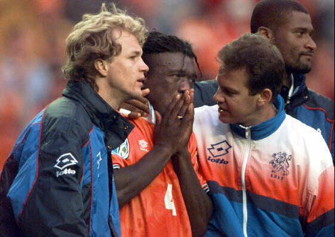

今天得到的消息，是晚上我兰会穿传统的橙色球衣出场，但是黑色裤子跟乌龟的有冲突，所以也会换成橙色。
荷兰的主队服，上衣一定是橙色的，但是短裤却有白色、橙色、黑色三种选择。

从我经历的大赛来看：
88年欧洲杯白色短裤第一场输给苏联，后来白色短裤一路杀进决赛捧杯，决赛对苏联橙色短裤。
90年世界杯小组赛打成狗屎，1/8出门遇德国，穿白色短裤，口水大战被淘汰。
92年欧洲杯，小组赛顺风顺水，半决赛打丹麦，点球决战巴斯滕踢丢点球，败北。白色短裤。
94年美国世界杯 ，1/8对巴西，穿白色客场队服败北。
96年欧洲杯，强大的无敌阿贾克斯帮点球输给法国，19岁的西多夫都要崩溃了，白色短裤。
98年世界杯，历史上最强大的荷兰，半决赛点球输给巴西。白色短裤。
2000年欧洲杯，荷兰依旧强大，半决赛因为圣托尔多喝了狼奶，点球告负。黑色短裤。
2002年世界杯预选赛……
2004年欧洲杯，总算点球赢了一次，胜瑞典是穿的客场白色队服，接下来打葡萄牙还是白色客场队服，败给葡萄牙。
2006年世界杯，又遭遇葡萄牙，穿上了诡异的客场白色上衣蓝色短裤，红牌大战再次败给葡萄牙。
2008年欧洲杯，小组赛砍瓜切菜跺了法国意大利，结果全橙色出战俄罗斯加时赛败北。

那我到底要说啥呢？其实是在担心打点球。怕临时的换裤子事件影响了荷兰人那脆弱的点球神经。众所周知，荷兰最怕点球，而南美球队踢点球都比较有一套。以本届荷兰的保守打法，今晚很可能是个0：0或1：1的闷局。凌晨5点的时候，又该荷兰人和本人这样的死忠揪心了。
所以，只能给自己个心理安慰：穿橙色短裤的时候，点球还没输过（但也没赢过）。

顺便说说明天的吧，1995版斯图加特对阵2010版巴塞罗那。我看好勒夫。4：2吧，毕竟两队的防守都还有问题。
有点怀念另外一个荷兰人维拉特了。