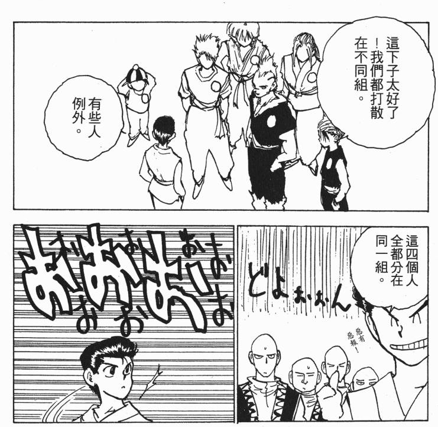

主队荷兰，被第二主队瑞典淘汰了。
第三主队爱尔兰，被克罗地亚淘汰了。
这心里啊，没着没落的。

其实要说，毕竟第二主队瑞典还是在的。可毕竟物是人非啊，世界杯这么多队员，墨西哥的马尔克斯是硕果仅存的学生时代一路看下来的球星，其余的，都可以认为是新生代……
倒是教练席上的球星认识不少——德尚、克洛泽、塔法雷尔、索斯盖特、西塞、皮齐、范博梅尔、金南一、车杜里、奥里奇、托马森、施耐德……

以瑞典为例，目前只认识一个饼材赫兰德和一个饼材贝里和一个超级饼材林德勒夫。
我从来都不喜欢大伊布。随着永贝里、林德罗特、梅尔贝里、扶不起的谢尔斯特伦这些人的相继退役，瑞典的美好只能永远停留在回忆里了。

剩下的球队里，比较喜欢的还有丹麦、尼日利亚、克罗地亚和墨西哥，以及欧洲杯憋死荷兰的冰岛。
这些也无非是占着格伦夏尔、格拉维森、奥利塞赫、索尔多、贾尔尼、布兰科们的余荫罢了。熟悉的人太少。平时根本不看球，零星的几个都是靠着两年前的欧洲杯或者上届世界杯。

目前唯二比较喜欢的球星，只有法国的马退敌和克罗地亚的拉基蒂奇而已。
法国的比赛是不会追的。
克罗地亚倒是往往神一场鬼一场，颇有当年荷兰的风范，可以一追。然而这次不知道谁排的鬼赛程，克罗地亚三场小组赛都在凌晨！简直是欺负老头子。
不过内心还是希望克罗地亚能放翻阿根廷，让梅球王跟罗球王在1/4比赛里见个真章。

好死不死的，克罗地亚、冰岛、尼日利亚和豪强里我唯一因为巴蒂能看上眼的阿根廷竟然分在了同一组～
好有既视感。

索性，人不认识有不认识的看法，不看名气，只认场上发挥也挺不错。期待02厄瓜多尔、06日本、14哥伦比亚之类的小确幸。
只是不会有看球日记了。其实这篇算是水文，为了提醒若干年后的自己——这届杯赛你不是被枪毙了，只是没兴趣写而已。

鉴于十年前的老朋友几乎都不会来了，就再絮叨一遍不喜欢各路豪强的理由，完全是多年下来的主观印象而已：

巴西：自由主义踢法跟我三观严重不符。
德国：防守好头球厉害，一板一眼太无聊，只能算是个比较佩服的对手。倒是很喜欢主教练勒夫，因为他是当年那只斯图加特的主教练。
阿根廷：防线垃圾，上届跟荷兰的半决赛实在是难看至极的菜鸡互啄。
西班牙：04之前是停留在预选赛之王的印象里，长期出不来。崛起之后又很不喜欢那种扣扣索索的小短传打法，一点儿也不大气，而且传得再多，不还得靠比利亚偷鸡才能赢球？
法国：96年点球淘汰荷兰起，就一直看法国不顺眼。而且非常讨厌齐丹这个脏货。
三喵：从我1990年看世界杯算起，24年没进过四强（不算本届），90年的第四就是最好成绩了，这也好意思叫豪强？

余者，比利时一盘散沙，葡萄牙乌拉圭太脏，都不值一提。