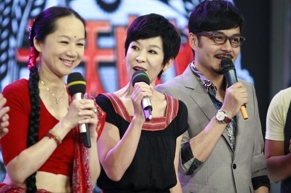

拖延症啊！这一拖就是一年。这次的话题是小时候的综艺节目。
之前，贝总说AV台不懂综艺，她是对的。可悲的是我小时候，除了握有大把资源的央视就没谁玩得转综艺了。

**《正大综艺》**
在幼年的记忆里，提到综艺节目，第一反应必须是《正大综艺》。正大综艺60%的功力在杨澜女士身上。我坚持认为，杨澜之前的节目主持人都只能叫报幕员。国内（可能）是她首（jie）创（jian）了跟嘉宾互动的节目形式，并且用尽量生活化的词汇和表达进行串场。在今天习以为常的形式在当年可是了不得的轰动——综艺娱乐节目做到“万人空巷”程度的，除了春晚就只能想到正大综艺了。（P.S:别跟我提超女，大连曾经十几年收不到马桶台。）
杨澜最初的搭档是姜昆。能感觉出姜昆是很努力地在做节目，但他作为一个逗哏的相声演员有个深入骨髓的毛病——爱抢话。不仅抢杨澜的，也抢嘉宾的。所以后来他自己感觉也不好。杨澜的第二任搭档印象非常淡，只是个路人甲。期间还有方舒方卉姐妹搭档，跟杨澜和路人甲轮流主持，效果也不咋样。
挺紧的赵老师之前虽然德高望重，但他播新闻已经是很久很久以前的事情了，90年代初除了出任《动物世界》的声优，已经基本退居二线了。当时他出山主持正大，也算不大不小的意外。赵老师主持的时候完全是定位在捧哏的角色上，一般不问不说话，偶尔抖个机灵，控场的事儿交给杨澜，他只帮两边打圆场。最佳搭档就这么产生了。他们搭档的那一两年里，《正大综艺》是当之无愧的龙头老大。那时候混娱乐圈的各路神仙基本都上过《正大综艺》，常来的比较有趣的人有谢园刘威梁天李玲玉，不怎么有趣的有成方圆。成方圆这人比较奇怪，除了翻唱苏芮和齐豫，好像自己一首拿得出手的歌都没的。
资讯欠发达的年代，《世界真奇妙》这种旅游人文风光短片确实能起到开启民智的作用，三位台湾的导游姐姐其实都不是特别漂亮，但文案跟语调都让人觉得舒服。这节目最火那几年，我都是周六晚上看一遍，周日重播再看一遍的。

杨澜大火，赵老师也大火。赵老师出了一本自传《岁月随想》，杨澜紧接着也出了本《凭海临风》，此二似乎是开了活着的名人出传记的先河，还颇具争议。有人觉得杨澜本事并不强，时事造就而已，但我觉得离开时代谈能力都是耍流氓。

杨澜主持的最后一期，宣布告别后跟王志文合唱了一首《在我生命中的每一天》。一曲唱罢我的感觉是这节目还有办下去的必要吗？的确后面的程前袁鸣和王雪纯虽然干得还不错，却渐渐地退出了我的视线。到了高中时代（96年），就不怎么关心这节目的死活了。
王志文倒是因为这首歌被发掘了演唱才能，唱了电视剧主题歌，还出了专辑。

不光火了杨澜赵忠祥，正大广告歌的演唱者翁倩玉之前根本没听说过却在后面的几年里到处串场，过场鲁冰花的演唱者甄妮也焕发了第N春。

《正大剧场》曾经是《正大综艺》不可分割的一部分。实事上最一开始我的60后70后大表哥表姐们最开始看这个节目，就是冲着“译制片”去的。当时正是国产电影的低谷期，没多少好片，而引进的外国老片基本都放烂了，除了正大剧场就只有AV1每周六还是周日的午夜场能有一部“译制片”了。不看前面综艺而直接等到时间看后面电影的也大有人在。
我们一家则刚好相反，我爸妈都不怎么喜欢看外国片，因为“人名太长记不住”。所以我本人对《正大剧场》的印象也一般。好像有《正大综艺》不久就放了连续剧《雾都孤儿》，看不懂就觉得很没趣。接着又是大长篇《侠胆雄狮》，这部剧说是动作片，但大多数时间是狮子头跟“凯瑟琳”在下水道里唠嗑，非常无聊。印象深的是几部电影。其一是90年或者91年儿童节的带有童话性质的电影，上中下演了3个礼拜，讲一个小女孩穿越到亚瑟王的时代。记得里面的王后非常好看。卧草忍不住了，必须搜索重温一下。其二是《环游世界80天》，不带成龙的版，也是分了上下集，热气球的戏非常热闹。为此特意跑图书馆去找了好几部凡尔纳回来读。其三就是《老人与海》，对那条大鱼的骨架印象深刻。

**《综艺大观》**
《综艺大观》在我看来远～～～不如《正大综艺》。其一是形式上没有任何创新，完全是台tinysize的晚会。其二也是最要命的，综艺大观的播出时间不固定。这玩意儿“原则上”是每隔一周播出。但原则就是用来破坏的，稳定的播出连半年都没维持上。
那时候小，对歌曲和舞蹈都不感兴趣，也不愿意听倪萍嘚啵，只盯着“开心一刻”看。所幸《小偷公司》和《五毛钱俩》这种名作看的都是首播。牛群老师真是个人才，据说他们节目时间不够的时候就找牛群，牛老师一天就能创作出作品，然后就能录了。
还有一个王木犊系列，石国庆老师一个人hold全场，也非常厉害。
歌真是没什么具体印象了，应该是董文华毛阿敏霸屏吧。好像只有某个夏天刘欢老师唱了一首“大杂院真热闹，后院里稀里哗啦在洗澡”的歌还算有趣。
《综艺大观》一个不讨喜的地方是经常做一些政治性比较强的主题，什么申奥亚运会七一啊之类的。记得老山前线被炸断腿的那个徐良就跟董文华在综艺大观上唱过至少两次《血染的风采》。第一次还挺感动，第二次就成了“怎么又来了？”

**《东方时空》**
没列错，我就是把《东方时空》当娱乐节目看的。1993年，东方时空横空出世。早上7点，“东方时空晨曲”，在音乐声中改变了以往暑假8点半才有节目的历史。《东方之子》略过不看；《生活空间》编导水平良莠不齐，咱也选择性地看；《金曲榜》每日必看；最有趣的还是《焦点时刻》，在朱总理题词之前，基本上七成是负面报道，看到有人倒霉我就高兴。

后来《金曲榜》变成《中国音乐电视》，从东方时空里剥离了。这个节目对那几年内地流行音乐的促进作用是不可磨灭的。《金曲榜》捧红了一批只有一首歌的人：高枫、张骁、王磊、马格、刁寒、张林，以及转行转得轻舞飞扬的戴军老师。那首《阿莲》的MV确实水准上乘。借助金曲榜在我心目中翻身的是那英。《雾里看花》的MV虽简单但那英这次收拾得特别利索，颠覆了以往膀大腰圆的形象设定——在这首MV之前，我一直以为“那英”是丁嘉丽唱歌时候用的马甲。
《中国音乐电视》不另写了，虽然是同一个节目，剥离出去之后虽然时间加长了，也组织了几届什么音乐电视比赛，可味道却变淡了。第一届比赛里大连台选送了个老外，唱了首念中国地名的歌，竟然得了个二等奖；第二届也不是第三届又有个大连歌手叫胡明东，我们初中校庆的时候请过他。若干年前去开发区一个比较高档的澡堂子酒店洗温泉，发现他在酒店附属的酒吧里驻唱。

《焦点时刻》导致各地方台跟风办新闻节目的热潮。大连台做了一个节目叫《新视点》。95年左右我二姑为了看这节目不惜压榨我跟表妹看动画片的时间。后来据说主持人毛杰民报了什么敏感问题被换了，一个主力记者卢壬子大哥也因为什么敏感问题离开了电视台，节目质量也跟《焦点访谈》一样每况愈下。再后来大连台几套节目整合，这节目消失了。

《实话实说》名气很大，独立之前是《焦点时刻》的周末特别节目。这种talk show已经是正宗的娱乐节目了。对其在《东方时空》体系内的表现我印象不深，因为我周末基本不看这类节目，但独立出来之后因为时间合适，颇追了一段日子。印象比较深的几期有：大连的两个视力障碍的女大学生、司马南表演打假以及金铭蒋小涵宫傲讲述年少成名的烦恼。最后一次看《小崔说事》的具体时间记不清了，大抵是大四到刚工作，开博之前。我们高二的班主任老妖一家上了小崔的节目。大师姐画画得好，每到国外一个地方都会用漫画的形式给老妖寄信，那期老妖是配角，大师姐才是女一号。看完那期节目觉得小崔不过如此而已，因为我们都知道老妖集邮，对他来说信封和邮戳也是无价之宝，可小崔根本没发掘出这个隐藏剧情。
再往后就很少看非体育类节目了，都不知道小崔说事什么时候没的。

把《东方时空》当成娱乐节目的重要原因之一，是没有别的可看：AV1七点放一遍，十点放一遍；AV2下午两点再放一遍，93年白天，只有3个频道可以看，不看这个还能看啥？苦中作乐呗。

**《第二起跑线》**
这个栏目在94年暑假的时候出现的频率特别高。一个中学生的竞技类节目被贺斌掌控得张驰有度。可惜这栏目没追下去，因为不放假的话它的播出时间是周日的上午——看了半宿的球谁还会一早爬起来看这个！后来好像变身成了一个找金苹果的定位游戏，没看几期。再后来有了个答题的节目，也是贺斌主持。吾友gelemon同学高中时去参加了一次，还得了个数码相机回来。1998年的数码相机还是颇令人艳羡的。

**《艺苑风景线》**
这个栏目的定位有问题，一会儿是旅游节目，一会儿又是喜剧小品，播出时间也不固定，简直莫名其妙。除了陈鲁豫女士是从这里发迹的之外，印象深的是陈佩斯姚二嘎的一个木匠系列小品。另外好像山东有一对孪生兄弟的魔术、相声、杂技演员，也经常上这个节目。

**《欢聚一堂》**
当年看AV4唯一的理由就是在欢聚一堂里看管彤姐姐。这个节目大约是由黄阿原策划的、以喜剧和歌舞为主要形式的小晚会。因为定位是海外观众，所以节目的形式要更死板一些。“挺好的孩子，就是舌头不好使”的那位南方风格的小品演员经常出现。
管彤还主持过一个叫《东西南北中》的节目，更是一个莫名其妙的大杂烩。央视这么多主持人，要么红了之后跳槽，要么不红转行，而管彤这么多年都不温不火，20多年了还能在3套装嫩，实属罕见。

**《曲苑杂坛》**
曲苑杂谈这个栏目先天就不足，开办不久就失去了每周一期的资格，跟综艺大观每周轮播，再后来每个月一期，又至于调整到10点档。反正是越来越不受重视的样子。汪文华据传是央视四大XX之一，曲苑杂谈委曲求全也维持了十多年，说她后面有人可算是空穴来风。这栏目的问题在于，相声小品作品的创作周期长，想出好东西难，而相声门里的龌龊事儿又太多了。而魔术杂技这类喜欢的人可没那么多，反正我是不喜欢，犹记当年软磨硬泡获得老妈许可熬到10点，却等来一个“吴桥杂技团专场”的感觉，就好像冬天吃了一口翔味冰淇淋。
曲苑杂谈最大的成功是发掘了藏族小伙洛桑，其创作过程有点今天的《星光大道》的意思。可惜洛桑命薄。后来的新疆妹买买提就差了许多，买买提的本事比洛桑可差远了。买买提就是孙楠前妻买红妹，根本不是新疆人，不过是个回族。话说她跟楠哥离婚不会是因为楠哥的长相越来越不清真了吧……
汪文华还策划了《电视书场》栏目，同样包办了主题歌。这个评书栏目的时间太糟糕了，是平日的下午一点。对于一个中学生来说，大多数时间追不上。很长的一段时间播的是田连元先生的《水浒传》。田在辽台可没说过水浒，兼之评书艺人的版本跟小说跟电视剧都有不同，还蛮期待的。可总不能逃课听书吧！断断续续的，也就断了心思。

**《夕阳红》**
这是我最讨厌的电视节目没有之一。杨洪基老师雄浑的声音响起的时候，就是假期节目结束的时候了。

**《气象报道》**
这傻逼玩意儿在下午的每个整点准时出现，三次或者四次。平日看不到也就罢了，假期里动画片看得正爽的时候忽然插入，气得人想捶墙。
“下面是16点的卫星云图、18点、20点、500百帕温度落点差……”我真想知道高考不考地理的年代里全国有几个人能看懂这玩意儿。
唯一比夕阳红好的地方是每次都只有五分钟。

**《每周质量报告》**
这个就出现得较晚，我是把它当作娱乐节目来看待的。高中时期一旦能赶上了就一定要看。尤其喜欢看记者暗访的桥段。记忆深刻的有两个：其一是用死羊崽子冒充鹿胎做鹿胎膏，其二是说往腐竹里加精液增加粘稠度。第二个实在太假，以至于我对这栏目的定位是满足猎奇心理。可惜暗访这种形式没多久就被叫停了，再后来这节目也消失了。

**《农业教育与科技》/《星火计划》**
两个节目轮流出现，播出时间一致，内容也差不多。一般是讲农村怎么播种怎么喷药怎么种蘑菇怎么养兔子怎么抠沼气池子之类的科教片。当年我是真把它当乐子来看的。尤其是赶上周二，这就是中午档的最后一个节目了，播完之后就是准时的一屏雪花“刷………………………………”

**《七星大擂台》**
辽台的娱乐节目渣一样。这个节目的前身叫《周末喜相逢》，改名之后应该是追加了预算，经常请一些港台的明星过来参加。但主持人李枫的风格太招摇了，辽宁本地的笑星贾承博金秉昶常佩业们手段都太低端了，连他们的后辈赵家班的低俗都做不到——赵家班起码占了个俗，他们只剩低了。犹记贾六先生的拿手绝活是瞪俩大眼珠子跟观众要掌声。

**《东芝动物乐园》**
大连台能利用的资源就更少了。99年的时候跟风办了个《久久合家欢》，开始走的也是请明星的路子。可赞助拉不来预算上不去愈发没人看，只能靠陈寒柏顶着，后来转型成为家庭为单位的业余选手PK。成本虽然下来了，可除了参与录影家庭的三亲六故就更没人看了。我囫囵看下来的就一次，因为上电视的是二姑工友的姐姐全家。
《东芝动物乐园》是大连台引进的节目，大连二套每周日8点播。这节目形式跟《正大综艺》有点像，不过把“世界真奇妙”变成了“动物真奇妙”罢了。但这东东由于赞助商的原因，演得大多是日本的动物。成天除了浣熊就是猕猴，一次两次是新鲜，每周都来就看得要吐了。
不论人品的话，侯耀华还挺适合当主持人的。孙萌倒也没火起来。

划拉一大圈，90年代的除了电影电视剧体育和各种晚会，算得上乐子的也就这些了。跟今时今日打开盒子各大卫视的铺天盖地根本无法同日而语。
艹，还真忘了一样——91、92年的时候，4点多放学回家实在没得看，也守着二套看过京剧。《定军山》、《打鱼杀家》、《三岔口》……《三岔口》还挺有意思的说。

P.S. 刚才搜了一下，小女孩穿越到亚瑟王故事的原著竟然是马克吐温！膜拜一下穿越文的鼻祖。