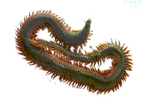

*卷首语：我打算在30周岁生日之前写30个记忆里的人和事，作为送给自己的生日礼物。这些人无论男女老幼前后左右忠奸，总是留下了一些记忆的。我真的有些怕这些记忆若干年后都散了。从今天开始，大概恰好是32个工作日，应该够了。我妈说我出生的头4天都没睁眼，所以刨去1980年的那两天不算，正好30篇。*

开始。

东林哥是我半岁到两岁之间的保姆王大妈的大儿子。他家还有一个东风哥。两个都大我10多岁。
王大伯是小平岛海军的军官，家里不缺钱。王大妈带小孩纯为了给自己找点儿事干。那个时候一个月我妈给她15块钱（其实也不少了）。

一岁的时候当然没有记忆。我要说的这件事发生在我大概5、6岁的时候。我妈厂子跟小平岛驻军搞联欢，她把我又临时送到了王大妈家。然后两个女人就出去了，好像是看节目看电影之类的。留下两个半大小子在家里看护我。

这俩小子怎么可能甘心呢？东风哥就撺掇东林哥去钓鱼。东林哥就哄我：“大致，钵里有草莓，柜里有小人书，在家等哥哥钓黑鱼回来给你炸着吃，好不好？尾巴都给你。”可是我根本不吃他那一套：“不带我你们就别想去！”

好吧，俩小子领着我就到了小码头，熟练地解开了一条舢板，把我抱了上去。出海没多久，我就睡着了。
再醒来的时候发现四周都是水，什么都没有，害怕就哭了起来。东林哥比较有办法，给了我一只他们不知怎么弄上来的蚆蛸（章鱼）让我玩。并且说，如果把它的墨都弄出来喝干净了，就能练成九阴白骨爪。于是我就开始蹂躏那只蚆蛸，把弄出来的墨挤到一个罐头瓶盖上，然后像小猫一样舔食掉。瓶盖没什么问题，问题是那瓶子，是哥俩用来装鱼喂子（鱼饵）的。在黄海沿海的钓鱼者和浅水鱼类们最喜欢的鱼喂子有一个名字——海蛆。

又过了一会儿，俩人大概只钓上了小鱼5、6条，但是时间已经过了挺久了，就把船摇了回去。上岸后我就吵吵腿软头晕。东林哥说没事，你第一次坐船晕船了，以后习惯就好了，我背你回去吧。

在东林哥背上待了没两分钟，我就吐了他一身。也不知是因为晕船还是因为吃了不干净的猫粮。

后来，我没揭发他俩跑出去钓鱼的事，东林哥也没说我吐了他一身。

1981年，是我被送到王大妈家看护的年份。