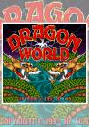

[中国龙](https://pewae.com/gaan/aHR0cHM6Ly93d3cuYXJjYWRlLWhpc3RvcnkuY29tLz9uPWRyYWdvbi13b3JsZCZwYWdlPWRldGFpbCZpZD00NzE4)

别名：dragon world机种：ARC厂商：鈊象电子类别：PUZ发行年月：1995-05耗时：5

这个游戏我不怎么熟。实际上IGS出的游戏我都不怎么熟。因为我只在1991（五年级）到1995（初二）这个时间段街厅进得多，而IGS却流行在1996年以后。高中时代，学校旁边倒有个街厅，不过里面的机器非常偏科——2台雷电，1台打击者1945II，1台合金弹头1，2台合金弹头2，1台合金弹头X，1台吞食天地2，剩下20多台都是格斗游戏——乐意看的有，愿意动手的就只有一个口袋战士了。初三到高中业余时间非常有限，根本没条件去跑别的位置的街厅。
所以初次见到这个游戏是在1999年秋天，大一，沈阳。对我来说最后的街厅窥屏岁月也停留在那个还没买PC的季节。
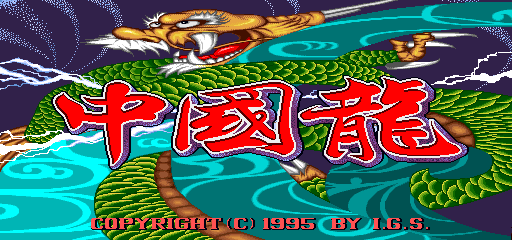

后来唯一一次上手是在2002年11月，在沈阳北站二楼（也许是三楼）的休息大厅旁边的游戏厅。等火车无聊嘛，接前面一位大哥打了2/3打的，过了一关，以为能看到脱衣服，结果每一大关的第一小关只解外衣，大失所望，后面的第二小关也没过去。就只投过这一个币。
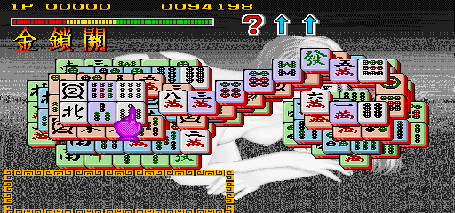

PUZ游戏我还是喜欢在家用机上玩，街机上的紧张感要素总会把我搞得很慌。本作的能量槽会不停地掉，屏幕上方的“血量”只有56格，每秒掉1格，每吃一张麻将牌回一格，也就是说基础的思考时间只有不到1分钟。如果时间充沛，大多数人都能应付，在读秒声中忙中出错也是人之常情。某上面的牌全覆盖下面牌的情况，以及利用视觉陷阱让人觉得可以解到的情况也存在，但不多。但街机游戏就是要勾引人投币嘛！跟大多数街机游戏一样，只要愿意当“币爷”，纯用道具平趟也能给打穿了。
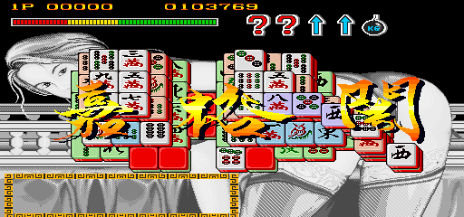

每一大关过了以后会进入奖励小关，台版这一版小游戏都挺猥琐的。实际上我第一次见到这个游戏就是问答画面，当时还以为是《民国教育委员会》的咸湿版，兴趣盎然。到正常关发现是个多捡一张牌的《上海》便大失所望。现在好多手机弹出的游戏解谜向小广告，再在底下加一行小字，什么游戏进行中有可能出现之类的把戏，20年前人家就玩过了啊！
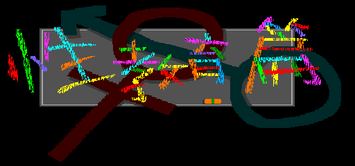
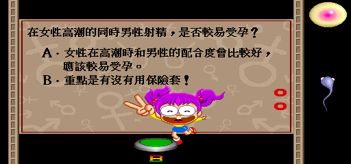

但是这里有一个问题，这些小游戏都需要三个按钮才能正常玩，而吝啬的街厅老板往往只给这个游戏装一个按钮……
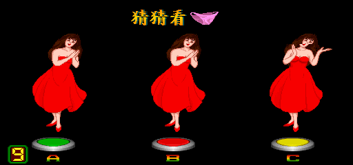
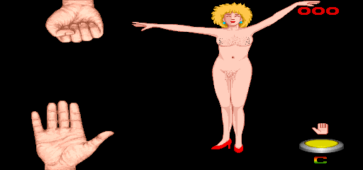
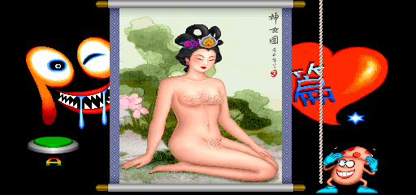

本作存在至少4个版本。麻将牌有两套：麻将和图标，背景图也有两套：山水画和美女。既然回顾，当然选加了料的美女版（台湾版/性教育版）来。我找到的这个版本这一版每一大关一个美女，第一小关脱外衣，第二关脱上围，第三关脱光。但是IGS的美工真应该给个大大的差评。这几个MM画得跟日本前辈《电子基盘》和《天开眼》比起来毫无诱惑力，充其量也就是个《天蚕变》的水平。也就只有倒数第二大关的蓝衣MM顺眼一点儿。
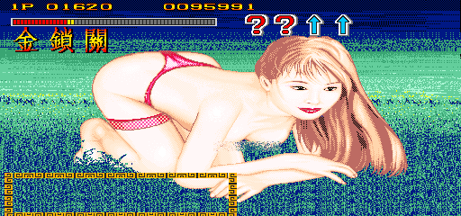
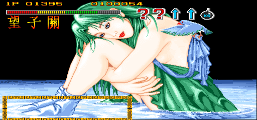
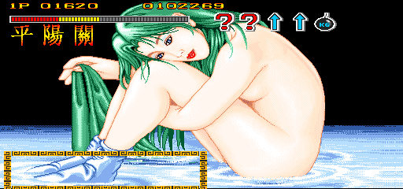
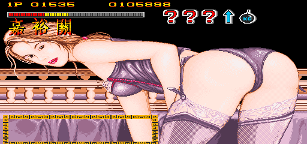
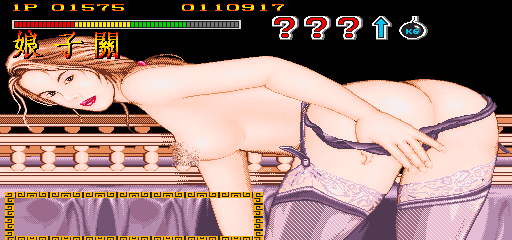
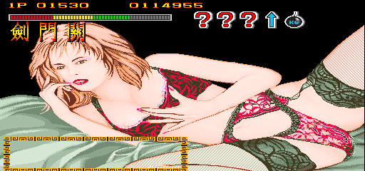
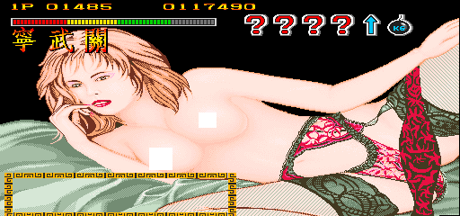
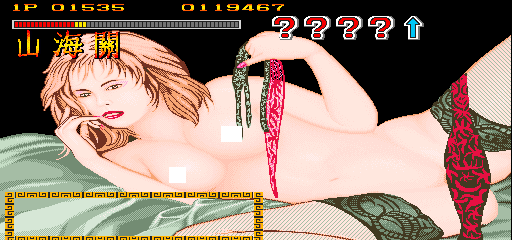
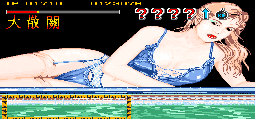
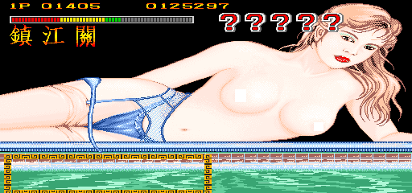
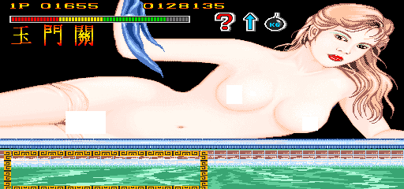

最后一大关变回了山水画，是不是版本问题已不可考，反正是只能找到这个了。
最后一关打通之后，制作组根本没准备通关画面，而是鸡贼地玩了一个谐音梗：“潼关”打过了，那就是通关了呗。我一周目过了以后，看到重复关卡的时候根本没意识到这一点，二周目才抓住这个梗，为了截图又不得不打了三周目，三周目通关以后发现截图快捷键设错了，无奈打了四周目。这么个玩意儿打四圈，我倒是图个啥啊。
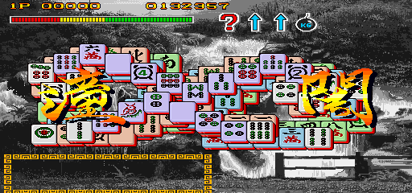

倒数第二小关也是谐音梗，埋得比最后一关浅一点。就是挺贱的。
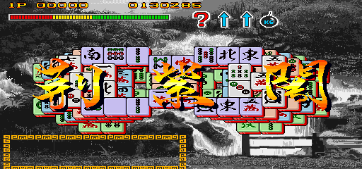

通关，也就是“潼关”以后，看到的是这个：
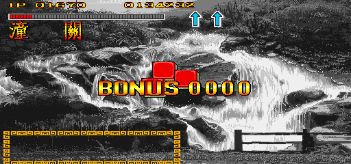