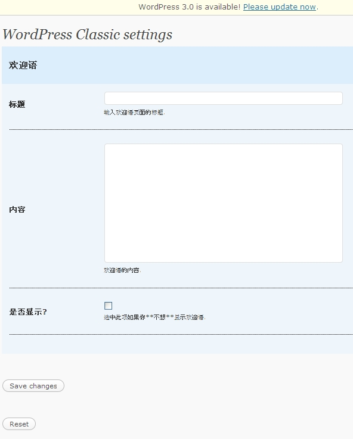

准确的说，这篇主要是译作。我在搜索wordpress+主题+选项的时候并没有找到合适的教程。只有Neoease小哥的一篇符合要求。但是他把一堆属性放到表格的同一位置存放，用起来不是很方便。接着换用英文关键字，终于搜到了[这个](https://pewae.com/gaan/aHR0cDovL2Jsb2cudGhlbWVmb3Jlc3QubmV0L3dvcmRwcmVzcy9jcmVhdGUtYW4tb3B0aW9ucy1wYWdlLWZvci15b3VyLXdvcmRwcmVzcy10aGVtZS8=)不错的教程。所以翻译一下并结合自己的理解写这一篇。
我很有诚意的！为了写这个俺甚至换了显示代码的插件。

为主题添加一个选项页是降低复杂主题管理难度的最好的方法。但是，能Google到的资料很少所以很多人都放弃了。在设计上一个如此重要的应用却有很少的文档，貌似那些资深开发者们都把这个方法当作祖传秘方私藏了起来。
在这篇文章中我将合并一个选项面板到WP默认主题（WordPress Classic）中，你学到的方法将很容易扩展到自己的工程上。

首先，blabla……（与WP无关），感谢国家。

~~我们的目标是，没有蛀牙~~
我们的目标是，在Wordpress的默认主题上方开辟一个区域，用来显示一段欢迎语。这段欢迎语的内容可以在后台的选项页中进行编辑。后台界面是这个样子的：

如果对加入的选项页的格式不加以控制的话，看起来会非常别扭，所以修改的内容中还包括一部分后台界面的美化。

******后台修改******
我们从修改*/wp-content/themes/classic/*下的*functions.php*开始。
为了避免麻烦，*在functions.php*文件的最前或最后加上下面的代码是最安全的。

首先添加

```
"欢迎语",
"type" => "title"),

array(	"type" => "open"),

array(	"name" => "标题",
"desc" => "输入欢迎语页面的标题.",
"id" => $shortname."_welcome_title",
"std" => "",
"type" => "text"),

array(	"name" => "内容",
"desc" => "欢迎语的内容.",
"id" => $shortname."_welcome_message",
"type" => "textarea"),

array(  "name" => "是否显示?",
"desc" => "选中此项如果你**不想**显示欢迎语.",
"id" => $shortname."_welcome_disable",
"type" => "checkbox",
"std" => "false"),
//再有想添加的可以参照这个格式进行
/*
array(	"name" => "内容2",
"desc" => "内容2的内容",
"id" => $shortname."_welcom2",
"type" => "textarea"),
*/
array(	"type" => "close")

);
```

这里是我们创建选项的地方。
我们把每个选项都放到一个数组中，方便在后面把它们组合到一起。每个选项都有一下复用的代码。在每个数组中，我们使用如下参数：
**name** – 用来显示这个选项的标题（可以是中文）。
**desc** – 对于这个选项的描述（可以是中文）。
**id** – 非常重要！ 我们用来识别每个存储数据。 **$shortname**将与id组合到一起存到数据库中，所以id是不能重复的。 (在我们的例子中,把$shortname设成wpc)。
**std** – 选项的默认值. 例如对于checkbox类型，可以设成true或者false以决定这个选项初始的时候是否选中。
**type** – 用来定义选项显示的类别. 像文字、文字输入框、checkbox之类。
首先以title类型作为开始。
‘open’选项才是真正有意义的开始，作用是开始表格的绘制（是的，原作者那个笨蛋为了好看用了table，后悔来不及了已经。）
接下来用一个text做欢迎语选项的标题，之后用一个textarea来存放消息的内容。接下来的checkbox用来决定是否启用这个欢迎语。
最后用’close’跟’open’相对应。

所以，利用这个模板，你可以在open和close之间任意增加或删除选项，所要做的只是照葫芦画瓢写一个array而已。注意id。

后边的部分是一坨Wordpress代码，用来具体实现选项页的做成和功能。不感兴趣的可以跳过。感兴趣的，我也在我能看懂的部分加了中文注释。
如果特别关注的话，会发现我对原英文作者的代码改动了两处。因为原来的作者没考虑到往数据库里存代码（比如adsense或analitics）的情况。
And now for the rest of the code. Most of which is a bunch of WordPress functions to tell it this is an options page, so we wont go over most of it:

```
function mytheme_add_admin() {

global $themename, $shortname, $options;

if ( $_GET['page'] == basename(__FILE__) ) {

if ( 'save' == $_REQUEST['action'] ) { //save按下时的动作

foreach ($options as $value) {
//将内容更新到数据库.译者添加去转义字符命令stripslashes
update_option( $value['id'], stripslashes($_REQUEST[ $value['id'] ]) );
}

foreach ($options as $value) {
if( isset( $_REQUEST[ $value['id'] ] ) ) {
//将内容更新到数据库.译者添加去转义字符命令stripslashes
update_option( $value['id'], stripslashes($_REQUEST[ $value['id'] ]  )); }
else {
delete_option( $value['id'] );
}
}
//更新标题栏
header("Location: themes.php?page=functions.php&saved=true");
die;

} else if( 'reset' == $_REQUEST['action'] ) { //reset按下的动作

foreach ($options as $value) {
delete_option( $value['id'] ); }
//更新标题栏
header("Location: themes.php?page=functions.php&reset=true");
die;

}
}
//调用WP函数add_theme_page.回调函数是mytheme_admin(),显示的名字就是主题名+"Options"Options这几个字可以换成别的.
add_theme_page($themename." Options", "".$themename." Options", 'edit_themes', basename(__FILE__), 'mytheme_admin');

}

function mytheme_admin() {

global $themename, $shortname, $options;
//保存后的提示信息,settings saved.可以替换成中文
if ( $_REQUEST['saved'] ) echo '

'.$themename.' settings saved.

';
//重置后的提示信息,settings reset可以替换成中文
if ( $_REQUEST['reset'] ) echo '

'.$themename.' settings reset.

';

?>

## settings

后台页面就OK了。在后台选中默认主题激活就可以看到选项页了。

****使用选项****

现在我们要做的是让添加的选项能用起来。这次，打开header.php

我们的任务有:

1.从数据库读取选项

2.判断禁用的checkbox功能是不是选上了，如果没有，才进行下一步

3.判断标题是否存在，如果存在就显示

4.否则，显示基本的“Welcom”

5.判断欢迎语是否存在，存在就显示

6.不存在就显示点儿别的

7.checkbox如果选上了，就什么都不显示。

1.读数据库选项

在 header.php 的底部，添加

```

```

上面的代码提取了我们所添加的选项，它们是：

$wpc_welcome_disable

$wpc_welcome_title

$wpc_welcome_message

2. 查看“禁用”选项

```

```

checkbox选中的时候，$wpc_welcome_disable值就是true，未选中就是false。接下来的动作只有未选中的时候才进行。

3. 查看是否有title并显示

```
####
```

用个H4显示欢迎语的标题

4.否则,显示默认标题

```
#### Welcome!
```

如果标题没设就显示Welcom

5 & 6. 查看并显示欢迎语的内容

```
echo $wpc_welcome_message; ?>

Hello and welcome to our site. We hope you enjoy your stay!
```

跟上一步差不多但是这次用到的是$wpc_welcome_message 。

7. 如果没选中，就什么都不显示

```

```

虽然不重要，但这几句不能省，不如编不过。

最后。如果你按照上面的步骤一步一步做下来，应该就能学会添加自己的option页了。

|  |  |
| --- | --- |
|
| |

|
|
" /> |

|
|

|  | |
|  | |

|
|
<span class="str"><?php if ( get_settings( $value['id'] ) != "") { echo get_settings( $value['id'] ); } else { echo $value['std']; } ?></span> |

|
|

|  | |
|  | |

|
|
> |

|
|

|  | |
|  | |

|
|
if(get_settings($value['id'])){ $checked = "checked="checked""; }else{ $checked = ""; } ?>                          /> |

|
|

|  | |
|  | |
```