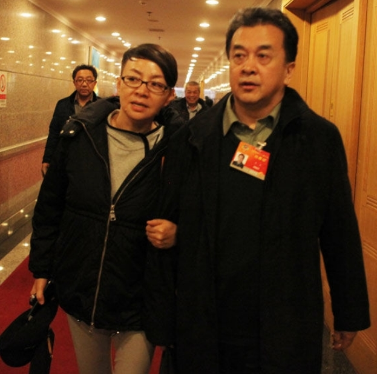
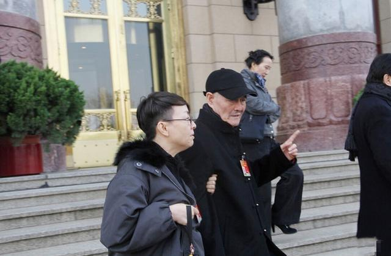

前日，宋丹丹女士在二会期间与老搭档黄宏赵本山挽手出现。

之前的种种迹象来看，黄宏和赵本山一定是完了。没被公布出来，要么是因为剧本还没写好，要么是因为时机不合适而已。自古落井下石者众而两肋插刀者寥寥，所以和平女侠哪怕只是在镜头前做个样子，也足以称得上“够朋友”了。

我并不喜欢黄宏或者赵本山或者宋丹丹——黄宏的作品太过郑智化；赵本山多年未见突破；宋丹丹倒的东北口儿怎么听怎么夹生——但这并不妨碍我对他们的态度——没有态度。只不过是几个演员而已，生生死死聚散离合，除了一点儿茶余饭后谈资，别无它用。
所谓搭档，也不过是亲密一点儿的同事关系，不觉得宋丹丹对这俩货有什么义务。尤其黄宏，据传“白云黑土”搭档之后跟宋丹丹关系已经很冷淡了。但所谓的侠义就是，女侠可能问了自己三个问题：我当他们是朋友不？他们现在困难不？我能为他们做点儿什么不？

今天说黄宏疑似行贿了，明天说赵本山涉嫌黑社会了——公安开始查了吗？未必。检察院批捕了吗？还没。法院判了吗？怎么可能！所以这俩还是正儿八经的政协委员（且不管如何当上的）。所以媒体整体捕风捉影地算怎么个事儿啊？所以圈儿里的人有意无意的撇清关系算怎么回事儿啊？够了！法院宣判以前先上CCAV批斗一番的模式，我受够了！
我只是猜女侠会这么想。

只为情谊，无关正义。
并不喜欢武侠作家们为“侠”赋予的新含义。尤其金庸，什么侠之大者为国为民，纯扯。何为国，何谓民？荆轲不过是为了报答燕丹的厚待，专诸也不过是公子光篡位的工具，曹操和汪精卫倒是可能不为自己，到头来还不是长歪了被扣上永世抹不掉的“奸”字，所谓的正义也成了争取政治资本的投机。也许只有传说中的邦德金刚狼星矢阿斯泰利克斯龙傲天们才能做到“大侠”吧。反正在我这儿，“侠”就是“义气”。宋丹丹女士为这个字做了一番很好的诠释——为义气，做自认为应该的事。
为她点个赞。

一个赞而已，不能更多了。只凭一个蚁力神，赵本山能清白就出鬼了。

> 所谓言必行,行必果,己诺 必诚,不爱其躯,赴士之阨困,千里诵义者也。荀悦曰,立气齐,作威福,结私交,以立强于世者,谓之游侠。