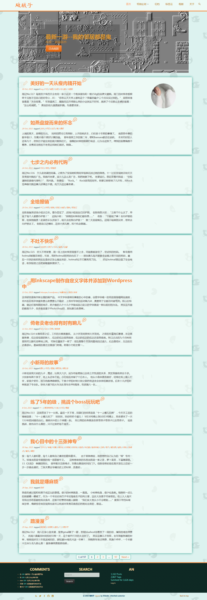
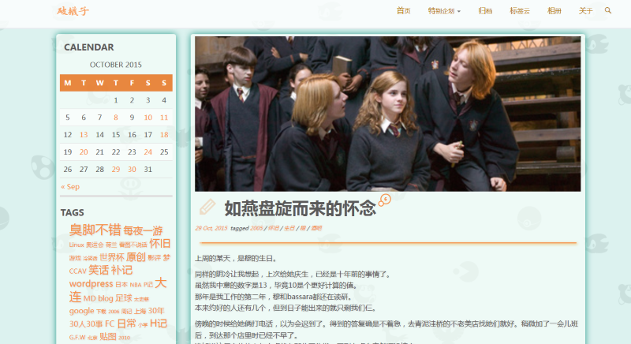

说了不止一次在写新主题的事。今天终于把它用上了。
难得有空改代码，可跑了几遍却实在不知道还应该该改些什么东西了，索性直接放上来使用，有缺点什么的日后再说。

距离上次写主题已经有五年多了。这五年来新技术的花样可不少，什么before/after啊，bootstrap啊，自适应啊，html5啊都是上次写的时候没遇到的。wp本身提供的函数库也增添了不少新功能。
这个主题参照的主结构是oblique。原来最大的卖点是瀑布流和斜角。我把斜角功能给去了，瀑布流也改了个面目全非，甚至一度想放弃，最后又找了回来。无限加载与图片延时加载之间有矛盾，会导致首页上图片的间隔有大有小，尚未没找到好的解决办法。
花费了大量时间在许多无聊的功能上。比如专门给不好好留言的人留了个按钮；比如post与comment的相对时间；比如特色图片上的伪日期戳。反正是玩嘛，也无所谓了。
开发的过程中参考了海量的主题，看到谁有好的效果就想扒过来。而后期却有因为风格不统一忍痛删了好多效果。最终的方案个人感觉还蛮清秀的。我好多年没用过这么清汤寡水的配色了。
说起配色，中间一度想以数学方法一劳永逸地解决配色问题，但尝试之后发现效果并不怎么好。数学公式保留了，但最终配色是手动的方案。灵感来自某游戏……
因为原来的模板是GPL发布的，所以这次我的主题也发布了出来。说实话要不是协议的要求，我是不喜欢放代码出来的——因为总有一些伸手党存在。但我有非常喜欢和朋友们讨论wp函数的使用。所以最终发布的时候耍了个心眼，默认的配色方案与现在使用的完全不同。代码里几乎所有的点都加了中文注释，我不希望你直接用我的主题，但我希望自己的代码能够给予后来的朋友们一些启示。

注意事项什么的全写在readme里了。
[下载地址](https://pewae.com/gaan/aHR0cHM6Ly9naXRodWIuY29tL2xpZmlzaGFrZS9ibHVlZmx5)

感谢flyfreemedia，感谢wordpress，感谢大发，感谢任天堂。
有问题和建议请在下面留言，虽然我基本不会接受。

最后照例把上一次的尸体拿出来留念。

