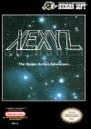

[义龟报恩](https://pewae.com/gaan/aHR0cHM6Ly93d3cuZG91YmFuLmNvbS9nYW1lLzM1Mjg4MzcwLw==)

原名：亀の恩返し,Xexyz别名：乌龟报恩机种：FC厂商：HUDSON类别：STG发行年月：1990-04耗时：3

秘技:输入”BBAI3 57912″可以与各关首脑对战,”A2A4A6A8AO”进入最后一关
在各射击版面尅时代地点,画面卷轴之前按住SELECT再输入上,下,右,左,即可从该版面最初以最强状态出击.

HUDSON在那个年代还真是高产啊.
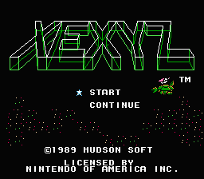

其实游戏的结构很简单,在动作版面收集信息,(其实就是在蓝石头上有隐藏的门 :o)
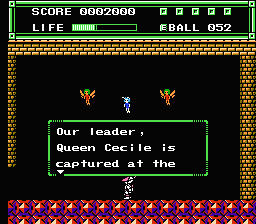
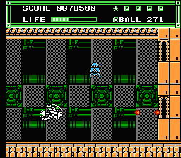
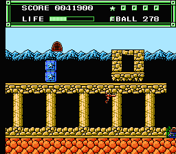

射击版面就是骑着各种古怪的东西,挑战更古怪的boss
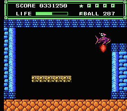
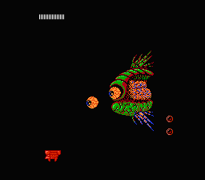
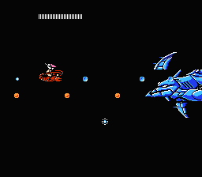

但是更多的时候骑的是乌龟壳.这就是”义龟”的来历吧.其实看对话和剧情,主人公应该叫”阿波罗”
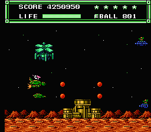
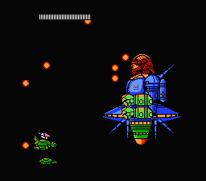
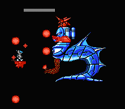
那个年代的公主,流行被抓走.
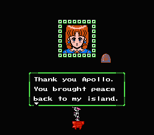
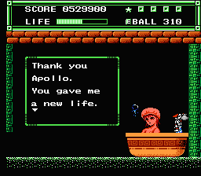
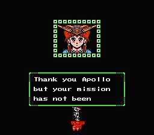
最终版面之前,要换个飞机
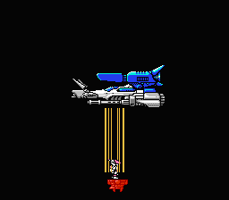
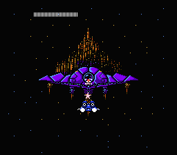
最搞笑的是,最后通关的画面是给出密码…
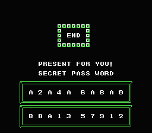