## 摘要

年度佳作：《年少日记》、《好东西》、《诡才之道》、《一部未完成的电影》、《雄狮少年2》、《入殓师》、《攻壳机动队》、《算命》、《教父2》、《喜宴》
年度抵制：《消失爱人》、《胜券在握》、《杀人树懒》、《皮皮鲁和鲁西西之309暗室》、《羊崽》
年度惊喜：《在糟糕的日子里》、《无限复活》
年度失望：《夺命金》、《怒水西流》、《月球上的裸体》、《巴山夜雨》、《里斯本丸沉没》、《与狼共舞》、《三伏天》、《怪形》
年度特别推荐：《黑处有什么》、《这很河狸》

年度最佳导演：《年少日记》卓亦谦
年度最佳剧本：《朱同在三年级丢失了超能力》王子川
年度最佳男主角：《老枪》祖峰（饰顾学兵）
年度最佳女主角：《朗读者》凯特·温斯莱特（饰汉娜）
年度最佳男配角：《破·地狱》朱栢康（饰郭志斌）
年度最佳女配角：《第二十条》赵丽颖（饰郝秀萍）
年度最佳音乐：《入殓师》
年度最佳画面：《落叶》
年度最佳续集或翻拍：《雄狮少年2》
年度最佳网大：《老狗》
年度最佳镜头：《破·地狱》仪式上卫诗雅从火盆上方飞身越过
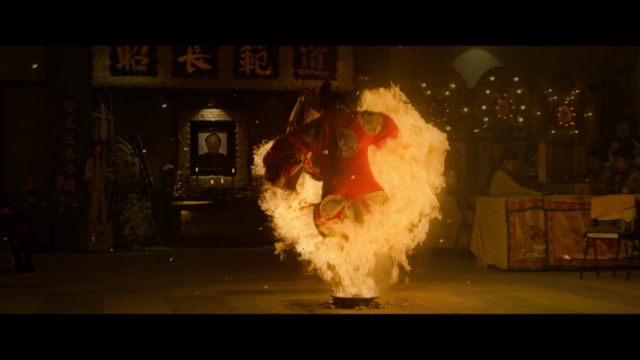

年度最差导演：《皮皮鲁和鲁西西之309暗室》郑亚旗
年度最差剧本：《射雕英雄传：侠之大者》徐克、宋譞
年度最差男主角：《人生开门红》常远（饰宋大江）
年度最差女主角：《全员嫌疑人》秦海璐（饰亚美）
年度最差男配角：《酱园弄·悬案》易烊千玺（饰宋瞎子）
年度最差女配角：《红楼梦之金玉良缘》丁嘉丽（饰刘姥姥）
年度最差续集或翻拍：《封神第二部：战火西岐》
年度最差音乐：《长安的荔枝》

## 总结

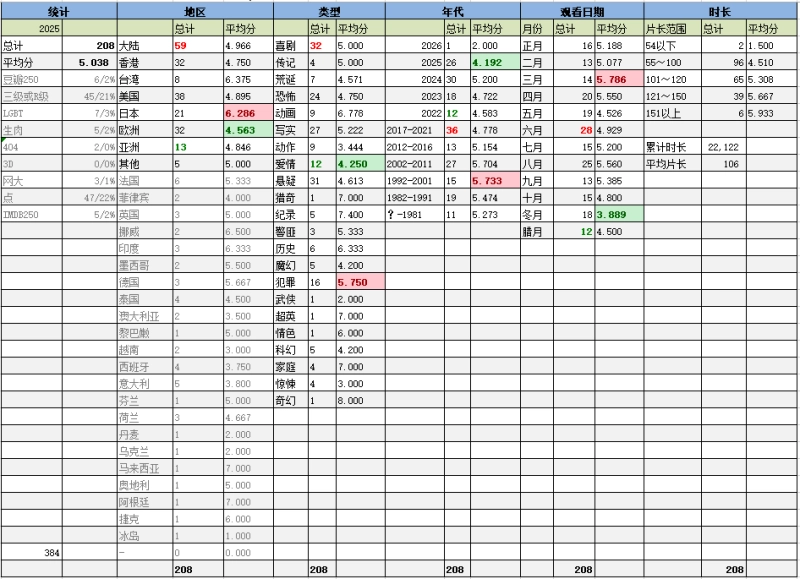

乙巳年是闰月年，全年384天。
今年观影208部，比甲辰年（去年）多了16部，考虑多出的一个月只是的量。对比去年的预估（210）相差无几，心里还是有点数的。
明年虽然是世界杯年，但在阿根廷以西的西半球国家进行比赛是很讨厌的事，不能熬夜，也就不会产生垃圾时间，所以预估180吧，稍微降一下。

平均分5.04，比去年提高了0.2，不见的是片子质量有多高，实在是中等水平的片子都差不多，给个5分还是3分也没差多少。全球电影总体趋势就是平庸的烂。

今年有1部满分作品。《雄狮少年2》，国产动画拍成爆米花爽片，看得荷尔蒙水平飙升，难得。
另有9部9分作品。
《入殓师》、《教父2》、《喜宴》、《攻壳特工队》声名在外，不表。
《年少日记》改变了我取消香港电影分类的想法，新时代的香港还是有出色的电影人的。这片子拍得内敛而有力量，不错。
《好东西》维持了邵艺辉的高水平，女性题材却并不矫枉，是能够接受的态度。
《诡才之道》胜在题材讨喜，哪怕有些刻意，也要对鬼片青眼有加。
《一部未完成的电影》，铭记一段不正确的个体回忆，如果更尖锐，还可以更好。
《算命》是少有的关于边缘人的纪录片。徐童导演的特色是难得的平视视角，不被道德捆绑。

烂片方面，今年有数量惊人的5部0分作品。
《风吹浪涌》是典型的电视软广电影，经费还不怎么足的样子。要不是为了刷所有的大连电影，我本是不会跟它产生交集的。
《魅惑啦啦队》、《血液机器》完全是粗制滥造。
《29片棕榈叶》完全像是high大了之后写出来的，哪儿哪儿都不挨着。
《皮皮鲁和鲁西西之309暗室》，郑亚旗是完全不把观众当人了，当然也没把他爹当人。郑渊洁早期最有名的作品就被如此祸祸，不仅败了皮皮鲁鲁西西的名声，还连带给舒克贝塔罗克泼脏水，现代版崽卖爷田心不疼。

月份分布上平平无奇，最多是闰六月的28部。最少是刚刚结束的腊月，12部，串休过年了啊。不算闰月，看片最多的是八月，也就是十一期间。虽然有专题限制，但评分没落下来。冬月的评分最低，1个月里被我刷出6部大烂片，欧洲内地美国、喜剧悬疑历史，还有动画片，花样出奇的烂，如此集中出现也是见了鬼。

年代分布上，2025新片看了26部，数量排名第三，质量倒数第一。2025大多数关注度高的片子看了七成，8个最差奖项被25年占了6个，拉完了。另外2024年没看完的大作也都基本补完了，质量还不错。观影数量最多的是2017-2021年段，最少的是2022年，就算正常吧。质量最高的是90年代，倒也未必是真好，只是更契合口味吧。其实8、90年代的片子是越刷越少了。

地区分布方面，数量排序与去年完全一致，仍旧是内地、美国、香港、欧洲、日本。评价上日本片时隔7年之后重回评价最高之列，跟看了几部优质动画片有关。欧洲这次得分最低，因为相对数量少而个性过于突出，相性不符或者看不懂的概率太大，也属正常。
世界地图新点亮了黎巴嫩。不过又一版《完美陌生人》实在难说拍出了什么新意。黎巴嫩也不是标准的阿拉伯国家。

类型上，占最多的仍旧是喜剧、悬疑和写实类剧情片，恐怖片以微弱劣势掉出前三。全球疲软的覆巢之下，恐怖片愈加没什么新意。其实喜剧也一样，东北喜剧演员轮番当导演轮番当主演排列组合搞出来的所谓喜剧片，是越来越尴尬了。大样本下常远先生成为自本博评选最佳最差奖项以来，第一位在同一奖项上二次获封的选手，其实力傲视同侪，行业冥灯，高处不胜寒。评分最低的是爱情片，跟动作片一样不是我喜欢的类型，分低正常。

片长方面，看了6部150分钟以上的作品，大部分是XX250作品。评分自然也相对较高。没看高质量的短片，分数有些过分难看了。

今年只进了一次电影院，年初二他们娘俩去看的《哪吒2》，我不感兴趣看的《唐探1900》。是更不感兴趣和不感兴趣的区别。后面全年也没有那部片子进影院的兴趣，包括《阿凡达3》。

今年刷了6部豆瓣250：《入殓师》、《攻壳特工队》、《教父2》、《教父3》、《喜宴》、《朗读者》；5部IMDB250：《12年级的失败》、《教父2》、《与狼共舞》、《囚徒》、《怪形》。其中《入殓师》、《攻壳特工队》、《喜宴》、《12年级的失败》感觉都很棒，而《与狼共舞》和《怪形》都有些失望。《怪形》还能怪到年代久远身上，而《与狼共舞》除了风景长镜头以外实在是欣赏不来。

R级片比去年多看3部，占比持平。只是现在的R级不怎么R了。真实观感也不好，尤其是欧洲那些实验性很强的作品，噱头和过分的镜头是有，整体却并不太好看。
某瓣未记录的电影回归到2部，只有去年的1/5。因为人而消失的《特工335》和因为事而消失的《一部未完成的电影》。《一部未完成的电影》虽然还不够尖锐，但是它仍旧不失为一部充满了勇气和良心的电影。

补全了教父系列。刷了《失衡凶间》系列，由《年少的你》而建立的一点对香港电影的信心又丧失殆尽。慕名找了一圈徐童的纪录片，大受震撼，推荐。可惜还有一部《挖眼睛》没找到资源。另外是十一期间看了大量在大连拍摄的电影。新的一年也没有刷某个系列的计划。

今年的特别推荐两部片子：
《黑处有什么》的看点是浓厚的90年代风情。导演是个细节控，每一个镜头都散发着年代的气息。我觉得导演给现在喜欢加年代料的编导和服化道们上了一课：堆砌绿皮青蛙古惑仔海报小虎队背景音乐只会让人浑身刺挠，你得注重到道边方砖这样的细节。本片路边男子身上的梦特娇，具体到让人鼻子发酸。缺点是叙事没抓住重点。
《这很河狸》的看点是如何在预算有限的条件下开脑洞。粗制而不滥造，简陋而不简单，全片充满了无脑欢笑。缺点自然就是穷啊。

## 详情

下面是影片的详细信息和三句话简评。右侧为本人评分，仅代表个人观点，拒绝客观公正。
评论皆原创。

[唐探1900](https://pewae.com/gaan/aHR0cHM6Ly9tb3ZpZS5kb3ViYW4uY29tL3N1YmplY3QvMzYyODI2Mzk=)

导演：戴墨 / 陈思诚主演：刘昊然 / 周润发 / 太保 / 岳云鹏 / 张傲月 / 张新成 / 王宝强 / 王雨甜 / 白客 / 约翰·库萨克类型：动作 / 喜剧 / 悬疑地区：大陆首映时间：2025

片尾喂了口大的：1900年哪来的电影？
堂堂陈大导也要到爱国赛道上抢屎吃了，但是这价值观上得太牵强了——老美兵力在八国联军里只排第五，军纪最差的是俄英法——一边在旧金山拍片一边还要骂美国佬，真是吃饭砸锅的下作之举。
在影院提前喊破“熊的力量”后竟然无人附和，不得不喟叹沧海桑田。

[圣母](https://pewae.com/gaan/aHR0cHM6Ly9tb3ZpZS5kb3ViYW4uY29tL3N1YmplY3QvMjY5MzM1ODg=)

原名：圣欲(港,台),圣母玛利亚,贝内黛塔,Sainte Vierge,Blessed Virgin导演：保罗·范霍文主演：alexia chardard / 克洛蒂尔·蔻洛 / 吉莱纳·隆代 / 埃尔韦·皮埃尔 / 夏洛特·兰普林 / 奥利维尔·雷堡汀 / 安托万·利兰达斯 / 朗贝尔·维尔森 / 维尔日妮·埃菲拉 / 达芙妮·帕塔基亚类型：剧情 / 历史 / 同性地区：法国首映时间：2021

我即上帝，是掌权者，也是疯子，一体两面。
女主的身材相当不赖。
恶搞玛丽亚和耶稣，十分大胆！

[志在出位](https://pewae.com/gaan/aHR0cHM6Ly9tb3ZpZS5kb3ViYW4uY29tL3N1YmplY3QvMTI5NzI4MQ==)

导演：叶成康主演：左颂升 / 张曼玉 / 成奎安 / 林建明 / 许绍雄 / 车保罗 / 钟镇涛类型：喜剧地区：香港首映时间：1991

变装爱好者钟镇涛。
想让刘镇伟拍好片，就不能给他太多的时间和太多的钱。
咸湿的段子恰到好处。

[孕妇的诱惑](https://pewae.com/gaan/aHR0cHM6Ly9tb3ZpZS5kb3ViYW4uY29tL3N1YmplY3QvMzY3ODE3MjY=)

原名：Salisihan导演：Rodante Y· Pajerma Jr·主演：Amabella De Leon / Chester Grecia / Ralph Engle / 扎拉·拉克萨曼娜类型：剧情地区：菲律宾首映时间：2024

标准的台湾BBS小黄文。
女一还行，轮廓有点伊能静的影子，女二真是太丑了。

[小熊维尼：血染蜂蜜2](https://pewae.com/gaan/aHR0cHM6Ly93d3cuaW1kYi5jb20vdGl0bGUvdHQyMzMzMDU1NA==)

原名：Winnie-the-Pooh: Blood and Honey 2导演：rhys frake-waterfield主演：ryan oliva / scott chambers / tallulah evans类型：恐怖 / 惊悚地区：英国首映时间：2024

太墨迹了，能比第一部更烂实属不易。
罗宾不出所料地一锤锤烂了维尼的脑袋。
跳跳虎现身了，下一部是猫头鹰？

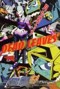

[落叶](https://pewae.com/gaan/aHR0cHM6Ly9tb3ZpZS5kb3ViYW4uY29tL3N1YmplY3QvMTk0NzI2NQ==)

原名：Dead Leaves导演：今石洋之主演：加濑康之 / 山口胜平 / 岩崎征实 / 岩田光央 / 本田贵子 / 梁田清之 / 水谷优子 / 竹本英史 / 飞田展男 / 高木涉类型：冒险 / 动作 / 动画 / 喜剧 / 科幻地区：日本首映时间：2004

节奏紧凑，有一种闪瞎眼的癫狂。
钻头鸡鸡可太逗了。
略污。

[银河铁道999](https://pewae.com/gaan/aHR0cHM6Ly9tb3ZpZS5kb3ViYW4uY29tL3N1YmplY3QvMTQ3NzkyNA==)

原名：Galaxy Express 999导演：林太郎主演：久松保夫 / 井上真树夫 / 池田昌子 / 藤田淑子 / 野泽雅子 / 银河万丈 / 麻上洋子 / 麻生美代子类型：冒险 / 动画 / 奇幻 / 科幻地区：日本首映时间：1979

片中的永生也没什么不好。
对待恶法就是要反抗。
音乐很棒。

[学校霸王](https://pewae.com/gaan/aHR0cHM6Ly9tb3ZpZS5kb3ViYW4uY29tL3N1YmplY3QvMjA3OTYzMg==)

导演：朱延平 / 金鳌勋主演：朱家麟 / 林心如 / 林志颖 / 江国宾 / 金城武类型：剧情 / 动作 / 喜剧地区：台湾首映时间：1995

林志颖的亮相舞蹈跳得好猥琐。
不满20岁的林心如简直要嫩出水来。
朱延平发起狠来，连自己都抄。

[想成为奥田民生的男孩和让男人痴狂的女孩](https://pewae.com/gaan/aHR0cHM6Ly9tb3ZpZS5kb3ViYW4uY29tL3N1YmplY3QvMjY3OTgzNjc=)

原名：A Boy Who Wished to Be Okuda Tamio and a Girl Who Drove All Men Crazy导演：大根仁主演：中川雅也 / 天海祐希 / 妻夫木聪 / 安藤樱 / 新井浩文 / 松尾铃木 / 水原希子 / 江口德子类型：喜剧 / 爱情地区：日本首映时间：2017

水原希子这张脸是挺精致的，但这口牙是真不适合怼脸拍。
黑灯瞎火地找黑猫这段还挺有趣。
奥田民生的歌不错。

[魔诫坟场](https://pewae.com/gaan/aHR0cHM6Ly9tb3ZpZS5kb3ViYW4uY29tL3N1YmplY3QvMTI5NjY4NQ==)

原名：Cemetery Man导演：米歇尔·索伊主演：François Hadji-Lazaro / 安娜·法尔奇 / 鲁伯特·艾弗雷特类型：喜剧 / 恐怖 / 爱情地区：法国首映时间：1994

坟头做爱，谁会不想看呢？
充斥着荒诞的美好气息。
跟班好惨。

[特工355](https://pewae.com/gaan/aHR0cHM6Ly93d3cuaW1kYi5jb20vdGl0bGUvdHQ4MzU2OTQy)

原名：The 355导演：simon kinberg主演：佩内洛普·克鲁兹 / 塞巴斯蒂安·斯坦 / 杰西卡·查斯坦 / 艾格·拉米瑞兹 / 艾米利欧·殷索莱拉 / 范冰冰 / 露皮塔·尼永奥 / 黛安·克鲁格类型：动作 / 惊悚地区：美国首映时间：2022

女性题材用在特工片上真不是神马好主意，并不是所有的片子都能成为霹雳娇娃。
范冰冰显得好臃肿。
最后一段有点小看天朝警察了。

[集体逃课日](https://pewae.com/gaan/aHR0cHM6Ly9tb3ZpZS5kb3ViYW4uY29tL3N1YmplY3QvMzAzNzE1NQ==)

原名：Senior Skip Day导演：拉里·米勒主演：Gary Lundy / Tara Reid / 凯拉·伊薇儿 / 塔琳·萨瑟恩 / 拉里·米勒 / 查尔顿·赫斯顿 / 泰伦·托瑞埃若 / 莉·汤普森类型：喜剧地区：美国首映时间：2007

男主看着就欠揍。
校长线还比较有趣。

[在糟糕的日子里](https://pewae.com/gaan/aHR0cHM6Ly9tb3ZpZS5kb3ViYW4uY29tL3N1YmplY3QvMzUyOTMxNjA=)

原名：The Trip导演：托米·维尔科拉主演：克里斯蒂安·鲁贝克 / 加尔万·麦希迪 / 劳米·拉佩斯 / 塞罗姆·埃内图 / 安德烈·埃里克森 / 尼尔斯·奥勒·奥特布罗 / 托尔·埃里克·冈斯特伦 / 斯蒂格·弗洛德·亨里克森 / 阿卡塞尔·亨涅 / 阿特勒·安东森类型：动作 / 喜剧 / 恐怖 / 惊悚地区：挪威首映时间：2021

可怜的草坪机上的老父亲。
朋友也死得挺冤的。

[假爸爸](https://pewae.com/gaan/aHR0cHM6Ly9tb3ZpZS5kb3ViYW4uY29tL3N1YmplY3QvMzYxNDAwNjI=)

导演：贾冰主演：丁嘉丽 / 于洋 / 倪虹洁 / 包贝尔 / 尹正 / 徐峥 / 杨皓宇 / 潘斌龙 / 王迅 / 贾冰类型：剧情 / 喜剧地区：大陆首映时间：2025

故事的内核不错，但是填充物不行，水分太大节奏也不好。
贾冰把裸奔这种招数都用上了，看得出沈阳那时候挺冷的。
音乐为主线的电影，歌却都不怎么好听。

[四个丘比特](https://pewae.com/gaan/aHR0cHM6Ly9tb3ZpZS5kb3ViYW4uY29tL3N1YmplY3QvNDcxMzk4MQ==)

导演：王才涛主演：于娜 / 四小凤 / 苏有朋 / 范明 / 颜丹晨类型：喜剧 / 爱情地区：大陆首映时间：2010

五阿哥有什么好看的，难看死了。
四胞胎听起来挺新鲜，但真是不好看啊。
剧情依托，苏有朋也真够配合的了。

[Soho区惊魂夜](https://pewae.com/gaan/aHR0cHM6Ly9tb3ZpZS5kb3ViYW4uY29tL3N1YmplY3QvMzA0NDc0NDA=)

原名：Last Night in Soho导演：埃德加·赖特主演：丽塔·塔欣厄姆 / 安雅·泰勒-乔伊 / 山姆·克拉弗林 / 托马辛·麦肯齐 / 特伦斯·斯坦普 / 科林·梅斯 / 西诺薇·卡尔森 / 迈克尔·阿乔 / 马特·史密斯 / 黛安娜·里格类型：恐怖 / 悬疑地区：英国首映时间：2021

结局烂到不行，但是倒数第二个场景女一女二在扭曲的镜头下对决很漂亮。
60年代的纸醉金迷描绘得不错。
政治正确已经入侵到了英国？小黑半毛钱作用没有。

[12年级的失败](https://pewae.com/gaan/aHR0cHM6Ly9tb3ZpZS5kb3ViYW4uY29tL3N1YmplY3QvMzY2Mjk4Nzg=)

原名：12th Fail导演：维德胡·维诺德·乔普拉主演：Abhishek Sengupta / Anant Joshi / Anshuman Pushkar / Geeta Agrawal Sharma / Harish Khanna / Sarita Joshi / Vikas Divyakirti / 普里耶修·查特奇 / 梅德哈·尚卡尔 / 维克兰特·梅西类型：传记 / 剧情地区：印度首映时间：2023

印度凤凰男的故事，过程很好，结局过于和谐社会。
印度穷小子考不上公，只能回村子，或者扫厕所磨面粉，而中国的可以送外卖，所以中国更强大。
但是中国电影多久没出过直面基层腐败的题材了？

[来了](https://pewae.com/gaan/aHR0cHM6Ly9tb3ZpZS5kb3ViYW4uY29tL3N1YmplY3QvMzAxNDAyMjk=)

原名：It Comes导演：中岛哲也主演：仲野太贺 / 冈田准一 / 妻夫木聪 / 小松菜奈 / 志田爱珠 / 松隆子 / 柴田理惠 / 石田惠理 / 青木崇高 / 黑木华类型：恐怖 / 悬疑 / 惊悚地区：日本首映时间：2018

小松菜奈是日本的腿玩年。
前半截黏黏糊糊，后面驱魔拍得真不错。

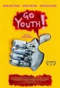

[放肆青春！](https://pewae.com/gaan/aHR0cHM6Ly9tb3ZpZS5kb3ViYW4uY29tL3N1YmplY3QvMzUzMjIyMDI=)

原名：Go Youth!导演：卡洛斯·阿梅拉主演：Daniela Arce / Mario Palmerin / 罗德里戈·科尔特斯类型：喜剧地区：墨西哥首映时间：2021

普通乃至无聊。
阳光明媚，街道整洁，青年人迷途知返，这是墨西哥的旅游宣传片吗？

[坏种2](https://pewae.com/gaan/aHR0cHM6Ly9tb3ZpZS5kb3ViYW4uY29tL3N1YmplY3QvMzU2NjAxOTE=)

原名：The Bad Seed Returns导演：路易斯·阿桑宝特主演：加芙瑞拉·贝埃 / 帕蒂·麦克马科 / 本杰明·艾瑞斯 / 洛恩·卡迪纳尔 / 米歇尔·摩根 / 艾拉·迪克森 / 露西娅·沃尔特斯 / 马利·沃楚克 / 马洛·齐默曼 / 麦肯娜·格瑞丝类型：剧情 / 恐怖 / 惊悚地区：美国首映时间：2022

配乐像走错片场一样，但是好带感啊。
开头悬疑感不错，结局解决悬念的办法竟然是给所有人集体降智，失败。
女主角小眼神不错。

[甜蜜释放](https://pewae.com/gaan/aHR0cHM6Ly9tb3ZpZS5kb3ViYW4uY29tL3N1YmplY3QvMzY4OTA4MDQ=)

原名：Sweet Release导演：潘乔·马尼奎斯主演：Anthony Dabao / Beaulah / Horace Mendoza / Jem Milton / Jonica Lazo / Mae Andres / Mhack Morales / Nathan Cajucom / 戴妮莎·加西亚 / 阿塔斯卡·梅尔卡多类型：剧情地区：菲律宾首映时间：2024

用公路片的形式拍小黄片，也算用心了。
两个女主，一个脸型不喜欢，另一个鼻子好假。

[青春硬起来](https://pewae.com/gaan/aHR0cHM6Ly9tb3ZpZS5kb3ViYW4uY29tL3N1YmplY3QvMzYzOTE5NjM=)

原名：Hard Feelings导演：葛兰兹·亨曼主演：Lilly Joan Gutzeit / Louis Jérôme Wagenbrenner / Maximilian Schneider / Monika Oschek / Nhung Hong / Tobias Schäfer / 汤姆·贝克 / 科茜玛·亨曼 / 萨米拉·布鲁尔 / 薇薇安卡类型：喜剧地区：德国首映时间：2023

近大远小。
为什么这种类型的主人公身边都有一个初始妹子？
德国妹子看着可真显老，一点儿不像96年的。

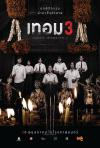

[猛鬼大学3](https://pewae.com/gaan/aHR0cHM6Ly9tb3ZpZS5kb3ViYW4uY29tL3N1YmplY3QvMzY4ODIxMTM=)

原名：Haunted Universities 3导演：Aroonakorn Pick / Aussada Likitboonma / Sorawit Meungkeaw / 侬塔瓦特·纳姆本查珀主演：Anirut Kayensee / Kanchit Jaichobngam / Ponchanan Chantra / Sun Pansin / Tawan Hiranyapong / 依莎亚·贺苏汪 / 妮查潘·查采芃纳 / 察猜·钦西 / 平西朋·艾格朋皮西 / 西瓦·詹隆库类型：喜剧 / 恐怖地区：泰国首映时间：2024

沉闷

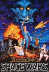

[屌飞船奇遇记](https://pewae.com/gaan/aHR0cHM6Ly9tb3ZpZS5kb3ViYW4uY29tL3N1YmplY3QvMjE2MjkxNw==)

原名：Flesh Gordon导演：迈克尔·本维尼斯特 / 霍华德·齐姆主演：Joseph Hudgins / Suzanne Fields / 贾森·威廉姆斯类型：冒险 / 情色 / 科幻地区：美国首映时间：1974

粗糙但有趣.
40年来人类写小黄文的创意没啥进步。
如此小制作敢嘲讽金刚和超人，勇气可嘉。

[下一球成名](https://pewae.com/gaan/aHR0cHM6Ly9tb3ZpZS5kb3ViYW4uY29tL3N1YmplY3QvMjU4MjI2OTU=)

原名：Next Goal Wins导演：Mike Brett / Steve Jamison主演：Charles Uhrle / Gene Ne'emia / Jaiyah Saelua / Larry Mana'o / Nicky Salapu / Rawlston Masaniai / Thomas Rongen类型：纪录 / 运动地区：英国首映时间：2014

澳大利亚31：0血洗美属萨摩亚后，深感愧疚，脱离大洋洲足联，加入亚足联。
蕞尔小邦竟然在少数性别群体方面如此开放。
再弱的球队也有宿敌。

[魅祸啦啦队](https://pewae.com/gaan/aHR0cHM6Ly9tb3ZpZS5kb3ViYW4uY29tL3N1YmplY3QvMzYyMzcxMjc=)

原名：Deadly Cheers导演：Jessica Janos主演：Kym Wilson / Macy Minear / 贾斯汀·波尔蒂类型：惊悚地区：美国首映时间：2022

编剧是AI吧。
拖泥带水。

[不羁夜](https://pewae.com/gaan/aHR0cHM6Ly9tb3ZpZS5kb3ViYW4uY29tL3N1YmplY3QvMTI5Mjk2NQ==)

原名：Boogie Nights导演：保罗·托马斯·安德森主演：Samson Barkhordarian / 伯特·雷诺兹 / 唐·钱德尔 / 妮可·阿丽·帕克 / 威廉·H·梅西 / 朱丽安·摩尔 / 海瑟·格拉汉姆 / 约翰·C·赖利 / 路易斯·古兹曼 / 马克·沃尔伯格类型：剧情 / 情色地区：美国首映时间：1997

毒狗竟然能活下来，太不合理。
屌再硬也硬不过时代。
为艺术献身的女艺术家之朱丽安·摩尔，part2。

[老狗](https://pewae.com/gaan/aHR0cHM6Ly9tb3ZpZS5kb3ViYW4uY29tL3N1YmplY3QvMzY4NDc2MjU=)

导演：姜晓通主演：刘奕铁 / 刘怡潼 / 包贝尔 / 姜武 / 安琥 / 朱时茂 / 胡子程 / 马苏类型：剧情 / 动作 / 喜剧地区：大陆首映时间：2025

死了的狗就是好狗。
姜武和包贝尔演的都不错，可惜包贝尔没有挨打。
贩毒线还是弱了点。

[南京！南京！](https://pewae.com/gaan/aHR0cHM6Ly9tb3ZpZS5kb3ViYW4uY29tL3N1YmplY3QvMjI5NDU2OA==)

导演：陆川主演：中泉英雄 / 刘烨 / 姚笛 / 木幡龙 / 江一燕 / 秦岚 / 范伟 / 裴中中 / 贝弗利·佩库斯 / 高圆圆类型：剧情 / 历史 / 战争地区：大陆首映时间：2009

太穷了，南京就算被炸，也不至于反反复复只有片中那么几栋建筑。
普通人视角的南京惨案，要比宏大叙事更动人。
可惜的是人物较多，焦点太散。

[谁是超级英雄](https://pewae.com/gaan/aHR0cHM6Ly9tb3ZpZS5kb3ViYW4uY29tL3N1YmplY3QvMzUyMTIwNzk=)

原名：Superwho?导演：菲利普·拉肖主演：乔治斯·科拉菲斯 / 卜拉欣·布哈勒 / 塔雷克·布达里 / 尚塔尔·拉德索 / 朱利安·阿鲁蒂 / 爱丽丝·杜富尔 / 艾洛蒂·丰唐 / 菲利普·拉肖 / 让·雨果·安格拉德 / 阿马尔·维克德类型：动作 / 喜剧地区：法国首映时间：2022

健忘症是哪个年代的鬼理由啊。
动作戏一点意思都没有。

[年少日记](https://pewae.com/gaan/aHR0cHM6Ly9tb3ZpZS5kb3ViYW4uY29tL3N1YmplY3QvMzQ5NDA4Nzk=)

导演：卓亦谦主演：何珀廉 / 卢镇业 / 吴冰 / 周汉宁 / 归绰峣 / 戴玉麒 / 郑中基 / 陈汉娜 / 韦罗莎 / 黄梓乐类型：剧情地区：香港首映时间：2024

人，究竟该如何面对自己？
为香港还能拍出这样的电影感到高兴。
扣一分，是因为女朋友的戏份还可以再深挖一点。

[消失爱人](https://pewae.com/gaan/aHR0cHM6Ly9tb3ZpZS5kb3ViYW4uY29tL3N1YmplY3QvMjYzMDk5Njg=)

导演：黄真真主演：张榕容 / 林俊杰 / 王珞丹 / 石修 / 黎明类型：悬疑 / 爱情地区：大陆首映时间：2016

黎明和王珞丹完全不来电。
林俊杰演的像个小学生，下次别演了。
MV式的怼脸看得够够的。

[第九分局](https://pewae.com/gaan/aHR0cHM6Ly9tb3ZpZS5kb3ViYW4uY29tL3N1YmplY3QvMzAzNDYwMjM=)

导演：王鼎霖主演：刘奕儿 / 张允曦 / 杨雁雁 / 汪建民 / 温贞菱 / 澎恰恰 / 袁艾菲 / 邱泽 / 马力欧 / 高英轩类型：动作 / 喜剧 / 奇幻地区：台湾首映时间：2019

高开低走，可惜后半段流俗。
反派女配演得太假了，拉低了整个片子的水准。

[大明劫](https://pewae.com/gaan/aHR0cHM6Ly9tb3ZpZS5kb3ViYW4uY29tL3N1YmplY3QvMTE2MjcwNjg=)

导演：王竞主演：余少群 / 冯远征 / 冯韵之 / 司源 / 戴立忍 / 杨旸 / 胡晓光 / 钱学格 / 马精武类型：剧情 / 历史 / 古装地区：大陆首映时间：2013

细腻认真的历史剧，可惜剧情太平缺少高潮。

[鬼媾人](https://pewae.com/gaan/aHR0cHM6Ly9tb3ZpZS5kb3ViYW4uY29tL3N1YmplY3QvMTQ3OTgxOQ==)

导演：刘仕裕主演：关之琳 / 叶汉良 / 夏文汐 / 曹查理 / 王晶 / 莫少聪 / 陈百祥类型：喜剧 / 恐怖地区：香港首映时间：1989

王晶演不了正经人。
关之琳的红衣女鬼形象不错。
最后决战整个氛围乱掉了。

[消失的情人节](https://pewae.com/gaan/aHR0cHM6Ly9tb3ZpZS5kb3ViYW4uY29tL3N1YmplY3QvMzUxNTQ5NTc=)

导演：陈玉勋主演：刘冠廷 / 周群达 / 庄益增 / 李霈瑜 / 林美秀 / 陈竹升 / 马志翔 / 黑嘉嘉类型：喜剧 / 奇幻 / 爱情地区：台湾首映时间：2020

中段科幻感消失。
导演讲故事的能力亟待提高。
女主演的还不错，男主就油了。

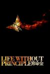

[夺命金](https://pewae.com/gaan/aHR0cHM6Ly9tb3ZpZS5kb3ViYW4uY29tL3N1YmplY3QvMzUzMjYxNA==)

导演：杜琪峰主演：任贤齐 / 刘青云 / 卢海鹏 / 胡杏儿 / 苏杏璇 / 谭炳文 / 车婉婉 / 钟舒漫 / 陈自瑶 / 黄日华类型：剧情 / 犯罪地区：香港首映时间：2012

拍的比较精细，演的也不差，但是完全没有特色。
港版结尾还行。
也算是敏锐地观察到了港陆矛盾了。

[老枪](https://pewae.com/gaan/aHR0cHM6Ly9tb3ZpZS5kb3ViYW4uY29tL3N1YmplY3QvMzM0NTg5Nzk=)

导演：高朋主演：何熙维 / 冯雷 / 周政杰 / 祖峰 / 秦海璐 / 衣云鹤 / 邵兵类型：剧情 / 犯罪地区：大陆首映时间：2024

瞎JB加什么埃蒙斯！埃蒙斯最早出场是2004年，哪儿还有大哥大了，年代全被搞乱了。
可怜秦海璐把脸整得已经无法做出微表情了。
谷峰邵兵演的都很棒。

[六月之蛇](https://pewae.com/gaan/aHR0cHM6Ly9tb3ZpZS5kb3ViYW4uY29tL3N1YmplY3QvMTI5OTI1MQ==)

原名：A Snake of June导演：冢本晋也主演：不破万作 / 冢本晋也 / 寺岛进 / 神足裕司 / 黑泽明日香类型：剧情 / 悬疑 / 情色地区：日本首映时间：2002

妻子线紧张刺激，丈夫线敷衍了事。
黑泽明日香似笑非笑的表情很迷人。
特效夸张了，丢份。

[填词L](https://pewae.com/gaan/aHR0cHM6Ly9tb3ZpZS5kb3ViYW4uY29tL3N1YmplY3QvMzU5ODY4MzM=)

导演：黄绮琳主演：吴冰 / 周汉宁 / 潘宗孝 / 胡子彤 / 葛民辉 / 邓丽英 / 邵美君 / 钟雪莹 / 陈书昕 / 陈毅燊类型：剧情地区：香港首映时间：2024

多少人的理想，是从入门到放弃。
人首先要活着，其次还是要活着。
剧情有点虎头蛇尾。

[猫妖小杏](https://pewae.com/gaan/aHR0cHM6Ly9tb3ZpZS5kb3ViYW4uY29tL3N1YmplY3QvMzYzOTQ2OTE=)

原名：Ghost Cat Anzu导演：久野遥子 / 山下敦弘主演：五藤希爱 / 市川实和子 / 森山未来 / 水泽绅吾 / 泽部渡 / 铃木庆一 / 青木崇高类型：动画地区：日本首映时间：2024

成长总要在暑假。
很喜欢过曝光的色调。
青蛙线还可以深挖。

[妖法](https://pewae.com/gaan/aHR0cHM6Ly9tb3ZpZS5kb3ViYW4uY29tL3N1YmplY3QvMzAxNjI2MDA=)

原名：Hex导演：鲁道夫·贝腾达奇主演：Dara Phang / Philip Philmar / Sarita Reth / Sisowath Siriwudd / Steve Bakken / 凯利·布拉茨 / 斯文·索奇塔 / 珍妮·博伊德 / 罗斯·麦克科尔 / 阿德里安·霍夫类型：恐怖地区：美国首映时间：2018

全片沉闷，但收了个不错的结尾。
女主眼角的鱼尾纹重到出戏。

[误杀3](https://pewae.com/gaan/aHR0cHM6Ly9tb3ZpZS5kb3ViYW4uY29tL3N1YmplY3QvMzU4MTU3NzE=)

导演：甘剑宇主演：佟丽娅 / 冯兵 / 刘雅瑟 / 周楚濋 / 尹子维 / 徐诣帆 / 段奕宏 / 王龙正 / 肖央 / 高捷类型：剧情 / 悬疑 / 犯罪地区：大陆首映时间：2024

这个系列拍到这里，“要反转了”是卖点也是桎梏，这次对于反转的把握的还行，但是剧情硬伤有点多。
尹子维演好人还真不适应，一直以为反转会落在他身上呢。
你们就继续往泰国身上泼脏水吧！

[射雕英雄传：侠之大者](https://pewae.com/gaan/aHR0cHM6Ly9tb3ZpZS5kb3ViYW4uY29tL3N1YmplY3QvMzYyODk0MjM=)

导演：徐克主演：吴兴国 / 巴雅尔图 / 庄达菲 / 张文昕 / 梁家辉 / 纳仁巴特尔 / 肖战 / 胡军 / 蔡少芬 / 阿如那类型：武侠地区：大陆首映时间：2025

徐老怪，岁数大了就退休吧，你们这些香港人能学点历史不，蒙古打金国需要从宋朝借道？而且郭靖一嘴一个南宋，他妈的感觉跟溥仪说自己是伪满皇帝一样。
没有九阴白骨爪的射雕是没有灵魂的，剧本没有形成小江湖和大民族的对比，郭靖这个人物没有丁点儿弧光。
打斗完全是比划+音效+特效，一点点身体接触都没有，我看你这个干嘛，看小姐姐跳舞它不香么？

[破·地狱](https://pewae.com/gaan/aHR0cHM6Ly9tb3ZpZS5kb3ViYW4uY29tL3N1YmplY3QvMzY3MTI5ODc=)

导演：陈茂贤主演：卫诗雅 / 周家怡 / 朱栢康 / 梁雍婷 / 白只 / 秦沛 / 许冠文 / 金燕玲 / 韦罗莎 / 黄子华类型：剧情 / 家庭地区：香港首映时间：2024

今日天各一方，难见面。
LGBT那段根本没必要，玛莎拉蒂的也可以用更好的方式结尾。
黄子华线跟连诗雅线的衔接其实不太顺畅。

[好东西](https://pewae.com/gaan/aHR0cHM6Ly9tb3ZpZS5kb3ViYW4uY29tL3N1YmplY3QvMzYxNTQ4NTM=)

导演：邵艺辉主演：任彬 / 周野芒 / 孔连顺 / 宋佳 / 张弛 / 曾慕梅 / 王菊 / 章宇 / 赵又廷 / 钟楚曦类型：剧情 / 爱情地区：大陆首映时间：2024

喜欢这种不禁烟不禁酒不禁欲的创作态度，以及时不时跳出来的冷笑话。
听音辩物那段太棒了！
缺点是插曲插得有点儿频了，虽然钟楚曦的歌唱得还不赖。

[死侍与金刚狼](https://pewae.com/gaan/aHR0cHM6Ly9tb3ZpZS5kb3ViYW4uY29tL3N1YmplY3QvMjY5NTc5MDA=)

原名：Deadpool & Wolverine导演：肖恩·利维主演：乔恩·费儒 / 休·杰克曼 / 克里斯·埃文斯 / 瑞安·雷诺兹 / 罗伯·德兰尼 / 艾玛·科林 / 莫蕾娜·巴卡琳 / 莱斯利·格塞斯 / 达芙妮·基恩 / 马修·麦克费登类型：动作 / 喜剧 / 科幻地区：美国首映时间：2024

小贱贱没让人失望，不过迪士尼也不是啥好鸟，真打算让狼叔干到90岁啊！
不愧是视第四堵墙为无物的主人公，不过你一个X战警的编外人员，搞那么多复仇者的梗干嘛？我就看不懂复仇者的梗，这方面体验糟糕。
本田是花了广告费还是没交保护费？

[致命36区](https://pewae.com/gaan/aHR0cHM6Ly9tb3ZpZS5kb3ViYW4uY29tL3N1YmplY3QvMzcwMjI5OTU=)

原名：Sector 36导演：Aditya Nimbalkar主演：Baharul Islam / Mahadev Singh Lakhawat / 维金兰特·马西 / 达尔尚·杰里瓦拉 / 迪帕克·迪布里亚尔 / 阿卡什·库拉纳类型：剧情 / 惊悚 / 犯罪地区：印度首映时间：2024

蟑螂再努力，也干不过人字拖。
不愧是印度，这器官摘的也是干净又卫生，可以立刻送去做溜肝尖。
男主的转变过于突兀。

[诡才之道](https://pewae.com/gaan/aHR0cHM6Ly9tb3ZpZS5kb3ViYW4uY29tL3N1YmplY3QvMzUzNjQ2OTE=)

导演：徐汉强主演：叶静涵 / 姚以缇 / 张榕容 / 王净 / 瘦瘦 / 百白 / 罗芽里 / 葛凡 / 那维勋 / 陈柏霖类型：喜剧 / 恐怖地区：台湾首映时间：2025

有创意的题材加不错的制作。
陈柏霖的MV彩蛋好有趣。
可惜台湾这几个女演员功力还差些意思，本可以更好一些的。

[火锅艺术家](https://pewae.com/gaan/aHR0cHM6Ly9tb3ZpZS5kb3ViYW4uY29tL3N1YmplY3QvMzY2MjA5NTI=)

导演：崔志佳主演：乔杉 / 于洋 / 刁标 / 宋小宝 / 崔志佳 / 张琪 / 李昆鹰 / 焦俊艳 / 艾伦 / 魏翔类型：喜剧地区：大陆首映时间：2025

东北这帮“喜剧人”跟香港佬一样，就那么几块料，每年排列组合出来恰饭。
不同的是，东北佬还喜欢轮流当导演，平心而论，佳佳还算是不错的那个。
但是，你不尊重电影、不尊重观众也就罢了，不尊重火锅是会遭报应的。

[热情邀约](https://pewae.com/gaan/aHR0cHM6Ly9tb3ZpZS5kb3ViYW4uY29tL3N1YmplY3QvMzYxNDg0NTE=)

原名：You're Cordially Invited导演：尼古拉斯·斯托勒主演：Leanne Morgan / 凯拉·蒙特罗索·梅加 / 吉米·塔特罗 / 威尔·法瑞尔 / 杰拉尔丁·维斯瓦纳坦 / 梅瑞迪斯·海格纳 / 瑞茜·威瑟斯彭 / 罗里·斯卡沃 / 西利亚·维斯顿 / 韦斯利·曼恩类型：喜剧地区：美国首映时间：2025

挂满蛛网的老梗，演的还凑合。
对于威尔法瑞尔对于这类夸张表演的热衷难以理解。
女主好烦。

[一级指控](https://pewae.com/gaan/aHR0cHM6Ly9tb3ZpZS5kb3ViYW4uY29tL3N1YmplY3QvMzAyMDA5NzM=)

导演：黄国辉主演：何珮瑜 / 廖启智 / 张建声 / 张松枝 / 方中信 / 曾江 / 谭耀文 / 陈家乐 / 骆应钧 / 鲍起静类型：动作 / 悬疑 / 犯罪地区：大陆首映时间：2021

用伪证击败伪证。
剧情弱得冒泡，完全靠老戏骨的演技给撑起来的，可怜。

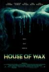

[恐怖蜡像馆](https://pewae.com/gaan/aHR0cHM6Ly9tb3ZpZS5kb3ViYW4uY29tL3N1YmplY3QvMTMwOTE4NA==)

原名：House of Wax导演：佐米·希尔拉主演：乔恩·亚伯拉罕斯 / 伊丽莎·库斯伯特 / 布莱恩·范·霍尔特 / 帕丽斯·希尔顿 / 查德·迈克尔·墨瑞 / 贾德·帕达里克类型：恐怖 / 惊悚地区：美国首映时间：2005

难得一见的伙伴不分开送人头的恐怖片。
但也没聪明到哪儿去。
滴蜡的效果还不错。

[尸前想后](https://pewae.com/gaan/aHR0cHM6Ly9tb3ZpZS5kb3ViYW4uY29tL3N1YmplY3QvNDExNjk2OQ==)

导演：献岳主演：万绮雯 / 温碧霞类型：恐怖地区：香港首映时间：2000

俗套量产鬼片。
万绮雯被拍得好胖。

[堕落东京](https://pewae.com/gaan/aHR0cHM6Ly9tb3ZpZS5kb3ViYW4uY29tL3N1YmplY3QvMTQyNjgxNA==)

原名：Tokyo Decadence导演：村上龙主演：三上寛 / 二阶堂美穗 / 信太昌之 / 加納典明 / 天野小夜子 / 岛田雅彦 / 瀬間千恵 / 草间弥生 / 野崎奈美类型：剧情地区：日本首映时间：1992

多少无聊的人们啊！
片尾的定格好奇怪。

[失衡凶间](https://pewae.com/gaan/aHR0cHM6Ly9tb3ZpZS5kb3ViYW4uY29tL3N1YmplY3QvMzUzODc1OTc=)

导演：冯志强 / 许业生 / 陈果主演：任贤齐 / 伍咏诗 / 关楚耀 / 吴海昕 / 林晓峰 / 罗孝勇 / 苏丽珊 / 郑丹瑞 / 陈维诺 / 颜卓灵类型：恐怖 / 惊悚地区：香港首映时间：2022

氛围还行，节奏也可以。
颜卓灵怎么退化到这种程度了，演得还不如她的虎牙有戏。
郑丹瑞都这么老了。

[失衡凶间之罪与杀](https://pewae.com/gaan/aHR0cHM6Ly9tb3ZpZS5kb3ViYW4uY29tL3N1YmplY3QvMzU5MzcxOTI=)

导演：许学文 / 陈翊恒 / 黄千殷主演：卫诗雅 / 吴凤鸣 / 吴嘉乐 / 周祉君 / 张凯娸 / 张松枝 / 张裕东 / 魏秋桦 / 黄又南 / 黄溢濠类型：剧情 / 悬疑 / 惊悚 / 犯罪地区：香港首映时间：2023

血腥味变重，猎奇程度不足。
林嘉欣的颜值怎么变了这么多？

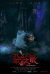

[失衡凶间之恶念之最](https://pewae.com/gaan/aHR0cHM6Ly9tb3ZpZS5kb3ViYW4uY29tL3N1YmplY3QvMzYzMTgwNTY=)

导演：李巨源 / 李志毅 / 黄炳耀主演：何世文 / 何颖璇 / 吴凤鸣 / 周祉君 / 周霭儿 / 和泉素行 / 朱柏谦 / 林千渟 / 柯炜林 / 陈湛文类型：剧情 / 惊悚 / 犯罪地区：香港首映时间：2023

制作精良了，也拖沓了。
第一个剧本本来不错，导演能力太差了。
第二个故事太没意思。

[凶兆](https://pewae.com/gaan/aHR0cHM6Ly9tb3ZpZS5kb3ViYW4uY29tL3N1YmplY3QvMTQ4MjAyOQ==)

原名：The Omen导演：约翰·摩尔主演：Baby Litera / Baby Morvas / Baby Muller / Baby Zikova / Bohumil Svarc / Carlo Sabatini / 乔瓦尼·隆巴多·雷迪斯 / 列维·施瑞博尔 / 普里德拉格·比耶拉克 / 朱丽娅·斯蒂尔斯类型：恐怖 / 惊悚地区：美国首映时间：2006

偶尔几个镜头有点死神来了的 意思，整体来讲极为平庸。
为啥非要让保姆穿老土的制服啊？怪怪的。

[完美陌生人(黎巴嫩版)](https://pewae.com/gaan/aHR0cHM6Ly9tb3ZpZS5kb3ViYW4uY29tL3N1YmplY3QvMzUyMjQ2NTY=)

原名：Perfect Strangers导演：Wissam Smayra主演：Abdelrahman Yasser / Mona Zaki / Raymonde Saade Azar / Sinead Chaaya / 乔治斯·哈巴兹 / 埃亚德·纳萨尔 / 娜丁·拉巴基 / 戴曼德·布·阿布德 / 法雅徳·耶敏 / 阿德尔·卡拉姆类型：剧情 / 喜剧地区：黎巴嫩首映时间：2022

中规中矩。
穆斯林不禁同性恋吗？不过黎巴嫩好像不能算传统穆斯林国家。

[黑太阳南京大屠杀](https://pewae.com/gaan/aHR0cHM6Ly9tb3ZpZS5kb3ViYW4uY29tL3N1YmplY3QvMTkxOTA5OA==)

导演：牟敦芾主演：姜文婷 / 张良 / 张西河 / 潘永 / 熊小田 / 韩振华类型：剧情 / 历史 / 战争地区：香港首映时间：1995

拍得比较矜持。
以牟敦芾的风格来说，比较没劲。
拍出了什么是具体的“麻木”。

[比尔和泰德畅游鬼门关](https://pewae.com/gaan/aHR0cHM6Ly9tb3ZpZS5kb3ViYW4uY29tL3N1YmplY3QvMTMwNDQyMQ==)

原名：Bill & Ted's Bogus Journey导演：彼得·休伊特主演：乔斯·雅克兰德 / 乔治·卡林 / 亚历克斯·温特 / 基努·里维斯 / 威廉姆·赛德勒 / 帕姆·格里尔类型：冒险 / 喜剧 / 奇幻 / 科幻地区：美国首映时间：1991

乱但有趣。
死神比其余所有角色加起来还更有趣。

[克洛伊](https://pewae.com/gaan/aHR0cHM6Ly9tb3ZpZS5kb3ViYW4uY29tL3N1YmplY3QvMzQxODE4Nw==)

原名：Chloe导演：阿托姆·伊戈扬主演：Mishu Vellani / 劳拉·德卡特莱特 / 妮娜·杜波夫 / 娜塔莉·林斯卡 / 朱丽安·摩尔 / 朱莉·卡纳 / 罗伯特·H·托马斯 / 连姆·尼森 / 阿曼达·塞弗里德 / 麦克斯·泰瑞奥类型：同性 / 家庭 / 悬疑地区：美国首映时间：2009

人性的扭曲加道德的沦丧，这种疯女人应该人道毁灭。
阿曼达的size不错，不过形状不好看。
转折生硬。

[美国田园下的罪恶](https://pewae.com/gaan/aHR0cHM6Ly9tb3ZpZS5kb3ViYW4uY29tL3N1YmplY3QvMTg3MjI3Mg==)

原名：An American Crime导演：汤米·奥·哈沃主演：丝柯·泰勒-考普顿 / 凯瑟琳·基纳 / 哈蕾·麦克法兰 / 尼克·瑟西 / 布莱德利·惠特福德 / 特里斯坦·贾里德 / 罗密·罗斯蒙特 / 艾利奥特·佩吉 / 艾莉·葛瑞那 / 詹姆斯·弗兰科类型：剧情 / 犯罪地区：美国首映时间：2007

铺垫过长，后半部分很精彩。
亲生父母的行为逻辑不够。
小胖子的角色塑造不错。

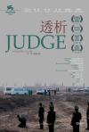

[透析](https://pewae.com/gaan/aHR0cHM6Ly9tb3ZpZS5kb3ViYW4uY29tL3N1YmplY3QvNDAxMTIwMw==)

导演：刘杰主演：倪大红 / 奇道 / 宋迎春 / 梅婷 / 郑铮 / 高群书类型：剧情地区：大陆首映时间：2009

有事梅婷干，没事干梅婷，尿毒症患者还这么精力旺盛，佩服啊佩服。
倪大红叠buff过多过于刻意，其余还不错。
结局恶臭。

[29片棕榈叶](https://pewae.com/gaan/aHR0cHM6Ly9tb3ZpZS5kb3ViYW4uY29tL3N1YmplY3QvMTMwNDI0Ng==)

原名：29 Palms导演：莱昂纳多·里卡尼主演：乔·鲍里托 / 克里斯·奥唐纳 / 凯文·西富恩特斯 / 加里·保罗·戴维斯 / 安妮塔·马耳他 / 拉塞尔·敏斯 / 杰瑞米·戴维斯 / 比尔·普尔曼 / 迈克尔·勒纳 / 迈克尔·拉帕波特类型：剧情 / 喜剧 / 惊悚 / 犯罪地区：美国首映时间：2002

三个大汉把主角二人撵下车，把女的扒光，把男的给爆菊了，这是什么神仙剧情？
既沉闷又浮躁，看得人身体不适。

[穷凶极恶](https://pewae.com/gaan/aHR0cHM6Ly9tb3ZpZS5kb3ViYW4uY29tL3N1YmplY3QvMzcxOTMzNzQ=)

导演：郭玉龙主演：侍宣如 / 安泽豪 / 岳冬峰 / 王双宝类型：剧情 / 恐怖 / 悬疑 / 惊悚地区：大陆首映时间：2025

一匹马拉4个人，特效做得再好又有什么意义呢？
王双宝老师老了之后竟然有点慈眉善目。
女主的脸太过于量产。

[黑处有什么](https://pewae.com/gaan/aHR0cHM6Ly9tb3ZpZS5kb3ViYW4uY29tL3N1YmplY3QvMjY0MzM5NjY=)

导演：王一淳主演：仁龙 / 刘丹 / 刘杰毅 / 吴珏瑾 / 周逵 / 苏晓彤 / 蒋雪鸣 / 贾致钢 / 郭笑 / 陆琦蔚类型：剧情 / 悬疑 / 犯罪地区：大陆首映时间：2016

满满的九十年代初风情，看到饭桌上哪个的搪瓷钵子，激动得热泪盈眶。
读课文一场戏，有趣但没必要。
可惜有个大BUG：《蜜桃成熟时》1991年可还没上映呢。

[乌龙大家庭](https://pewae.com/gaan/aHR0cHM6Ly9tb3ZpZS5kb3ViYW4uY29tL3N1YmplY3QvMTMwMDYyMw==)

导演：石天主演：乔宏 / 关德兴 / 曹达华 / 李香琴 / 林振康 / 梁韵蕊 / 石天 / 黎姿类型：喜剧地区：香港首映时间：1986

因循守旧。

[完美伴侣](https://pewae.com/gaan/aHR0cHM6Ly9tb3ZpZS5kb3ViYW4uY29tL3N1YmplY3QvMzY0MjEyNzA=)

原名：Companion导演：德鲁·汉考克主演：伍迪·傅 / 卢卡斯·盖奇 / 哈维·吉兰 / 杰克·奎德 / 梅根·苏丽 / 索菲·撒切尔 / 雅布其·杨-怀特 / 马克·门查卡 / 马特·麦卡锡 / 鲁伯特·弗兰德类型：惊悚 / 科幻地区：美国首映时间：2025

旧瓶装新酒，机器人觉醒题材，拍得一般。
女主倒是很漂亮，同性恋加得太刻意了。
自己开的车那么智能，警车和保险柜怎么都没有身份识别呢？

[诡丝](https://pewae.com/gaan/aHR0cHM6Ly9tb3ZpZS5kb3ViYW4uY29tL3N1YmplY3QvMTc4MDE2OA==)

导演：苏照彬主演：万芳 / 张钧甯 / 张震 / 徐熙媛 / 林嘉欣 / 江口洋介 / 津嘉山正种 / 陈冠伯 / 陈柏霖 / 马之秦类型：剧情 / 恐怖 / 悬疑 / 惊悚 / 科幻地区：台湾首映时间：2006

宣传人间大爱的鬼片，倒也挺无趣的。
节奏不好。

[无限复活](https://pewae.com/gaan/aHR0cHM6Ly9tb3ZpZS5kb3ViYW4uY29tL3N1YmplY3QvMTMwNTM4Ng==)

导演：刘镇伟主演：关继威 / 张柏芝 / 活丽明 / 郑伊健 / 陈忠伟类型：剧情 / 奇幻 / 爱情 / 科幻地区：香港首映时间：2002

张柏芝的颜值巅峰。
刘镇伟脑子不抽抽的时候还是能写出好本子的。
关继威演得真好，可惜作品不多。

[爱的新世界](https://pewae.com/gaan/aHR0cHM6Ly9tb3ZpZS5kb3ViYW4uY29tL3N1YmplY3QvMjA3NjM4Ng==)

原名：A New Love in Tokyo导演：高桥伴明主演：杉本彩 / 片冈礼子 / 铃木砂羽类型：剧情 / 喜剧 / 爱情地区：日本首映时间：1994

比较清新，但没有拍出底层的挣扎感。
片尾曲好听。

[万](https://pewae.com/gaan/aHR0cHM6Ly9tb3ZpZS5kb3ViYW4uY29tL3N1YmplY3QvMzY0NDkzMDM=)

原名：Manji导演：井土纪州主演：ぶっちゃあ / 仁科亚季子 / 大西信满 / 小原徳子 / 新藤真奈美 / 木岛法子 / 黒住尚生类型：剧情 / 同性 / 情色地区：日本首映时间：2023

女主的力气没使对地方。
毫无感情体验，尤其是男女之间。

[怒水西流](https://pewae.com/gaan/aHR0cHM6Ly9tb3ZpZS5kb3ViYW4uY29tL3N1YmplY3QvMzAyOTAyNTM=)

导演：冯勇沁主演：何沄伟 / 刘敏涛 / 匡牧野 / 吕晓霖 / 宁理 / 李春嫒 / 段博文 / 王迅 / 陈都灵 / 马书良类型：悬疑 / 犯罪地区：大陆首映时间：2025

破案片想战胜进度条是挺难的，何况我还只认识王迅刘敏涛，说他俩不是坏人都对不起出场费。
结尾崩坏了，战斗力提升过快。
陈都灵好瘦。

[游戏之夜](https://pewae.com/gaan/aHR0cHM6Ly9tb3ZpZS5kb3ViYW4uY29tL3N1YmplY3QvMjY5NDkyNDE=)

原名：Game Night导演：乔纳森·戈尔茨坦 / 约翰·弗朗西斯·戴利主演：丹尼·赫斯顿 / 凯尔·钱德勒 / 凯莉·班伯里 / 拉蒙尼·莫里斯 / 杰森·贝特曼 / 杰西·普莱蒙 / 比利·马格努森 / 瑞秋·麦克亚当斯 / 莎朗·豪根 / 迈克尔·C·豪尔类型：喜剧 / 悬疑 / 犯罪地区：美国首映时间：2018

反转太套路了，人物设定也多余而缺少个性。
瑞秋老了以后更漂亮了。
狗又不会死，给那么多镜头真没意思。

[沉默笔录](https://pewae.com/gaan/aHR0cHM6Ly9tb3ZpZS5kb3ViYW4uY29tL3N1YmplY3QvMzAzOTYyODM=)

导演：郝飞环主演：孙敏 / 楚布花羯 / 章宇 / 董凡 / 谭天 / 钟波 / 马吟吟类型：剧情 / 悬疑 / 犯罪地区：大陆首映时间：2023

悬疑感不强，章宇演得不差。
年代感很奇怪。

[时来运转](https://pewae.com/gaan/aHR0cHM6Ly9tb3ZpZS5kb3ViYW4uY29tL3N1YmplY3QvMTMwNDc0OA==)

导演：刘家荣主演：元彪 / 冯淬帆 / 午马 / 吴耀汉 / 曾志伟 / 李丽丽 / 林正英 / 楼南光 / 金燕玲 / 钟发类型：喜剧 / 恐怖 / 武侠地区：香港首映时间：1985

强行打戏，拼凑感十足。

[猛鬼3宝](https://pewae.com/gaan/aHR0cHM6Ly9tb3ZpZS5kb3ViYW4uY29tL3N1YmplY3QvMzU2MzM0MzI=)

导演：黄锎主演：凌文龙 / 吴骏熙 / 岑珈其 / 徐浩昌 / 王俊棠 / 蒙洁 / 钟雪莹 / 麦咏楠 / 麦梓亨 / 黄伟乐类型：喜剧 / 恐怖地区：香港首映时间：2022

反映香港颓势的鬼片，凑合。
剧情有点俗套，第二个故事稍好。

[神探小红帽](https://pewae.com/gaan/aHR0cHM6Ly9tb3ZpZS5kb3ViYW4uY29tL3N1YmplY3QvMzU2NTY5MjU=)

原名：Once Upon a Crime导演：福田雄一主演：佐藤二朗 / 夏菜 / 室毅 / 山本美月 / 岩田刚典 / 新木优子 / 木村绿子 / 桐谷美玲 / 桥本环奈 / 若月佑美类型：喜剧 / 悬疑 / 犯罪地区：日本首映时间：2023

剧情简陋，手法幼稚，子供向。
为什么日本人总能一板一眼地拍这种一眼假的东西呢？

[错体追击组合](https://pewae.com/gaan/aHR0cHM6Ly9tb3ZpZS5kb3ViYW4uY29tL3N1YmplY3QvMTQ4MjQ2Ng==)

导演：董玮主演：严广明 / 于荣光 / 梁琤 / 陈小春类型：动作地区：香港首映时间：1995

还行，主打一个不依不饶。
有的人就是天生会演戏，比如陈小春。
剧情未免太不把大陆公安当人了。

[涅槃咒](https://pewae.com/gaan/aHR0cHM6Ly9tb3ZpZS5kb3ViYW4uY29tL3N1YmplY3QvMzYyODk5Nzg=)

原名：Hanh Phúc Máu导演：chung nguyen / nguyen minh chung主演：Duoc Si Tien / Pham Huynh Huu Tai / 金春 / 陈庄类型：恐怖 / 惊悚地区：越南首映时间：2022

平平无奇。
越南的重男轻女也如此严重。

[杀手游戏](https://pewae.com/gaan/aHR0cHM6Ly9tb3ZpZS5kb3ViYW4uY29tL3N1YmplY3QvMzA3NjAzMA==)

原名：The Killer's Game导演：J·J·佩里主演：丹尼尔·伯哈特 / 安东尼娅·德斯普拉特 / 庞·克莱门捷夫 / 戴夫·巴蒂斯塔 / 斯科特·阿金斯 / 本·金斯利 / 泰瑞·克鲁斯 / 索菲亚·波多拉 / 谢娜·韦斯特 / 马克·扎罗类型：动作 / 喜剧 / 惊悚地区：美国首映时间：2024

男主角浑身土鳖气质，导致爆米花电影high不起来。
也就打那几个韩国人的十分钟能看。

[最佳损友闯情关](https://pewae.com/gaan/aHR0cHM6Ly9tb3ZpZS5kb3ViYW4uY29tL3N1YmplY3QvMTMwMzcyNA==)

导演：王晶主演：关之琳 / 冯淬帆 / 刘德华 / 吴君如 / 吴启华 / 曹查理 / 苗侨伟 / 邱淑贞 / 郑裕玲 / 陈百祥类型：喜剧地区：香港首映时间：1988

胡翻乱炒，价值观收汁。
王晶一个追女仔的壳子究竟拍了多少部冷饭啊！
陈百祥算第一男主？非常少见的了。

[一江春水](https://pewae.com/gaan/aHR0cHM6Ly9tb3ZpZS5kb3ViYW4uY29tL3N1YmplY3QvMzUxOTc3NjU=)

导演：高启盛主演：刘君 / 周恒乐 / 李妍锡 / 祝康笠 / 陈传凯 / 黄道胜类型：剧情 / 家庭 / 犯罪地区：大陆首映时间：2022

每个人都挺克制，挺好。
女主很漂亮，可惜跟小宋佳撞型了，以后看发展吧。
结局俗了。

[圣山村谜局](https://pewae.com/gaan/aHR0cHM6Ly9tb3ZpZS5kb3ViYW4uY29tL3N1YmplY3QvMzUxOTY2NTM=)

导演：扎西才加主演：土登格桑 / 姜子妍 / 平措扎西 / 扎姆拉 / 索朗次仁 / 罗布卓嘎类型：恐怖 / 悬疑地区：大陆首映时间：2021

女干部真是一副干部脸，完全不会演戏。
剧情非常普通，放到任何一个山区山村里都能成立，缺少藏族特色。
镜头语言也比较单调，只有掉下尸体那里还不错。

[虎胆女儿红](https://pewae.com/gaan/aHR0cHM6Ly9tb3ZpZS5kb3ViYW4uY29tL3N1YmplY3QvMTMwMjM2Nw==)

导演：王龙威主演：夏志珍 / 张荪薇 / 恬妞 / 惠英红 / 李美凤 / 王莱 / 石坚 / 西协美智子 / 陈惠敏 / 黄莺类型：剧情 / 动作 / 犯罪地区：香港首映时间：1990

倪震大少爷真是尴尬的要死，当然李美凤也没好到哪里去。
文隽写这个剧本根本就没带脑子，就是扒皮教父加杨门女将，感觉两包烟都用不了就抄完了。
黄莺不错，可惜没红。

[下一张皮肤](https://pewae.com/gaan/aHR0cHM6Ly9tb3ZpZS5kb3ViYW4uY29tL3N1YmplY3QvMjY0MjYwNzg=)

原名：The Next Skin导演：Isa Campo / 伊萨基·拉库埃斯塔主演：Fred Adenis / Greta Fernández / Igor Szpakowski / Sílvia Bel / 埃玛·苏亚雷斯 / 塞尔希·洛佩斯 / 布鲁诺·托德契尼 / 米克尔·伊格莱西亚斯 / 阿莱克斯·莫尔纳类型：剧情 / 惊悚地区：西班牙首映时间：2016

主线故事挺抓人，但是莫名其妙增加的LGBT元素倒胃口。
帅哥男主演得生涩。
西班牙大雪山还是挺帅的。

[胜券在握](https://pewae.com/gaan/aHR0cHM6Ly9tb3ZpZS5kb3ViYW4uY29tL3N1YmplY3QvMzYzNTQwODY=)

导演：刘循子墨主演：喻恩泰 / 宁理 / 张本煜 / 李乃文 / 杨皓宇 / 柯达 / 邓家佳 / 邓超 / 郑云龙 / 陈明昊类型：剧情地区：大陆首映时间：2024

邓超身边的人待他如亲妈。
冗长。
编剧栏写再多的名字也改变不了这些人没上过班的事实。

[一部未完成的电影](https://pewae.com/gaan/aHR0cHM6Ly93d3cuaW1kYi5jb20vdGl0bGUvdHQzMjE4NjU3OQ==)

原名：An Unfinished Film导演：娄烨主演：张颂文 / 梁鸣 / 毛小睿 / 秦昊 / 黄轩 / 齐溪类型：剧情地区：大陆 / 新加坡首映时间：2024

线上喝酒太真实，不是一顿，不是两顿，不是三顿。
齐溪真是放得开，她的控制能力好强，片中全是素颜怼脸的镜头。
最后的听我说谢谢你让全片得到升华。

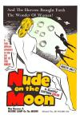

[月球上的裸体](https://pewae.com/gaan/aHR0cHM6Ly9tb3ZpZS5kb3ViYW4uY29tL3N1YmplY3QvMTg3NTE0MA==)

原名：Nude on the Moon导演：Doris Wishman / Raymond Phelan主演：Lester Brown / Marietta / William Mayer类型：奇幻 / 科幻地区：美国首映时间：1961

并不Cult，节奏奇怪。
60年代的带点肉肉的审美真不赖。

[正发生](https://pewae.com/gaan/aHR0cHM6Ly9tb3ZpZS5kb3ViYW4uY29tL3N1YmplY3QvMzUzMTgwMjE=)

原名：Happening导演：奥黛丽·迪万主演：卡西·莫泰·克莱恩 / 卢安娜·巴杰拉米 / 安娜·穆格拉利斯 / 安娜玛丽亚·沃特鲁梅 / 桑德里娜·博内尔 / 法布里齐奥·隆吉奥内 / 皮奥·马麦 / 路易丝·舍维约特 / 阿丽斯·德·朗克桑 / 露易丝·奥利-狄奎罗类型：剧情地区：法国首映时间：2021

压抑的年代与不安的心。
结局流俗。

[隔绝之巢](https://pewae.com/gaan/aHR0cHM6Ly9tb3ZpZS5kb3ViYW4uY29tL3N1YmplY3QvMzQ0NjMxOTk=)

原名：The Nest导演：罗伯托·迪·菲奥主演：Carlina Torta / Cristina Golotta / Elisabetta De Vito / Fabrizio Odetto / Francesca Cavallin / Ginevra Francesconi / Roberto Accornero / Valentina Bartolo / 毛里齐奥·隆巴迪 / 贾斯汀·科罗夫金类型：恐怖 / 悬疑地区：意大利首映时间：2019

拍得过于隐晦。
小女主颜值演技俱佳。
反转是出人意料，但是前面情绪积累不够。

[狗不穿裤子](https://pewae.com/gaan/aHR0cHM6Ly9tb3ZpZS5kb3ViYW4uY29tL3N1YmplY3QvMzAzNTI2OTY=)

原名：Dogs Don't Wear Pants导演：J-P·瓦尔科帕主演：Armands Reinis / Ellen Karppo / Iiris Anttila / Ilona Huhta / Samuel Shipway / 乌娜·艾罗拉 / 亚尼·沃拉宁 / 佩卡·斯特朗 / 克里斯塔·科索恩 / 埃斯特·盖斯勒洛娃类型：剧情 / 爱情地区：芬兰首映时间：2019

狗更不要脸啊。
男演员牺牲很大。

[巴山夜雨](https://pewae.com/gaan/aHR0cHM6Ly9tb3ZpZS5kb3ViYW4uY29tL3N1YmplY3QvMTQzMzU3OQ==)

导演：吴永刚 / 吴贻弓主演：仲星火 / 卢青 / 张瑜 / 张闽 / 强明 / 李志舆 / 林彬 / 欧阳儒秋 / 石灵 / 茅为蕙类型：剧情地区：大陆首映时间：1980

题材很大胆，拍摄的也精细，可惜表演的痕迹太重，故事也太简单。
男主的回忆镜头切得不好。
张瑜的转变太生硬。

[入殓师](https://pewae.com/gaan/aHR0cHM6Ly9tb3ZpZS5kb3ViYW4uY29tL3N1YmplY3QvMjE0OTgwNg==)

原名：Departures导演：泷田洋二郎主演：余贵美子 / 吉行和子 / 山崎努 / 广末凉子 / 本木雅弘 / 笹野高史类型：剧情地区：日本首映时间：2021

广末凉子好像一直在姨母笑。
哀而不伤的程度很难把握。
开头还以为最后一幕会落在社长身上。

[阴阳画皮](https://pewae.com/gaan/aHR0cHM6Ly9tb3ZpZS5kb3ViYW4uY29tL3N1YmplY3QvMzU0OTg2NDI=)

导演：郝昭赫主演：克拉拉 / 吴毅将 / 孙蛟龙 / 李牧芸 / 杜帅 / 杜雨宸 / 梁志港类型：古装 / 奇幻地区：大陆首映时间：2022

女主鼻子上有颗痣，女二颧骨边有颗痣。
水墨特效那里不错，甚至可以算很好。
剧本稀烂，编剧都不敢署名。

[雄狮少年2](https://pewae.com/gaan/aHR0cHM6Ly9tb3ZpZS5kb3ViYW4uY29tL3N1YmplY3QvMzU4ODMxMzE=)

导演：孙海鹏主演：张杰 / 李昕 / 王一郎 / 蔡欣然 / 郭皓 / 陈业雄类型：动作 / 动画 / 喜剧地区：大陆首映时间：2024

绝对精彩的动作电影，十几年未见的爽片。
锦江乐园的摩天轮里还有风扇？
女主切了个刷盘子的镜头，别太过分啊。

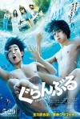

[碧蓝之海](https://pewae.com/gaan/aHR0cHM6Ly9tb3ZpZS5kb3ViYW4uY29tL3N1YmplY3QvMzQ0NjAzMDM=)

原名：Grand Blue导演：英勉主演：与田祐希 / 小仓优香 / 朝比奈彩 / 犬饲贵丈 / 石川恋 / 高岛政宏 / 龙星凉类型：剧情 / 喜剧地区：日本首映时间：2020

为了复现漫画场景导致过于夸张而失真。
阿部宽很蠢，不过一点儿也不萌啊。

[小心肝儿](https://pewae.com/gaan/aHR0cHM6Ly9tb3ZpZS5kb3ViYW4uY29tL3N1YmplY3QvMzYzMDgyODk=)

原名：Babygirl导演：哈里纳·雷金主演：伊斯特·麦克格雷格 / 哈里斯·迪金森 / 妮可·基德曼 / 安东尼奥·班德拉斯 / 沃恩·蕾莉 / 盖特·杨森 / 维克多·斯勒扎克 / 罗伯特·法里奥尔 / 苏菲·王尔德 / 莱斯利·席尔瓦类型：剧情 / 惊悚 / 爱情地区：荷兰首映时间：2024

不知不觉，昔日的澳洲甜心已经成了六旬老太。
女性题材的发展已经病入膏肓了,为政治正确加的黑人小跟班真多余。
为艺术献身的女艺术家之妮可基德曼。

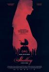

[谢丽](https://pewae.com/gaan/aHR0cHM6Ly9tb3ZpZS5kb3ViYW4uY29tL3N1YmplY3QvMjY3MTM2MzQ=)

原名：Shelley导演：阿里·阿巴西主演：Kenneth M· Christensen / Marianne Mortensen / Marlon Kindberg Bach / 伯恩·安德森 / 帕特里夏·舒曼 / 皮特·克里斯托弗森 / 考斯米娜·斯特拉坦 / 艾伦·多丽特·彼得森类型：剧情 / 恐怖 / 悬疑地区：丹麦首映时间：2016

拖沓。
故弄玄虚。

[红楼梦之金玉良缘](https://pewae.com/gaan/aHR0cHM6Ly9tb3ZpZS5kb3ViYW4uY29tL3N1YmplY3QvMjY5MjQ1MjI=)

导演：胡玫主演：关晓彤 / 卢燕 / 张淼怡 / 杨童舒 / 林鹏 / 王斑 / 罗海琼 / 苑琼丹 / 边程 / 黄佳容类型：剧情 / 古装 / 爱情地区：大陆首映时间：2024

不能把片塞那么满，什么都说什么都说不好，情绪没到位呢你拍的什么桃花林唱的哪门子歌啊。
导演太喜欢用镜头转圈了。
片尾曲改得也太难听了。

[封神第二部：战火西岐](https://pewae.com/gaan/aHR0cHM6Ly9tb3ZpZS5kb3ViYW4uY29tL3N1YmplY3QvMzAxODEyNTA=)

导演：乌尔善主演：于适 / 吴兴国 / 娜然 / 此沙 / 武亚凡 / 费翔 / 那尔那茜 / 陈牧驰 / 韩鹏翼 / 黄渤类型：动作 / 古装 / 奇幻 / 战争地区：大陆首映时间：2025

第一部的人物复杂性到第二部全扔了，是没给编剧结账吗？
战争拍得如同儿戏。
披风为什么会粘在野猪头上不掉下来，晴纶的吗？

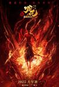

[哪吒之魔童闹海](https://pewae.com/gaan/aHR0cHM6Ly9tb3ZpZS5kb3ViYW4uY29tL3N1YmplY3QvMzQ3ODA5OTE=)

导演：饺子主演：吕艳婷 / 囧森瑟夫 / 张珈铭 / 李南 / 杨卫 / 瀚墨 / 王德顺 / 绿绮 / 陈浩 / 雨辰类型：剧情 / 动画 / 喜剧 / 奇幻地区：大陆首映时间：2025

急于表现自己有钱有技术，特效镜头如山洪暴发，冲淡了本就不强壮的故事，看起来很累。
南极仙翁的造型可圈可点，可惜后面忽然致敬力王里的典狱长，毁于一旦。
陈塘关为甚要在悬崖上开个门？

[死神来了：血脉诅咒](https://pewae.com/gaan/aHR0cHM6Ly9tb3ZpZS5kb3ViYW4uY29tL3N1YmplY3QvMzA0MjkzODg=)

原名：Final Destination: Bloodlines导演：亚当·B·斯坦 / 扎克·利波夫斯基主演：丁波·李 / 凯特琳·桑塔·胡安娜 / 安娜·洛尔 / 布瑞克·巴辛格 / 托尼·托德 / 欧文·帕特里克·乔伊纳 / 特欧·布里奥尼斯 / 理查德·哈蒙 / 艾普尔·特莱克 / 莱亚·吉斯特德类型：恐怖 / 惊悚地区：美国首映时间：2025

核磁共振的设计在全系列也算相当出色。
主线还凑合，虽然不紧凑也算是比较成功的重启，但是大量的亚非裔演员的表现实在让人怀疑，用这些人是能抵税吗？
没事别总戴个大耳麦。

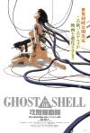

[攻壳机动队](https://pewae.com/gaan/aHR0cHM6Ly9tb3ZpZS5kb3ViYW4uY29tL3N1YmplY3QvMTI5MTkzNg==)

原名：Ghost in the Shell导演：押井守主演：大塚明夫 / 大木民夫 / 家弓家正 / 小川真司 / 山内雅人 / 山寺宏一 / 玄田哲章 / 田中敦子类型：动作 / 动画 / 科幻地区：日本首映时间：1995

赛博时代的政治斗争。
音乐和画面都很牛叉。
质感实在是一种说不清而又真实存在的东西。

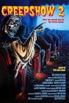

[鬼作秀2](https://pewae.com/gaan/aHR0cHM6Ly9tb3ZpZS5kb3ViYW4uY29tL3N1YmplY3QvMTI5OTc2Nw==)

原名：Creepshow 2导演：迈克尔·高尼克主演：乔治·肯尼迪 / 多萝西·拉莫尔 / 汤姆·萨维尼 / 迪恩·史密斯 / 霍特·麦克卡兰尼类型：奇幻 / 恐怖地区：美国首映时间：1987

用朴素的方式吓唬人。
虽然是恐怖片，但三观极正。

[人生开门红](https://pewae.com/gaan/aHR0cHM6Ly9tb3ZpZS5kb3ViYW4uY29tL3N1YmplY3QvMzY5ODg5MjY=)

导演：易小星主演：于洋 / 代乐乐 / 修睿 / 兰西雅 / 常远 / 李宗恒 / 李萍 / 王耀庆 / 田雨 / 邓家佳类型：剧情 / 喜剧地区：大陆首映时间：2025

每年不看一部常远的烂片，就好像这一年没看电影。
剧本非常平庸，结局硬上价值观，过于刻意。
靠着邓家佳和彩蛋挽了一点点尊。

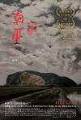

[南巫](https://pewae.com/gaan/aHR0cHM6Ly9tb3ZpZS5kb3ViYW4uY29tL3N1YmplY3QvMzAzNTkzNDA=)

原名：The Story of Southern Islet导演：张吉安主演：云镁鑫 / 吴俐璇 / 徐世顺 / 蔡宝珠 / 邓壹龄类型：奇幻 / 恐怖地区：马来西亚首映时间：2021

能看出有很多华人和当地人之间的政治龃龉，但是更多的又不懂，真让人心焦。
鬼起身入水的镜头不错。
就他们在池塘里抓的鱼，有人买？

[无痛侠](https://pewae.com/gaan/aHR0cHM6Ly9tb3ZpZS5kb3ViYW4uY29tL3N1YmplY3QvMzAzMjIzOTg=)

原名：The Man Who Feels No Pain导演：瓦桑·巴拉主演：古山·德瓦亚 / 萨尔塔吉·卡卡尔 / 萨蒂亚吉特·加努 / 里瓦·阿罗拉 / 阿布希曼努·达萨尼 / 马赫什·曼杰瑞卡类型：动作 / 喜剧地区：印度首映时间：2019

致敬Bruce Lee的片子把动作戏拍得这么烂，李小龙真是死不瞑目啊。
歌曲的插入导致看着看着就跑偏。
逻辑漏洞，无痛也不等于能打啊。

[恶魔之浴](https://pewae.com/gaan/aHR0cHM6Ly9tb3ZpZS5kb3ViYW4uY29tL3N1YmplY3QvMzQ5NTM3NjA=)

原名：The Devil's Bath导演：维罗妮卡·弗兰茨 / 赛佛林·费奥拉主演：Agnes Lampl / Camilla Schilia / Elmar Kurz / Franziska Holzer / Tim Valerian Alberti / 克劳迪娅·马丁尼 / 娜塔莉亚·巴拉诺娃 / 安雅·普拉施格 / 玛利亚·霍夫斯塔尔 / 达维德·沙伊德类型：剧情 / 历史 / 恐怖 / 惊悚地区：奥地利首映时间：2024

过于隐晦了些。
能力不够强的导演，不适合把片子搞那么长。
结局舒适。

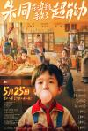

[朱同在三年级丢失了超能力](https://pewae.com/gaan/aHR0cHM6Ly9tb3ZpZS5kb3ViYW4uY29tL3N1YmplY3QvMzU3NDk4NDIv)

导演：王子川主演：吴嵩 / 国义骞 / 岳昊 / 张航诚 / 徐艺瑄 / 方东海 / 李勤勤 / 王浩宇 / 郭笑 / 马千壹类型：奇幻地区：大陆首映时间：2024

快看点有字的书吧！
剧情令人舒适，尤其写检查一段深入人心，导演小时候一定没少写。
事件的轻重缓急还差些火候。

[百合子之香](https://pewae.com/gaan/aHR0cHM6Ly9tb3ZpZS5kb3ViYW4uY29tL3N1YmplY3QvNDczNDYzNg==)

原名：Yuriko's Aroma导演：吉田浩太主演：外間勝 / 木岛法子 / 松野井雅 / 染谷将太 / 江口德子 / 笠井しげ / 美保纯 / 金子ゆい / 鈴木ゆか类型：剧情 / 情色地区：日本首映时间：2010

染谷将太演什么都像只弱鸡。
沉闷。
女主角神似安藤樱。

[奇奇欲爱世界](https://pewae.com/gaan/aHR0cHM6Ly9tb3ZpZS5kb3ViYW4uY29tL3N1YmplY3QvMjY3NTc5MTk=)

原名：Kiki, Love to Love导演：帕科·莱昂主演：亚历克斯·加西亚 / 坎德拉·佩尼亚 / 安娜·卡兹 / 帕科·莱昂 / 爱德华多·雷卡瓦伦 / 纳塔利娅·德·莫利纳 / 西尔维娅·雷伊 / 贝伦·奎斯塔 / 路易斯·卡叶赫 / 雅各布·桑切斯类型：喜剧地区：西班牙首映时间：2016

过于猎奇和直白，后劲不足。
名词过于专业，字幕君头发要掉光了。

[护航父母](https://pewae.com/gaan/aHR0cHM6Ly9tb3ZpZS5kb3ViYW4uY29tL3N1YmplY3QvMjY2NjU0MzU=)

原名：Blockers导演：凯·加农主演：伊克·巴里霍尔兹 / 凯瑟琳·纽顿 / 吉娜·格申 / 杰拉尔丁·维斯瓦纳坦 / 琼·黛安·拉斐尔 / 盖瑞·科尔 / 约翰·塞纳 / 莱斯利·曼恩 / 迈尔斯·罗宾斯 / 雷蒙娜·杨类型：喜剧地区：美国首映时间：2018

青春性喜剧这条赛道很难翻出花来了。
LGBTQ和黑人就硬塞啊。

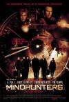

[八面埋伏](https://pewae.com/gaan/aHR0cHM6Ly9tb3ZpZS5kb3ViYW4uY29tL3N1YmplY3QvMTMwOTA2NA==)

原名：Mindhunters导演：雷尼·哈林主演：ll cool j / 丹尼尔·布瓦塞万 / 克里斯蒂安·史莱特 / 凯瑟琳·莫里斯 / 威尔·坎普 / 小克利夫顿·克林斯 / 帕翠西娅·维拉奎兹 / 方·基默 / 约翰尼·李·米勒 / 艾恩·贝利类型：剧情 / 悬疑 / 惊悚 / 犯罪地区：荷兰首映时间：2004

女主有些蠢，配角有抢着去送死的嫌疑。
动作戏还不错，死的也够干脆。

[十三猛鬼](https://pewae.com/gaan/aHR0cHM6Ly9tb3ZpZS5kb3ViYW4uY29tL3N1YmplY3QvMTI5NzU3Ng==)

导演：史蒂芬·贝克主演：Alec Roberts / F·默里·亚伯拉罕 / JR·波恩 / Rah Digga / 托尼·夏尔赫布 / 艾伯丝·戴维兹 / 莎诺·伊丽莎白 / 马修·哈里逊 / 马修·里沃德类型：恐怖地区：美国首映时间：2001

化妆不错，剧情漏洞太多。
正常人会劲儿劲儿地搬到玻璃房子里住？
那女带路党跳出的太突然了，你们就那么信了？

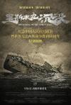

[里斯本丸沉没](https://pewae.com/gaan/aHR0cHM6Ly9tb3ZpZS5kb3ViYW4uY29tL3N1YmplY3QvMzA0MTI2NTg=)

导演：方励主演：丹尼斯·莫利 / 威廉·班尼菲尔德 / 托尼·班纳姆 / 方励 / 林阿根类型：纪录地区：大陆首映时间：2024

事情很动人，但是讲述的手法过于单调。
也没有得到好的剪辑，那点材料支撑不起两小时。
在海边人看来，渔民救落水者这件事天经地义，值得表扬，但不值得过多的表扬。

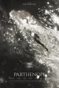

[帕特诺普](https://pewae.com/gaan/aHR0cHM6Ly9tb3ZpZS5kb3ViYW4uY29tL3N1YmplY3QvMzY0MDQyNTM=)

原名：Parthenope导演：保罗·索伦蒂诺主演：伊沙贝拉·法雷利 / 佩普·兰泽塔 / 保拉·卡利亚里 / 加里·奥德曼 / 塞莱斯特·达拉·波塔 / 弗朗西丝卡·罗马娜·贝加莫 / 斯特法尼娅·桑德雷莉 / 西尔维奥·奥兰多 / 路易莎·拉涅瑞 / 达里奥·艾塔类型：剧情 / 奇幻地区：意大利首映时间：2024

景好看，人好看，片子不好看。
旅游广告片？

[Single8](https://pewae.com/gaan/aHR0cHM6Ly9tb3ZpZS5kb3ViYW4uY29tL3N1YmplY3QvMzYxMjYyMzA=)

原名：新·初哥大战外星人(港),我的纸皮星战导演：小中和哉主演：上村侑 / 佐藤友祐 / 北冈龙贵 / 川久保拓司 / 有森也实 / 桑山隆太 / 福泽希空 / 高石明里类型：剧情地区：日本首映时间：2023

比起特摄情怀，我更怀念片中胶片时代的种种黑科技啊。
只有日本人能把握好这种彪呼呼的中二热血的尺度。
喜欢女主的绿茶人设。

[麦收](https://pewae.com/gaan/aHR0cHM6Ly9tb3ZpZS5kb3ViYW4uY29tL3N1YmplY3QvMzMxNDg3OA==)

导演：徐童主演：格格 / 牛洪苗类型：纪录地区：大陆首映时间：2008

鸭子真的不知道？我不信。
质朴是优点也是缺点，底层缺少提炼。
没拍到老陈有些遗憾。

[算命](https://pewae.com/gaan/aHR0cHM6Ly9tb3ZpZS5kb3ViYW4uY29tL3N1YmplY3QvNDA3Mzg3Mg==)

导演：徐童主演：历百程 / 唐小雁 / 石珍珠类型：纪录地区：大陆首映时间：2009

窟窿眼子铜盆大。
卑微的喜怒哀乐。
充满了真正的江湖气，尽管那一点儿也不美好。

[老唐头](https://pewae.com/gaan/aHR0cHM6Ly9tb3ZpZS5kb3ViYW4uY29tL3N1YmplY3QvNDgyNDk2OQ==)

导演：徐童主演：唐小雁 / 唐希信类型：传记 / 历史 / 纪录地区：大陆首映时间：2011

老头白活的篇幅太长了，影响观感和情节推动，大街上每个老头都有故事，何必要听你呢？
没见过杀猪，非常震撼。
三儿和老头其实是一样的人。

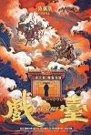

[戏台](https://pewae.com/gaan/aHR0cHM6Ly9tb3ZpZS5kb3ViYW4uY29tL3N1YmplY3QvMzU0ODMzOTU=)

导演：陈佩斯主演：余少群 / 姜武 / 尹正 / 尹铸胜 / 徐卓儿 / 杨皓宇 / 陈佩斯 / 陈大愚 / 黄渤类型：剧情 / 喜剧地区：大陆首映时间：2025

人家手里有枪，让唱啥唱啥。
舞台味有点重，外景戏和特效肉眼可见的廉价感。
我要是徐志胜，我能把剧组告上法庭，妈的就出一张大头照就成主演了，不带这么埋汰人的。

[上海之夜](https://pewae.com/gaan/aHR0cHM6Ly9tb3ZpZS5kb3ViYW4uY29tL3N1YmplY3QvMTI5OTUyMw==)

导演：徐克主演：叶倩文 / 张艾嘉 / 成奎安 / 文隽 / 李丽珍 / 田青 / 胡枫 / 钟镇涛类型：剧情 / 喜剧 / 歌舞地区：香港首映时间：1984

典型的混乱而又有趣的港片。
最后一个镜头过于刻意。
叶倩文演得生硬。

[蓝色爱情](https://pewae.com/gaan/aHR0cHM6Ly9tb3ZpZS5kb3ViYW4uY29tL3N1YmplY3QvMTQwMTMzOA==)

导演：霍建起主演：崔敏捷 / 张晓军 / 徐秀林 / 李佳 / 滕汝骏 / 潘粤明 / 王刚 / 董勇 / 袁泉 / 郭晓东类型：剧情 / 爱情地区：大陆首映时间：2000

20出头的袁泉好美，远不像后来皮包骨头的样子。
同样也是大连最好的年代。

[东方剑](https://pewae.com/gaan/aHR0cHM6Ly9tb3ZpZS5kb3ViYW4uY29tL3N1YmplY3QvMTMwNTQ4Ng==)

导演：王进 / 胡炳榴主演：丁家琳 / 于海洋 / 刘志影 / 夏宗佑 / 张力维 / 李照坤 / 罗玲 / 陈锐 / 颜世华 / 颜世魁类型：惊悚 / 犯罪地区：大陆首映时间：1982

情节过于简单，老太婆第一次出场就暴露了。
谈恋爱的情节跟主线完全脱节。

[明天回答你](https://pewae.com/gaan/aHR0cHM6Ly9tb3ZpZS5kb3ViYW4uY29tL3N1YmplY3QvNDI5MDQwMg==)

导演：王亚彪主演：刘俊生 / 孙彦军 / 尉骞 / 李小力 / 杨蓉 / 欧阳儒秋 / 王润身 / 胡洁 / 霍克 / 魏巍类型：剧情地区：大陆首映时间：1981

漏点小男孩如今已年过半百，应该会想抹掉自己的名字吧。
刘皇叔演的叫一个刻板。
女主非常符合80年代审美，可惜作品不多。

[主犯在你身边](https://pewae.com/gaan/aHR0cHM6Ly9tb3ZpZS5kb3ViYW4uY29tL3N1YmplY3QvMjIzMDQwMw==)

导演：汪孟渊主演：于亚娜 / 于纯绵 / 孙宝光 / 孙宪元 / 尚丽娟 / 施锡来 / 李铁军 / 段春启 / 肖林 / 赵守凯类型：剧情地区：大陆首映时间：1985

一波三折的剧情相当不赖。
女主尚丽娟的眼神相当犀利。

[后来的我们](https://pewae.com/gaan/aHR0cHM6Ly9tb3ZpZS5kb3ViYW4uY29tL3N1YmplY3QvMjY2ODM3MjM=)

导演：刘若英主演：井柏然 / 刘启恒 / 周冬雨 / 张子贤 / 施予斐 / 曲哲明 / 李剑青 / 田壮壮 / 苏小明 / 邹倚天类型：剧情 / 爱情地区：大陆首映时间：2018

你拍一，我拍一，一对对到天宫MINAMI。
大型MV吧，不过田壮壮演的甚好。
是北京地铁不配合拍摄吗？拍个片把个河口站P得妈妈都不认识了。

[爸爸的3次婚礼](https://pewae.com/gaan/aHR0cHM6Ly9tb3ZpZS5kb3ViYW4uY29tL3N1YmplY3QvMjU4ODQ4Nzc=)

导演：马楚成主演：冯婧 / 孙茜 / 张亮 / 张悦轩 / 王啸坤 / 董洁 / 隋凯 / 韩红类型：喜剧 / 家庭 / 爱情地区：大陆首映时间：2016

剧情崩坏兼之张亮、孙茜、Mike隋、张天天根本不会演戏，董洁完全带不动。
韩红出场后的印度式歌舞是在整乐子吗？

[不动声色](https://pewae.com/gaan/aHR0cHM6Ly9tb3ZpZS5kb3ViYW4uY29tL3N1YmplY3QvMzY2MzcwMTI=)

导演：刘耿维主演：宋庆 / 李佳璇 / 那志东 / 钱波类型：犯罪地区：大陆首映时间：2023

演得很不错，但明显制作实力有限。
抓鬼火中年的时候还上一大帮子人呢，怎么最后成老头一个人了，警察的人数优势呢？
最后的改编过于玄幻，还不如按照案件本来的样子来搞。

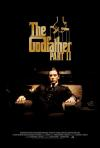

[教父2](https://pewae.com/gaan/aHR0cHM6Ly9tb3ZpZS5kb3ViYW4uY29tL3N1YmplY3QvMTI5OTEzMQ==)

原名：The Godfather Part II导演：弗朗西斯·福特·科波拉主演：G·D·斯普拉德林 / 塔莉娅·夏尔 / 李·斯特拉斯伯格 / 理查德·布赖特 / 约翰·凯泽尔 / 罗伯特·德尼罗 / 罗伯特·杜瓦尔 / 迈克尔·V·格佐 / 阿尔·帕西诺 / 黛安·基顿类型：剧情 / 犯罪地区：美国首映时间：1974

黑社会头子不需要手下有能力，只需要忠诚。
不喜欢两条时间线的交错，能看懂，但不喜欢。
维克多喜欢在餐桌上把事办了，而麦克已经没人陪着吃饭了。

[教父3](https://pewae.com/gaan/aHR0cHM6Ly9tb3ZpZS5kb3ViYW4uY29tL3N1YmplY3QvMTI5NDI0MA==)

原名：The Godfather Part III导演：弗朗西斯·福特·科波拉主演：乔·曼特纳 / 乔治·汉密尔顿 / 伊莱·瓦拉赫 / 塔莉娅·夏尔 / 安迪·加西亚 / 布里吉特·方达 / 索菲亚·科波拉 / 阿尔·帕西诺 / 雷夫·瓦朗 / 黛安·基顿类型：剧情 / 犯罪地区：美国首映时间：1990

前面拖沓得要命，好在结局舒适。
闺女太失败了，全靠阿尔帕西诺往回救。
死的时候，身旁只剩条狗。

[酱园弄·悬案](https://pewae.com/gaan/aHR0cHM6Ly9tb3ZpZS5kb3ViYW4uY29tL3N1YmplY3QvMjY3NDk5Mzg=)

导演：陈可辛主演：刘润萱 / 安娜·柯克 / 易烊千玺 / 杨幂 / 梅婷 / 王传君 / 章子怡 / 章宇 / 赵丽颖 / 雷佳音类型：剧情 / 犯罪地区：大陆首映时间：2025

特效小组没见过猪吗？
章子怡带了一帮猪队友。
拍成这德行了还有续集？

[非常家务事](https://pewae.com/gaan/aHR0cHM6Ly9tb3ZpZS5kb3ViYW4uY29tL3N1YmplY3QvMzU5MzAxNDQ=)

原名：A Family Affair导演：理查德·拉·格拉文斯主演：乔伊·金 / 凯西·贝茨 / 吉塞特·瓦伦丁 / 奥利维亚·马克林 / 妮可·基德曼 / 扎克·埃夫隆 / 艾格尼丝·孟嘉萨瑞 / 莱莎·寇希 / 贝利·M·B / 雪莉·可拉类型：喜剧 / 爱情地区：美国首映时间：2024

这才是真正的“我还上了你妈”。
澳洲人有什么口音？

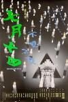

[七月十四](https://pewae.com/gaan/aHR0cHM6Ly9tb3ZpZS5kb3ViYW4uY29tL3N1YmplY3QvMTMwMjQ0Nw==)

导演：钱升玮主演：刘以达 / 刘青云 / 周文健 / 张国强 / 罗兰 / 苑琼丹 / 陈明真 / 陶大宇 / 黄斌 / 黎燕珊类型：恐怖 / 惊悚地区：香港首映时间：1993

故事完整且自洽，在那个年代实属难得。
陈明真收放自如，一点不像新演员。

[末日村庄](https://pewae.com/gaan/aHR0cHM6Ly9tb3ZpZS5kb3ViYW4uY29tL3N1YmplY3QvMzMyODIxMA==)

原名：Village of Doom导演：田中登主演：古尾谷雅人 / 夏八木勋 / 池波志乃类型：剧情 / 犯罪地区：日本首映时间：1983

手电用的什么牌子的电池，质量那么好。
心理变化的那个地方，音乐转换很突兀。
通奸因为寂寞，杀人又何尝不是。

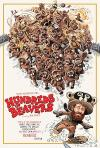

[这很河狸](https://pewae.com/gaan/aHR0cHM6Ly9tb3ZpZS5kb3ViYW4uY29tL3N1YmplY3QvMzY0NjU1MjY=)

原名：Hundreds of Beavers导演：迈克·切斯利克主演：丹尼尔·朗 / 埃里克·韦斯特 / 奥利维亚·格雷夫斯 / 杰伊·布朗 / 杰瑞·库雷克 / 赖兰德·布里克森·科尔·图斯 / 路易斯·里科 / 道格·曼切斯基 / 韦斯·坦克 / 麦克斯·黑类型：冒险 / 动作 / 喜剧地区：美国首映时间：2022

为什么不吃海胆？
早期卓别林式的默片既视感。
三翻四抖是放之全世界都好使的喜剧技巧。

[子弹出租](https://pewae.com/gaan/aHR0cHM6Ly9tb3ZpZS5kb3ViYW4uY29tL3N1YmplY3QvMTMwNTU0NA==)

导演：袁俊文主演：任达华 / 刘兆铭 / 周秀兰 / 张学友 / 狄威 / 罗烈 / 陈淑兰类型：剧情 / 动作 / 犯罪地区：香港首映时间：1991

任达华收放自如。
张学友的角色设定和插曲都不错。

[永安镇故事集](https://pewae.com/gaan/aHR0cHM6Ly9tb3ZpZS5kb3ViYW4uY29tL3N1YmplY3QvMzUyMzE3MDA=)

导演：魏书钧主演：刘洋 / 宋川 / 康春雷 / 杨子姗 / 杨平道 / 杨瑾 / 梁鸣 / 王佳佳 / 翟义祥 / 黄米依类型：剧情地区：大陆首映时间：2023

“在永安镇什么都不会发生”就为了这句台词，攒了部电影。
老板娘打扮得漂漂亮亮，戴上耳环，杀鱼。
用开机镜头作为片子的最后一个镜头，太刻意了吧。

[风再起时](https://pewae.com/gaan/aHR0cHM6Ly9tb3ZpZS5kb3ViYW4uY29tL3N1YmplY3QvMjY5OTU0NzU=)

导演：翁子光主演：何珮瑜 / 吴卓羲 / 周文健 / 春夏 / 杜鹃 / 梁朝伟 / 许冠文 / 谭耀文 / 郭富城 / 金燕玲类型：剧情 / 动作 / 犯罪地区：香港首映时间：2023

啰里巴唆拖泥带水。
港片就是很难拍出年代的质感，一股小家子气。
杜鹃真烂。

[恶女](https://pewae.com/gaan/aHR0cHM6Ly9tb3ZpZS5kb3ViYW4uY29tL3N1YmplY3QvMzYxNTE2MTQ=)

导演：宋欣颖主演：凤小岳 / 徐钧浩 / 曾少宗 / 李天柱 / 林美秀 / 游珈瑄 / 邵雨薇 / 郭子乾 / 陈家逵 / 高英轩类型：剧情 / 惊悚地区：台湾首映时间：2023

女主气场挺契合的，只是太瘦了，不适合演床戏。
但是胖女人的人设还是太浅了，可以再弄复杂一些。
结尾好评。

[魔幻时刻](https://pewae.com/gaan/aHR0cHM6Ly9tb3ZpZS5kb3ViYW4uY29tL3N1YmplY3QvMjE1NzUwNw==)

原名：The Magic Hour导演：三谷幸喜主演：佐藤浩市 / 妻夫木聪 / 寺岛进 / 小日向文世 / 山本耕史 / 深津绘里 / 绫濑遥 / 西田敏行 / 近藤芳正 / 香川照之类型：喜剧地区：日本首映时间：2008

故事普通，全靠氛围铺垫。
有点太长了，尤其后半部分，紧张感全失。

[全员嫌疑人](https://pewae.com/gaan/aHR0cHM6Ly9tb3ZpZS5kb3ViYW4uY29tL3N1YmplY3QvMzY5ODYzMjk=)

导演：傅鸫主演：周瑞 / 小沈阳 / 曹恩齐 / 王紫逸 / 秦海璐 / 翁长特 / 董畅 / 金梦阳子 / 陶海类型：悬疑 / 犯罪地区：大陆首映时间：2024

后半截异常墨迹，剪辑一下会死吗？
小沈阳的演技本就很尬了，没想到本片中比他还烂的大有人在。
人死的平平无奇，仿佛出场就是为了送人头一样，这样的感觉对悬疑片来说就是灾难。

[长安的荔枝](https://pewae.com/gaan/aHR0cHM6Ly9tb3ZpZS5kb3ViYW4uY29tL3N1YmplY3QvMzYxODU1MDI=)

导演：大鹏主演：刘俊谦 / 刘德华 / 大鹏 / 孙阳 / 常远 / 庄达菲 / 杨幂 / 王迅 / 白客 / 魏翔类型：剧情 / 古装 / 喜剧地区：大陆首映时间：2025

紧张感没拍出来。
客串阵容过于强大，各自为战，一盘散沙，尤其杨幂那个角色，找柳岩不好吗。
大鹏你能不能放弃自己的音乐梦想？

[有客到](https://pewae.com/gaan/aHR0cHM6Ly9tb3ZpZS5kb3ViYW4uY29tL3N1YmplY3QvMjYyODU3Nzc=)

导演：吴家丽主演：刘心悠 / 徐子珊 / 蔡瀚亿 / 谢婷婷 / 郭伟亮 / 雷宇扬类型：惊悚地区：香港首映时间：2015

猫猫复仇的故事没拍到位，另两个故事就更差了。
缺少新意，第一个故事只配拍成MV。
特效烂到家了。

[连体阴](https://pewae.com/gaan/aHR0cHM6Ly9tb3ZpZS5kb3ViYW4uY29tL3N1YmplY3QvMjA3NTk5NA==)

原名：Alone导演：柏德潘·王般 / 班庄·比辛达拿刚主演：Ratchanoo Bunchootwong / Vittaya Wasukraipaisan / 玛莎·华顿娜柏妮类型：剧情 / 恐怖 / 惊悚地区：泰国首映时间：2007

看了不到1/3就猜出来了，氛围感尚可。
资金受限，没看到想看的镜头。

[“骗骗”喜欢你](https://pewae.com/gaan/aHR0cHM6Ly9tb3ZpZS5kb3ViYW4uY29tL3N1YmplY3QvMzY4Mzg3MDc=)

导演：苏彪主演：孙阳 / 宋木子 / 小爱 / 李雪琴 / 柳岩 / 王皓 / 王耀庆 / 童漠男 / 衣云鹤 / 金晨类型：喜剧 / 爱情地区：大陆首映时间：2024

金晨的台词水平，实在是性冷感啊。
就在李雪琴碰瓷囚车那里戛然而止该多好。
这样的爱情轻喜剧里，澳门都不让叫澳门了。

[小伟](https://pewae.com/gaan/aHR0cHM6Ly9tb3ZpZS5kb3ViYW4uY29tL3N1YmplY3QvMjY3NTI1NjQ=)

导演：黄梓主演：彭杏英 / 薛立贤 / 郭尔君 / 钟雨伦 / 顾定轩 / 高翰文类型：剧情 / 家庭地区：大陆首映时间：2021

那个人，很重要，但好像也没那么重要。

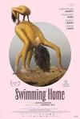

[游泳回家](https://pewae.com/gaan/aHR0cHM6Ly9tb3ZpZS5kb3ViYW4uY29tL3N1YmplY3QvMzU5MDMxMjU=)

原名：Swimming Home导演：贾斯汀·安德森主演：Anastasios Alexandropoulos / Michalis Goumas / Tzef Montana / 亚里安妮·拉贝德 / 克里斯托弗·阿波特 / 娜丁·拉巴基 / 弗蕾娅·汉南-米尔斯 / 麦肯兹·戴维斯类型：剧情地区：荷兰首映时间：2024

有些过于抽象了，尤其是那诡异的舞蹈。
悬疑感倒是很强。
腿毛也太茂盛了。

[花漾少女杀人事件](https://pewae.com/gaan/aHR0cHM6Ly9tb3ZpZS5kb3ViYW4uY29tL3N1YmplY3QvMzUxODMzMjQ=)

导演：周璟豪主演：丁湘源 / 于之乐 / 张子枫 / 李孝谦 / 马伊琍类型：剧情 / 悬疑地区：大陆首映时间：2025

母女冲突对立场景真实可信。
人格分裂这种老梗一点儿也没意思。

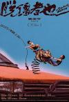

[脱缰者也](https://pewae.com/gaan/aHR0cHM6Ly9tb3ZpZS5kb3ViYW4uY29tL3N1YmplY3QvMzY0NTMxNzM=)

导演：曹保平主演：刘亚津 / 孙安可 / 常远 / 张本煜 / 林雪 / 柳杨 / 甘昀宸 / 郭麒麟 / 颜北 / 齐溪类型：喜剧 / 犯罪地区：大陆首映时间：2025

红白机上出现16位的街霸2，太草率了。
曹保平这次大失水准，臭豆腐这种低级梗都开始用了。
明明没有人喜欢字幕结尾，却还要搞那么久，咋想的？

[诱拐](https://pewae.com/gaan/aHR0cHM6Ly9tb3ZpZS5kb3ViYW4uY29tL3N1YmplY3QvMTM4OTk4Ng==)

原名：G@me导演：井坂聪主演：Izam / 仲间由纪惠 / 宇崎龙童 / 石桥凌 / 藤木直人类型：剧情 / 悬疑 / 爱情地区：日本首映时间：2003

仲间由纪惠的小罗圈腿有些出戏。
二次转折前的前戏过长破坏了节奏。
老头子好假。

[第二十条](https://pewae.com/gaan/aHR0cHM6Ly9tb3ZpZS5kb3ViYW4uY29tL3N1YmplY3QvMzYyMDgwOTQ=)

导演：张艺谋主演：刘耀文 / 张译 / 潘斌龙 / 王骁 / 范伟 / 赵丽颖 / 陈明昊 / 雷佳音 / 马丽 / 高叶类型：剧情 / 喜剧 / 家庭地区：大陆首映时间：2024

命题作文不好写，两条线融合太生硬。
拌嘴的部分生动而没有必要，关键是太频繁了。
刘耀文真烂。

[深夜食堂](https://pewae.com/gaan/aHR0cHM6Ly9tb3ZpZS5kb3ViYW4uY29tL3N1YmplY3QvMjY4Njg1NTM=)

导演：梁家辉主演：冯淬帆 / 张立 / 张艺上 / 梁家辉 / 梁靖康 / 焦俊艳 / 郑欣宜 / 金世佳 / 金燕玲 / 魏晨类型：剧情地区：大陆首映时间：2019

梁老师，蚬子真不是您这个炒法的。
某酸奶品牌过粪了。
故事整体上都平淡，冯淬帆和张立两个贯穿始终的人物缺少出彩的细节。

[妻子的罪恶](https://pewae.com/gaan/aHR0cHM6Ly9tb3ZpZS5kb3ViYW4uY29tL3N1YmplY3QvMjA1OTQzMg==)

原名：The Strange Vice of Mrs. Wardh导演：赛尔乔·马蒂诺主演：乔治·希尔顿 / 卡洛·阿里吉耶罗 / 布鲁诺·科拉扎里 / 曼努埃尔·吉尔 / 肯奇塔·艾罗尔迪 / 艾德薇姬·芬妮齐 / 阿尔维托·德·门多萨类型：恐怖 / 悬疑 / 惊悚 / 犯罪地区：意大利首映时间：1971

故事不错，但是拍的沉闷。

[入侵者们的晚餐](https://pewae.com/gaan/aHR0cHM6Ly9tb3ZpZS5kb3ViYW4uY29tL3N1YmplY3QvMzY1OTM0MDQ=)

原名：Shinnyuushatachi no Bansan导演：水野格主演：势登健雄 / 吉田羊 / 平岩纸 / 池松壮亮 / 白石麻衣 / 菊地凛子 / 角田晃广 / 野间口彻类型：剧情 / 喜剧 / 悬疑地区：日本首映时间：2024

一看到主角团长得歪瓜裂枣的样子，就知道后面有反转了。
可惜摊牌后设计感不足，节奏完全下来了。

[杀人树懒](https://pewae.com/gaan/aHR0cHM6Ly9tb3ZpZS5kb3ViYW4uY29tL3N1YmplY3QvMzYyMDk1MjU=)

原名：Slotherhouse导演：马修·古德休主演：丽莎·安巴拉佛讷 / 凯利·林恩·莱特 / 奥利维娅·鲁伊尔 / 布拉德利·福勒 / 斯蒂芬·卡皮契奇 / 格蕾丝·帕特森 / 萨特·诺兰 / 蒂夫·史蒂文森 / 蒂安娜·乌普切娃 / 西德尼·克雷文类型：喜剧 / 惊悚地区：美国首映时间：2023

无脑片也不飙血浆也不爆衣，女主团还长得那么丑，这样的片子拍出来干嘛？
树懒做得面目可憎。
兄弟会类影片难有突破。

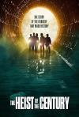

[极盗行动](https://pewae.com/gaan/aHR0cHM6Ly9tb3ZpZS5kb3ViYW4uY29tL3N1YmplY3QvMzQ5NjYzNDM=)

原名：The Heist of the Century导演：艾列尔·维诺格拉德主演：Darío Levy / Johanna Francella / Juan Alari / Magela Zanotta / Mariano Argento / 古勒莫·法兰塞拉 / 巴勃罗·拉戈 / 拉斐尔·菲洛 / 路易斯·卢克 / 迭戈·佩雷蒂类型：喜剧 / 犯罪地区：阿根廷首映时间：2021

电影由主犯投资并担任编剧。
节奏顺畅。
阿根廷电影结尾怎么也玩出字幕这一套？

[无效](https://pewae.com/gaan/aHR0cHM6Ly9tb3ZpZS5kb3ViYW4uY29tL3N1YmplY3QvMzY1MDExNzI=)

原名：Invalid导演：Jonáš Karásek主演：Gregor Holoska / Helena Krajciová / Zdenek Godla类型：剧情 / 喜剧 / 惊悚地区：捷克首映时间：2023

可恨之人必有可恨之处。
用锤子和镰刀作为武器……

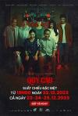

[恶魔犬](https://pewae.com/gaan/aHR0cHM6Ly9tb3ZpZS5kb3ViYW4uY29tL3N1YmplY3QvMzY5MjkxMjI=)

原名：Quy Cau导演：刘清伦主演：Mie / 光俊 / 南书 / 金春 / 韩翠玉范 / 黎云容类型：恐怖地区：越南首映时间：2024

建议玉林狗肉节全天循环播放本片。
连越南片也要在片尾加没有动物受到伤害了。
演技、特效和恐怖氛围都不太行，但是东亚家庭关系倒是表现得不错，故事发生地换成山东也毫不违和。

[报丧女妖](https://pewae.com/gaan/aHR0cHM6Ly9tb3ZpZS5kb3ViYW4uY29tL3N1YmplY3QvMzU3NjAzNTM=)

原名：Code Name Banshee导演：强·基耶斯主演：Keil Oakley Zepernick / Kim DeLonghi / Levon Panek / Marinko Radakovic / 亚历山大·维舍尔鲍默 / 凯特·希金斯 / 安东尼奥·班德拉斯 / 杰米·金 / 汤米·弗拉纳根 / 韦恩·派尔类型：剧情 / 动作 / 惊悚地区：美国首映时间：2022

索然无味+这就完了？
班德拉斯也破产了咩？

[与狼共舞](https://pewae.com/gaan/aHR0cHM6Ly9tb3ZpZS5kb3ViYW4uY29tL3N1YmplY3QvMTI5Mzc2NA==)

原名：Dances with Wolves导演：凯文·科斯特纳主演：凯文·科斯特纳 / 吉姆·赫尔曼 / 坦图·卡丁诺 / 弗洛伊德·怀斯特曼 / 查尔斯·罗基特 / 格雷厄姆·格林 / 玛丽·麦克唐纳 / 罗伯特·帕斯托莱利 / 罗德尼·格兰特 / 莫里·柴金类型：冒险 / 剧情 / 西部地区：美国首映时间：1990

猎牛一场戏充满了胶片时代的独特美感。
部落战争的场面也很好看，其余的就很一般了。
甚至很滞涩。

[逃狱兄弟](https://pewae.com/gaan/aHR0cHM6Ly9tb3ZpZS5kb3ViYW4uY29tL3N1YmplY3QvMzMzNzk2NDM=)

导演：麦浩邦主演：张建声 / 张继聪 / 栢天男 / 谭耀文类型：喜剧 / 犯罪地区：香港首映时间：2020

果然，小孩是没那么容易领盒饭的。
同一事件拍三遍完全没必要。

[地狱](https://pewae.com/gaan/aHR0cHM6Ly9tb3ZpZS5kb3ViYW4uY29tL3N1YmplY3QvNTMyMDYzNQ==)

原名：Hell导演：Luis Estreda主演：达米安·阿尔卡扎类型：剧情 / 喜剧 / 犯罪地区：墨西哥首映时间：2010

嘴上说的都是上帝，心里想的都是毒品。
这大伯哥，这弟媳妇。
一种满面尘灰的沉重。

[囚徒](https://pewae.com/gaan/aHR0cHM6Ly9tb3ZpZS5kb3ViYW4uY29tL3N1YmplY3QvMzU5Mjg1OQ==)

原名：Prisoners导演：丹尼斯·维伦纽瓦主演：休·杰克曼 / 保罗·达诺 / 杰克·吉伦哈尔 / 梅丽莎·里奥 / 泰伦斯·霍华德 / 玛丽亚·贝罗 / 维奥拉·戴维斯 / 艾琳·格拉西莫维奇 / 迪兰·明奈特 / 韦恩·杜瓦尔类型：剧情 / 悬疑 / 犯罪地区：美国首映时间：2013

吉伦哈尔智商是硬伤，抓嫌疑人也好，发现尸体也好，都不查社会关系的么？
故事发生在美国什么地方啊，感恩节过后没几天地都冻了。
狼叔演得还行，不过有点单调了。

[世界上最糟糕的人](https://pewae.com/gaan/aHR0cHM6Ly9tb3ZpZS5kb3ViYW4uY29tL3N1YmplY3QvMzQ0NDc1NTM=)

原名：Prisoners导演：约阿希姆·提尔主演：Helene Bjørneby / Karen Røise Kielland / Lasse Gretland / Marianne Krogh / 威达·桑登 / 安德斯·丹尼尔森·李 / 汉斯·奥拉夫·布雷内 / 玛丽亚·嘉西亚·狄·梅奥 / 赫伯特·诺德鲁姆 / 雷娜特·赖因斯夫类型：剧情 / 喜剧 / 爱情地区：挪威首映时间：2021

一个人吐烟圈，另一个吸进去，实在是又变态又唯美。
我趁你打包的时候出去冷静冷静。
女性主义跟死绿茶并不冲突。

[三伏天](https://pewae.com/gaan/aHR0cHM6Ly9tb3ZpZS5kb3ViYW4uY29tL3N1YmplY3QvMjY3MTU0ODU=)

导演：乔丹·席勒主演：田牧宸 / 罗蓝山 / 黄璐类型：剧情 / 同性地区：香港首映时间：2018

黄璐演得太硬，两个男演员就更不行了，尤其是年轻的那个。
穿内衣洗澡也是够了。
人物性格的处理过于简单草率，直苗苗通到底。

[喜宴](https://pewae.com/gaan/aHR0cHM6Ly9tb3ZpZS5kb3ViYW4uY29tL3N1YmplY3QvMTMwMzAzNw==)

导演：李安主演：尼尔·赫夫 / 归亚蕾 / 李淳 / 汉娜·沙利文 / 米切尔·利希藤斯坦 / 许永德 / 赵文瑄 / 迈克尔·加斯顿 / 郎雄 / 金素梅类型：剧情 / 同性 / 喜剧 / 家庭 / 爱情地区：台湾首映时间：1993

中式和乐融融。
哪怕不愿讲话，也是要请。
可惜女主角台词减分。

[上帝之手](https://pewae.com/gaan/aHR0cHM6Ly9tb3ZpZS5kb3ViYW4uY29tL3N1YmplY3QvMzUxMzQ3NjQ=)

原名：The Hand of God导演：保罗·索伦蒂诺主演：Enzo De Caro / 托尼·塞尔维洛 / 特蕾莎·萨波南杰洛 / 索菲亚·格谢维奇 / 菲利波·斯科蒂 / 贝蒂·佩德拉兹 / 路易莎·拉涅瑞 / 雷纳托·卡朋特理 / 马西米利亚诺·加洛 / 马龙·朱伯特类型：剧情地区：意大利首映时间：2021

1986年的那不勒斯全城支持阿根廷？
壮硕的小姨。

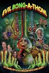

[恶魔烟筒马拉松](https://pewae.com/gaan/aHR0cHM6Ly9tb3ZpZS5kb3ViYW4uY29tL3N1YmplY3QvMzczOTgzNDc=)

原名：Evil Bong-a-Thon!导演：查尔斯·班德主演：彼得·唐纳德·巴达拉曼蒂二世 / 桑尼·卡尔·戴维斯 / 汤米·张类型：喜剧地区：美国首映时间：2025

唯一支持看完的动力是假奶量很大。
剧组都像是飞叶子飞大了，前言不搭后语。

[劣迹斑斑](https://pewae.com/gaan/aHR0cHM6Ly9tb3ZpZS5kb3ViYW4uY29tL3N1YmplY3QvMTk0NTc1MA==)

原名：The Dirt导演：杰夫·特里梅因主演：丹尼尔·韦伯 / 伊万·瑞恩 / 凯瑟琳·莫里斯 / 布兰妮·弗兰 / 文斯·马蒂斯 / 机关枪凯利 / 艾丽莎·玛丽·史迪威 / 艾伦·杰伊·罗姆 / 艾琳·欧贝 / 道格拉斯·布斯类型：传记 / 音乐地区：美国首映时间：2019

这帮摇滚乐队真没一个好玩意儿。
比波西米亚狂想曲来得真实，起码乐队勇于自黑。
音乐真心不怎么样啊。

[朗读者](https://pewae.com/gaan/aHR0cHM6Ly9tb3ZpZS5kb3ViYW4uY29tL3N1YmplY3QvMjIxMzU5Nw==)

原名：The Reader导演：史蒂芬·戴德利主演：Alissa Wilms / Frieder Venus / 凯特·温斯莱特 / 大卫·克劳斯 / 弗罗里安·巴西奥罗麦 / 弗里德里克·贝希特 / 拉尔夫·费因斯 / 苏珊娜·洛塔尔 / 詹妮特·海因 / 马蒂亚斯·哈比希类型：剧情 / 爱情地区：美国首映时间：2008

为艺术献身的女艺术家之凯特温斯莱特。
宁可被关一辈子也不愿承认自己是文盲，死要面子到令人感动。
最后犹太女人的不原谅恨真实。

[偷窥情人](https://pewae.com/gaan/aHR0cHM6Ly9tb3ZpZS5kb3ViYW4uY29tL3N1YmplY3QvMjYxOTk4ODg=)

原名：Sukimasuki导演：吉田浩太主演：中村映里子 / 久住翠希 / 佐々木心音 / 八木将康 / 川籠石駿平 / 松野井雅 / 町田啓太类型：剧情 / 情色地区：日本首映时间：2015

佐佐木心音咋还凹陷了呢？
其实男女主角都挺变态的，这不能算爱情。

[黎明的强奸者](https://pewae.com/gaan/aHR0cHM6Ly9tb3ZpZS5kb3ViYW4uY29tL3N1YmplY3QvMjQ4Nzg0MjE=)

原名：The Dawn Rapists导演：Ignacio F· Iquino主演：Eva Lyberten / Linda Lay / mireia ros类型：惊悚 / 犯罪地区：西班牙首映时间：1978

不愧是欧洲，是真的孕妇啊。
镜头语言有点跳。
又一部批判反堕胎的。

[克里斯·米勒的堕落](https://pewae.com/gaan/aHR0cHM6Ly9tb3ZpZS5kb3ViYW4uY29tL3N1YmplY3QvMjEzNjcyNg==)

原名：The Corruption of Chris Miller导演：Juan Antonio Bardem主演：Barry Stokes / Jean Seberg / Marisol类型：剧情 / 恐怖 / 悬疑 / 惊悚地区：西班牙首映时间：1973

无聊。

[皮皮鲁和鲁西西之309暗室](https://pewae.com/gaan/aHR0cHM6Ly9tb3ZpZS5kb3ViYW4uY29tL3N1YmplY3QvMzY5Mzc3NTI=)

导演：郑亚旗主演：刘蕊 / 李昕 / 黄爽类型：动画 / 喜剧 / 奇幻地区：大陆首映时间：2024

郑亚旗这个败家子，毫无想象力，小时候光忙着打洛克人了吧？
把进暗室的过程弄那么冗长实在是没用必要。
你都出动五角飞碟了，不能发射缩小光线把最终BOSS变小吗？

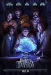

[幽灵鬼屋](https://pewae.com/gaan/aHR0cHM6Ly9tb3ZpZS5kb3ViYW4uY29tL3N1YmplY3QvNDkyNDE0NQ==)

原名：Haunted Mansion导演：贾斯汀·西米恩主演：J·R·阿杜西 / 丹尼·德维托 / 克里克·威尔逊 / 勒凯斯·斯坦菲尔德 / 杰瑞德·莱托 / 杰米·李·柯蒂斯 / 欧文·威尔逊 / 罗莎里奥·道森 / 蒂凡尼·哈迪斯 / 蔡斯·W·狄龙类型：剧情 / 喜剧 / 奇幻 / 恐怖 / 悬疑地区：美国首映时间：2023

BLM含量也太高了。
平淡。

[向阳·花](https://pewae.com/gaan/aHR0cHM6Ly9tb3ZpZS5kb3ViYW4uY29tL3N1YmplY3QvMzY5NTQwMDQ=)

导演：冯小刚主演：兰西雅 / 啜妮 / 李慧君 / 杨晨汐 / 王啸宇 / 王菊 / 程潇 / 赵丽颖 / 钱漪 / 陈执愔类型：剧情 / 犯罪地区：大陆首映时间：2025

赵丽颖冲奖之心，路人皆知。
程潇的角色超级多余。
兰西雅可造之才。

[猎金·游戏](https://pewae.com/gaan/aHR0cHM6Ly9tb3ZpZS5kb3ViYW4uY29tL3N1YmplY3QvMzU5MjkyNTg=)

导演：邱礼涛主演：倪妮 / 刘以豪 / 刘德华 / 李梦男 / 欧豪 / 田丽 / 蒋梦婕 / 赵海燕 / 郑则仕 / 黄奕类型：剧情 / 犯罪地区：大陆首映时间：2025

黄奕的气场全靠垫肩维持。
欧豪毫无担当，从思想到行动都像个娘们。
股票剧情的细节不行，但大框还可以，反正是劝人向善远离股市的，也算是功德。

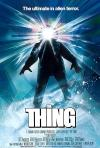

[怪形](https://pewae.com/gaan/aHR0cHM6Ly9tb3ZpZS5kb3ViYW4uY29tL3N1YmplY3QvMTI5Njc5NA==)

原名：The Thing导演：约翰·卡朋特主演：Peter Maloney / TK·卡特 / 凯斯·大卫 / 唐纳德·莫法特 / 大卫·科列侬 / 威尔福德·布利姆雷 / 库尔特·拉塞尔 / 查尔斯·哈拉汉 / 理查德·戴萨特 / 理查德·马苏尔类型：恐怖 / 悬疑 / 科幻地区：美国首映时间：1982

怪物造型独特，但是节奏太平缓了。
互相猜忌的氛围相当不错。

[兽餐](https://pewae.com/gaan/aHR0cHM6Ly9tb3ZpZS5kb3ViYW4uY29tL3N1YmplY3QvMTg1MzE4MS8=)

原名：Feast 导演：约翰·古拉格主演：乔什·祖克曼 / 亨利·罗林斯 / 克里丝塔·艾伦 / 克鲁·古拉格 / 埃里克·迪恩 / 娜维·罗华 / 巴萨扎·盖提 / 杰森·缪斯 / 珍妮·瓦德 / 贾达·弗雷德兰德类型：动作 / 喜剧 / 恐怖 / 惊悚地区：美国首映时间：2005

节奏紧张人物有趣，真正的Girls Help Girls。
黑人上来就死，小孩也活不到最后的美好年代。
怪物的胃里那么多蛆可太不科学了。

[羊崽](https://pewae.com/gaan/aHR0cHM6Ly9tb3ZpZS5kb3ViYW4uY29tL3N1YmplY3QvMzM0NTA4MTAv)

原名：Dýrið / Lamb导演：瓦尔迪马尔·约翰松主演：Ester Bibi / 劳米·拉佩斯 / 比约恩·西鲁·哈瑞森 / 英格瓦·埃盖特·西古德松 / 赫米尔·希尼·古纳森类型：奇幻 / 惊悚地区：冰岛首映时间：2021

有资格竞争世界上最无聊的电影。
欧美片里死条狗可真不容易。

[柏林，我爱你](https://pewae.com/gaan/aHR0cHM6Ly9tb3ZpZS5kb3ViYW4uY29tL3N1YmplY3QvMTA3NjAwNDIv)

原名：Berlin, I Love You导演：丹尼·雷维 / 丹尼尔‧利沃斯基 / 丹尼斯·甘塞尔 / 彼德·切尔瑟姆 / 玛西·塔吉丁 / 约瑟夫·鲁斯纳克 / 蒂尔·施威格 / 费南多·伊姆贝克 / 贾斯汀‧富兰克林 / 迪安娜·阿格隆主演：伊万·瑞恩 / 凯拉·奈特莉 / 卢克·威尔逊 / 吉姆·斯特吉斯 / 夏洛特·勒邦 / 海伦·米伦 / 海顿·潘妮蒂尔 / 米基·洛克 / 迪安娜·阿格隆 / 迭戈·卢纳类型：剧情地区：德国首映时间：2019

柏林旅游宣传片。
实在太包容了，无法接受。

[奇遇](https://pewae.com/gaan/aHR0cHM6Ly9tb3ZpZS5kb3ViYW4uY29tL3N1YmplY3QvMzY1MjI0Mjcv)

导演：马多主演：于洋 / 李乃文 / 李梦 / 杨皓宇 / 王皓 / 翟子路 / 费启鸣 / 贾冰 / 郑合惠子 / 马旭东类型：喜剧地区：大陆首映时间：2025

1999年哪来的腾讯QQ？头像也不对，更不要说Qzone了。
不知哪路神仙非要把1999年的故事强行改成2001年，味道全变了，就像王力宏说的：“永永远远地差两年”。
女主角功能性太差，杨皓宇看多了腻。

[真相背后](https://pewae.com/gaan/aHR0cHM6Ly9tb3ZpZS5kb3ViYW4uY29tL3N1YmplY3QvMzU2NjYwMDAv)

原名：ปริศนารูหลอน导演：วิศิษฏ์ ศาสนเที่ยง主演：atichart lee / keetapat pongruea / ทาริกา ธิดาทิตย์ / นิโคล เทริโอ / สติเว่น อิสรพงศ์ ฟูเรอร์ / สุทัตตา อุดมศิลป์ / 塔诵·格琳纽慕 / 索姆波布·本贾蒂库尔 / 纳塔帕·宁吉拉瓦 / 萨达农·杜隆卡沃类型：恐怖 / 悬疑 / 惊悚地区：泰国首映时间：2021

洗澡视频一条线完全废掉了，可惜。
猫猫好可怜。
用来吓人的摇篮曲还怪好听的。

[我的老板是连环杀手](https://pewae.com/gaan/aHR0cHM6Ly9tb3ZpZS5kb3ViYW4uY29tL3N1YmplY3QvMzU0MjQ3MTMv)

原名：บอสฉันขยันเชือด导演：普万尼特·弗迪主演：natthakan thayutajaruwit / pramote pathan / กฤษดา สุโกศล แคลปป์ / ปรีชญา พงษ์ธนานิกร / พอวิไล อภิรัชฎาพร / สัณหณัฐ ทิราชีพ / 波拉马蓬·詹卡莫尔 / 莫妲·娜琳叻 / 萨哈拉·桑卡布理查 / 邦沙敦·宗威拉克类型：喜剧 / 悬疑 / 惊悚地区：泰国首映时间：2021

前半截墨迹，后半截比前半截更墨迹，打个BOSS水了半个小时，谁能受得了。
好在女主颜值很顶。

[临界点](https://pewae.com/gaan/aHR0cHM6Ly9tb3ZpZS5kb3ViYW4uY29tL3N1YmplY3QvMzYwNzI3NDMv)

原名：Borderline导演：吉米·沃登主演：jimmie fails / matthew del bel belluz / patrick cox / terence kelly / yasmeen kelders / 凱薩琳·羅格·哈格奎斯特 / 埃里克·迪恩 / 萨玛拉·维文 / 阿尔芭·巴普蒂斯塔 / 雷蒙德·尼科尔森类型：喜剧 / 恐怖 / 惊悚地区：加拿大首映时间：2025

把一切归于变态是可以，但无趣啊，我看啥来了。
女主反杀女反那里反复逐帧重放了好几遍，确认女反穿了打底裤，失望。
我还真以为黑人是个我认不出来的NBA球员客串的，特意查了近几年有谁是从开拓者加入掘金的，最后发现他只是个演员而已。

[蜡笔小新：谜团！花之天下春日部学院](https://pewae.com/gaan/aHR0cHM6Ly93d3cudGhlbW92aWVkYi5vcmcvbW92aWUvNzk1NTY0)

原名：クレヨンしんちゃん 謎メキ！花の天カス学園导演：三原三千夫 / 三浦阳 / 铃木大司 / 高桥涉主演：一龙斋贞友 / 佐藤智惠 / 兴梠里美 / 小林由美子 / 广桥凉 / 松尾骏 / 林玉绪 / 森川智之 / 楢桥美纪 / 真柴摩利类型：动画地区：日本首映时间：2021

普普通通的精良制作。
阿呆难得出彩。

[猎战狂徒](https://pewae.com/gaan/aHR0cHM6Ly93d3cudGhlbW92aWVkYi5vcmcvbW92aWUvMTYwNzU5Ng==)

导演：关东杰主演：吴豪 / 徐大宁 / 文东俊 / 曾晨 / 王泽宗 / 英壮 / 赵思陌 / 邹兆龙 / 郑楚一 / 魏晓璇类型：动作地区：大陆首映时间：2026

肉联厂火并再多些肉联厂特色就好了。
反派弱智。

[渡](https://pewae.com/gaan/aHR0cHM6Ly93d3cudGhlbW92aWVkYi5vcmcvbW92aWUvMTI1NzM4MQ==)

导演：周洲主演：池韵类型：剧情地区：澳大利亚首映时间：2024

女性独立到了反智的程度。
女主微表情控制不错。

[触目惊心](https://pewae.com/gaan/aHR0cHM6Ly93d3cudGhlbW92aWVkYi5vcmcvbW92aWUvMTgxOTAy)

导演：梁小熊主演：任达华 / 凌志华 / 劉超凡 / 周海媚 / 梁心 / 欧阳淑兰 / 邓泰和 / 黄百鸣类型：恐怖 / 惊悚地区：香港首映时间：1993

黄百鸣角色存在的意义似乎只是为了占周海媚的便宜。
任达华最后的死法又刻意又犀利。
泳池憋死未遂一段没拍好，假。

[腿](https://pewae.com/gaan/aHR0cHM6Ly9tb3ZpZS5kb3ViYW4uY29tL3N1YmplY3QvMzQ5MjU1OTgv)

导演：张耀升主演：张少怀 / 张立东 / 李李仁 / 杨丽音 / 杨祐宁 / 林志儒 / 桂纶镁 / 王自强 / 金士杰 / 陈以文类型：剧情 / 喜剧 / 爱情地区：台湾首映时间：2020

故事尚可，节奏太慢。
杨佑宁的插叙可谓又臭又长。
桂纶镁自嘲的笑话一点儿也不好笑。

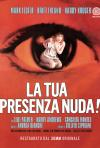

[夜童](https://pewae.com/gaan/aHR0cHM6Ly9tb3ZpZS5kb3ViYW4uY29tL3N1YmplY3QvMzM0NTgwOS8=)

原名：La tua presenza nuda!导演：james kelley / 安德烈·比安奇主演：colette giacobine / conchita montes / harry andrews / lilli palmer / 哈迪·克鲁格 / 布里特·艾克拉诺 / 马克·莱斯特类型：剧情 / 恐怖 / 惊悚地区：意大利首映时间：1972

结局大快人心。
究竟是不是它干的，是不是想象不重要，感觉到位了。
中间拉扯的部分有点冗长。

[害虫](https://pewae.com/gaan/aHR0cHM6Ly9tb3ZpZS5kb3ViYW4uY29tL3N1YmplY3QvMzYzOTYzMjQv)

原名：Vermines导演：塞巴斯蒂安·瓦尼契克主演：丽莎·尼亚科 / 伊科·扎克松戈 / 埃马纽埃尔·博纳米 / 杰罗姆·尼尔 / 玛丽-菲洛梅纳·尼加 / 索菲娅·勒萨弗尔 / 西奥·克里斯廷 / 费尼肯·欧菲尔德 / 阿卜杜拉·蒙迪 / 马哈玛德·桑伽勒类型：恐怖 / 惊悚地区：法国首映时间：2023

勇敢的亚裔大妈还是牺牲了。
不知蜘蛛和密闭哪一个更令人恐惧。

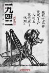

[一九四二](https://pewae.com/gaan/aHR0cHM6Ly9tb3ZpZS5kb3ViYW4uY29tL3N1YmplY3QvNjAxMTgwNS8=)

导演：冯小刚主演：冯远征 / 张国立 / 张涵予 / 张默 / 徐帆 / 王子文 / 范伟 / 蒂姆·罗宾斯 / 阿德里安·布罗迪 / 陈道明类型：剧情 / 战争地区：大陆首映时间：2012

飞机轰炸的场景冷血又真实。
上位者与屁民并进的方式很大胆，但是作为中间链条的美国记者，表现还是弱了些。
徐帆演的奇怪，既不年轻，也不像村姑。