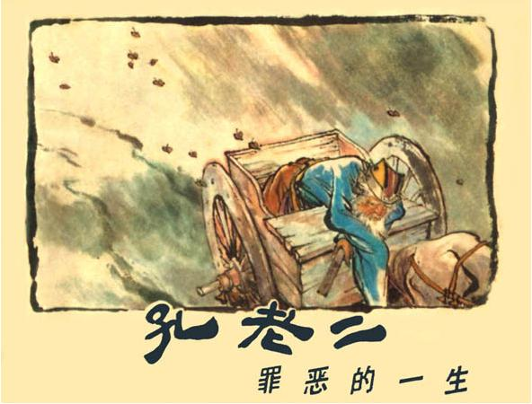
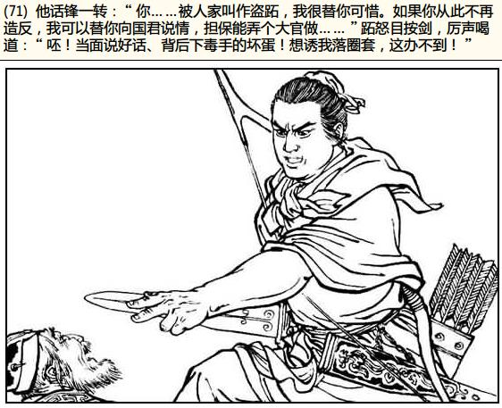
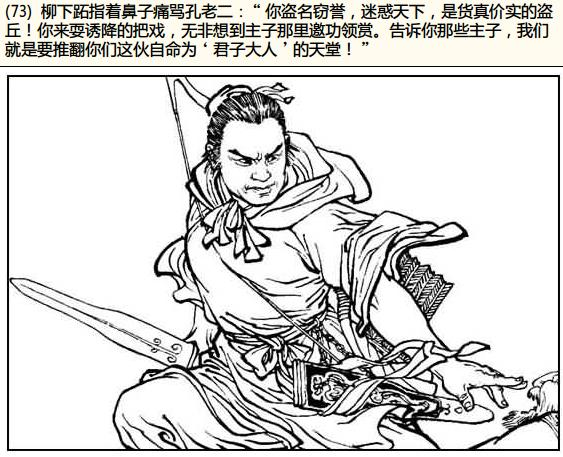
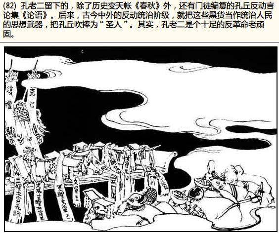

今天中午上网瞎逛，偶然间发现一套小人书（

```
下载
```

）。我靠，巴金写的字儿，牛叉啊！再仔细一看，这毒草我tm尝过！而且是印象深刻苦大仇深的那种。

按说，依照我的年纪，跟小人书该属有交集但无交情才对。可是架不住”那时候家里穷啊”。大舅家的大哥酷爱看小人书，有几百本的收藏。然后传给大姨家的大哥，然后传给二舅家的大哥，然后传给老舅家的大哥，然后传给我——十几年就过去了——后来我还把剩余的几十本传给了表妹呢。

为啥说这书是毒草呢?书里那些意识形态的东西就不多说了，反正刚上学的时候俺认字也不多，只记住俩名字：孔老二和跖。


跖还好说，除了颠覆点儿是非观念以外没什么大碍，还间接教会一个生僻字，和一个古人可以用一个字做名字的常识（常识是对的，论据却是错的，跖跟男人的耻辱一样姓柳下）。
孔老二这老不死的可把我害惨了。刚上小学五年级，历史课开课不久就讲到春秋了么，老师上课提问，谁知道孔子的名字是什么？俺当时就奋不顾身地举手了。被叫起之后响亮的回答：“孔老二！”要知道要是回答个普通的错误答案也就没事了，可偏偏俺用的是色彩这么浓重的一个回答。于是，第一次被教导主任拎去教育……

所以说，一旦被灌输了错误的概念，就很不容易改掉，往往比不了解这个概念更可怕。

比如初中的那傻逼语文老师，教我们说一行5个字的是律诗7个字的是绝句。当时俺这种有识之士跟她据理力争还吃了板子。结果上高中以后大锅同学在一次课堂回答的时候当场露怯，导致其语文成绩江河日下两次高考作文加起来才得了30分。
再比如学《大风歌》的时候，同桌宝宝童鞋问：“大风起兮云飞扬的‘兮’怎么念啊？”我想起前几天看的弱智电视剧讲荆轲的，里面唱的是“风萧萧hou易水寒”，就告诉宝宝说念hou。后果就是宝宝课堂上被嘲笑，我下课后被海扁。
再再比如，我老婆至今仍坚信在宇宙飞船上能看清万里长城。

不光别人教的，连自己琢磨的也有出错的——大二的时候流行flash，其中来自台湾的讦谯龙系列影响甚远。3P大纲之流纷纷以“干焦龙”呼之。俺就笑话他俩：“个没文化的土鳖，那俩字念jieqiao！”然而两年之后开始追看台湾综艺节目，发现宪哥瓜哥菲哥乃哥哥哥嘴里都念的是“干焦”，那感觉就好像自己嘴里被放进了土鳖。但是要想打出那俩字，却又非打jieqiao不可。正所谓说土鳖谁是土鳖……

其实想告诫自己的是：知之为知之，莫强为人师。尤其是将来教育宝宝的时候，一定要在第一时间交给它最准确的知识。如果教了错的再想改，可就费劲了。
至于巴金，就不知道他晚年一力推行忏悔之道，是不是跟他对我的愧疚之心有关。
