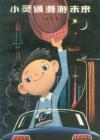
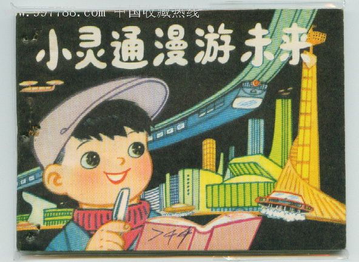

[小灵通漫游未来](https://pewae.com/gaan/aHR0cHM6Ly9ib29rLmRvdWJhbi5jb20vc3ViamVjdC8xOTMzNDc5Lw==)

作者：叶永烈 / 杜建国出版社：少年儿童出版社出版时间：1978

今天表哥婚礼,喝了不少.惶惶间想起了小时候巨喜欢的小人书小灵通漫游未来

于是上网找了一番,没找到当初看的小人书,只找到封面

这本书是叶永烈61年的时候写的,但是到了70年代末才得以出版.

心血来潮,对照一下叶永烈先生当初的幻想实现了什么吧.

**原子能气垫船:**
原文:
*这艘船是一种新式的船，叫做“原子能气垫船”。在船上，有一个巨大的风扇，不停地往船底鼓风，使整个船都腾空，脱离水面。这样，船在航行的时候，不受水的阻力，所以像飞一样快。正因为这样，船还能在陆地上行驶——它在陆地上也是腾空的，脱离地面。*
*我们三个人沿着走廊，来到了甲板上。甲板银光闪亮，我以为是用铝做的，跟飞机一样。小虎子像个小船长似的，把他从爷爷那里听来的话告诉我——气垫船不是用铝做的，是用一种叫做“钛”的新金属做的。这种金属的样子很像铝，也是那样轻，可是，它比铝更加耐腐蚀，不怕海水侵袭。*
*小虎子还豪迈地告诉我：这艘气垫船是用原子能开动的，一块香皂那么大的原子能燃料，就可以使这艘气垫船开几万公里哩！
还不到中午，气垫船开始慢下来了。在短短的几小时内，它便航行了一万多公里。
气垫船跟别的船不同，它竟然从海里一直冲到码头上，才把气放掉，卧在地上*
现实:
气垫船这种东东确实是有的,但基本没有原子能的,更不可能拿钛这么金贵的金属来做.因为实用性不高,所以基本上连电影里都少见,除了.
叶爷爷关于原子能材料的认识显然有待加强,香皂大小的原子能材料竟然只能跑几十个小时,还不如烧油呢.

**水翼船:**
原文:
*正说着，在远远的海面上，出现了一个黑点。一眨眼，那黑点越来越大。
“我上去看看，究竟是什么船？”小虎子说着，就爬上旗杆。他真行，一下子就爬得老高。他正想招呼我也爬上去，一看小燕在我旁边，就“唰”地一下滑下来了。他低低地贴着我的耳朵说：“算了，小燕在这儿，还是别上去好！”
那船越来越近，嘿，它有一个又圆又尖的船头，跟飞机差不多，小虎子告诉我，这叫“水翼船”。有趣的是，这船船底长着两个翅膀，飞速地在海上航行，整个船就像蜻蜓点水似的擦着水面高速前进！没一会儿，就无影无踪，海面上只留下一道雪白的浪迹。*
现实:
只要是船,就没有跑这么快的.

**微型的半导体电视电话机**
原文:
*“小虎子，你们该下来吃早饭啦。”这时，忽然响起了爷爷的声音。
我前后左右找了一通，却没看见爷爷。
“找爷爷吗？他在我的口袋里喊呢！”小虎子一边笑着说，一边从裤口袋里掏出一个小盒子似的东西。
“快点下来！”从小盒子里，又传出来爷爷的喊声。
这是一个塑料做的盒子，盒子上有一块火柴盒那么大小的荧光屏。我从荧光屏上看到爷爷一边在看报，一边在讲话呢。
原来，这是一个微型的半导体电视电话机，使人既能听到对方的讲话，还能看到讲话人的动态、表情。
“我这里也有一个。”小燕指了指自己的衣袋说。
正说着，从小虎子和小燕的口袋里，同时发出“嘟，嘟，嘟……”的声音，在最后一声“嘟”之后，我看了一下电视手表，见指着19：00：00。
小虎子说：“微型半导体电视电话机已经向我们报告，晚上7点了，该各就各位了。小灵通，你在这里写你的文章，我在这儿画画。小燕，你回妈妈的房间去，做你的暑假作业。”*
现实:
不就是手机么,现在中国几乎人手一个,叶爷爷当初非要往电视上联系,真有点误入歧途了.带摄像功能的手机做起来也不复杂,只不过做得出是一回事,用的起是另一回事.本人的手机现在拍照功能都觉得浪费,连彩信都没开的说.

**电视手表**
原文:
*小虎子朝手腕上看了看，对我说：“现在是11点23分25秒，到11点半就可以到达未来市了。”
小虎子手腕上的手表，只有普通邮票那么大小，长方形，怪别致的。
小燕见我对这手表很感兴趣，就给了我一只，说她有两只手表，一只是妈妈给的，一只是她生日时，爷爷作为礼品送给她的。
我接过手表，仔细看看，真有意思。那手表既没有时针、分针、秒针，也没有齿轮和发条，只不过是一块小小的电视荧光屏，上面写着几个数字：“11：23：40”，也就是11时23分40秒，那表示秒的数字在不断变化。当40秒变成60秒时，那23分也一下子变成了24分。
我想，居然会有这样奇妙的手表？
小虎子看到我对这小小的新型手表感到奇怪，就说道：“这是电视手表呀！未来市的电视台不断播送着标准时间，电视手表上就出现了几时几分几秒。这种手表永远不用上发条，而且一直非常准确。它构造简单，价钱非常便宜，所以在我们未来市，每个小朋友都有电视手表，有的还有好几只呢！”*
现实:
这个描述显然有点暴寒,电子表的话60年代也不是没有啊.电视台现在是没有那闲工夫管你的表的,但是让PC上的时钟与世界同步易如反掌.
题外话:
贩一批电视回60年代,肯定暴了.不过那个年代贩卖电视恐怕会被当成坏分子被批斗吧.

**水滴一样的汽车**
原文:
*这小汽车真漂亮，我见也没见过！它的整个外壳，是由一整块无色透明的塑料做成的。车头上的一块红色的塑料牌上，写着这样几个金光闪闪的字：未来牌汽车，中国第88汽车厂制造。这小汽车的车头又尖又小，屁股大，车顶圆溜溜的，远远看去，挺像一颗透明晶莹的大水滴哩！
奇怪的是，这小汽车没有一个轮子！
“这汽车怎么没有轮子？”我不由得问小虎子的爸爸。
“它是无轮汽车。”他回答道。
“没有轮子，汽车怎么跑路呢？”
“这种汽车的原理，其实跟气垫船差不多。”小虎子的爸爸说道，“它有一个喷气发动机，能够喷出两股气流——一股气流向下喷，使汽车腾空起来，离开地面；另一股气流朝后喷，推动汽车向前跑。这种汽车跑起来非常快，就像在地面上飘似的，所以大家都叫它‘飘行车’。也有人因为它的样子像水滴，叫它‘滴形车’、‘水滴车’。”
“这汽车，谁都会开。小灵通，你只要跟我学一分钟，保证会。”小虎子说道，“在我们这儿，飘行车简直像鞋子一样普遍，几乎每家每户都有飘行车，每个人都会开这玩意儿。”
“小灵通，你还是先跟我学吧！”小燕让我看她面前的操纵板，说道，“你看看这操纵板，就明白一大半了。”
我凑近一看，只见浅绿色的塑料操纵板上，写着：开关、速度、高度……
小燕笑着告诉我：“你只管放心，一百个放心！坐飘行车，非常安全。即使司机闭上眼睛开车，也不会闯祸。因为飘行车装有自动避撞装置，一遇上对面有车子开来，它就会自动向左拐，而对方的车子也会自动向左拐，不会撞上。有时，突然对面出现一辆高速行驶的飘行车，来不及躲开，其中的一辆飘行车就会自动加大气流，从另一辆飘行车上面飞过去。”
“如果飘行车掉到河里或者撞到山上，怎么办呢？”我还是有点担心。
“没关系，飘行车在水上也能飘行，还能爬山。”小燕一边说着，一边故意让飘行车离开了公路，开进一条小河，然后再沿着河岸爬上去，重新回到公路上。
我连忙把控制车速的闸刀向上一扳，想把速度降下来，谁知道我弄错了，向上扳是加快速度，飘行车像箭一样向房子冲去。我慌了手脚，大叫：“不得了！不得了！”
正当飘行车要撞到墙壁上的时候，突然来了个急刹车，停住了。我不留神，人向前一冲，头撞在车壳上。还好，那透明的塑料车壳像橡胶一样富有弹性，我的头一点也不疼。*
现实:
现在车都改鼓励小排量的了,这么猛的车估计有了也不会推广

**手提电视**
原文:
*这时，我想起了小虎子，他怎么一声不响呢？回头一看，原来他在用那小盒子电视机收看文艺节目，正看得津津有味呢。*
现实:
PSP?MP4??

**机器人**
原文:
*我朝老爷爷的对面一瞧，吓了一跳：老爷爷的对手是一个长着银光闪闪的长方脑袋的怪物。他有两只圆圆的眼睛，三角形的鼻子，一张又宽又大的嘴巴。他浑身都亮闪闪的。在肩膀、手腕、膝盖、脚踝、头颈这些关节上，可以看到一颗颗突出来的六角形螺丝帽。“我来介绍介绍。”小虎子说道，“这是我和小燕的新朋友、好朋友——小灵通，他是个新闻记者。这是我爷爷的爸爸——我的曾祖父——老爷爷。”
小虎子指了指那位浑身发亮的人说，“他是机器人，绰号——也算是他的名字吧，叫做‘铁蛋’。他浑身是用不锈钢做成的。”
“欢迎，欢迎，我们的小记者。”老爷爷一边用左手持着雪白的胡子，一边用右手抚摸着我的脑袋。
“欢迎，欢迎，我们的小记者。”铁蛋也学着老爷爷的话，瓮声瓮气地讲起来，而且还“砰！砰！砰！”地拍掌表示欢迎。
这时，小虎子的爷爷、爸爸和妈妈也都上楼了，一起坐在阳台上。老爷爷让我坐在他的身边，亲热地问我几岁啦？家住哪儿？家里有几个人？
“铁蛋，你快去给客人倒杯茶。”小虎子的妈妈说。
那机器人随即来了个“立正”、“向后转”，很快地跑开了。一转眼，他用盘子托了七杯茶送上来了，给我、小虎子、小燕以及小虎子的老爷爷、爷爷、爸爸、妈妈每人一杯茶。
“小灵通，以后你要喝水、吃饭，只管找铁蛋就行了。”小虎子的爸爸说，“铁蛋是我们家的‘厨房主任’，专门管这些事儿。”
“他下棋也下得挺高明的。”老爷爷说，“小灵通，你有空可以跟铁蛋赛一盘。”*
现实:
机器人肯定用不起,雇保姆可是便宜的很.

**塑料的广泛应用**
原文:
*小虎子的房间是朝南的，紧靠在阳台旁边。南边的墙壁，从顶到脚，全是用无色透明的新型有机玻璃做的，所以房间里格外明亮。
靠窗那儿，放着一张玲珑的小方桌，也是用塑料做的，桌面很薄，桌腿很细。这小方桌，看样子是小虎子做功课用的。桌子旁边，是一个小书架，放满花花绿绿的儿童读物。靠里面，是一张塑料小床。
还好，那透明的塑料车壳像橡胶一样富有弹性，我的头一点也不疼。
“在我们这儿，不管是桌子、椅子、饭碗、床、书架、地板、天花板、门窗……全都是用塑料做的。”小虎子说着，“不过，这塑料有好多种，像做桌腿、床架的塑料，是‘塑料钢’，它像钢铁一样结实。像做窗户的塑料，是‘有机玻璃’或者‘塑料玻璃’，又透明又结实。做地板用的塑料，是‘塑料橡胶’，富有弹性，表面不滑，老年人不会滑倒跌跤。天花板和墙壁是用一种‘泡沫塑料’做的，这种塑料的肚皮里尽是泡泡，又轻又能隔热，能使房间里冬暖夏凉。这泡沫塑料还能隔音。小灵通，如果我们今晚把门关上，就是谈到天亮，爸爸和妈妈也不会知道哩。”
珍珠般的人造大米被传送带送到前面的包装车间。在那里，被装进一个个透明的、薄薄的塑料袋子里。*
现实:
实木家具贵得要死

**助听器,隐形眼镜**
原文:
*“老爷爷的耳朵灵，那是因为他的耳朵里，装了一只很小很小的放大机，能把声音放大，所以他能听得很清楚。他的眼睛不花，那是因为他眼睛里，装了老花眼镜。镜片是嵌在眼睛里的，所以你看不出来他戴眼镜。我爸爸的眼睛里也嵌着镜片，不过，他嵌的是近视镜片。”*
现实:
早已广泛应用.

**人造器官**
原文:
*“你老爷爷年纪那么大了，身体可真好！”我好奇地说。
“老爷爷的身体是不错。不过，他在67岁、96岁、108岁的时候，生过三次大病。一次是肺烂了半边，动手术换了一叶人造肺。又有一次是肝脏坏了，换了个人造肝脏。还有一次是心脏无法跳动了，换了个人造心脏。他的三次大手术，都是在‘未来医院’里做的。在这个医院里，有许许多多人造的器官，你什么器官坏了，就可以换一个新的，就像自行车哪个零件坏了，可以调换一个新零件似的。因此，未来市的居民，寿命都很长。”小燕这时也打开了“话匣子”，滔滔不绝地说起来，“在我们家，老爷爷的年纪不算最大，老爷爷的爸爸、妈妈都健在呢，他们喊我老爷爷叫‘小三子’哩！”*
现实:
尚未投入使用,不过贩卖器官的人倒是不少.

**人造食品**
原文:
*那饭粒都是圆溜溜的，像一颗颗珍珠。我试着吃了一粒，嗨，有点像饭的味道，但细细一回味，又觉得和饭有点不同。
“小虎子，这是珍珠米？”我指着饭碗问。
“不，不，这不是珍珠米，这是人造大米。”小虎子妈妈笑着回答了我的问题，“这人造大米不是田里种的，它是从工厂里造出来的。”
“米也能人工制造？”我迷惑不解。
“等明天，让小虎子带你到人造粮食工厂去参观参观。”小虎子的爸爸对我说道。
餐桌上有四盘菜，每一盘菜都使我感到希奇。
第一盘菜是五香酱蛋。那蛋足足有小西瓜那么大。
“这是什么蛋？是恐龙蛋？”我非常吃惊。
“哈哈，即使是恐龙蛋，也没有这么大！”小虎子的爸爸说道，“世界上任何动物的蛋，都没有这么大。”
小虎子的爸爸一面说着，一面用刀把蛋切开。咦，我这才发现：蛋里没有蛋黄，全是蛋白！
小虎子叫我吃了一块，我觉得味道倒有点像鸡蛋，但比鸡蛋还鲜！
小虎子的爸爸告诉我：“这个蛋是人造蛋！现在，工人们不仅会制造人造大米，而且会制造人造蛋白质。他们把制成的蛋白质，灌进椭圆形的塑料袋里。顾客买回去以后，用开水一煮，就煮成这个样子了。”
铁蛋带着沉重的鼻音在旁插嘴说：“这个蛋是我烧的！”
老爷爷听了，捋着胡子笑道：“烧这个菜最简单，只要把水烧开，蛋倒进去，再加点酱油、五香粉就行了，所以让铁蛋来烧。”
另外一盘菜是清蒸肉丸。我吃了一个，觉得跟普通的肉丸差不多，没有什么特别的味道。
出乎意料的是，小虎子的爸爸说：“这肉丸也是人造的！其实，人造肉跟人造蛋白的化学成分差不多，都是用人造蛋白质做的。不过，现在未来市还只能生产人造肉酱，人们用人造肉酱做肉丸子。暂时还没有办法做成一块块的人造肉。”
“它跟人造淀粉的制造方法不同。人造蛋白质是用石蜡作原料。石蜡是从石油中提炼出来的——我们中国的石油中含有很多石蜡。石蜡放进这罐子里，再放进一种叫做‘吃蜡菌’的微生物。这些微生物把石蜡当成食物，大吃特吃起来。它们吸收了石蜡，变成身体中的蛋白质。成吨成吨的石蜡倒进罐子里，没多久就全被吃光。‘吃蜡菌’越吃越胖，不断繁殖，变得越来越多。把这些‘吃蜡菌’捣成酱就成了人造肉——人造蛋白质了。”
“原来，人造肉是用石蜡做成的，这肉可真称得上是‘腊肉’了！”我开玩笑地说道。*
现实:
有倒是有了,可是现在只有纯天然绿色的才是最好的.

**转基因食品**
原文:
*第三盘菜是萝卜炒丝瓜。我吃了一口，这萝卜是平常的萝卜，不过味儿甜一点。这丝瓜也是普通的丝瓜，只不过味儿鲜一点。
我一边吃，一边想：萝卜虽然平常，丝瓜也很普通，可是，我怎么从没吃过萝卜炒丝瓜呢？
仔细一琢磨：萝卜是秋季蔬菜，丝瓜是夏天上市的，有萝卜的时候没有丝瓜，有丝瓜的时候没有萝卜，现在怎么同时生产了呢？
小虎子的爸爸把其中的奥妙讲给我听了：原来，这是未来市农业科学研究所，用一种叫做“遗传工程”的新技术培养出来的新品种，名字叫“萝瓜”。本来，人们种萝卜，只收萝卜，萝卜叶子不能吃；人们种丝瓜，只收丝瓜，丝瓜叶子扔掉不要。现在，他们把萝卜与丝瓜合在一起，培育成“萝瓜”。这种作物，上面长丝瓜，下面长萝卜。萝卜和丝瓜同生共长，同时收获。也正因为这样，就有了这盘萝卜炒丝瓜。有趣的是，这新品种的叶子也可以吃，盘子里夹杂着好多萝瓜叶。我吃了几片，就像青菜一样好吃。
还有一盘菜是雪白的粉皮，拌着一颗颗西瓜籽。我感到很奇怪：怎么用西瓜籽当菜呢？
我用筷子夹了一颗西瓜籽，想用牙齿把它的壳咬开。谁知一咬，就把它整个儿咬碎了，原来这西瓜籽是没有壳的，味道挺香，油汪汪的。
“咦，这西瓜籽怎么没有壳？”我话音未落，就惹得小虎子全家哈哈大笑，连铁蛋也笑了。
直到小虎子的爸爸告诉我这是芝麻，我才知道自己弄错了。
这芝麻真大，和西瓜籽差不多大小。小虎子的爸爸说，这是未来市农业科学研究所经过多年精心培育出来的新品种。*
现实:
福祸未知的转基因食品.

**钢化瓷**
原文:
*饭后，我和小虎子、小燕一起洗碗。小虎子把盘子、碗乒乒乓乓朝瓷砖砌成的水槽里放，那些瓷盆、瓷碗居然一只也不碎，瓷砖也没裂！
小虎子告诉我，这些瓷盆、瓷碗、瓷砖都是经过特殊处理的钢化瓷，不会碎裂。他把一个瓷盆故意朝空中一抛，瓷盆落到地上，蹦蹦跳跳几下，发出清脆的当当声。我连忙拾起来，里里外外查看了一下，真的一点也没坏。
我们中国最早发明了瓷器，在未来市，它更青春焕发，几乎每家每户都用钢化瓷器作为餐具。*
现实:
有是有,就是没人拿来吃饭用.

**去污油**
原文:
*原来在盘子和碗的表面，涂了一种奇妙的“去污油”。这种盘子、碗既不沾脏东西，也不沾水，不沾油。你把脏盘子、碗往水里一放，污垢就统统掉进水里。把盘子从水里拿出来，那水就像荷叶上的水珠似的全都滚了下来，一滴也不留。
更妙的是，小燕把餐桌上的白布往水里一浸，上面的油渍什么全都掉进水里。她再把白布拎起来一抖，餐布就干了，用不着晒，就重新铺在餐桌上。
这白色的台布，原来也涂上了一层去污油，所以水、油都不沾。
小虎子还告诉我：未来市生产的布，上面都涂了奇妙的去污油。因此他们洗衣服非常方便，只消往水里一浸，再拿起来抖几抖，就可以再穿了。
另外，在未来市生产的肥皂中，里面也含有这种奇妙的去污油。人们用这种肥皂洗澡后，全身皮肤都不再沾上水和油。皮肤上的污垢，用水一冲就干净了。
下雨天，未来市的居民既不穿雨衣，也不撑雨伞，因为雨水落到衣服上，马上就骨碌碌地滚到地上。即使在倾盆大雨中，全身也不湿。梳长辫子的姑娘，只要把辫子一甩，头发上的雨水就全被甩掉啦！*
现实:
中国人有比这个还厉害的”奇强”.

**环幕立体电影**
原文:
*小燕抢过报纸，细声细气地念了起来：“红旗环幕立体电影院，今天下午两点整，放映童话片《森林里的王国》。”
我们四个人坐了一辆飘行车，老爷爷说他自己好久没开车了，今天由他来开。我刚在飘行车上坐稳，车子便慢了下来。我眺望前方，在灿烂的阳光下，有一座圆圆的、金闪闪的建筑物，屋顶是半球形的，像一只巨大的碗反扣在地面上。它的四周，开着好多扇拱形的大门。
在正门上，写着九个红色大字：“红旗环幕立体电影院”。我们的飘行车从拱形的大门一直开进去，进入了放映大厅。
这当儿，飘来一阵阵苹果的香味。嘿，这电影不仅有声有色，而且还有气味哩！*

现实:
环幕电影,有人看吗?

**小太阳灯**
原文:
*我问了小虎子，才弄明白：那弯弯的银钩月，才是真正的月亮。今天正是农历二十，月亮不可能那么圆。而那明亮的圆月，原来是一盏灯，叫做“小太阳灯”。它是装在一颗人造卫星上的。这颗人造卫星始终停在未来市的上空，像嵌在夜空中的一颗晶莹的大宝石。到了晚上，“小太阳灯”大放光芒，把未来市照得一片雪亮，变成了一座“不夜城”。*
现实:
槐花灯都不开了,西湖都限电了…

**学校**
原文:
*“你们上课，是到学校里去上呢，还是坐在家里的电视机前面听课？”
“我们每天都是到学校去上课。因为老师如果坐在电视台里，学生看得见老师，但是老师看不见学生，没法知道学生听课用心不用心，听得懂听不懂，有没有什么问题。现在只有在晚上复习功课的时候，老师才到电视台去。我们在复习的时候，有什么不懂的地方，就把电视机的电钮旋到老师讲课的频道，用半导体电视电话机打电话给老师。老师马上给我们解答疑问。”
“你们的学校大吗？”
“很大，有3000多人。凡是小学毕业的，全部都升初中。也有的小学没毕业，成绩优异的，就跳级升入中学。”小虎子说，“我们的教室很宽敞，像剧院似的，座位是阶梯式的，一排比一排高。即使坐在最后一排，也用不着伸长脖子看银幕。”
“什么？你们教室里挂银幕？那不就变成电影院了吗？”
“是呀，我们的教室很像电影院，银幕非常大，挂在前面墙壁正当中。”*
现实:
原来早在60年代就有人置疑网校的教学效果了

**没有蚊子,没有苍蝇**
原文:
*“我除了喜欢地理课之外，对生物课也很欢喜。”小虎子接着说，“上生物课的时候，教室的银幕上就出现各式各样有趣的昆虫。老师告诉我们，哪些是益虫，哪些是害虫，我看了教学影片，才知道世界上过去有什么蚊子、苍蝇。人们睡觉要挂蚊帐，还要打什么霍乱预防针，防止传染病。”
“什么，你没见过蚊子和苍蝇？”
“没看到过。在我们未来市，没有蚊子，也没有苍蝇。”小虎子摇着圆脑袋说道。*
现实:
这个境界快了,大亚湾就没有蚊子也没有苍蝇…

**人控天气**
原文:
*“未来市人民广播电台，现在播送未来市气象台发布的今天天气协商结果——由于今天上午举行未来市第八届全市运动会，经各单位协商同意，上午6点到12点，控制本市市区的天气为晴天，郊区下雨。因为目前郊区正是庄稼生长旺盛季节，需要降雨。今天中午12点至1点，市区下一小时雨冲洗街道；郊区至下午6点转为晴天。但是，沿海晒盐场一带，今天一直保持晴天，保证晒盐工作正常进行……”
小虎子对我的疑问，反而感到奇怪。他认为这是司空见惯的事情，电台每天都是这样播送的。他向我解释，在未来市，人们已经能控制天气。要晴天的话，只消用飞机喷洒一点“消云剂”，就能使乌云消散；要下雨的话，只消用飞机喷一点“降雨剂”，天就下雨。可是，未来市有许多单位，常常这个要晴天，那个倒要下雨，这儿要晴天，那儿要多云。怎么办呢？未来市气象台专门成立了一个天气协商办公室，根据各单位的建议进行协商，每天发布天气协商结果。
当我们刚刚离开厂门，天就哗哗啦啦地下起大雨来。我一看电视手表，正好12点整——今早广播的“天气协商结果”是那样的准确，分秒不差。*
现实:
防汛抗旱总指挥部…

其实,到现在我都不知道,”四化”究竟实现了没.
四化都什么来着??