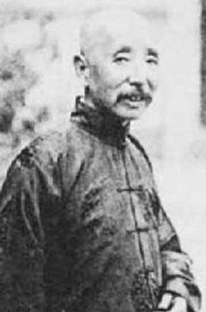
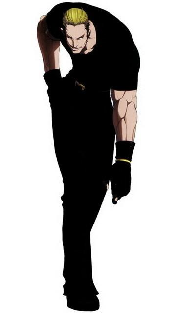

每到这个时候，就会想起大学同学小斌斌。

沈阳市有个规定，每年的9月18号，晚上9点多，要不就是10点多，会全城响警报，同时停电。过程好像是持续5分钟。

辽大有个传统，每年的这个时候都会有好事儿的人冲到楼下，高喊“打倒日本帝国主义”，去砸留学生宿舍的玻璃——虽然留学生大多是韩国人和俄罗斯人。当然，懒人也有表达情绪或者说起哄的权利，他们采用的方式跟夫妻吵架时泼妇或者非泼妇女性采取的方法差不多，就是往楼下扔东西。在俺们之前，师兄师姐们都是往楼下扔暖壶的；但是到了俺们这波，为了节约成本，大多是趁开学的半个月攒上半箱的啤酒瓶子，在警笛响起的那一刻将这主要成分是二氧化硅的物体呈抛物线丢出阳台。失之雄浑而取之清悦。

第一年，嗯，俺想起来了，第一年刚到的时候是10点多熄灯以后响起的警报——后来政府怕市民告扰民才改成了9点多。师兄师姐们扔暖壶的声音此起彼伏，抑扬顿挫。俺们在榻上也是听得心潮彭湃。后来有人专门跟师兄取经，得到了三字真髓：取瓶胆。

但是俺们为了节约成本，终究还是用了酒瓶。第二年，校园便是俺们的天下。在短短的不到十分钟的时间里，竟产生了十数人的伤亡——其中包括几个扔瓶子脱臼的和踹玻璃扭伤脚踝的——据野史记载还有想摸黑进入女生宿舍被误伤的。这件事情引起了学校的重视——可能觉得辽大医院的承载能力有限，便在第三年的时候出动了保安队。

大三的那一天。晚上。老三和老二去装模作样的上自习还没有回来；老大在隔壁打或者看人打CS；老六也在隔壁，不知道是在看电影还是看图片；老四躺在他靠阳台门的位置上，睡觉。俺独占着那台K6的机器，玩拳皇——俺一般趁着老四没在看的时候玩，不然丢人。同时，俺在用凉水泡脚。
窗外警笛声响起的时候，校园内黑了下去。果然是和以往一样，此起彼伏的碎玻璃声和打倒什么什么的声音。为了应景，俺也喊了句：“打倒山崎————”果然把它打倒了。窃喜。

保安队们忽略了一件事——他们平常的经费，用来吃喝的可能太多了，以至于并没有配上安全帽——这导致他们在清脆的爆瓶声中，只能远观而不能抓现形——不知道抓不到几个的话他们第二天面对满地的碎玻璃会不会被扣奖金。

隔壁的准备很充分——他们顺着阳台倾泻了十数个瓶子。甚至作访问的老大和老六也友情客串了——俺虽然不良于行，却是没有聋的。俺们的阳台是连着的，门也没有关，什么都能听见。
小斌斌终于在警报声结束的时候隆重出场了。
“TMD瓶子藏得太隐蔽，找半天了。楼上的兄弟看我的！咣！”
“咱就是带种，咣！”
“嘿，过瘾嘿！咣！”
“兄弟们等我一下，进屋再拿。”

一个黑影从俺背后的门外溜了进来。是一坨貌似男人的物体。俺没有在意，以为是隔壁计算机系来借光盘的呢。他们经常这么干，俺们还指望盘坏在他们光驱里赔给俺新的呢,又怎么会阻止呢。不过今天这个貌似有点面生。那也无妨了。俺们寝室也没有什么珍贵的东西。桌面上除了三嫂的照片和老大的洗面奶就没有什么价值超过RMB5元的东西了。
那厮直奔阳台而去。俺真想告诉他今天三嫂和大嫂都没来过，但是又想，让他多转一圈也好。

小斌斌在继续他的表演。隔壁老七其实在劝他：“留两个来年用吧”
“不就图个爽么！再来，咣！”
“你TM干什么滴，抓我胳膊干什么！”

小斌斌就这样被保安带走了。
俺敬佩他，为了抗日，他毅然放弃了评优资格，捐出了当年的200块奖学金。

这件事情教育了俺：以后洗脚，一定要关门。