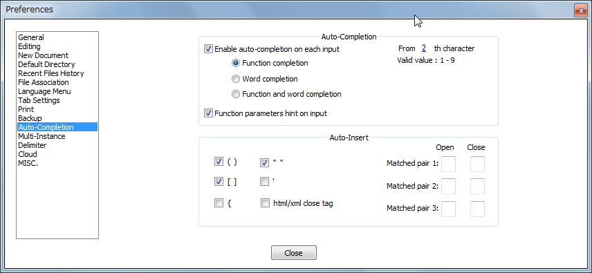
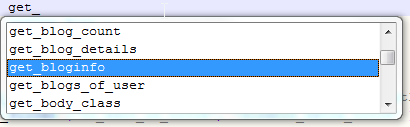
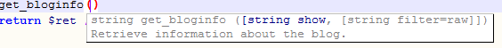
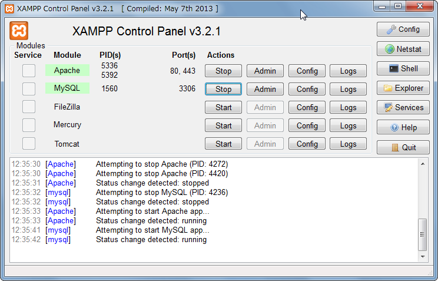
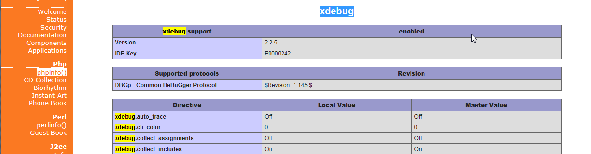
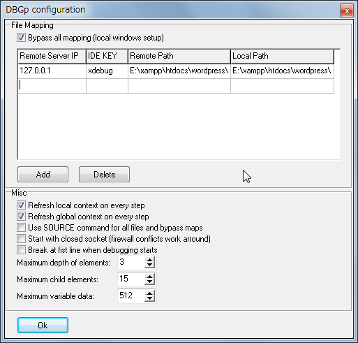

其实本来只是想装个XAMPP本地改CSS来着。但运行起来之后，发现自己的function里有个警告。就想，能不能debug一下呢？这些可捅了马蜂窝，费了好大周折才搞定调试环境，而CSS的工作却还没开始。感觉像为了吃个拌猪耳朵而养了一头猪一样。不把这养猪的过程分享出来，实在是中心如噎。
大多数资料给出的方案是XdeBug+Eclipse。好处是能够夸平台。但我这儿只是轻量应用，Eclipse基于java的，太臃肿又太慢，所以就找了轻量级的Notepad++的方案。Notepad++（简称NPP）本来就是我主力的文本编辑器——虽然它的作者有点儿秀逗。
本文作成于2015.2.6，使用软件为：Notepad++ Ver.6.7.4，XAMPP Ver.3.2.1，DBGp Ver.0.13b，

**一、让NPP支持wordpress函数的自动填写**
设置NPP的自动完成功能。把图上那俩checkbox挑上就可以。

下载一个开源xml。[地址](https://pewae.com/gaan/aHR0cHM6Ly9naXRodWIuY29tL3Rha2llbi9Xb3JkUHJlc3MtQXV0by1jb21wbGV0ZS1mb3ItTm90ZXBhZC1QbHVz)。把压缩包里面的php.xml解压缩后**覆盖到 \你的NPP安装目录\plugins\APIs\ 下**即可。官方说不用重启就可以生效，我没有亲见，所以还是重启吧。要注意的事，这份xml已经一年多（2013.10）都没有维护了，所以它是不支持Wordpress4.0-4.1的新函数的。而且作者君自己也说他列出的函数本身就是不全的，所以，仅作参考好了。
敲两个函数验证一下。



**二、配置XAMPP中的Xdebug**
XAMPP最新版的安装很傻瓜的，所以只是简单说一下怎么在本地搭建woedpress就好了：
运行xampp-control.exe，启动Apache服务和MySQL服务。

在浏览器里敲

```
http://localhost/phpmyadmin/
```

配置一个wordpress用的数据库。（都会吧）
把最新版的wordpress解压缩到 \你的XAMPP安装目录\htdocs\ 默认的名字是wordpress。然后修改目录下的wp-config.php。（应该也都会，不详述了）
这样你在浏览器里敲
http://localhost/wordpress/
就可以进到本地的wp里了。然后跟你服务器上一样配置自己的wordpress就可以了。如果有心的还可以把自己blog上的数据倒到本地。
下面才是重点：激活Xdebug！
XAMPP是整合了XDebug的，但默认是关闭的。把它打开就好。
编辑 \你的XAMPP安装目录\php\php.ini **把下边注释掉的部分（开头是;的）全部打开**。另外注意，**xdebug.remote_enable的值一定要改成1！**

```
[XDebug]
zend_extension = "E:\xampp\php\ext\php_xdebug.dll"
xdebug.profiler_append = 0
xdebug.profiler_enable = 1
xdebug.profiler_enable_trigger = 0
xdebug.profiler_output_dir = "E:\xampp\tmp"
xdebug.profiler_output_name = "cachegrind.out.%t-%s"
xdebug.remote_enable = 1
xdebug.remote_handler = "dbgp"
xdebug.remote_host = "127.0.0.1"
xdebug.trace_output_dir = "E:\xampp\tmp"
```

保存之后，通过XAMPP**重启Apache服务**。
在浏览器里敲

```
http://localhost/xampp/phpinfo.php
```

如果能找到xdebug的部分，Xdebug的配置就完成了。


**三、安装配置NPP的DBGp插件**
下载地址(http://sourceforge.net/projects/npp-plugins/files/DBGP%20Plugin/)。
不知道什么原因，这个插件在NPP的PluginManager里是搜不到的。所以需要**手动下载并解压缩放到 \你的NPP安装目录\plugins\**
重启NPP，配置DBGp。【Plugin】→【DBGp】→【Config】

**Remote IP 设为127.0.0.1**
IDE Key随便填
Remote Path和Local Path都填本地代码所在目录
OK保存。

**四、调试**
在浏览器里敲

```
http://127.0.0.1/wordpress/?XDEBUG_SESSION_START=xdebug
```

其中等号后面的东西随便填。
在NPP里【Plugin】→【DBGp】→【Debuger】，就可以进行调试了。设断点神马的不用我教吧？