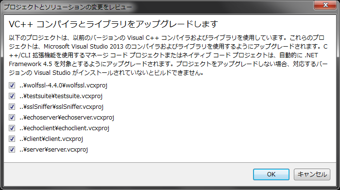
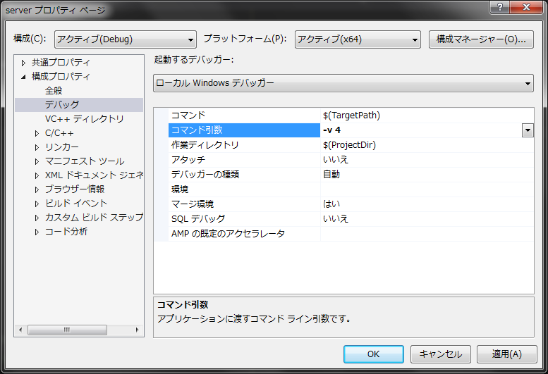
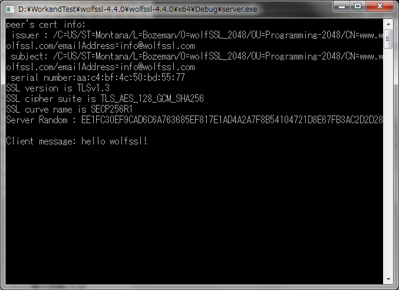
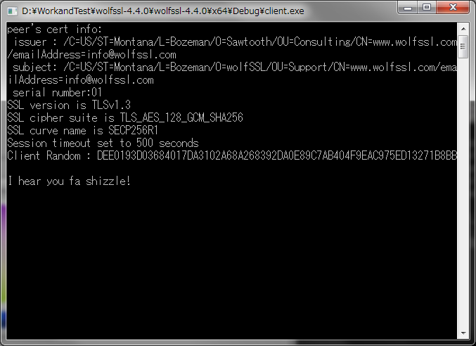

## 下载WolfSSL源代码

[https://www.wolfssl.com/download/](https://pewae.com/gaan/aHR0cHM6Ly93d3cud29sZnNzbC5jb20vZG93bmxvYWQv)
下载第一个压缩包。

## 重新生成VS工程

WolfSSL为了在多版本的Visual Studio下都能运行，故意使用了比较早版本的工程文件。所以需要先双击wolfssl64.sln，弹出画面时选中所有工程，让Visual Studio自动转换VS工程文件。


## 增加TLS1.3相关宏定义

编辑\IDE\WIN\user_settings.h
在

```
#ifndef _WIN32
#error This user_settings.h header is only designed for Windows
#endif
```

后面增加下面的宏：

```
#define WOLFSSL_TLS13
#define HAVE_TLS_EXTENSIONS
#define HAVE_SUPPORTED_CURVES
#define HAVE_ECC
#define HAVE_HKDF
#define HAVE_FFDHE_8192
#define WC_RSA_PSS
```

## 编译和调试

先编译wolfssl。这一步不是必须，因为工程中设定了依赖关系，但稳重起见还是自己先搞一下。
然后修改server工程。选中server，右键，属性->DEBUG->命令行，加入“-v 4”，意为用TLS1.3连接。

client工程也同样。
在client.c的最后部分，

```
return args.return_code;
```

处设一个断点。这一步也不是必须，但这两个测试程序都是C窗口程序，不设断点的话什么也看不到。

先选中server工程，右键->DEBUG->新实例开始。
然后选中client工程，同样操作。
因为断点的存在，两个窗口都不会关闭，出现下图所示窗口输出时，测试成功。



[via](https://pewae.com/gaan/aHR0cHM6Ly93d3cud29sZnNzbC5jb20vZG9jcy90bHMxMy8=)
[via](https://pewae.com/gaan/aHR0cHM6Ly93d3cud29sZnNzbC5qcC9kb2NzLTMvdmlzdWFsLXN0dWRpby8=)