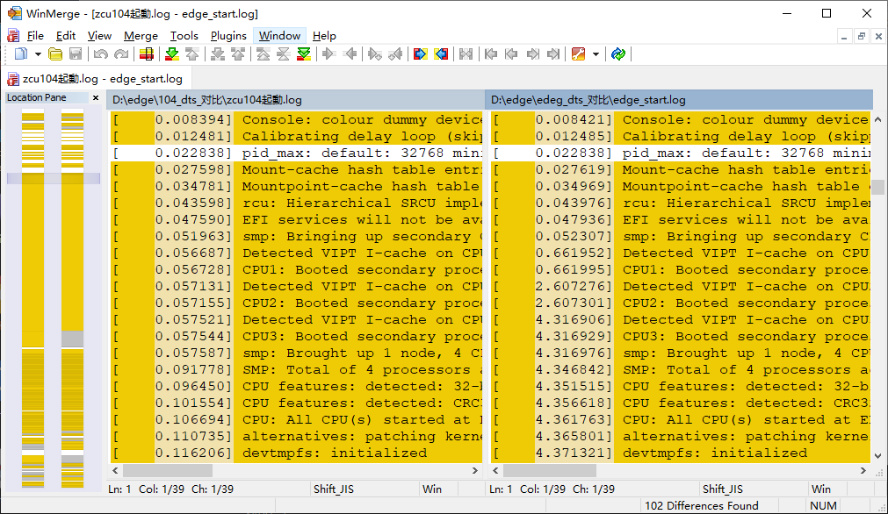
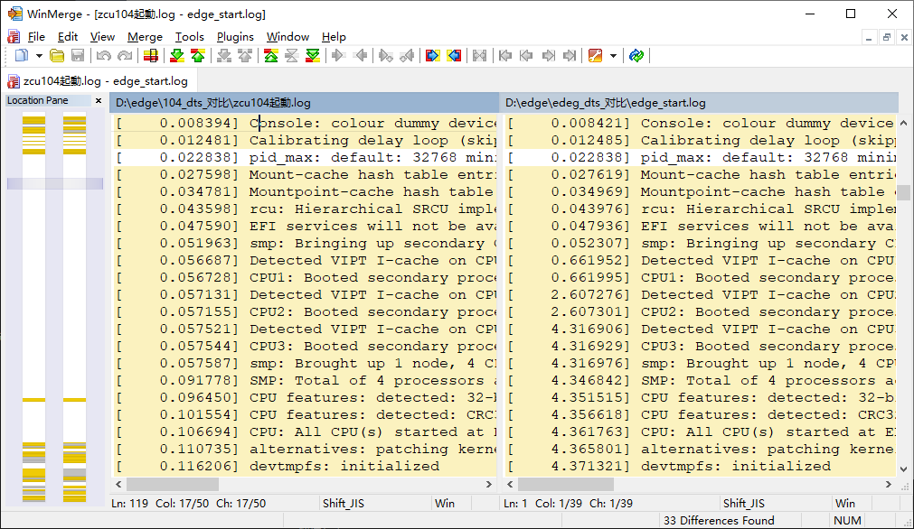

Linux内核启动时，会显示启动信息。调试驱动的时候，这些信息非常有用。但是比较工具默认会把前面方括号里的时间戳也一起差分，因为每次启动的时间都略有差异，所以会造成每行都有差分，等于没有差分的情况出现。

这种情况当然要用到正则这个大杀器出马了。只需一个规则找到每行开始的中括号，那么无论是在差分工具里增加正则filter，还是用文本工具替换掉时间戳再比较，就不会出现处处都不同的情况了。

这句正则特别简单：

```
\[[\s]{2,4}[\d]{1,}.[\d]{6}\]
```

简单说明一下，这段正则查找的内容是【左方括号·2-4个空格·1-n位数字·半角句号·6位数字·右方括号】，顺序写下来都是简单逻辑，稍微别扭一点的只有两个转义。
完事儿。