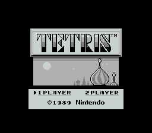
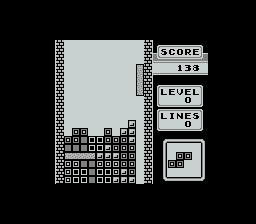
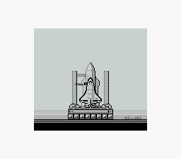
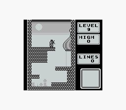
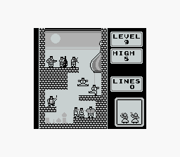

任天堂Gameboy的前半辈子里最伟大的游戏，是俄罗斯方块。（后半辈子当然是口袋了）

俄罗斯方块是款有历史有故事的游戏，GB版更是跟这个游戏的版权大战有密切的关系。
公元1984年，苏联人阿列克谢在苏联的一个山寨系统上发明了俄罗斯方块，第二年他的朋友把俄罗斯方块移植到了MS-DOS上。此时阿列克谢希望走合法的渠道推广这个游戏，甚至可以对苏联政府出让版权，但未得到苏联政府的允许。所以这个时期DOS版的俄罗斯方块是免费传播的。后来一个匈牙利人又把游戏移植到了AppleII和Commando64上，一个英国公司A看到了商机，到苏联联系阿列克谢，试图购买版权。然后这个A公司犯了冒进的错误，在没获得授权的情况下，把版权又转卖给了英国公司M和美国公司S。S又把开发权转卖给了雅达利，雅达利后来开发了街机版和雅达利家用机版，这也是历史上第一个由苏联传入美国的娱乐产品。M把版权卖给了BPS，BPS后来开发了我们所熟知的FC版。FC版卖得非常好，引来了任天堂的注意。
1986年英国的M公司在欧洲范围内发行了正式的PC版，苏联政府才知道这款游戏的火爆，敦促苏联对外贸易协会E跟A重新开始版权的谈判，1988年重新达成了协议。
1988年，GB发售之前，任天堂的驸马爷荒川实认为俄罗斯方块是最适合掌机的游戏，所以要先搞定版权。于是任天堂绕开了前面所有纠缠不清的版权方，直接去跟E谈。谈下来之后，北美GB发售，卖了3000万份。作为首发游戏的俄罗斯方块居功至伟。任天堂还不依不饶地把大刀挥向了竞争对手雅达利，旷日持久的官司之后美国的法院判决最开始A向M的授权非法，这判决甚至惊动了末代总书记戈尔巴乔夫。雅达利被迫收回销毁所有街机版和家用机卡带。现在看荒川驸马的履历，值得称道的事件就这一件。

然而俄罗斯方块国内最火的时候老任可没挣到几个钱。90年代初期我就只在《旋风小子》里见过GB。那时人手一台的“游戏机”是港台黑科技造出来的专门的俄罗斯方块机。简单的跟GB版类似，20级速度循环进行，复杂的20合一的都有，而且每种玩法还都有区别。印象最深的一个改版是把方块数从4变成1～5的图形组合，1这种珍贵资源可以穿透已经排好的方块，殊为珍贵。这种改版其实已经背离了Tetris的本质：tetra（希腊语的第四个字母δ）+tennis（阿列克谢最爱的运动）。

俄罗斯方块造就了无数的段子。
最著名的是有人因为要在飞机上玩俄罗斯方块，空乘不让，然后就闹，然后就被关了几年笆篱子。
还有一个，据说海湾战争期间GB和俄罗斯方块是米军的军备物资。
身边也有。我大舅有个朋友，两口子都是他同事。93年的某天晚上一人捧着一台俄罗斯方块机玩，没人做饭把孩子饿哭了把邻居吓坏了喊来了警察。过后俩人为这事儿离婚了。当然他们玩的是前面提到的山寨机。

俄罗斯方块可能是世界上跨平台版本最多的游戏，从街机到PC，从GB到PSP，从FC到PS4，乃至ios和android以及各种在线对战平台。最神奇的是：玩法根本没变过！
结婚以后就淡出了主机游戏，所以听到PS4上也出了俄罗斯方块的时候，我的内心其实是崩溃的。可人家阿列克谢先生跟一开始的M社的一个人合伙开了一公司，专门卖俄罗斯方块版权，总不能让人饿死吧！
阿列克谢自己表示过最符合他心意的版本是GB版。GB版除了手感极佳，音乐也非常有特色，TYPE-A的1.1版跟FC版相同，是一首著名的俄罗斯民歌“Korobeiniki”。TYPE-C则是来自巴赫的法国组曲，有一次相亲坐咖啡厅里，耳畔响起这首曲子的钢琴版，我跟人说，这好像是首俄罗斯名曲，结果被当场打脸。
TYPE-B是唯一能打通关的模式，LEVEL9，5阶障碍的那个奖励音乐，每次听到都会泪流满面。因为我大多数时间都是在玩黑科技，玩GB版的俄罗斯方块是种浪费电（池）和时间的奢侈行为。唯一的一次为了看无尽模式最高多少分，被老妈发现，被罚陪她逛街两次……无尽模式100w分时想起的也是同样的奖励音乐。
对了，还有一种隐藏的装逼模式：按select键，显示下一个方块的小窗口会被隐藏。
下面是普通的庆祝画面和5阶障碍的庆祝画面：

而代表传统玩法的TYPE-A其实是无尽模式，意味着俄罗斯方块没有通关画面，让它永远嘀嘀啵啵地转下去吧！