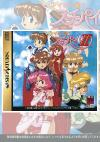

[偶像雀士2](https://sesesega.hatenablog.jp/entry/suchiepai2#%E3%82%A2%E3%82%A4%E3%83%86%E3%83%A0%E3%82%92%E5%85%A8%E7%A8%AE%E9%A1%9E%E5%85%A5%E6%89%8B)

原名：アイドル雀士スーチーパイⅡ机种：SS厂商：JALECO类别：TAB发行年月：1996-04耗时：6

[秘技](http://wiki.pewae.com/doku.php?id=wiki:%E5%81%B6%E5%83%8F%E9%9B%80%E5%A3%AB2#%E7%A7%98%E6%8A%80)
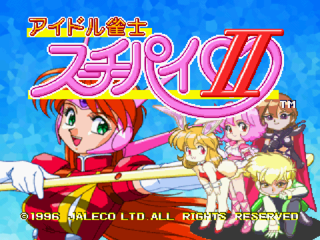
上次[跟平田大哥喝酒](https://pewae.com/2025/03/random_kuso_104.html)之后，我把新目标锁定为SS上的H-Game。
曾几何时，模拟器杂志上把SS列为最难被模拟的机种，而且SS对我来说并不神秘（我摸SS真机比PS多），且《光明力量3》、《光之继承者2》都挺失望的，以至于不玩也没啥念想，所以20年来一直也没上心调试过SS模拟器。
真跑起来之后，发现音频的模拟确实还不太顺畅。
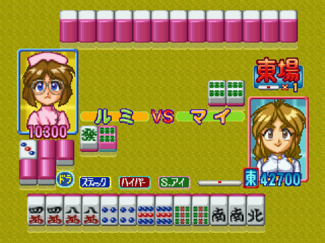

查资料之后，锁定了“偶像雀士”这个系列。这是本系列又一个咬不准译名的游戏——初代在SFC上登场，主标题是“美少女雀士”，副标题是主人公的名字，音译过来是“斯琪派”。进入次世代之后，在3DO上发售了改名之后的一代：偶像雀士——斯琪派；本作是二代，后面还有三代和纪念版之类。麻将游戏这个大分类，类似概念的游戏如过江之鲫，本人采用的这种直译是否有重名之类，完全不清楚，资料太少了。
不过找资料的时候找到一个有趣的冷知识：因为与主角名字的发音接近，所以4月7日被日本纪念日协会定为“偶像雀士日”。

俗话说的好：“麻将不脱衣，等于没脱衣。”
这个系列游戏有个巨大的问题，分删减版和未删减版。差不多的内容，在不同的主机上，或者相同主机不同的发售日，内容也会完全不同。如果有人想像我朋友一样玩纯粹的麻将游戏，一定要找1996年的2CD版。

虽然麻将游戏离开烟雾缭绕的街厅之后，紧张感荡然无存，玩法也都差不多。但本作的剧情模式可玩性还是相当高的。5个主角各有特技，关卡的难度曲线也很顺畅。
后加入的队友要收集获胜点加强能力，能力集满之后拥有变身特效。其中主人公的特技非常有用：点炮的时候消耗一次特殊技，抹除这次点炮；而男人婆的特技则最为惊心动魄——流局前最后一张牌，必然变成海底捞月。
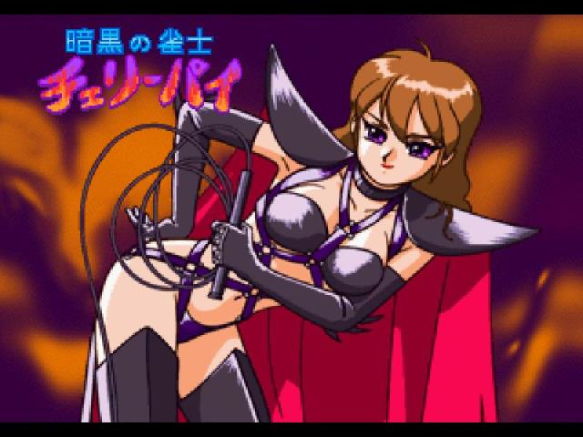

可惜制作组虽然请了知名画家来画立绘，但似乎把更大的成本投入到了声优身上，对话略长，肉戏偏少。
通关之后每个人物有一首专门的主题歌和配套的MV，足见其重点所在。
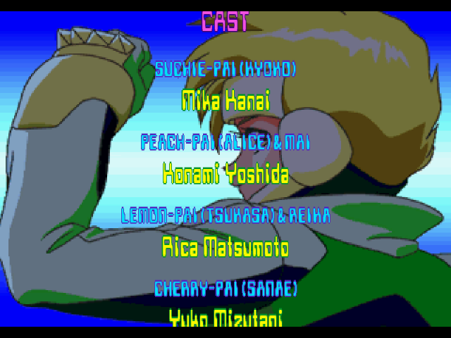

游戏的重点并不是为难玩家，所以设置了非常变态的秘技：剧情模式只要发动特技时同时按下↓+L+R+Y，残余特技数就能增长；同时按下L+X+Z就能直接胡十三不靠。
给小萝莉换衣服的那个模式也有秘技可以用。
标题画面输入秘技也能直接看通关画面。
各取所需，也挺好。
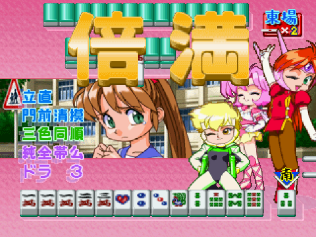

但是吧，小日子的癖好有时真的是难崩——我tm十三幺都整出来了，你就给我奖励这个？
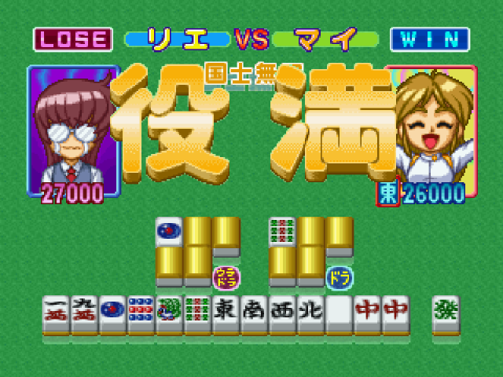
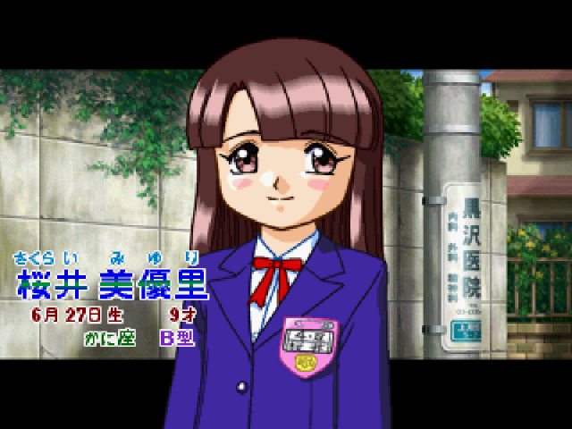

那个年代的游戏，出多CD骗钱是常规操作。本作的第二张CD就是典型的骗钱货。
第二张CD的挑战模式，每打赢一个角色，就能获得给一个9岁小女孩换装的机会，一共15套衣服，除了换装那一下的惊鸿一瞥，捂得严严实实。
真有老色痞愿意为看这个单刷15次吗？
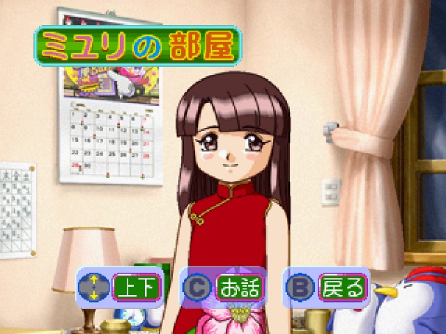

CD2另外的内容就更狗屁不是了——声优的访谈。是的，声优，不是女优。
这帮人最大的61年生，最小的67年，出游戏的时候也都30左右了，这有神马好拍的！
这家伙放进来，老色痞也立刻痿了吧，何苦呢！
活该你JALECO敬陪任天堂六大的末座啊！
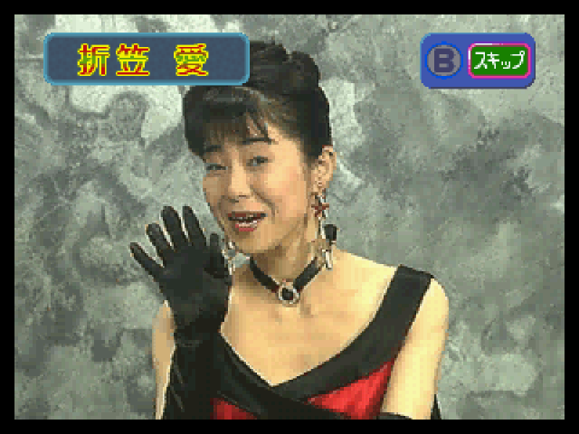

一个小小的麻将游戏竟然也搞起了隐藏模式：5个角色通关以后才能选用主角，进入主角清场模式。用主角再次打通关之后才能迎来真正的结局。
通关！

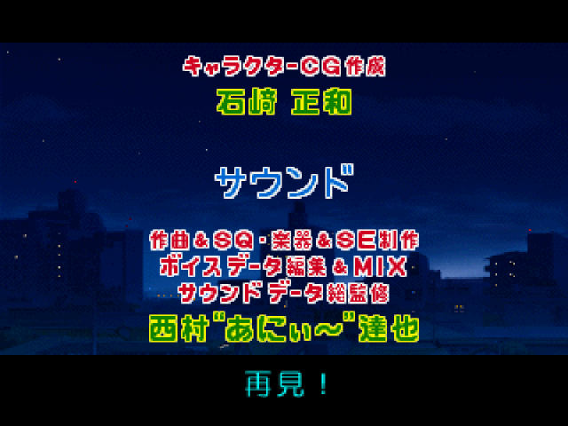