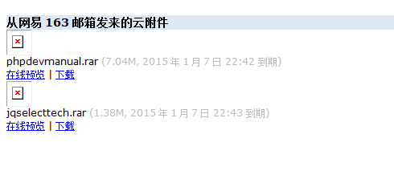

2014年12月26日，星期五。天气晴。

臭宝幼儿园有新年庆祝活动，要求吃过早饭化好妆再去。所以五点半就起床，陪她们娘俩化妆。

因为起来得过早，所以到单位也很早。预想中的早晨应该无所事事才对。
之前提过在P记干了11年，让许多小伙伴大吃一惊。跟另外一个事实相比，这简直不值一提——某个项目我干了6年半。耗走了客户的四个PL和三个PM。实在是厌烦得紧。一有来新项目的机会，就立刻请缨去攻关难题了（组里现有人员都没有做片上经验）。

该交的都交出去了，该接的还没到。本该是无比轻松的一天。实际上工友（好80年代！）们陆续就位前，确实无聊到爆。话说之前一天晚上，升级WP到了4.1，用的那个主题也一并升到了新版本。新版本的Customizr解决了自带js中使用安卓系统浏览时一点击input框就失去焦点的BUG。话说这个bug我可是用了两个晚上的排除法才找到问题点，又用了一个晚上想出了在移动端暂时屏蔽js的办法。并且找了份JQuery教程，打算有空的时候自己慢慢攻克的。这下可好，白忙活了。不过做子主题还真是个不错的习惯——父主题升级改bug，子主题的特性完全不受影响。

对于本人这个不得不放下在公司的上网习惯的老油条来说，找点儿事情做，哪怕是啃一份教程，也是好的。幸好之前的教程直接发公司邮箱了。打开邮箱却傻了眼。你妹的网易，麻痹的云附件！我要能上网还自己给自己发个毛的邮件啊！你tm为了省空间和服务器，搞这种云附件可以，但作为默认项就有点太鸡贼了吧！要不是这两天本人的梯子不大好用，怎么也轮不到用网易邮箱来发邮件的好吧！？

接本胖子的是徒弟小新。属于珍稀物种——会编码的女程序员，也是我的徒弟（[事迹1](https://pewae.com/2013/03/small-new-wearing-high-heels.html)、[事迹2](https://pewae.com/2013/11/female-programmers-play-the-guess-the-word-game.html)）。用光荣的话来说，我们俩属于相性比较合的，所以该交待的早就交待清楚了。只不过上午小新在熟悉系统的时候，在一边站着权当压场子。偏偏某条测试用例无论如何也无法进行下去，一跑就造成基板死机。这下可麻了爪，赶紧让负责基板的小宇和小哲确认修改过的范围。结果这俩人查了10分钟后把责任推给了三个月前本人写的那个模块。被拖下水也没什么捷径可走，一点一点回退重烧打日志，忙活了整个上午加中午，得到的结论是tm从上次纳品之后就不好使！

阿国那边也不消停。顶替阿国的老何对系统完全两眼一抹黑，而阿国是最后一天根本就心不在焉，整天也不见个人——忙着跟各个部门的狐朋狗党告别呢！所以老何那边出现的问题也只能由我这个最熟悉系统的人来解答。虽说我不是私藏的人，但一来老何负责的模块本就不是我交出去的，很多地方只知道原理而不知道实现；二来那边还有个大bug要调查；第三则是每年12月下旬的这个时候都会有一种烦躁的思绪，尤其是不明所以的小丫头们问候：“王哥圣诞快乐新年快乐”的时候（我甚不喜听这句话，有兴趣的可以在4年前的博文里找原因。）心情愈加烦闷之下，火气就逐渐上升。
偏偏给老何讲功能的过程中，发现事先跟阿国约定好的一个接口他忘记实装了。让老何来改也不是，自己操刀也不合适（毕竟我这边都交接完了）……

好在小哲这小伙有点儿狠劲，在我分身乏术的情况下，小伙儿独自调查出了基板那个怪问题的原因——Debug版会出问题而Release版不会。虽然有些啼笑皆非但总算有了个结论，可以暂时放下。老何这边则是老陈豁出了老脸，给阿国打了个电话让他回来站好最后一班岗。

到下午四点半，纷纷扰扰的一天才总算平静了下来。

P.S：很久不写这种日记流水了。很生涩。很不习惯。