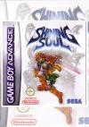

[光明之魂](https://pewae.com/gaan/aHR0cHM6Ly93d3cuZG91YmFuLmNvbS9nYW1lLzI3MDY4MzU3)

原名：シャイニング・ソウル机种：GBA厂商：世嘉类别：A-RPG发行年月：2002-03耗时：60

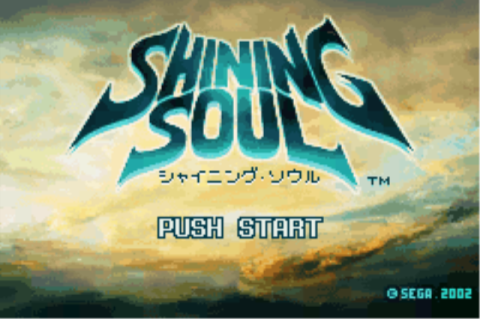
相对我的年代来说，我GBA游戏玩的比较少。因为GBA正式发售没几天，模拟器便有了。然后便是轰轰烈烈的GBA游戏汉化大潮。
那时正值大学期间，时间也多，PC上的游戏也精彩，所以除了热门大作和一些有趣的汉化作品，我并没有在GBA模拟器上投入很多精力。前后无非也就是玩了三款恶魔城，一款火焰纹章，一款机战和几作老任家的招牌。3P哥后来买了真机，我也不是很有兴趣。
直到2004年，工作的我长期开始出差。这才从3P哥那里借来了机器，借以打发漫长的旅途。《光明之魂》正是在04年11月份天津出差的时候接触并打通关的。
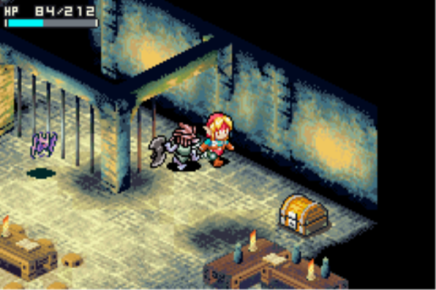

ARPG并不是我的菜。并且光明之魂这部作品，是个半吊子的rougelike游戏——物品掉落是随机的，但关卡和敌人是固定的。好东西的出现非常困难，敌人的行动也弱智。而武器的种类也没有太多，刷一个晚上刷不到有用的装备是很容易沮丧的。当时我大概刷了4、5个晚上刷到了通关，后面的二周目连碰都没碰。
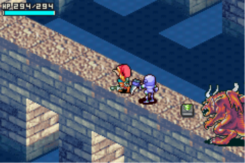
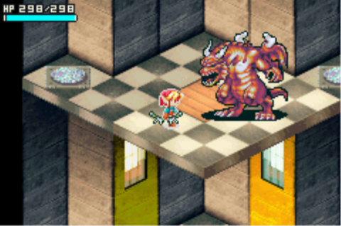

这个游戏违背了我“有女的选女的”的原则。盖因为女法师跑起来实在是太慢了，非常不友好。而弓箭手又好使得有些过分。
这次玩了二周目，除了场景变白了些，普通小怪厉害了些，以及多了一个大杂烩的隐藏关以外，就没啥了。挺失望的。
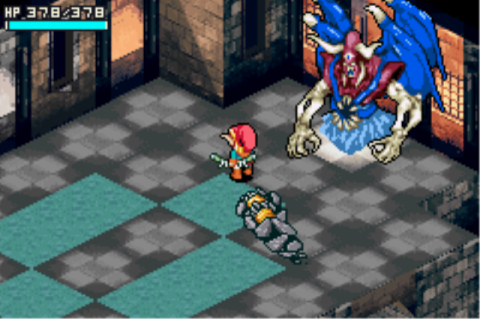

对我来说唯一有些乐趣的收集是“魂”系统。也就是迷宫中偶尔会掉落几种可以使用召唤魔法的物品。在公关过程中收集小怪的灵魂，然后集中来一发。这些魔法的动画也算是充分发挥GBA机能吧。
比较容易得到的火凤凰魂是比较绚丽的。而后一个是“托鲁[[1]](https://pewae.com/2022/12/shinning-soul.html#inner_anchor_1)之魂”，全游戏攻击力最强，但画面也太敷衍了。
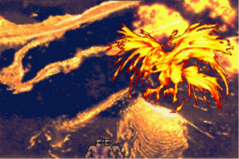
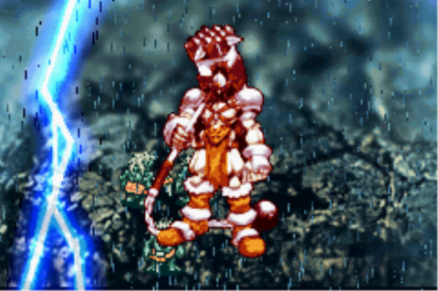

也许是机能受限的原因吧，BOSS们的动作破绽都特别大。通关一点儿也不难。
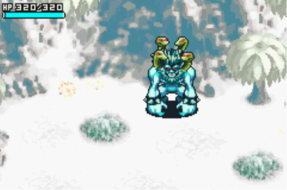
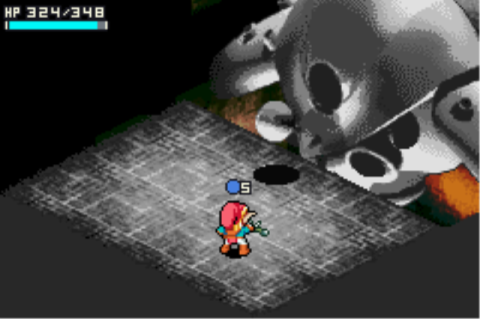
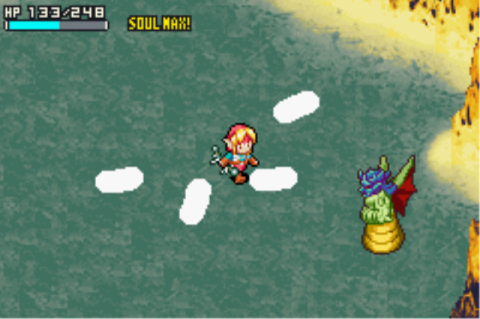
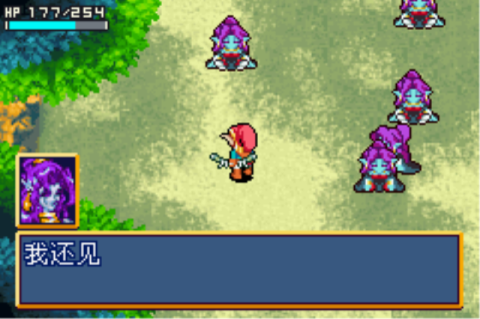
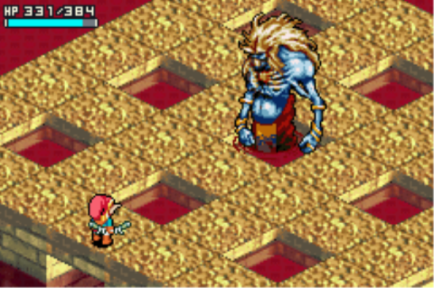
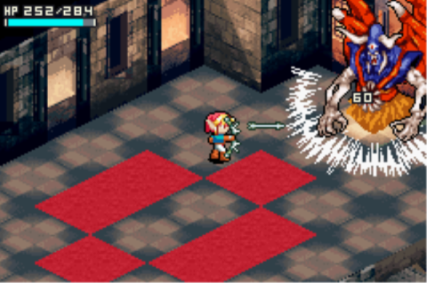
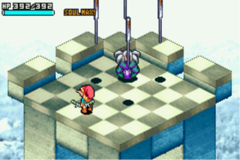

最终BOSS可谓毫无创意，一条黑龙三个脑袋，分别放冰火雷的攻击魔法。
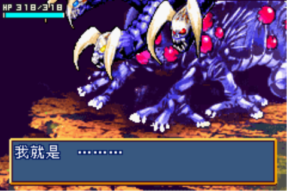
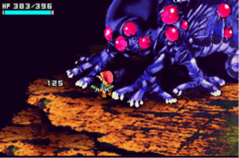

通关！
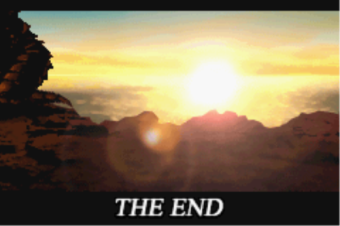

---

- [(1)](https://pewae.com/2022/12/shinning-soul.html#inner_ref_1)：就是雷神托尔呗，当时的汉化组日文水平如何不知道，知识面实在有些狭隘。