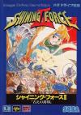

[光明力量2：古老的封印](https://pewae.com/gaan/aHR0cHM6Ly93d3cuZG91YmFuLmNvbS9nYW1lLzI2Mzc3NTg0)

原名：シャイニング・フォースII 古えの封印别名：Shining Force II / 古代的封印 / 光明力量2 / 光明与黑暗4机种：MD厂商：世嘉类别：SLG发行年月：1993-10耗时：120

这又是一款充满了美好回忆的游戏。1995年夏天，受“电软”蛊惑，我去买了盘汉化版的《赌神》回来。自己没玩几天就被死党宝宝借走了。玩着玩着就被他玩丢了。正好我又自己偷着买了MD，他就不知从哪里搞了盘《光明与黑暗4》还我。
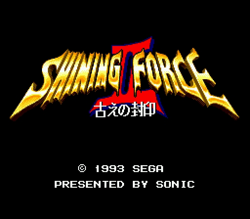

事实上光明系列只有第一作叫做光明与黑暗，至今我也没搞清楚电软怎么给算成了4代。这个系列的命名如今早已有定论，就叫光明系列。而且以高桥兄弟为制作人的光明力量1～3为系列中最正宗的代表作。
单论光明力量2这款游戏，可以算作是世嘉MD游戏的天花板，1994年的世嘉最佳游戏。当年电软推出游戏排行榜，在多榜合并前它是唯二占据榜单的MD游戏的钉子户。最出色的就是它的音乐和画面。尤其作曲家 武内基朗实在是天才，利用现在看来机能非常可怜的性能，竟然模拟出了类似交响乐的效果。长号和圆号的音色非常出色，颇有一番热血沸腾之感。
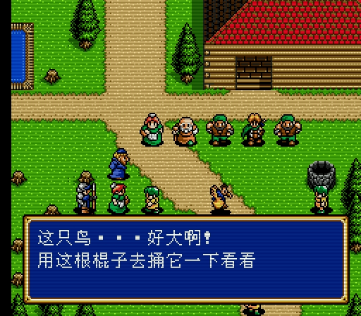

当然也不是所有人都推崇这部作品。我的好朋友3P哥就更加喜欢前作“诸神的遗产”。诸神的遗产在音乐和画面上全面落后，但是，战略性确实比本作要高。本作最大的缺点就是，虽然登场的人物多达30人，但是其中10个是彻底的废柴，毫无锻炼价值。每个人玩的时候上场的队伍都差不多。
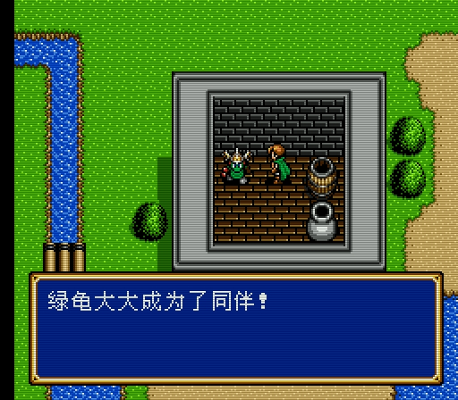
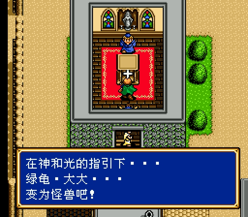

当年玩的时候是有遗憾的。我手上的卡最大的毛病是掉记录。而且最讨厌的是，前面不掉后面掉。本游戏一共44场战斗，我达到39战的时候记录没了。修养了半年重振旗鼓，又在第30仗的时候挂掉了。这下彻底心灰意冷，草率地用选关秘技选了最后一关，白蹭一个结局。
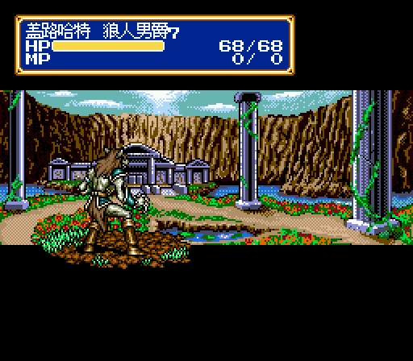

说起秘技就有趣了。当年电软给出了个按住上开机的选关秘技。玩了几次之后发现这个模式不怎么有趣，基本上无法让游戏正常进行（其实是有的），却触类旁通地开发出了按住下开机的选脚本秘技。这个秘技就很好玩了，可以提前招两个女队员进队，能减轻很多前期的压力，又不影响游戏的乐趣。
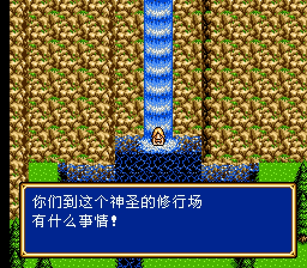

这个游戏是我玩过的SRPG中RPG要素最多的一个。像什么到处翻箱倒柜啊，隐藏物品啊，隐藏人物啊什么的，活脱脱是RPG嘛。尤其想玩好这个游戏必须要练级，这实在太RPG了。
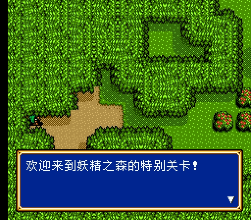
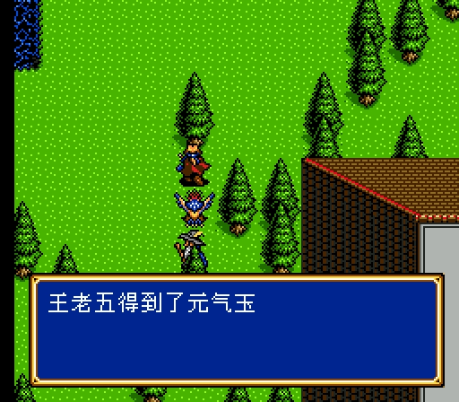

后来模拟器兴起，自然是想第一时间弥补遗憾。可惜一不小心改大发了，BOSS以外一刀一个，BOSS三刀一个。简直兴味索然。
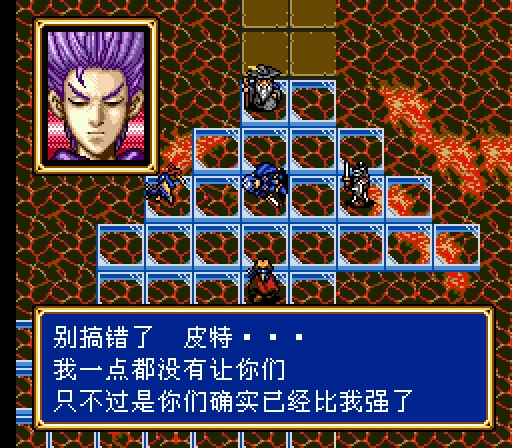
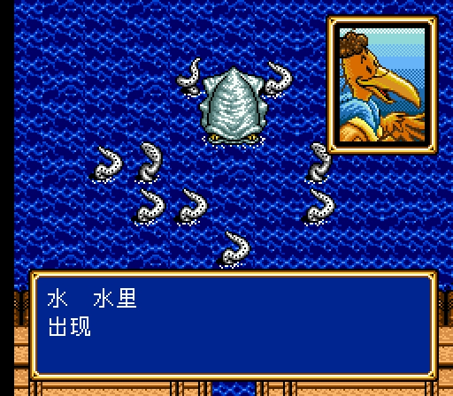
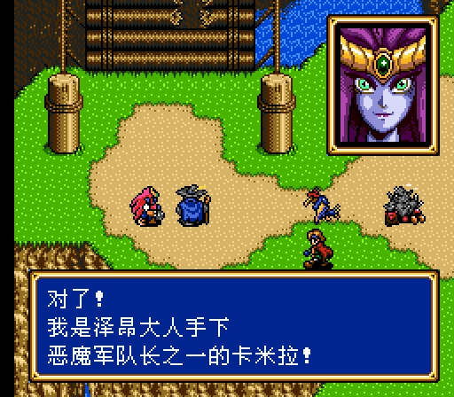
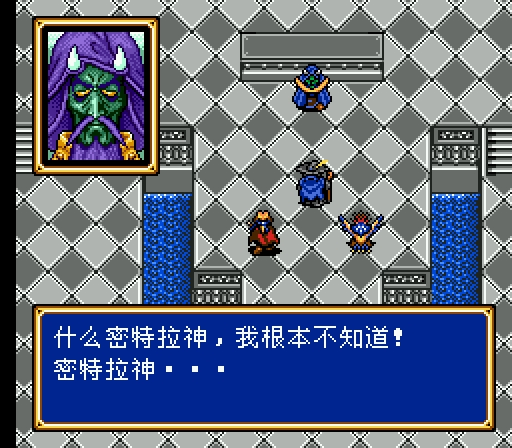

而上面的秘技也没法用了，真就别扭。
幸运的是，这次重温查找资料的时候，被我发现了上开机和下开机真正的秘密：本游戏有个debug开关，以前盗版卡这个开关是打开的，所以可以直接上来用；而正版卡需要用秘技才能开启。
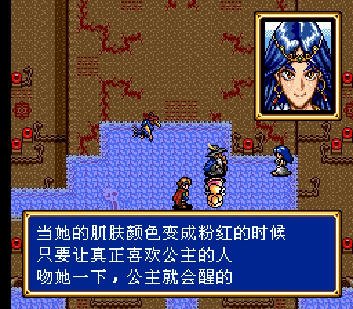
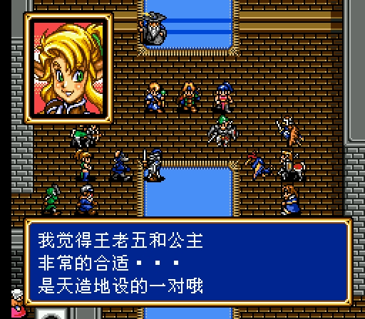
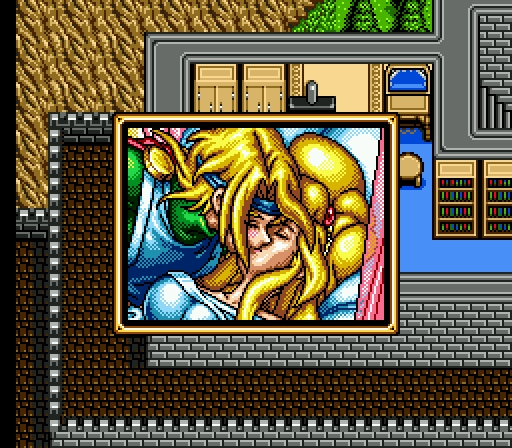
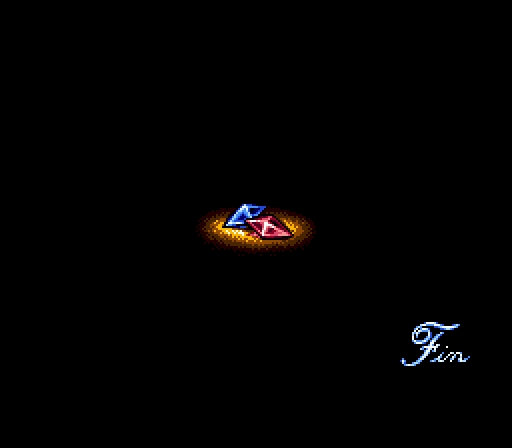

这次终于自己打到了结局，很高兴。最终的BOSS其实挺怂的，因为它根本不会动地方。凑齐家伙一顿集火就行了，还不如他手下的魔法师难打。
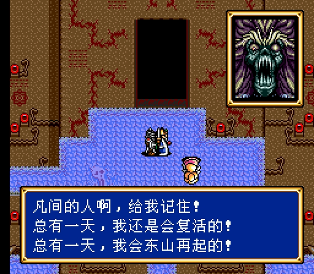
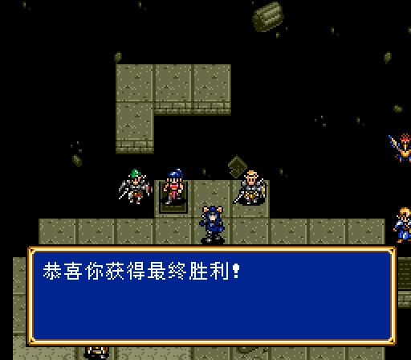