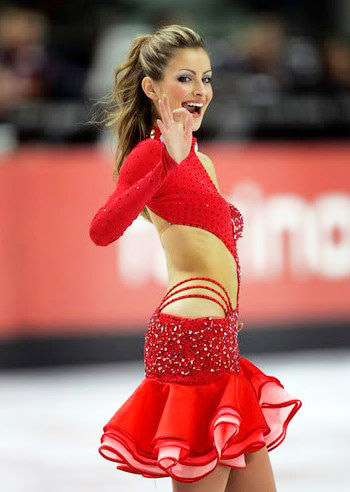

这是本系列的最后一篇。

家里没买彩电前，对于体育节目的记忆是极少的。
横竖也就一个[88年奥运会本约翰逊](https://pewae.com/2008/09/the-olympics-for-my-13-instant.html)喝药的事记忆比较深。
再就是本地姓焦的焦岩峰老湿主持的《体育大观》栏目，每周四晚8点大约40分钟的时间，持续了好多年。那个时候只有四个台，也不知道别的地方台是不是有这么早的体育专题节目。焦老师的节目品味还不错，连很多马术啊皮划艇啊之类的生僻项目的消息也有，也不知道是不是因为这类项目推广得不好片源不花钱。我妈当时特别讨厌焦老师，因为这个节目会耽误她少看一集琼瑶。
CCAV1套也有一个体育节目，好像就叫《体育世界》吧，但播出时间是在每周三也不是周四的白天，除了假期根本看不到。

## 排球

为毛把排球排在第一呢？时间顺序。
89年秋天家里买彩电之后，第一个赶上的比赛应该是90年的四国女排邀请赛，以及后面的世锦赛世界杯。
我爸这几代人身上，有很重的女排情节。奶奶家生活水平一般，但是大姑父在79年的时候因为看不惯大娘娘家的嚣张气焰，赌气式地给买了一台黑白电视，所以奶奶一家人看电视的历史非常非常久远。我爸可是追过“小鹿纯子”的番的人（虽然那时他都30了），而且八十年代前中期女排成绩好，自然吸粉无数。时至今日，AV5已经无法引起我关注了，可老爷子看到女排大奖赛和国内女排联赛之类的，哪怕是头一天的录像，也会看完。
彼时的女排，主教练胡进被骂得特别惨，其实那时候再怎么不济，好歹也是世界前四的水平。当时的主力队员有李国君、许新、李月明、赖亚文、巫丹、苏慧娟什么的。现在的报道总说孙玥是郎平的接班人，如何如何憋屈之类的，这是不对的，李国君才是正牌接班人，比孙玥混得还憋屈。孙玥好歹在当时世界排坛还在前十范围之内，李国君的那个扣球成功率才叫感人，白瞎了当时世界顶尖的俩副攻了。
那时候印象最深的是苏联毛妹的大长腿和古巴妹子的翘屁股。古巴的路易斯和贝尔非常恐怖，古巴人似乎只要一传能接上，然后二传中规中矩地把球推到四号位，“哐”地一下球就砸下来了，要么得分要么出界，根本不给拦网和救球的机会。相比之下李国君就是个矮胖子，李月明和赖亚文虽然也是高个大长腿，但脸也很长啊，而且俩人都习惯性猫着腰，姿态上输了太多。
当时韩国队是地地道道的鱼腩，不过队里有个很有趣的名字：朴美姬。
中国队则只能靠副攻小快灵的背飞背溜短平快的技巧零敲碎打地得分，主攻短小无力只能靠造打手出界得分，记得有一个什么比赛还把30“高龄”的郎平请回来了——主教练胡进是她老搭档张蓉芳的老公，郎平本人也已经当过女排主教练，相当尴尬。
当时只知道四国赛是邀请赛，而不太能分得清世界杯和世锦赛的性质。其实到现在也没心思了解排球另两大赛事的区别。
再往后是孙玥、两个咏梅、王怡、殷茵、李艳、何琦、王丽娜们。好像是95也不是96年，女排也学男足搞起了职业联赛，CCAV也下大力气直播，所以孙玥那波人的曝光率是挺高的，那波人里我比较喜欢矮个子主攻李艳，跳起来的时候气势非常猛。
但是上高中之后看比赛的时间也少，而足球联赛更火，关注点就不在这个缺乏身体对抗的项目上了。回家如果遇到老爸看女排，就陪着一起看看，平时绝对不会主动看女排。女排情节什么的对我来说是不存在的。再往后那波，比较佩服主教练陈忠和。记得我上大学的时候，02年，女排因为出线后故意输球躲俄罗斯而被意大利队为首的一批对手好一顿Diss，国内也是沸反盈天。要是一般的教练就算不辞职也很难走出来，陈忠和却挺过来了。他要是没坚持住，雅典就不会有那块金牌了。
电视时代女排奥运会的表现大家都知道，就不提了。

男排一直是姥姥不亲舅舅不爱的状态。AV5刚开始转男排联赛的时候，还看过几眼。张翔安家杰卢卫中王贺兵什么的，也算混个脸熟。但中国男排跟国际男排根本就不是一个量级的，看男排联赛里有来有往的，国际男排比赛却80%的时候都是一拍两瞪眼，一扣就死强调力量。

## 足球

看足球的事儿以前说过不少回了，这次汇总一下。
90年开始，世界杯就没落下。
06年以前的世界杯，回忆在[这里](https://pewae.com/2006/05/my-world-cups.html)
06、10都没少看，博客里差不多都记下了。
14孩子小，但是前半段盒子有回看功能，看了好多昏昏欲睡的比赛。后半段最耿耿于怀的是淘汰赛荷兰跟哥斯达黎加打到点球，那天便宜小姨子婚礼，天亮了我不情不愿地跑去帮忙没看上直播，百年不遇的世界杯荷兰点球赢球啊！
18这届孩子大了点儿，真没少看，差不多30场。但是现在足球都是讲整体踢法，不带劲，可能会看得越来越少吧。

欧洲杯看得晚，第一次是96年。
其实我早已想不起来我们中考的具体时间了，去年同事们聊天，强行回忆了一波。我只记得中考第二天考数学，哈喇子同学睡眼惺忪地说他半夜起来看了个意大利输捷克，大凶之兆，肯定考不好。于是上网搜索了那场比赛的时间：1996年6月14日（英国时间），于是逆推出我们高考是在96年的6月14、15两天。96年暑假大连体育转ESPN的信号，我几乎把所有场次都重看了不止一遍。
2000年欧洲杯正是好时候，大一下半学期。寝室从外面花160块买了个不知几手的电视，加上偷了电，大夏天的凌晨起来一个人蒙着被子，基本上荷兰和意大利的比赛都没落下。那届比赛确实群星璀璨，也踢得好看。
04欧洲杯在南京出差，一开始为了省钱，跑去南农大住读研的哈喇子的宿舍；后来觉得每趟坐车一个小时实在太耽误事儿，而且欧洲杯开打了，于是就近在客户现场旁边找宾馆住。客户的位置在南京的鼓楼边上，南大墙外，宾馆都不便宜。一开始找了一个条件不错的，朝阳大窗，每天140。住进去的第一个晚上，开电视发现全是雪花，没有AV5，勃然大怒——这让我错过了法国逆转英格兰的比赛。第二天就换了另外一家价钱一样北向且更小房间的。看房间的时候别的都没管，第一时间要求把电视打开确定能收到AV5。后面的比赛看得很爽，因为客户是政府部门，上班晚午休长下班早，而且我在机房坐着有冷气吹还可以打盹。晚饭也不吃，去超市买一堆啤酒零食，眯到12点就爬起来看比赛。什么瑞典5-0保加利亚啊，瑞典2-2丹麦默契球啊，荷兰德国、克罗地亚法国这些精彩一场比赛都没落下。值得一书的是小组赛荷兰打捷克那场，哈喇子特地来宾馆找我蹭球看。晚上喝了点之后都有点儿困，自信都是老看球的了，靠生物钟就能爬起来，就互道晚安躺下了，结果一睁眼快四点半了，荷兰的进球一个没看到，只看到捷克最后巴罗什的反超和斯米切尔的绝杀，痛上加痛。
08年陪老婆在老丈人家守孝，家里就一台电视在老丈人屋里。我就算半夜起来也不好意思过去看啊。只能用笔记本看网上直播，时有时无的，看着也不爽快，只看了不到10场，连决赛都没看成。
12、16两届博客上都有体现，不再赘述。

美洲杯就讨厌了，白天打。
95年美洲杯是初二暑假，是看得最多的一届。后面就没怎么关注过。

五大联赛里，最早接触的当然是[意甲](https://pewae.com/2015/01/yearn-of-mr-zhanghuide-and-italy-serial-a-of-90s.html%0A%0A)。
但看的最多的，其实是德甲，其次是英超。初高中周六的晚上，我爸妈是不管我看电视的。正好看黄健翔李维淼搭档解说的德甲。96-99年，拜仁很强，而打法吸引眼球的斯图加特转的比赛也很多。一般不是拜仁或者斯图加特我就换广东台看英超，然后不是曼联或切尔西就再换AV8看《伪装者》。说起来广东台那时真的很喜欢转切尔西。
从上大学之后，就不怎么看五大联赛了。结婚前，周末大好的时光，不打游戏可还行。结婚后不看孩子那也是不成的。
所以转播开始的晚的西甲，对我来说形同陌路。甚至当年罗纳尔多在巴萨大杀四方的时候，我都还在潜意识里觉得西甲是要弱一档的比赛。
现在的小孩们，把我这种两年看一次球的叫伪球迷，其实我心里还蛮赞同的。

欧冠第一次看的也比较晚。那是97年的决赛前一天放学，队长跟汤球球打赌谁会赢，我也参了一腿，押下狗多特。第二天凌晨，我第一次跑出房间跑到客厅开电视，偷看欧冠直播。等到分出胜负，再把电视关上，回房间小憩一会儿。所以我特别讨厌欧冠比赛打加时罚点球，那样的话我往往起个大早还看不到结果（天大亮的时候我妈就醒了）。
这么多年的欧冠决赛，对我来说都像春晚似的，充满仪式感。只落下了两场。第一次是08年客观条件不允许，第二次是10年改成周日记错了时间。
印象最深的还是05年的伊斯坦布尔之夜。真是越看越兴奋，本来结束的就晚，然后不得不冲个澡冷静一下，结果上班迟到了。
小组赛看的就不多了。半夜起来总觉得不值。
反正现在没有世界杯和欧洲杯的年景里，一年就这一场球，也熬得起。

甲A联赛差不多是伴随了整个青春的记忆。大连队那时所向披靡，本地台自然是场场不落。然后除了AV5，辽宁台会转辽宁跟沈阳的球，广东、山东、四川也都有卫视直播可以看，可以说那时每个周日的下午就一直在看球，最少两场。
最激动人心的一场球是在96年高一刚入学军训的时候，本身就是军训最后一天了，从早上开始就下雨，淅淅沥沥个不停。于是带队老师决定放假。下午三点半，三个班的男生和大部分女生都跑到了部队的俱乐部，跟战士们一起看了大连万达水战延边的比赛。那场比赛斯文森先头球进了一个，后来老将孙伟替补上场梅开二度。比赛赢了气氛很热烈，直接转场吃最后的告别大餐了。
没有比较就没有伤害，我们年级的另外五个班在另外的部队军训，变态的中年妇女教导主任要求下雨天也要坚持训练，在走廊里走了一整天的分列式……
王健林宣布退出足坛的场景还历历在目，今年又宣布万达回归，是不是太拿我们的记性当回事儿了？
对大连队的关注一直持续到大学及工作后。后期徐明的实德折腾得实在太不像话了，降级之后，就没关注过大连足球了。因为始终[不支持阿尔滨](https://pewae.com/2012/03/dalian-derby.html)，所以现在的一方也很难获得我的好感。
家乡有球队，就很难对别的球队产生关注了。所以差不多也有10年没看国内联赛了。

对国足就俩字，爱过。
那会儿真是什么亚洲杯、亚运会、世界杯外围赛的，场场不落。
包括青年队的比赛。犹记孙继海王鹏的那只77年出生打亚青赛的队伍里，有个叫徐亮的。而后来81那批国奥里，又出现了徐亮，也就是后来国内足坛的那个任意球专家。一直不知道这俩是不是同一个人。如果是的话，那这年龄改得也太明目张胆了吧！
96年亚洲杯小组赛被相马直树羞辱的时候，我就产生了动摇。04年5月上海出差，安琦打马来西亚的失误差点把我吓死，心说这帮球员都没脑子的吗。
转到冬天，1117，我在天津塘沽出差。住的宾馆里只有私接的卫星，并没有AV5。我找了个有电视的小饭店要了俩菜四瓶酒，谁知欣赏了一场7：0的闹剧。
我悟了——依着中国这帮足球人的智商，这辈子没指望了。
从那以后，14年了，没再看过国字号男足的任何一场比赛。

女足看得很早。91年的首届女足世界杯，央视是全程直播的，中国作为东道主花了好大的力气，弄了个第五，挺灰头土脸的。
女足比赛跟男足相比，还是缺乏对抗性，所以只在没别的看的时候才会看。印象最深的要数00-10年间巴西的马塔和克里斯蒂安妮，完全男子化的技术，非常厉害。

## 游泳

最早看的游泳比赛，是90年亚运会。女子项目五朵金花全面控场，男子项目沈坚强一枝独秀。
92年巴塞罗那，中国女子游泳成绩特别好，所以假期里反复地重播，被洗脑了。然后五朵金花非常神秘地93年比完全运会全退役了一个不剩。
说起五朵金花，其实并不是五个人，自由泳的庄泳、自仰杨文意、混蛙林莉、蝶泳钱红这四个没什么争议，第五个有时候指蝶泳二号选手王晓红，有时候指兼项王黄晓敏（林莉的自由泳不太行）。黄晓敏其实是第一个为中国获得奥运会奖牌的人。后来黄晓敏信了法X功，公开作妖，媒体上就不提这人了，五朵金花的最后一朵才固定成王晓红。
后面是94年罗马世锦赛，国内直播了。当时的中国女队震惊世界，简直是上了天了，16个项目，中国有15个拿到前三，12块金牌，乐靖宜4个项目4块金牌4个世界纪录。当时我在大姨家，看得头发都要竖起来了，这样下去，扫平亚特兰大根本就不是梦啊。
紧接着广岛亚运会就有意思了。转播的时候轰轰烈烈，女队在世界上都称霸了，还在乎一个小小的亚洲？连男队都雄起了，跟日本队拼得有声有色。等比赛结束，中国女队因为兴奋剂被剥夺了16枚金牌。女队四人禁赛，男队三人禁赛。现在回想，应该是在罗马的吃相太难看，被美国老大盯上了。而且当时因为台湾阿扁的问题，中日关系紧张，日本特意在酒店安了针孔摄像头，中国队员在酒店针头乱扔都被拍下来了，药检后说是误服都没人信。在广岛，中国队头号大将乐靖宜比50自的时候“以为有人抢跳所以没有往前游（钻旁边泳道里了）”，被取消资格。后来被日本人抓住说是取消资格的就可以不用药检，大做文章。这事儿细思极恐，要是乐靖宜真的明哲保身的话，游泳队内斗也够可以的了。
96年亚特兰大奥运会，央视转播前可能是自信广岛的盖子被捂住了，女子4×100米自由泳接力前信誓旦旦，说我们4个队员100米成绩加起来比美国队4个加起来块3秒，所以这块金牌手拿把掐。结果除了乐靖宜，另三个都颓得厉害。后来不久年芸单莺就相继出事儿了，没剥夺这枚银牌只能算当时手段不行。
2000年前的中国游泳界就是个笑话，今天得冠军，明天就被查禁药。连现在的奥运会回顾片里，都很少提96年乐靖宜那块金牌。当然世界泳坛也从来没干净过，强如索普也差点被抓，什么德布鲁因、范戴肯、罗切特，没被质疑过兴奋剂问题，都不好意思叫名将。所以叶诗文也好，孙杨也罢，被外国佬质疑太正常了，替前辈还债呗。
但我还是喜欢看游泳比赛。07年在上海出差，有一阵下班说啥也要赶回住处，赶着看游泳世锦赛。
一直为北京奥运会为了屈就老外而把游泳比赛时间改在上午耿耿于怀。

## 赛车

90年代初，辽台有个引进的体育专题节目，叫《万宝路体育世界》。顾名思义，这个节目是万宝路赞助的。当时万宝路赞助的最大的体育项目就是F1，解说用的粤语译名。“万宝路麦拿伦车队的冼拿和保鲁斯”念起来特别带感。好多年之后我才知道，麦拿伦=麦克拉伦；冼拿=赛纳；保鲁斯=普罗斯特。
后来赛纳死了，烟草广告也被全球禁止了，节目的赞助商也变成了吉列，但还是有大量的赛车消息。

从AV5成立的那一天起，就有个节目叫《赛车世界》。每个周末都有，后来有F1的比赛还会直播。跟甲A没冲突的时候，就看F1。早两年是因为舒马赫而支持贝纳通车队，后来舒马赫走了，来了意大利人费斯切拉，常年在第六名左右晃荡。其实贝纳通的技术并不怎么强大。喜欢他们完全是因为七星的配色好看。
看F1直播其实挺无聊的，有的时候整场比赛也看不到个超车。所以很喜欢看水战出事故——两个多小时总得找点乐子吧。
沙桐的主持水平也就那样，全靠身边的专家撑场子。

上完大学回来，就不怎么看F1了，毕竟需要的时间太长。尤其有了上赛道之后，仿佛B格一下降下来了，就只在新闻里看个积分榜拉倒。
结婚以后就更不关心F1了，差不多每年会想起来关注一次舒马赫的生死吧。

倒是《赛车世界》里世界拉力锦标赛和达喀尔的内容比较吸引人，我觉得汽车掠过带起一篇沙尘或泥浆的样子特别带感。但也仅限于感兴趣。只认识一个勒布。后来《赛车世界》又改名又改播出时间的，赶不上就不看了。

## 乒乓球

41，42届世乒赛稍微有点印象。记住一个名字很有时代特征的马文革。
第一场印象深刻的乒乓球比赛是92年奥运会的男双决赛，吕林王涛真是拼了老命，苦战之后拿下了德国对手。那场比赛是北京时间的下午开始的，耗时特别长，到后面看得越来越精神。
女子就一直那么厉害，尤其是一直气势胸胸的邓亚萍。我当时总是阴谋论，觉得萨马兰奇总给邓亚萍颁奖，这色老头一定是个匈奴。

94年广岛亚运会，邓亚萍输给了“叛国者”小山智丽，引起轩然大波。
我觉得当时至少有两拨人是偷着笑的，第一是被瑞典压得抬不起头的男队，第二是闹出兴奋剂丑闻的游泳队。

男子乒乓球重回霸主地位靠的是95年天津世乒赛。比赛正好是五一放假期间开始的，蔡振华各种机关算尽，在决赛出秘密武器丁松赢回了斯韦斯林杯，从那以后男乒才和女乒一样重回到傲视天下的巅峰。

也就是从那个时候开始，AV5逐渐走上“乒乓球台”的邪路。
96年初好像是，CCTV搞了个乒乓球擂台赛，男女各五个老将五个新秀，打循环赛，每周直播。
从那以后，一发而不可收拾，世锦赛世界杯播，大奖赛播，公开赛播，联赛播，最后奥运会队内选拔赛也要播，本来就不怎么喜欢这个勾心斗角为主的项目，被喂得跟AV5离心离德。本来0708年的时候看电视就很少了，一看播乒乓球干脆就关掉电视拉倒。

专门解说乒乓球的蔡猛也是个主囊，天天这么旋那么旋的，头头是道，有一次王涛当嘉宾，连着纠正了他三次，说他看错旋转了。

我连单项世锦赛跟团体世锦赛什么时候分开比的都不知道。

## 田径

我们小时候的运动会都是田径运动会，加个拔河，不像现在，全是趣味运动会了。
所以对田径的了解很早。其实田径比赛非常简单粗暴，我就是比你快，就是比你远，有种原始的魅力。
但是中国田径93年以前成绩根本就不行，转播也少，所以关注的也比较晚，或者说，从来没关注过。
犹记那是93年暑假，某天CCAV2一反常态不播东方时空了，而是改放头一天的田径世锦赛录像，才知道中国女子中场跑在德国放卫星了。那几天回放最多的其实是曲云霞的3000米，毕竟是包揽了金银。报道的时候，曲云霞的名字也总在王军霞的前面，直到后来王军霞创造了石破天惊的世界纪录，名字才反过来。
跟马家军一起获得金牌的铅球冠军黄志红才是更值得铭记的人物。她是亚洲第一个获得田径世锦赛冠军的人。该胖子性格非常开朗，晚20年上综艺节目绝对没问题。记得有个访谈，她给记者讲了个笑话：“我去饭店点餐，不会英语啊，就跟旁边桌学。一拍桌子：‘他妈的就是！’，然后服务生给上了一瓶番茄汁（tomato juice）。”
90年代最受瞩目的田径明星是美国的“阿甘”迈克尔·约翰逊，200米和400米称霸天下。有一次电视台和赞助商还搞了个噱头，安排约翰逊和100米冠军贝利比一场150米，以证明谁是世界上跑得最快的男人，全球直播。德雷克斯勒、杰西乔伊娜等一干明星垫场。结果比的时候约翰逊跑到一半就落后，随后一捂大腿一声大喊，伤了。这是我看比赛以来第二次经历“裤子都脱了就给我看这个”事件。
再往后的明星就是有小虎牙的马里昂·琼斯。简直没有她不行的，后来果然是禁药了。
田径比赛，场地太大，田赛和径赛穿插进行，实在不是什么欣赏性强的好比赛。激动人心的，无非短跑、接力等几个项目而已。
田径百米飞人简直没法看，什么刘易斯克里斯蒂格林钱伯斯加特林盖伊鲍威尔辛普森蒙哥马利，在博尔特出世前，就没一个干净的。
接力倒是让人血脉偾张，我就喜欢看人掉棒。
另外比较关注的项目是女子三级跳和女子撑杆跳。因为这两个项目的运动员都是身材颀长大长腿，养眼。跟投掷项目一比，美滋滋……
田径世锦赛看得不多，因为太过冗长。黄金（钻石）联赛没事的时候倒是看一下，刺激啊！

竞走是我最不喜欢的田径项目，这玩意儿太拧巴了——又要快又不能双脚同时离地，你咋不比爬呢？而且所有人都在偷着犯规，慢动作一看没一个规矩的，这还比个什么意思嘛。

## 体操

体操是观赏性非常高的项目，任何时候换台，看到有体操，就不会换走了。
体操比赛是从90年亚运会的时候开始看的。那时候男队还没从李宁的溃败中走出来，李家军刚开始崭露头脚；而女队丢了传统项目平衡木的金牌，以及确定了自己的传统弱项跳马。90亚运会体操的女子全能冠军叫陈翠婷，故事还上了好孩子画报。
体操运动员衰老得太快，女队员往往只能比一届奥运会两届世锦赛，常年下来，记不住几张脸。男队员稍好一点，也鲜见能比三届的。所以16年奥运会上看到丘索维金娜出场的时候，不得不致向她以最大的敬意。听说今年的亚运会她还参赛了，而且得了银牌，实在是个奇迹。
看体操比赛不能听解说。尤其是女队比赛的时候，十次有八次都在抱怨裁判不公。也不看看女队选的那些小萝卜头，就算没改年龄，跟东欧的那边小白腿一比，观赏性也差了好多吧！再说你那万年不变的西红柿炒蛋队服，换我是裁判我也不给印象分。
没觉得霍尔金娜多好看，一直觉得她长得像个小母鸡。
女子体操喜欢看罗马尼亚，美女最多。男子最爱看的项目当然是单杠，惊险刺激，摔下来太有趣了。
有个不好的现象，随着时代的变迁，全能冠军变得越来越不全能了。2000年的杨威大战涅莫夫，杨威的吊环就明显是瘸腿的。后来的内村称霸多年，鞍马也在水准之下。

## 棋牌类

没有AV5的时候，AV台就有棋牌节目了。
最早是个教人打桥牌的，平时不显眼，一到假期的下午就出来刷存在感，非常可恨。桥牌这东西太高大上了，至少在我周围是没人喜欢玩的，至于AV台非要力排众议上个桥牌节目的原因，呵呵，跟现在大老板们砸钱搞足球差不多。
八十年代末聂卫平被捧到民族英雄的高度，随之而来的是一项叫“XX杯电视快棋赛”的围棋比赛。AV应该是仿照日本电视台办的这个比赛，所以也按照日本的方式直播。围棋这种精于算计的项目我是一向不太喜欢的，连稍微高阶一点的规则我都不懂。但这并不能阻止我在电视上看人说棋。讲棋比较多的是华以刚老师和徐莹老师，总是对各类名词不明觉厉——不就是下一个子嘛，又飞又尖又挂又断的，你们是不是在蒙外行啊！当然很多时候是没别的节目可看。九十年代初中国最厉害的棋手其实是马晓春，但马晓春讲棋没意思，特黏糊。
后来邓爷爷逐渐不天天上新闻联播了，AV5也成立了。当然少不了凑时间的棋牌节目。最开始的时候AV5节目少，棋牌节目周末也演。这时候讲象棋，我就能看懂了。也是一男一女，讲什么胡荣华吕钦许银川的，仍旧看不太懂，看来是真不适合这些玩脑子的游戏。
谢军拿了几个冠军，国际象棋有时候也讲。一般喜欢看诸宸讲棋，人漂亮嘛。而且可能国际象棋懂的人相对较少，所以讲的比较浅，倒比象棋好看。
99年还是2000年，有个叫那威的死胖子开了个栏目讲五子连珠。顿时茅塞顿开，我总算知道自己为啥总是禁手输给电脑了。后来那威竟然变身成了个喜剧演员，实在不知该说啥才好。

## 台球

AV台播斯诺克可早了，从92也不是93年就开始了。
那时候有个什么杯斯诺克邀请赛，英国的各路名将，什么希金斯亨德利的都来过。当时庞卫国就已经以全国冠军的身份出战了。因为那还是四个台的年代，7点钟不看新闻联播怎么都行，所以不仅是守着AV2看台球，而且是全家一起看。
07年出差，跟小松和韩博士一起看丁俊晖，韩博士忽然说：“我怎么觉得这个解说嘉宾球路比小丁整得还明白呢？”
我心说，那可是庞卫国啊。

大连体育台诞生在甲A最火的年代，除了播球和简陋的体育新闻，就靠播引进的ESPN节目度日。其中有个阶段，晚上6、7点钟演女子九球。有个特别厉害的长相酷似梅格瑞恩的费舍尔，有个韩裔的黑寡妇Jennet李，还有个台湾的Jennifer陈，都比潘晓婷早多了。
这个节目对我也有帮助。我终于知道玩红白机上的台球该怎么得高分了。记得有次决赛费舍尔得了冠军，照惯例要做一个花式表演，她翻了半天书，然后一竿子把白球戳出球台，正中主持人要害。

## 篮球

对篮球感兴趣产生的算比较晚，开蒙是靠[94年的总决赛](https://pewae.com/2007/11/exciting-nba-finals-1994.html)。

随后的暑假，世锦赛。本来是冲着梦二队去的，可中国队却深深吸引了我。尤其是打巴西那场，真是看得人兽血沸腾。最后时刻中国队落后两分，郑武突破上篮得手，加时。加时赛老胡连得十分。后来又赢了西班牙，黄金一代实现了男篮历史性的突破。

从那以后，逐渐对篮球关注起来。
众所周知，94-95的常规赛是没乔丹的。所以看报纸上三天两头说乔丹要回来了。
尤其95年乔丹回来了之后，公牛还是被魔术淘汰了，就没觉得怎样，一个人再厉害又能如何啊？
然后脸就被打肿了。

初高中时期AV5一个礼拜只播一场，而且一周只休一天实在不愿意早起（头一天看德甲了嘛），所以NBA更多看的是大连体育的ESPN录播。最受追捧的当然是公牛，然后超音速、爵士、火箭、魔术和有小鲜肉希尔的活塞比赛转得都不少。我就是那时候受ESPN和《当代体育》的蛊惑，稀里糊涂地就成了希尔和活塞的球迷。
我这代人，好多都宣称自己是看了灌篮高手而成为篮球迷的，反正我不是。在看灌篮高手之前，我看了全套的《篮球飞人》漫画；在看《篮球飞人》之前，我已经天天守着大连体育看NBA了。
对NBA的比赛，一直是有它挺好没它也行的态度，完全没有看足球比赛那样错过一场关键比赛都扼腕叹息的那种感觉。尤其是大好的礼拜六礼拜天上午，多睡一会儿不好吗。
07年在上海出差的时候，跟Jack一块租房子住的时候，产生了很大的矛盾。其中很重要的一点就是，他把老婆孩子接过去了（房租当然是公司出）。我晚上要看体育新闻的时候，他儿子要看动画片；我早上要看NBA的时候，他儿子要看“家有儿女”；等我不想看了，他来喊我“大致，出来看姚明”。我看个鸡毛的姚明，根本不喜欢他那种打法好伐。
后来自己住，搞了个黑机顶盒，其中重要目的之一是能收到五星体育，五星体育平日晚上有一场NBA放。只要不播姚明易建联，我是来者不拒。正好晚饭时间，手还空不出来打游戏。
有孩子之后就不得不早起了，一开始尝试抱着孩子看NBA。可臭宝害怕黑人，坚决不让看。现在孩子大了，有线也早撤了，熟悉的球星早就退得半个也不剩，只在纸面上关心一下活塞队的消息罢了。

我们这批人可能是CBA的第一批观众。当时篮协看甲A搞得好，有样学样上马了CBA。而且很怂包地把比赛时间定在冬天没有甲A的时候。辽宁那时叫猎人队，队徽绝对是经过精心设计的，很酷。AV5有专门的篮球报道节目，每个周日也转球，当然辽宁台每场比赛都会转。八一队连霸多年，辽宁队万年老二。那时候没觉得王治郅有多厉害，不过是年轻罢了。再往后上了高中，没怎么看CBA了。因为辽宁队李晓勇岁数大了之后，打不出快攻，辽宁的比赛老牛破车一样难看。

然后还有CUBA，WCBA，我总觉得水平不行，没太关注过。

## 网球

跟别的项目不太一样，网球入门不是靠比赛，而是得感谢信赖飘柔的张德培先生。
张老先生那么信赖飘柔，那报纸上有消息就关注一下呗，进而发现阿加西好帅啊，转迷阿加西。
看大连体育台久了，不太喜欢底线磨洋工的打法，所以对澳大利亚的拉夫特好感度比较高。
在说回张德培，出道即巅峰，只拿了一个大满贯，剩下一堆巡回赛，最高排名竟然还能排第二。其实张是个地地道道的美国人，跟林书豪一样，就是没少挣中国人的钱，也跟中国人一样。
底线选手里，除了阿加西还比较喜欢智利的里奥斯，小辫子很有特色。

女选手看个热闹，什么格拉芙塞莱斯辛吉斯达文波特海宁克里斯特尔斯大小威莎拉波娃萨芬娜，都不入法眼。长得漂亮身材好的还要数娱乐明星库娃，以及一个从前南地区叛逃出来的问题少女多克奇。
多克奇特别有意思，央视的新闻里一会儿翻译成多克奇，一会儿翻译成多奇克。所以在家里装宽带后不久，就好奇地搜索了这个名字，人家叫Dokic，结论是都行。她的国籍也是个迷，一会儿南斯拉夫，一会儿澳大利亚，一会儿塞尔维亚，最后又变成澳大利亚。感觉有钱人换个国籍可真方便呐!

网球直播看得其实不多，尤其是节奏缓慢的法网太催眠了。对澳网印象比较好一点。
07年上海大师赛，差点就买票去看最后的阿加西了。当时查完了票价决定还是看电视好了。

网坛这些年发展是越来越不济了，费德勒小威差不多都是我的同龄人，这都出道20年了还没被淘汰下去。

## 羽毛球

羽毛球跟乒乓球一样，也是在95年翻的身。跟乒乓球不同的是，羽毛球是男女队一起沉沦，有一阵报纸上天天在叫唤“汤尤杯，何时归”。

AV5经常转一些世锦赛，汤尤杯或者公开赛什么的，还在可以忍受的程度。只是当时中国的龚智超孙俊戴韵都是把人磨死的打法，看着太郁闷了。
所以看双打要爽过单打。葛菲顾俊固然厉害，但还是看印尼和韩国的男双比赛更过瘾，可惜转得少。

英国有个打双打的女选手，叫什么忘了，长得很漂亮，水平很差。

现在的话，如果遇到双打还可以看一看，单打实在是看不动了。

## 拳击

关注拳击当然离不开泰森。
95年，泰森出狱，打一个叫麦克雷尼的无名小卒。全球瞩目，AV5也直播。垫场赛打得热火朝天的。正赛双方一出场，麦克雷尼瞎比划了两下，泰森把对方顶倒一次，带倒一次，一次有效击中都没有，裁判就终止比赛了。裁判事后给的理由好像是那小子精神不正常。这是我遭遇的最早的“裤子都脱了就给我看这个”。
后来，AV5总在周日中午转上一两场拳，录播的多，直播的少。韩大嘴老师说别的不行，说拳击还凑合。
到了97年，泰森大战霍利菲尔德，应该是个周六，我们上课。心痒痒的小凤逃课出去看，我没敢。
不一会儿郁闷地从后门钻回来了，问结果，他说，回家看新闻吧。

后来的重量级拳王们，没有一个拥有泰森那样的魅力。
最讨厌看刘易斯，明明长得高大威猛，却非要用小刺拳一点点捣，不记点不会赢的主儿。

倒是中量级的霍亚，步伐是真好看。

## 花样滑冰

花样滑冰是一项极具观赏性的比赛。我很喜欢看，尤其是单人滑。看双人滑的时候我总想把旁边那男的敲死。
一开始的时候，除非有陈露参赛，否则AV5是不转任何花滑比赛的，直到申雪赵宏博出了点成绩，才开始转一些。
看花样滑冰还是在大连体育看的多。
最早是关颖珊和利平斯基争霸的年代。从身形和肤色上当然支持关颖珊（利平斯基是个大脑袋），后来的成就也是关颖珊更高一些。
最喜欢的是成绩不怎么样的贝尔宾，动作大气奔放。
总觉得浅田真央身上带了一股病气，不舒服。
陈露难度足够，但化妆啊选曲啊服装啊之类都太吃亏了，一点儿都不抓人眼球。

花滑也是个属于矮子们的运动，看着那么高挑的贝尔宾，也才162。

## 短道速滑

从90年代中后期开始吧，短道速滑这个项目似乎成了冬季项目的突破口，世锦赛上频频获得好成绩，于是AV5越来越多地转这个比赛。
女队有四朵金花——杨阳、杨扬、王春露和孙丹丹，男队李佳军一根独苗。
每次看到李佳军独斗两个韩国选手的时候，就充分理解了什么叫“孤军奋战”。

国家体育总局应该是闻到了冬奥金牌的味道，安排了特别多的比赛。比如很奇怪的“短道速滑亚锦赛”，连着好几届都在哈尔滨办。
这是弄啥啊，你找韩国人陪你玩就直说呗，亚洲一共才几个国家玩冰上运动啊！

后来出了王濛撕逼王春露，以及王春露撕逼李琰的新（chou）闻，看得我开心极了，tmd这才是东北老娘们儿的常态啊。

## 其余冬季项目

我一直觉得冬奥会比夏奥会更接近运动的本质（棒子滚粗），所以冰雪项目都挺喜欢看的。
最喜欢的是高山速降和大回环，真tm惊险刺激肾上腺素飙升。
然后是花样滑雪和跳台，都是观赏性强，意外性大的项目。
纯拼耐力的速滑是中国的弱项，近些年要不是有中国选手进决赛都不转了。现在还有人记得叶乔波吗？我小时候可喜欢叶乔波了。因为看不上张海迪，所以每次写作文，什么艰苦奋斗身残志坚的例子，我都用叶乔波替换张海迪。
雪车有点看不懂。
斗智斗力讲究团队的冰壶也很有趣。王冰玉后来化妆了没有刚出来时好看。

也有没劲的，比如冬季两项。

## 其余奥运项目

剩下的项目，就只在奥运会的时候看了。包括中国的强项举重和跳水。
举重、田径、游泳、自行车这种兴奋剂重灾区，干脆开放兴奋剂得了，反正光喝药水平不高也不可能拿冠军不是。
跳水是挺好看的，但我讨厌规则。每次大赛都是那些重复的动作，一点儿新意都没有，这是体操跟跳水最大的不同。
垒球棒球是很有趣的项目，可中国女垒没落了之后就很少转了。
柔道也很有趣，尤其是小级别，可中国的强项是女子大级别，而且往往是到了决赛或者半决赛才开始转，一看就是后娘养的。
跆拳道没意思。
射箭射击差不多，刚看的时候有些紧张，看多了就没劲了。
奥运会最无聊的项目是马术里的盛装舞步，根本不知道那些人马（真的是人和马）在磨磨唧唧瞎捣鼓啥。偏偏可能AV的编导们觉得这是项绅士运动，还特爱转，有这功夫转两场拳击多好！

## 体育新闻

最后，说说体育新闻。从有AV5以后，除了大学四年和出差，直到结婚前，看体育新闻就成了我的一种习惯。赶不上也要看后面的体育世界。
曾因为单位太远下班到家赶不上体育新闻而萌生过换工作的想法。
虽然经常说一些冷门项目，或者体育总局又下了什么文件那样的官样文章，可就是一种习惯。
梁毅苗、赵晶、袁文栋，就像每天都见面的老朋友。
可结婚后，逐渐逐渐就做不到了。

随着地铁开通，每天6点钟到家已经不是难事了，可，连有线电视都没装。
不年轻了呗。

城市之间、武林大会、龙舟、马拉松，自行车，碰到就换台。