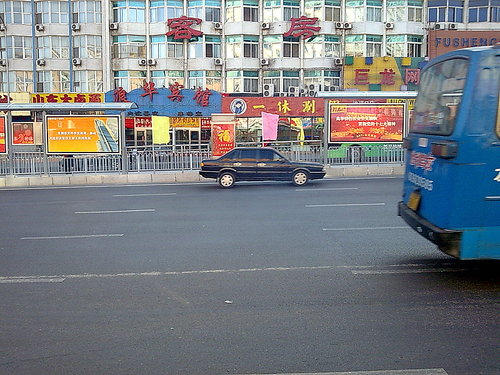
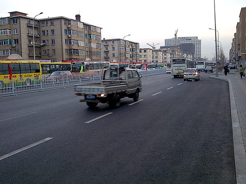
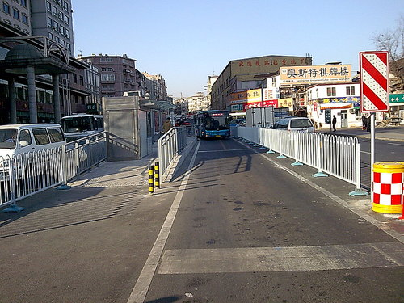
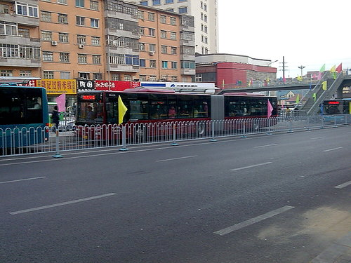
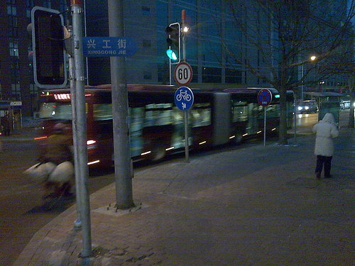
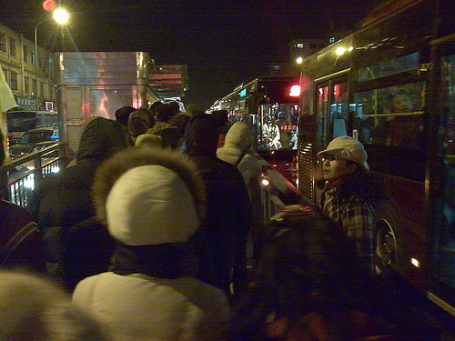
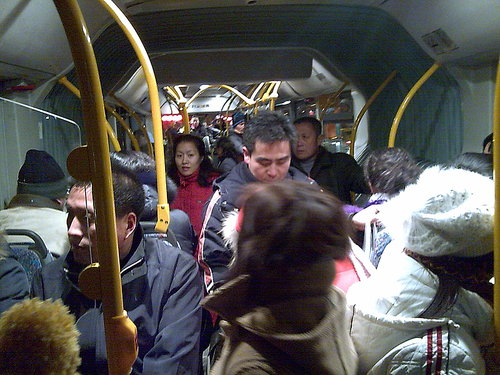
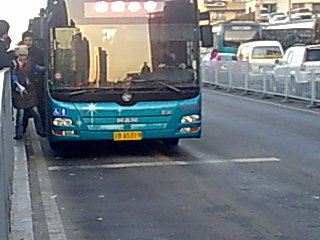

折腾了半年多的大连市快速公交终于通车了.
对于这个东东,俺可是一肚子的不满.不是反对快速公交本身,而是反对它的过程和形式.

1.华北路,松江路的扩道工程,为什么会耽误那么长时间?

2.扩道为什么要以牺牲人行道为代价?现在某些地方的人行道已经不足半米,难道政府对胖子有歧视?这回倒是”城市建设需要”了,有关方面怎么不

```
大张旗鼓的拆迁
```

扩道了?快速公交是快速了,但是被快速公交挤占了道路,从中速公交变成慢速公交的其它线路又怎么办?

3.为什么快速公交沿途所有非十字路口处的人行横道被取消?革镇堡到兴工街的人群理论上得到实惠了,可是华北路两侧居民受到的影响怎么办?凭什么提高公交车速度要以牺牲行人为代价?

4.开始只是说为达沃斯修路,怎么就变成快速公交了?如果是一开始就打算修公交的话,为什么不在扩道的同时修站台和天桥?如果不是,又是什么时候更改的规划?为什么不召开听证会?

5.公交车为什么非要搞到18米那么长?这么长的车安全性能怎么保证?如果这么长的车坏在十字路口,有什么紧急预案?凭什么说长车就比短车有效率?有没有论证报告?

6.既然线路是在兴工街华北路路口右转弯,为什么沙河口到兴工街路段该车还设定成内道行驶?有没有考虑到这个本来就混乱的十字路口的效率问题?

BRT究竟是什么意思?怎么跟达沃斯一样,光抛出个名称却不加以解释?难道是**别惹它**?



他们就拍脑袋吧!猪狗不如!

——-UPDATE——-
大博要的公交车正面
