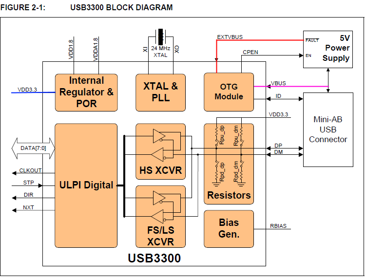

上个月客户那边提交了一个BUG，现象是我们写的DWC2（DesignWare OTG Controller 2.0）驱动在 USB Device 模式下工作的时候，不能识别VBUS的切断，而是在VBUS上没有电压的情况下，仍然能跟Host进行正常的USB通信。

调查了接近三个礼拜，终于被我找到了原因，只改了14行代码就搞定了。

先说结论：两个miss的复合作用导致这个BUG的产生。
1）GPIO上的USB_20_OTG_EN没有设成1。
2）DWC寄存器GUSBCFG上，BIT20『ulpiextvbusdrv』没有设成1。

解决的办法就简单了，当然是在初始化阶段把这个两个值都设成1。

先看图，下面这张是3300-EZK的模块说明图。

我们在基板在使用中，蓝色的线连接了一个继电器，控制继电器的就是GPIO管脚USB_20_OTG_EN。
红色和品红的两根，就是输入的VBUS。3300-EZK通过初始化的设置，来决定是使用VBUS还是EXTVBUS。

所以，当USB_20_OTG_EN=0时，整个3300-EZK是处于不供电状态的。
刚开始调查的时候，客户方面让我通过取间接读取寄存器的办法去取3300-EZK上的VBUS状态，取到的永远是0。
而且这种状态下，USB Device设成自供电完全是可以正常工作的。USB2.0线很简单，只有4根线：VBUS，D+，D-，GND。当我们设定成自供电的时候，只要D+D-能正常工作就好了，VBUS相当于被废掉了。
而我在实验的时候，另一块基板上也能取到VBUS的值，因为那块基板上的3300-EZK的VBUS没有连继电器，而是一直接着VCC呢!

DWC寄存器GUSBCFG上，BIT20『ulpiextvbusdrv』设置后，通过一系列的动作，控制的是3300-EZK的EXTVBUS。也就是内部供电还是外部供电的切换开关。
DataSheet上关于这个bit的描述是“This bit selects between internal or external supply to drive 5V on VBUS, in ULPI PHY.”，是正解。
但是描述中的“Host only.”这一句比较害人。我们第一次移植驱动的时候，看到Host only的字样就没有再去深究。其实在Linux代码里，能够看到这一位就是判断是否由外部供电用的。
在USB_20_OTG_EN=0时，单独设这一位没有任何反应。
之前的代码中一直没有设定这一位，所以我们的驱动就一直认为是自己供电的，也就是一直走着品红色的那根线，一直有电。

在调试的过程中，还有一个现象。当『ulpiextvbusdrv』单独设定的时候，不会接收Host发来的VBUS激活消息，与『hnpcap』、『srpcap』一起设下才可以。同时设下的现象是插线没有反应，其实是设成功了（因为要等外部供电）。但当时没意识到这一点，还以为这三个bit不能同时设。
事实是，只有三个bit同时设下，芯片才会处于OTG的A-Device状态，等待Host发来的激活信息，否则是B-Device状态，也就是自己供电的状态，Host直接就检知开始通信了。

最后说一下这次的一些心得。
代码是从Linux驱动抄过来的，Linux驱动中『ulpiextvbusdrv』是通过配置项来设定的，在移植的时候因为通信好用了就没再注意它。其实Linux默认的DeviceTree中，这一项是置1的。
物理设备3300-EZK确实是不用单独写驱动的，所有的设置都可以通过DWC的『gusbcfg』寄存器完成设置。
USB的peripheral模式，默认应该设成使用外部电源，或者在DeviceTree里做成可配置项。如果有特殊的descriptor，再改过来。
USB_20_OTG_EN，不应该放在不同基板的宏下面，而应该写成可配置项，放在DeviceTree当中。