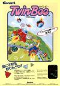
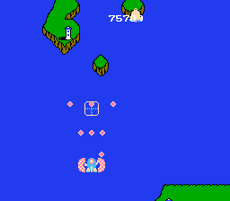
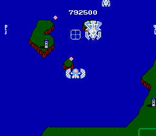

[兵蜂](https://pewae.com/gaan/aHR0cHM6Ly93d3cuZG91YmFuLmNvbS9nYW1lLzIzNjE5ODk2Lw==)

原名：ツインビー别名：TwinBee机种：FC厂商：科乐美类别：STG发行年月：1985-03耗时：15

秘技:1.加命：按住start，同时按住两个手柄的上和右，按A进入游戏，可以增加到10条命。
2.改变散弹枪方向：按住start捡铃铛即可(相当无聊的秘技)

科氏的又一名作，打击铃铛时的音效和捡到升级时候的音乐都堪称殿堂级。
不过最爽的音效还是来自第一次负伤时的救护车声。

这个游戏说简单也简单，说困难也困难。玩的时候只需要注意别捡太多的加速铃铛就可以了。跟上一个游戏一样，在游戏机时代俺就没玩过正常的第五关。每到第五关的时候敌人就是花版。最要命的是，子弹也是花版……直到如今有了模拟器才得见第五关敌人的真面目：糖果……

