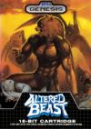

[兽王记](https://pewae.com/gaan/aHR0cHM6Ly93d3cuZG91YmFuLmNvbS9nYW1lLzI0ODgxNzAwLw==)

原名：獣王記,Altered Beast机种：MD厂商：世嘉类别：ACT发行年月：1989-08耗时：5

秘技：开机时按住ABC三键和左下,按START,可以进入下图界面,可以控制每一关变成那种动物.
开机时按住ABC三键和右上,可以进入音乐测试模式.
通关后上方落下的字幕可以击打,也可以被其击倒(蛮无聊的)

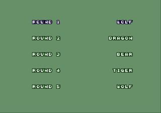

时光如水,岁月如梭,每夜一游终于进入了世嘉MD的时代.
3P以为俺MD篇的第一个游戏会是暴力克星,俺在上海的时候想推阿拉丁,但是真到了今天俺一整理rom,发现非这个游戏不可.因为在FC的时候我就想推这个了,只不过当时觉得MD上的更具备代表性,就留了下来.俺之所以一直没有想起来,是一直以为这个游戏是B开头的了.
当当当当,隆重介绍MD的首发游戏之一—**兽王记**
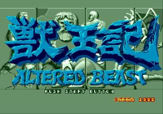

游戏其实还蛮无聊的,是一个老掉牙的野兽救美女的故事:一个公主~~收~~受到了坏人的诅咒,被变成了一只鸟.姘头主人公就获取了野兽的力量,打啊打啊打啊,终于把坏人干掉了,这个世界清净了…
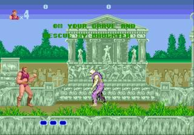
之所以选中它是因为这个游戏对于俺来说实在是太苦大仇深了,在游戏厅的死一条命换人的规矩下,俺从来就没打到过第二关以后.俺技术不好自己承认,但是这个游戏的操作性也实在是不敢恭维.不跟别的比,就跟同样是移植自街机的,同样是首发游戏的战斧进行比较,差的可不只一星半点.从后续作品的开发上也可见端倪.战斧推出之后,接连又出了二代和三代.而兽王记不久就销声匿迹了,直到2005年才在PS2上又出续作.
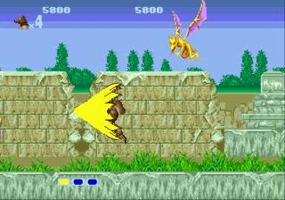

当年感觉这生意和画面那个震撼啊.现在才发现端的是无比难看.下图的这种动物今天看来应该是双头狼,但是在当年,俺们都叫它”猪”来着.打死”猪”以后,可以吃到一个小球,”Power Up”的音效当年可是被争相效仿的,只不过俺们嘴里的发音就变成了”啊我儿啊”.连吃三个小球之后就可以变成动物了,攻防能力大大强化,BOSS也随之来到.游戏这个系统设定是很贱的,boss每隔一段时间出来露个头,看你是不是已经变成动物了,是的话就开打,不是的话任由你攒小球.
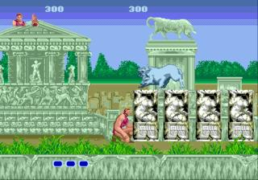
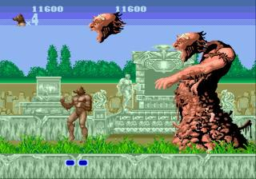

过关以后有小静画
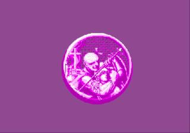

变身的过程里,数熊的形象最可爱
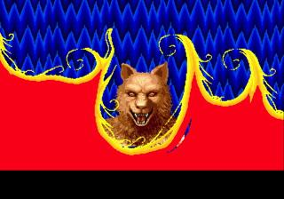
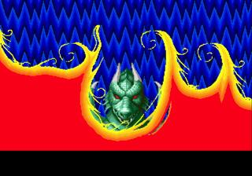
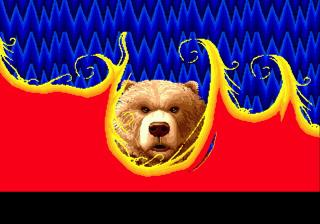

似曾相识的第二关boss,也不知道谁抄袭谁
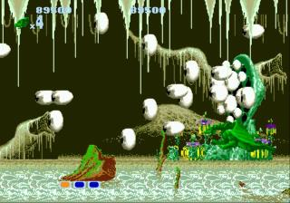
最后一关boss,跟忍者神龟里的牛头简直一个模子出来的
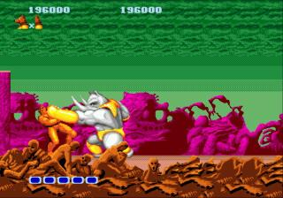

通关!!
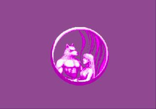