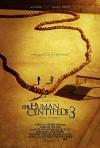

[人体蜈蚣3](https://pewae.com/gaan/aHR0cHM6Ly93d3cuaW1kYi5jb20vdGl0bGUvdHQxODgzMzY3Lw==)

原名：The Human Centipede III导演：tom.six主演：dieter.laser / eric.roberts / laurence.r.harvey类型：喜剧 / 恐怖地区：荷兰首映时间：2015

几个月前获悉《人体蜈蚣》这个非人系列的第三部已经放出来了，拖下来后一直也没有时间看。
前几天hanna那里说起了恐怖片的事情，遂想起，趁周末补了一发。

总体感觉，导演江郎才尽了。

从一开始放出的种种风声，就能看出这一定是系列的最后一部了。导演找来了第一部的男主演男一，第二部的男主演男二。
故事发生在米国一个监狱里，三代目是一个暴戾的监狱长，一方面要应付犯人的不满，另一方面要面对监狱的赤字。三代目信奉的酷刑和威压对于囚犯似乎起不到什么作用。二代目演的会计出主意，要三代目把凡人穿成人体蜈蚣，既节约粮食又能从精神和肉体上打击囚犯的气焰。最后，计划付诸实现，获得了州长的认可，三代目得以保住自己的位置。

整部片，我是当搞笑片来看的，因为导演一直在自黑。比如监狱长始终对“拍两部烂片”的傻逼导演不屑一顾。
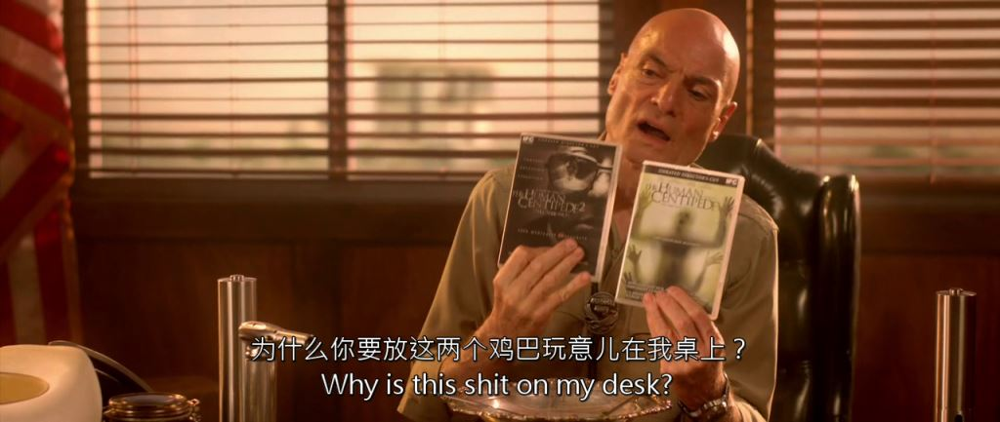
然后导演本尊也露了个脸：
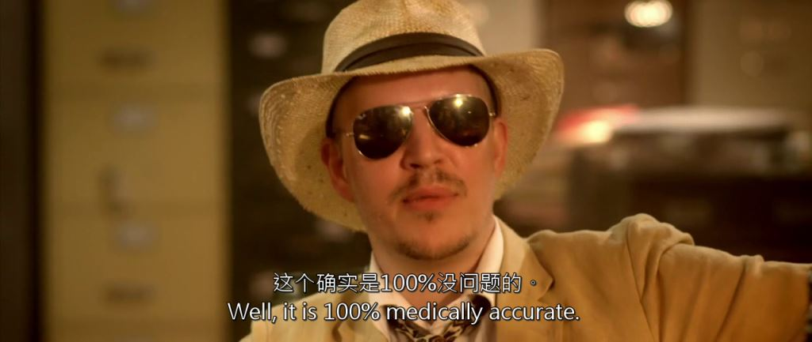

不知是导演的要求还是演员自己的处理，三代目用的是马景涛式的“咆哮帝”风格来表现其暴戾和乖张。不能说不好吧，反正我是不太喜欢。尤其跟一代目的阴冷反差极大。倒是二代目果然演技出众，这次的会计跟二代目完全判若两人。两人站在一起，萌萌的身高差～
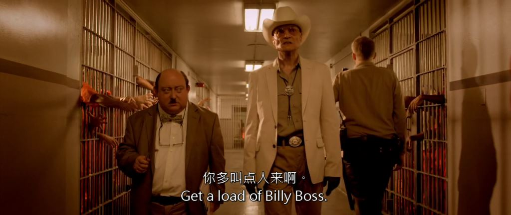

显然导演有自知之明，第三代已经不以蜈蚣为卖点了。实事上蜈蚣的整体镜头只有这么一个，虽然长，却远远不如二代蜈蚣的震撼。
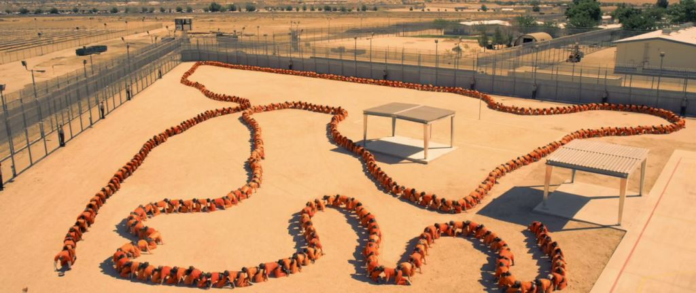
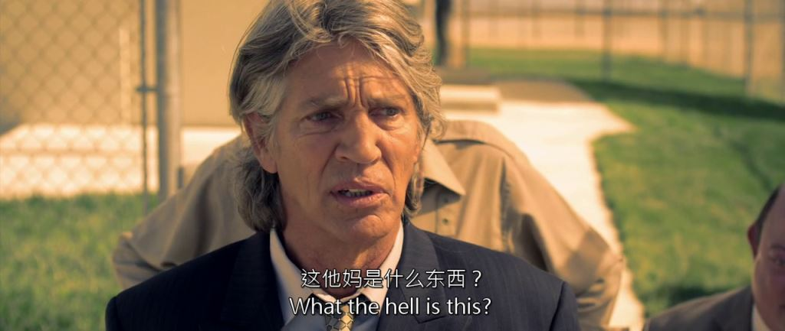

真正让我有一点不适的是这个镜头。按说电影里表现这事儿的不少，但这么直白特写的不多。看懂了就看懂了，看不懂的我也不解释，感兴趣的自己下载看去。
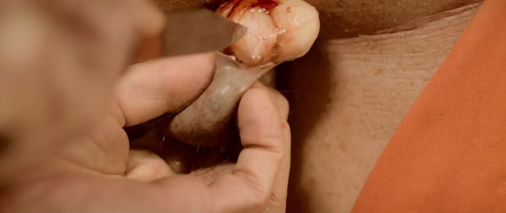
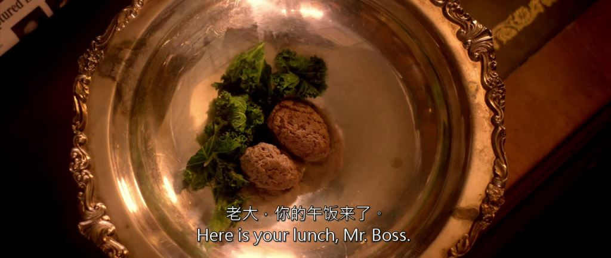

还有一个小段子，反正我是没觉得恶心，只是觉得挺邪恶且无聊的。
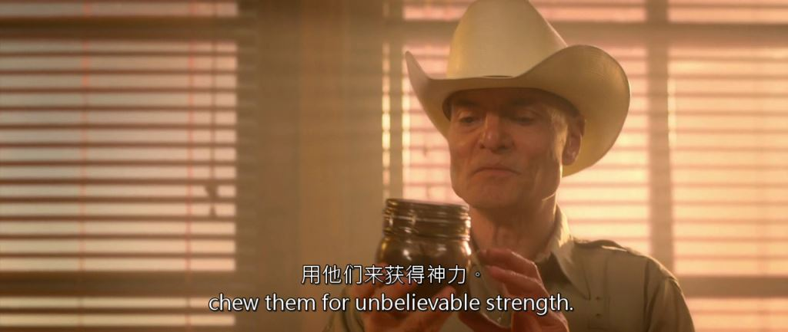
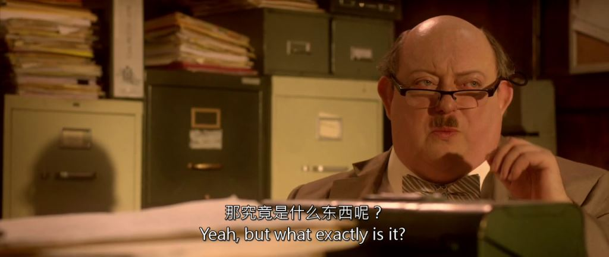
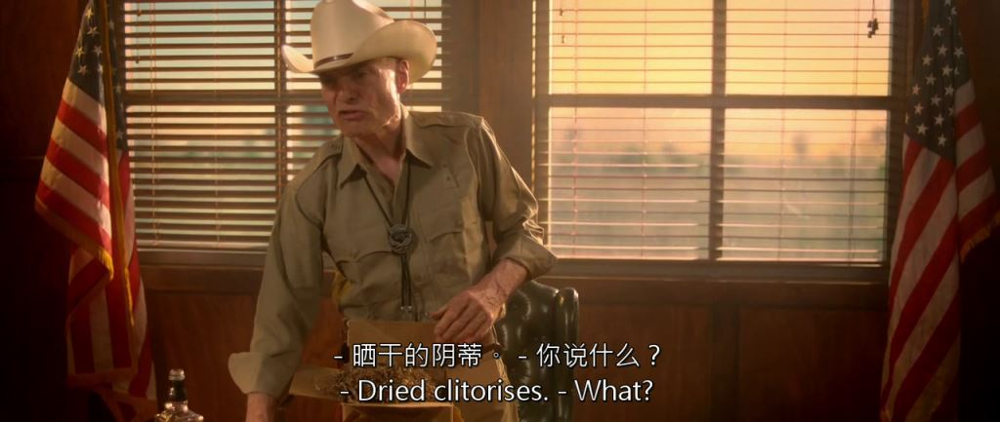
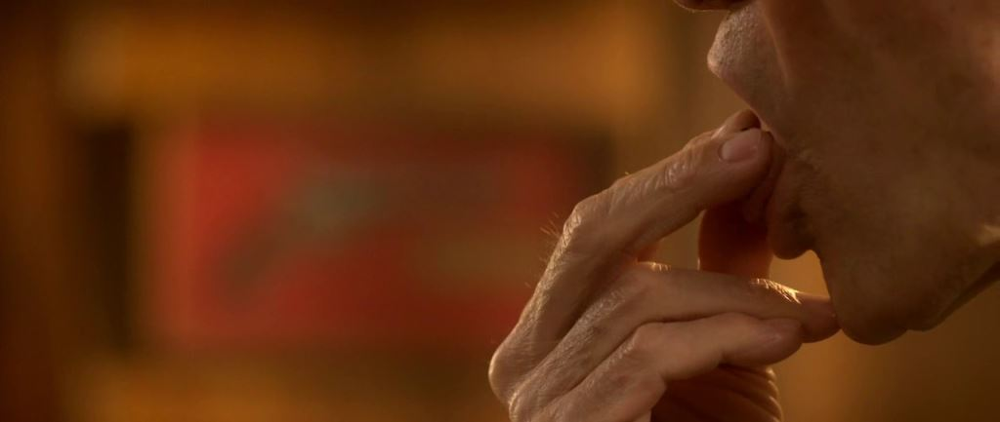
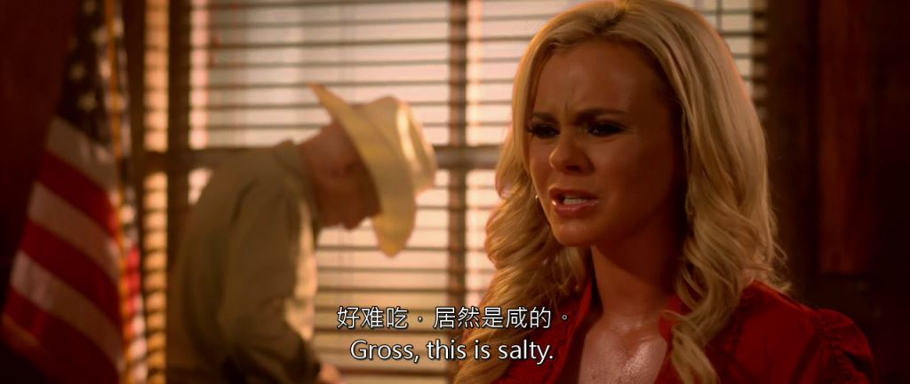

可以说，整部片完全是三代目的独白。作为一部恐怖片是不合格的。作为系列的终结，也很难说及格。男主演得确实非常卖力气，但有时有些用力过猛的感觉，完全无法产生共鸣。（话说跟一个纯恶棍产生共鸣也很难吧）
最后，二代目死在三代目怀里。
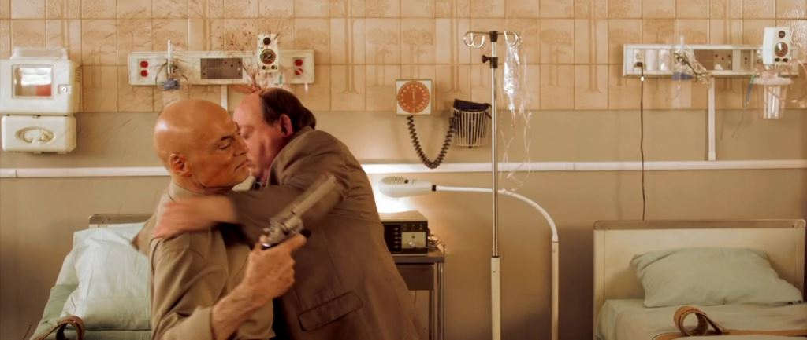

我打分的话，《人体蜈蚣》是一部普通的恐怖片，6.5分；《人体蜈蚣2》是一部反人类犯罪题材登峰造极之作，10分；《人体蜈蚣3》只是一部普通的B级片，5分。