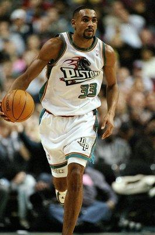

今天东决后，一帮同事在讨论。小丕子向来知道我也是看篮球的，就问：“王哥，你怎么情绪不太高，是因为步行者被淘汰了吗？”

当然不是。

脚前脚后的，希尔和基德宣布退役。结合[一年前的那篇](https://pewae.com/2011/06/sad-old-metters.html)，这意味着我再也看不到自己的偶像打球了。
铁打的营盘流水的球星，但偶像这东西，却只会在中二的年代出现。

95年，不正是俺中二的时候么？

那一年，在队长的熏陶下，从95年第二期开始，每周四都会去等一份《体坛周报》，后来提前到周三，再到周二，再到一周两期……
足球的消息浏览完毕后，自然而然溜到后面的板块。不夸张地说，当时在《体坛》的诱导下，我可以熟练描述出费斯切拉、里奥斯和武宫正树的技术特点。刚受过94总决赛洗礼有了一定基础的篮球乎？于是，一批战绩出色的球星就成为了俺的偶像候选。比如战绩最好的坎普，比如超级新秀大狗、希尔和基德，比如在广告里扣碎篮板的奥尼尔，比如加盟卫冕冠军的德雷克斯勒（这种行为现在叫抱大腿）……

大浪淘沙——
第一个被淘汰的备选偶像是大卫罗宾逊。理由是无耻的刷分。
第二个是奥尼尔。理由是对大卫的刷分行为斤斤计较。
第三个是大狗。几乎就没有机会看他的比赛。
第四个是基德。因为争风吃醋而不给队友传球这事儿实在太恶心了，太不李寻欢了，尤其他还是个后卫。
第五个是霍华德。他要的工资太多了，明明没那水平。

最后剩下的，唯坎普和希尔二人而已。后来又多了个个性鲜明的装B犯罗德曼。
希尔简直是个完美偶像。人品好，打球帅（动作幅度大），虽然不怎么会投篮，但活塞在他的带领下胜率也挺高，还不自私，能传球能抢板。而且那时的活塞队服也有加成。
坎普则是暴力美学，抓起球就扣你丫的，让人看得血脉喷张不可自拔。

然而……到了考上大学的那年，这俩人忽然就颓了。一个比赛数据越来越差（当时并没有关于他不自律的报道），另一个伤了又伤。

坎普退役的时候，很是慨叹了一下卿本佳人之类，还有些激情的残留。

然后希尔就去了太阳——我虽然欣赏但不喜欢的快节奏球队。然后跟一帮同事们说我也看太阳的比赛，他们说很好啊，太阳队打得好看。我没好意思承认自己是为了看一个老男人。
注册某论坛的时候，我搜索了一阵才把希尔跟山叔挂上号。不禁想，偶像都成叔了，那我呢？

一年又一年。只知道他会有退役的一天。总以为那一天到的时候会唏嘘得不成样子。
唏嘘是唏嘘过了，样子却还是老样子。

还是小丕子问：“王哥，你最喜欢哪只球队啊？”
“活塞。”
“哟，04年开始看球，老球迷了啊！”
“我呸。”

P.S： 我从来不是乔丹的球迷。因为我开始看球的那一年，他刚好没有在打……后来虽然上演王者归来，但我已经有了效忠的对象了。