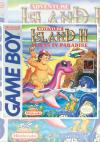

[冒险岛GB2：伊甸园里的恶魔](https://pewae.com/gaan/aHR0cHM6Ly93d3cuZ2lhbnRib21iLmNvbS9hZHZlbnR1cmUtaXNsYW5kLWlpaS8zMDMwLTE4Nzc5Lw==)

原名：Adventure Island II机种：GB厂商：HUDSON类别：ACT发行年月：1993-02耗时：6

[攻略](https://pewae.com/gaan/aHR0cDovL3dpa2kucGV3YWUuY29tL2Rva3UucGhwP2lkPXdpa2k6Z2I6JUU1JTg2JTkyJUU5JTk5JUE5JUU1JUIyJTlCZ2Iy)

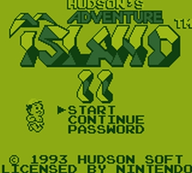

按照当年的计划，MD结束后本应该是SFC。鉴于往来的朋友们，尤其是新来的，总是把MD当成“小霸王”，我决定把GB提前。这么明显的颜色上的差异，就不会再认错了吧。
其实GB也分好多类型的在GBA以前，还有GB砖头机，GBP，GBL，GBC以及跟SFC互动用SGB。当然，这些放现在只能算冷知识了……

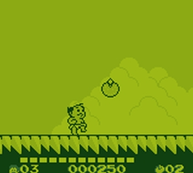
恕我矫情，这篇特意挑选在十二月二十七号发，是有特殊含义的。毕竟当初的FC的冒险岛3是险些成为本栏目的开篇的。只是当时挑选游戏的标准，自己定的是不需要特殊手段就能干通关的游戏，所以忍痛舍弃了冒险岛3。因为最后一关无论如何过不去。谁有能想到，仅仅到第二篇希魔复活自己就改了主意。

言归正传，GB冒险岛2其实恰好是FC冒险岛3的移植版。至于为什么序号变成了2，很简单，hudson在GB上没有做1的移植。二代移植到GB上就名正言顺的成了GB1，3也就变成2了。在FC和GB的时代，这种乱起名字的现象很多。
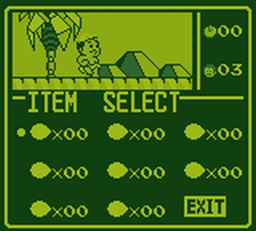

跟大家熟悉的冒险岛1比起来，FC的234知名度捏一块儿也比不上。而实际上冒险岛1是个很单调的游戏，反倒是从二代起增加了恐龙坐骑之后，隐藏要素极大丰富，变得有趣极了。地图这事儿应该是从玛丽3那边抄来的。
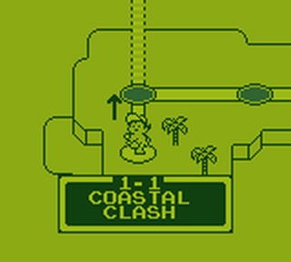

恐龙一共有5种：
黑桃龙能在岩浆里行走
红桃龙在冰面上不打滑
方块龙在水中移动力大大增强
梅花龙能在天上飞
星形龙在沙地上不下陷
因为冒险岛系列的固有秘技的影响，所以能打出范围子弹的黑桃和红桃龙是使用频率最高的。什么，你不知道冒险岛系列的通用秘技？子弹穿不过去的地方有隐藏宝物咯。
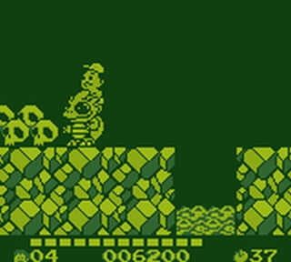

本作的奖励有好多种，隐藏路线，蛋三选一，云彩上吃奖励，冲浪吃奖励等。前面提到的攻略本人亲手制作，应该覆盖到了所有隐藏要素。
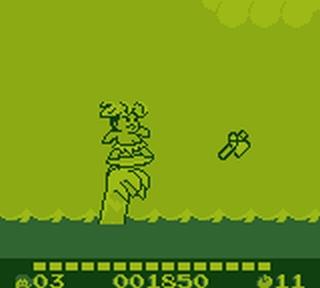

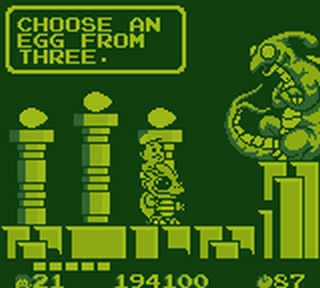

跟FC版相比，GB版受制于机能，流程大大缩水，每一关只有FC版的一半到2/3左右，这不仅没有降低乐趣，反而显得更加紧凑。当年在FC真机上，我是玩不穿的，几十条命都死在了8-1。GB版则一路畅通能见到最后boss。但也没打穿，最终boss实在是太耐艹了。
虽然机能不行，但片头动画交待的还算非常清楚。
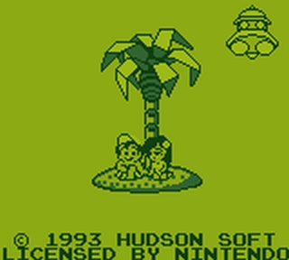
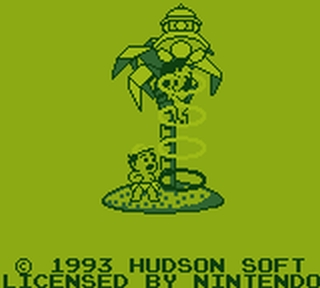

BOSS们
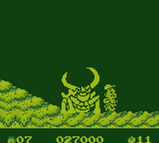
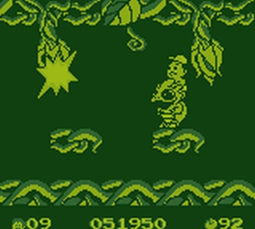
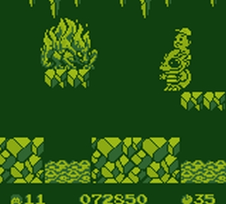
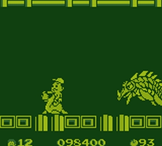
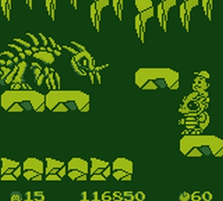
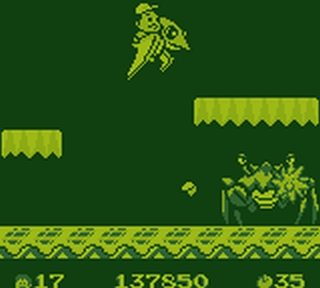
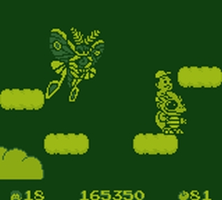

超级耐打两重变身的最终BOSS
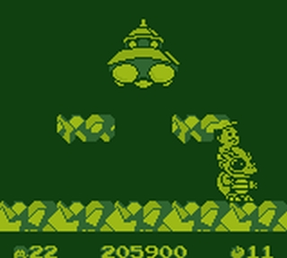
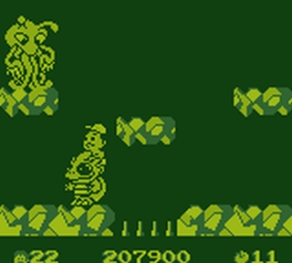

通关。傻叉翼龙为毛不给扔回个好地方啊，这么点的小岛，XX几次就失去新鲜感了好吧……

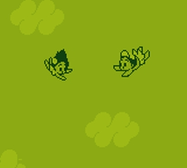
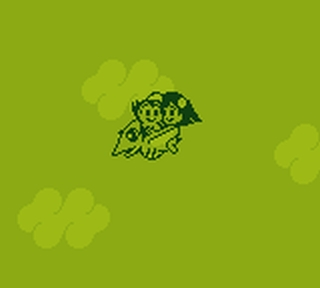
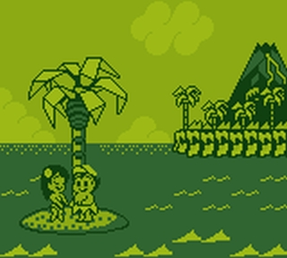
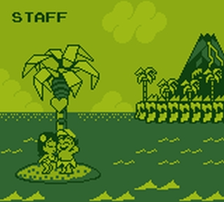