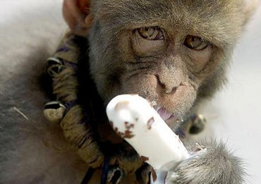

甲乙丙丁是一个项目组里的同事。夏天，每到天气热的时候，他们相约去吃冰棍儿。一人一天，轮流请。他们觉得吃冰棍这件事很高兴。
后来，甲结婚度蜜月去了，乙丙丁继续轮流请。他们觉得吃冰棍这件事很高兴。
甲蜜月回来，请大家去吃冰棍。他们仍旧觉得吃冰棍这件事很高兴。
之后，乙丙丁都腹诽甲应该把落下的这些天补上，却又不公开说。
于是吃冰棍这件事黄了。

戊己庚辛是另一个项目组里的同事。他们看到甲乙丙丁冰棍儿吃得很高兴，于是他们也相约去吃冰棍儿。一人一天，轮流请。他们觉得吃冰棍这件事很高兴。
后来他们看甲乙丙丁吃冰棍儿吃出矛盾了，觉得吃冰棍儿这事不太吉利，影响团结。
于是吃冰棍儿这件事黄了。

X是甲乙丙丁戊己庚辛壬癸的领导。有一天天热，X实在是想吃冰棍儿，又觉得自己是领导应该有一定的境界，于是他请所有人吃冰棍儿。大家都觉得这件事很高兴。
壬觉得也应该请大家吃冰棍儿。于是第二天他就请所有人吃冰棍儿。吃的时候,大家都挺高兴。
第三天开始，有人传闲话，任务领导请大家吃冰棍，壬也请大家吃冰棍，壬是在挑战领导权威。
于是吃冰棍儿这件事黄了。

癸觉得壬请了自己也应该请，于是买了一堆冰棍儿上来。
谁知甲乙丙丁组跟戊己庚辛组都在开会，于是壬癸和X把冰棍儿分了。第二天X没能来上班。
再后来癸就辞职了。
于是吃冰棍儿这件事黄了。

X请了大家若干次，发现没有任何一个人回请。领导家也没有余粮啊。就停止了请吃冰棍儿这事。
于是吃冰棍儿这件事黄了。

新来了一个实习生A，见大家天热很辛苦，就请所有人吃冰棍儿。
吃的时候，所有人都挺高兴。
后来，X觉得A是没有能力才不得不贿赂同事，在实习报告上写了个能力较差，没把A留下来。
于是吃冰棍儿这件事黄了。

后来。
于是楼下小卖部黄了。