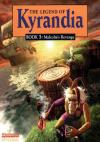

[凯兰迪亚传奇3：玛尔寇复仇](https://pewae.com/gaan/aHR0cHM6Ly93d3cuZG91YmFuLmNvbS9nYW1lLzEwODA5NDg3Lw==)

原名：The Legend of Kyrandia Book Three: Malcolm's Revenge机种：PC厂商：WestWood类别：AVG发行年月：1994-12耗时：20

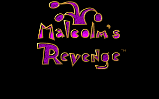
最早接触凯兰迪亚传奇也是97年，徐哥生日那天。他给我们演示了一小会儿凯兰迪亚传奇1。当时唯一的感觉就是这游戏太难了。
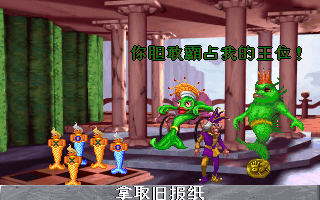

[99年寝室买了电脑](https://pewae.com/2010/07/living-on-net-for-10-years-2.html)之后，赶上流行15元正版风暴。学校外面优惠，25块钱两张。买了《金庸群侠传》之后，又挑了半天，一下看到了《凯兰迪亚传奇》这个名字，就兴冲冲地买了回来。
遗憾的是，当时寝室的电脑在那个年代也不算是好配置，装不上DX8，所以就没第一时间上手。
后来可玩的游戏又太多，这张盘就被静静地搁置在那里。
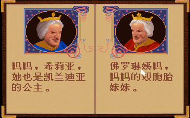

直到三年前搬家配新电脑，我试USB光驱的时候又翻出了这张盘，就决定一定要找时间把它打穿。
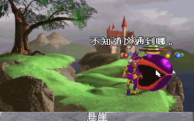

要说玩上手还真不太容易，光盘里的install早就不是Win10能支持的了。想换别的版本的话，网上能下载到的中文版没有语音音乐和过场动画，而有动画音乐的又全是英文版。
发了个狠，装了个Win98的虚拟机，把安装后的目录连同自己做的镜像文件一起拖到Win10下的DOSBox里，再一顿配置，终于全须全尾了！
中文版是当时很有名的台湾第三波汉化的。马尔寇这个名字就是典型的台式翻译，按照大陆的规则，应该是“马尔科姆”才对。中文版跟英文版相比，一个巨大的好处是不光有语音，还有文字。这游戏以我的英文水平，光靠听力是肯定打不通的。
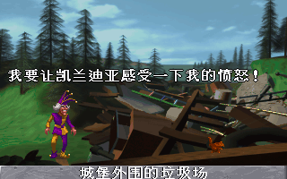
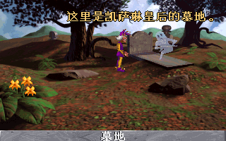

这么做当然是有理由的。因为这款游戏的音乐非常非常非常之出色，既生动活泼又轻松悦耳，一点儿也不觉得累。
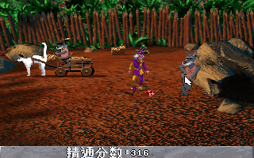

光盘版有560多M，大部分容量都消耗在过场动画上了。这水平，只能拼命联想时代背景了。
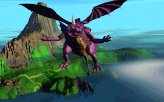
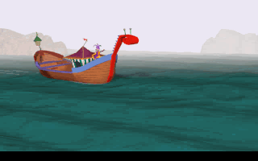

游戏的类型在当时应该算是独树一帜的。从地上捡一些道具或者道具组合，放到适当的位置解开谜题——没错，就是现在的密室逃脱。一代的谜题逻辑性比较强，三代的谜题则恶搞居多。比如扔条臭鱼在人身上，或者扔个剪刀到人间屁股底下这类。当年的西木头不愧是业界领袖啊。
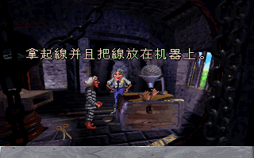
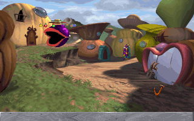

对话也蛮有趣的，马尔寇可以在“友好”“中立”“欺骗”三种对话方式之间切换，见什么人说什么话才能达成通关。
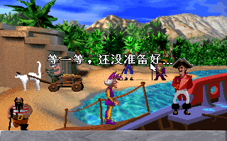

游戏多少有些虎头蛇尾。刚登场的时候，谜题很多，离开第一个场景有好多种方法。而到了第二个场景就一下子无聊了起来，只有一种办法能到下一关。后面虽然在回归到时候可以选择三个阵营，但其实对解谜的影响不大，一下子失去了重玩的欲望。解谜类游戏就这点不好，不管多难的谜题，做完之后就没有再来一次的欲望了。
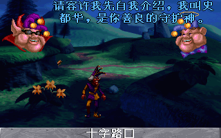

解密游戏似乎就少不了不合逻辑的操蛋谜题。
唯一一个卡关的地方不是谜题，而是重新回到某个场景后找不到路了。只好翻墙上了油管看通关录像，原来是要点一下下水道，然后爬出去……
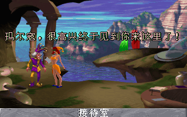

要通过以物换物的办法获得关键道具的地方也挺折磨人的。需要把可能有用的东西扔一地，然后进进出出地刷商品，好无聊。
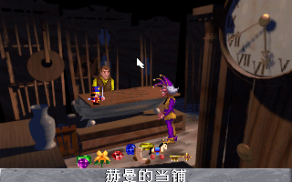

最后的通关其实只需要一个三明治。
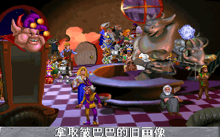
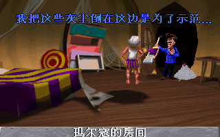
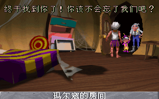
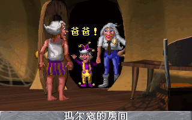

另一个吃容量的地方应该是结尾的通关动画。制作组搞了个超长的MV，应该是每个人员都给了露脸的机会。
4个程序员，2个音乐，7个美工，10个QA……
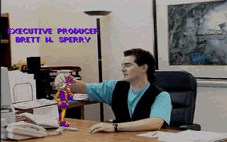
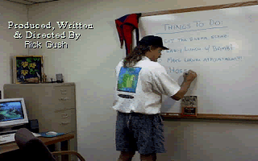
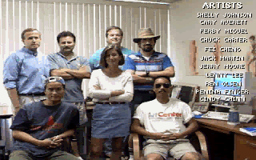