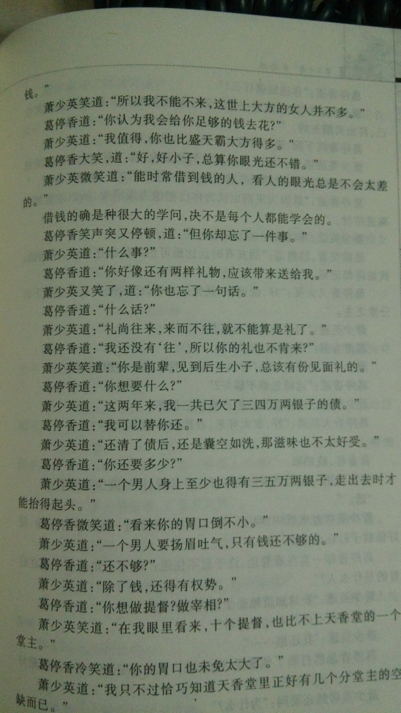

——重读古龙之《长生剑》、《孔雀翎》、《碧玉刀》、《多情环》、《霸王枪》、《离别钩》、《七杀手》、《拳头》
列那么长的一串而不是《七种武器》，是因为因为这个世界上根本没有“七种”武器！

**楔子**
因为前两部抽出来的不太满意，所以这次选一个应该会令自己愉悦的系列。
除了《离别钩》，其余7部都是在1995年初二两天运动会的期间突突出来的。具体的故事都不怎么记得了，脑海中无法磨灭的只有文字带来的快感。嗯，就是下图这种文字……

**《长生剑》**
系列开始于马马虎虎的短篇。八十几页，传统的小说分类勉强算中篇，在武侠这个类别里已经短的不能再短了。
开头的三个反派龙套自我吹捧，很有这个时期古龙的典型风格。

> 　赵一刀道：“十二连环坞、长江水路，和辰州言家拳的三位朋友，半路上忽然得了怪病，头痛如裂，所以……”
> 　　苗烧天道：“所以怎么样？”
> 　　赵一刀道：“他们的头现在已不疼了。”
> 　　苗烧天道：“谁替他们治好了的？”
> 　　赵一刀道：“我。”
> 　　苗烧天道：“怎么治的？”
> 　　赵一刀道：“我砍下了他们的脑袋。”
> 　　他淡淡的笑着道：“无论谁的头被砍下来后，都不会再疼的。”
> 　　苗烧天大笑，道：“好法子，真痛快。”
> 　　白马张三忽然道：“万竹山庄和飞鱼塘来的两位前辈，只怕也不能来了。”
> 　　苗烧天道：“哦？”
> 　　白马张三道：“他们已睡着，而且睡得很深很沉。”
> 　　苗烧天道：“睡在哪里？”
> 　　白马张三道：“洞庭湖底。”
> 　　苗烧天大笑道：“妙极，那里睡觉不但凉快，而且绝不会被人吵醒。”
> 　　白马张三淡淡道：“我对武林前辈们，一向照顾得很周到的。”

然而主人公就很逊色了。若不是李白的诗，我重读之前根本想不起来主人公的名字。白玉京不过是个推动剧情的线索，只在最后500个字的时候突然出手收拾了一下残局。其余的时间要么笑嘻嘻地看几个小喽罗内讧，要么在跟女主角打情骂俏。女主只是个古氏通用路人心机婊。几个反派人物的内讧倒是节奏感分明，一坏还有一坏坏的调调儿。
猜想古龙一开始给七种武器的定位是：先定义一个非常规意义的武器，再为这种武器写一篇命题作文。长生剑对应的武器是“笑”，文末古龙借女主之口说出了要表达的观点：“一个人只要懂得利用自己的长处，根本不必用武功也一样能够将人击倒。”遗憾的是这个观点并不新鲜，就算古龙自己，以往的作品里也用烂了的，从苏樱到林仙儿。
所以，《长生剑》注定了只是一个平淡的故事。

**《孔雀翎》**
《孔雀翎》主线的坑，挖得非常之深，寓言的意味最重。都说武侠是成人童话，所以写成寓言也没什么关系。
屌丝青年杀手高立养了个畸形瞎老婆，在一次执行任务的时候因为目标对自己有恩所以反水了，与另一个反水的杀手秋凤梧成了朋友。在抵御了青龙会杀手集团的报复行动之后，高立归隐种地，秋凤梧回家继承家业。几年后漏网的杀手找到高立实施报复，抓了瞎老婆当人质。高立信心不足，去找富二代借大杀器孔雀翎。秋叮嘱说非万不得已孔雀翎不能见人。高立怀揣大杀器后士气猛涨，干掉杀手，才发现半路上已经将大杀器弄丢了。去跟秋请罪，秋告知了他最大的秘密：孔雀翎已经丢了好多年了，之前给他的是假货。
古龙的世界里，是不存在暗器一说的。管它明暗，能杀人的就是好武器。但黑科技暗器的好处是不必掌握太高的技巧，所以江湖上最有名的孔雀翎就成了核弹一样的战略性武器。
从主角高立的角度看，这确实是一个关于信心的故事；但反过来从男二秋凤梧的角度看，故事就包含了信任与背叛的意味了——你来找我，是信任我，我把东西给你，是信任你；你半路把东西丢了，是背叛我，我拿假货给你，是背叛你；最后又告知了真相，又是信任。
快三十年了，我始终记得孔雀翎和秋凤梧这两个名字，显然不光是因为它们起得帅。什么该做什么不该做，这故事多少给了我一点儿潜移默化。
好像忘了说，87年第一次看录像，《孔雀翎》就是两部片子之一。

**《碧玉刀》**
富二代求亲记。这本书里有全系列我最喜欢的一个人物。
不是主人公段玉，而是女主华华凤。聪明懂事不添乱，在武侠小说的世界里也算难得了。难道她就是后来燕七的雏形？
至于段玉，比同名的段誉要可爱得多。没那么多朝三暮四，不傻也不怎么聪明。只是实话实说，干该干的事。
可惜为了扣“诚实”二字，古龙的剧情桥段设计得太刻意了。尤其是那个什么什么老爷子，儿子死了之后还选择信任段玉，这就不是人能干出来的事。
要是当侦探小说来看的话，里面的推理简直弱爆了——XX不可能这么干/天下只有XX能做到。
唉！谁叫古龙死得早而青山冈昌生得太晚呢！

**《多情环》**
这是个比无间道早30年的无间道的故事。仅从剧情上讲，是系列里最巧妙的——一开始就知道萧少英是要复仇的，而你会去关心他的手段和其中的过程，然后再制造冲突，引发读者的小猜疑：“这人到底是不是卧底？”。我其实非常喜欢这样的设置。而且古龙还很俏皮地玩了个双结局——复仇之后的隐藏boss，令人拍案。
合上书细想一下，这个故事里没有正义——主角是黑帮A的骨干，派去黑帮B卧底，未来得及展开行动，A就团灭了。主角终于在B内取得了老大的信任，成功反杀B老大。然而全国性连锁黑社会组织青龙会在B里也有卧底，主角最后不得不跟青龙会势力再次火并。
古龙写这种黑社会仇杀风，真是信手拈来。也正是因为非正义性，才把“仇恨”这个主题表现得淋漓尽致。
以直报怨什么的，最喜欢了。

**《霸王枪》**
这部是我心目中的典型性古龙作品，它符合一切“古龙式”的标准——斗智不斗力的男主角、傲骄的女主角、侦探小说式的剧情架构、化敌为友的伙伴、背叛的老朋友、出场过本以为是NPC的大BOSS……当然还少不了戏剧式的对话和简洁的功夫描写。
古龙写过很多多智近妖的角色，江小鱼苏樱沈浪王怜花叶开陆小凤等等等等，丁喜算是卡在“妖”的线上。很多时候问题看得明白却又不付诸行动很符合我的人生哲学，丁喜真的很讨喜。
也许因为要对应“信心”的缘故，《霸王枪》里的荷尔蒙含量在前面五种武器里是最浓烈的。具体的表现当然体现在配角小马身上，有什么话，打完再说。可能觉得小马的直来直去会影响架构，所以后半部被雪藏了，然后用一本外传性质的小说来进行补偿。王大小姐同样如此，为了给老爹正名，勇往无前。当然自己实力不怎么行……
若干年后另外一部武侠小说里的一个人物同样给我这种一往无前的感觉，他是《覆雨翻云》里的风行烈。同样用枪，好巧。
这本书还有一个有趣的现象：几个主要人物都记不住名字。小马全名马真，王大小姐全名王盛兰，小琳全名杜若琳。
P.S:《孔雀翎》里高立救的百里长青，是丁喜的老爹。

**《离别钩》**
读古龙，《离别钩》是一部不可不读的作品。因为它代表着古龙最后的辉煌。此后古龙由于身体和精神的原因，书籍的质量大幅度下降。包括楚留香系列的《新月传奇》、《午夜兰花》和陆小凤系列的《剑神一笑》都算不上太好的作品。
如果这部书放到《多情环》和《霸王枪》的那个年代写，至少要薄掉1/3——古龙写废话的毛病这个时候已经比较严重了。《离别钩》与前五种武器有两处最大不同。第一是年代较上一部的差距很大，有三年之久；第二是未经过连载，全文写完之后一次发表。因此，《离别钩》的剧本效果较少而完整度非常的高。前因后果什么的在系列里是交待得最清楚的。
没看到结局的时候我一直以为这第六种武器应该是“狠”——杨铮对自己非常的狠，最后打boss甚至付出了一条胳膊的代价。但没想到最后扣到了“离别”上。跟武器同名，岂非很无聊很无趣？写到这儿的时候，古龙可能已经找不到可以作为武器的人的意志力了，所以第七种武器难产一点儿也不奇怪。
很多朋友在系列中最推崇的是《离别钩》，我却不这么想。因为这部书骨子里透着一种阴冷，谁读谁知道。

**《拳头》**
《拳头》创作在1975年，1978年合集出版的时候确实被列为七种武器之六。但《离别钩》出版的时候，古龙亲自把它除名了。所以，《拳头》不是第七种武器。
《拳头》一书，有好多名字。《狼山》《神拳小马》《愤怒的小马》都是它。因为不论本名还是别名，都不符合七种武器的命名规范，所以熊老先生才会亲自把它从系列里剔除——这当然不是事实。我猜古龙写霸王枪的时候太喜欢小马这个直人配角了，所以决定单独为他写个别传，所以才有了这本书。至于武器不武器的，并不重要。创作能力正值巅峰的古龙怕也想不到自己会填不平《七种武器》这个坑。
小马确实很招人喜欢。有点像漩涡鸣人的忍道，小马的哲学就是直来直去。任你诡计千条，我就是一拳打过去；管你什么招数，我就是一拳打你的鼻子。
然而这本书被古龙写劈了。故事的结构是系列里最差的。
主人公带着三个朋友两个女伴护送一个病人上山。路上遇到了各色各样的敌人，灭掉一个再来一个，朋友们不断减员。最后时刻大boss弄死一个朋友，主角爆种，大boss金蝉脱壳，被已经失去战斗力的朋友抱着同归于尽，全局终。
这tm纯是个单线RPG啊。
书里还有一段关于吸毒和群P的故事。那年曾经有女生跟我借，因为这个我没敢借给她，一个呵呵送给自己。
小马是《霸王枪》里的亮点，小马的三个朋友是《拳头》里的亮点。可以狡猾，可以胆小，可以无能，但不可以背叛朋友。
所以有人非要坚持说《拳头》是七种武器之一，代表的是朋友。
怎么可能，把朋友当武器使，把古龙当成什么人了？

**《七杀手》**
《七杀手》现在被列为七种武器之七，我不同意。
首先，不同于其它六部，有七个手指头的那个杀手甫一出场就挂了。而另外五种武器不管是不是主人公的武器，起码都是关键的线索。
其次，《七杀手》写于1973年，《霸王枪》之后，《拳头》、《离别钩》之前。如果它真的是一种武器，那么应该排行第六。可古龙明确说了，第六种武器，是离别钩。
最后也是最重要的，1997和2008年，现在的版权方（古龙的一个私生子）授权，出版社两次修改了《七杀手》的结局，使之与青龙会挂钩，才让这部作品搭上末班车。虽然出版社方面自称古龙的朋友的人说让七种武器完满是古龙的遗愿，但不管怎样，修改别人作品这事儿，真心看不上。
何况，我最喜欢的，恰恰是没改过的那个结局？

> 龙五苦笑道：“有的人想做英雄豪杰，有的人想要高官厚禄，有的人求名，有的人求利，这些人我全都见过。”
> 　　柳长街道：“但你却从来也没有见过有人想做捕快？”
> 　　龙五承认：“像你这样的人的确不多。”
> 　　柳长街道：“但世上的英雄豪杰却已太多了，也应该有几个像我这样的人，出来做做别人不想做，也不肯做的事了。”
> 　　他微笑着，笑容忽然变得很愉快：“不管怎么样，捕快也是人做的。一个人活在世上，做的事若真是他想做的，他岂非就已应该很满足？”

这部书的开头非常惊悚爆眼球，后面怎么也圆不回来，是古龙式骗钱开头、挖了坑不好好填的书的典型。好在创造了一个好主角。
柳长街不是大侠，亦非巨寇，不是天下第一，未曾恶贯满盈。他只是微不足道的小人物。
我恰恰喜欢古龙创造的这样的小人物。

**尾声**
《多情环》、《霸王枪》、《孔雀翎》、《离别钩》、《碧玉刀》、《七杀手》、《拳头》、《长生剑》。

重要的事情说八遍：禁止演绎禁止演绎禁止演绎禁止演绎禁止演绎禁止演绎禁止演绎禁止演绎！