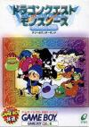

[勇者斗恶龙怪兽篇](https://pewae.com/gaan/aHR0cHM6Ly93d3cuZG91YmFuLmNvbS9nYW1lLzEwNzg5NDM2Lw==)

原名：ドラゴンクエストモンスターズ テリーのワンダーランド机种：GBC厂商：Eidos Interactive / TOSE类别：RPG发行年月：1998-09耗时：70

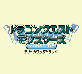

这部作品是GBC上的明星级大作。它的日版发售于98年9月。而日版GBC发售于98年10月，所以它是部很特别的，在主机发售前就“提前”支持了主机的游戏。其实说穿了一钱不值，黑白机的中后期，任地狱推出过一款在SFC上玩GB黑白游戏的增强卡，游戏支持了那块卡，就离支持彩色GB不远了（接口一致，4色跟10色的区别而已）。这也是GBC发售不久就有一大批原来的黑白游戏迅速推出彩色版的原因——一次有预谋的成规模的骗钱。
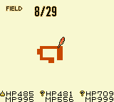
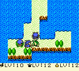

本作全名是“勇者斗恶龙怪兽篇～特瑞的神奇王国”。特瑞是95年发售的DQ6的主角，这部作品的故事发生在他小时候，按时间来看是6的前传。本作的发售日离DQ6已经整整过去了3年。DQ6是“天空三部曲”的最后一部，出完之后，全日本都在翘首期盼DQ7。ENIX那时一会儿说在SFC上出，一会儿说在PS上出，一会儿又说PS遇到技术问题要回到SFC上，总之各种跳票，吊足了人们胃口。所以一出来之后日本人的购买热情空前高涨，本作最终在日本卖了235万份，其中100万份是在98年的3个月里卖掉的！而老美显然对这个游戏没那么感兴趣，2000年的美版只卖了6万份。

这部作品的核心要素是抓怪，跟口袋妖怪是一样的，这也是他招来很多批评的原因。其实ENIX把口袋吃进去之后，吐出来的东西已经大变了样了：PM（口袋）的战斗是1V1，而DQM是3V3；PM的遇敌方式是固定地图+固定训练师+踩雷，而DQM是Roguelike随机迷宫+随机宝物+踩雷；PM的重点是训练怪物，只要愿意带着第一个村口遇到的耗子和鸡去打超梦都没问题，而DQM的核心玩法是交配，不停地练级和配合，生成更高档次的怪物才有能力去挑战更高档的迷宫。虽然有些迷宫出现BOSS的时候有一丢丢解谜和剧情存在，但那都无关紧要。
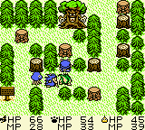
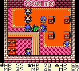

DQM的游戏流程相当简单——抓怪——练级-配合-打竞技场-打时空门-练级-配合-打高一级的竞技场-打高一级的时空门。把最后的竞技场和时空门打过之后，通关；通关后再进游戏，有更难的竞技场和时空门。反正跟DQ系列一贯的步步为营的节奏是一致的。那几年流行“通关之后才开始”，DQM打赢BOSS之后会出现9个新时空门，分别对应9系的怪兽，每个门都是29层，打起来费时费力，这种设定用现在的词来形容就是“肝”。这么说吧，这个夏天从世界杯开幕开始，一直到现在都8月末了，我才完成怪物图鉴。这还是有即时存档和修改器，抓妖怪跟练级速度都大大提升的情况下。
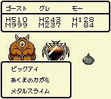
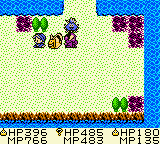
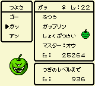

游戏的最大特色就是交配。可谓成也萧何拜也萧何。吸引人的地方是，在比较低级的关卡，事先合成比较牛叉的怪，能够打得比较爽。缺点就很多了。首先就是怪物数量虽然多达215种，比PM多40%还多，但实用的寥寥，只有每系顶尖的二三种和最后的问号系有培养价值，其余的抓来都是为完成图鉴或者作为合成用的材料。其次是怪物的设计沿用了DQ本作，所以大多恶形恶像，一点儿也不讨人喜欢。最后就是练级太枯燥。虽然有はぐれメタル这种经验宝宝可以刷，但它的出现实在太晚，而且即使用它，刷高级怪物到99级也很困难——一只2w，99级需要经验大约333只，按每次遇敌都能遇到3只金属史莱姆、每40秒遇敌一次的话，也要刷两小时。实际上金属史莱姆的出现概率并不高，花费的时间应该是这个数字的3倍。
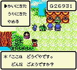
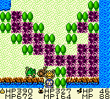

配合公式是个非常复杂的矩阵，抓怪的空间有限，想要获得强力的问号系，必须要规划好抓材料的路线图和捕捉顺序，要是有哪个不小心整错了，虽说不至于全部推翻，但修正付出的时间也是不菲。当年我玩的时候，笔记可是记了半备课本——那时候我还认不全50音，简直痛苦至极。
真机上还没有即时存档和FPE这两大杀器，偏生游戏前段在迷宫里是无法存档的，所以当年我能一路配合出214号，真是用了200个小时以上。
编号215的最终版BOSS，需要用214号和110号配合。110号游戏里只有一只，就是把特瑞带到游戏世界的引导员，打通全部时空门之后跟它对话，它才会加入——加入之后再合成，已经没有BOSS可打了，也就是传说中的“我练成了屠龙之技，可这世界上已没有龙……”
据说这一坑爹的设计在PS版的时候改掉了，追加了一个新BOSS。
先要打通关弄到的11号：
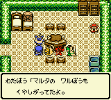
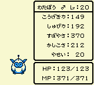

另一个特色是丰富的技能系统。每只怪物有自己原生的3个技能，还能完全继承父母的10+10个技能，如果学会的技能符合特定条件的话还能学会组合技能，低级技能随着等级的升高还有可能变成高级技能。攻击性魔法有火系雷系冰系风系爆破系等好多种，敌人也分不同的属性，各种有益的有害的buffer也很丰富，AOE打小怪也很爽。
然而，打BOSS的时候却没有非常强力的单体技能。最强的一个强力技能，消耗全部MP，无视防御，伤害是攻击力的145%，所以999的攻击力大概能打掉1400+的血。而另一种很好学的技能，只消耗3MP，同样无视防御，打出的伤害大约等同于攻击力（1000），所以要那个消耗全部MP的坑爹玩意儿干嘛？而这个1000伤害的技能，BOSS只能吃一下，然后就全miss了。999攻击的平A，打BOSS身上也有大概400多的伤害。所以最搞笑的事情发生了，只要等级到了，不用管什么技能，也不用管什么属性相克，一路平A都能把BOSS打死。
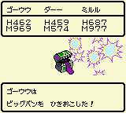

游戏的音乐还不错，挺柔和的。当然GBC也演绎不出什么太好的效果。
但再好的音乐，在4小时不停的练级的时候，也会变得枯燥。好吧，这是瞎扯，当年真机上为了省电根本就很少开音乐。
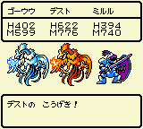

第一轮结局，在迷宫打赢他姐姐再打BOSS，在竞技场再战一次姐姐。都数不清有多少游戏是这么设定的了。然后欣赏一下大树王国的夜景，跟国王BB一会儿，老法师会把主人公送回现实世界。再跟他姐讲话，才能出现STAFF。
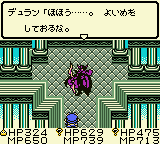
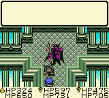
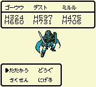
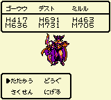
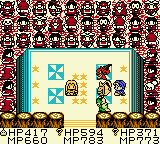
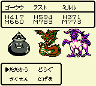
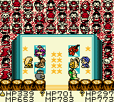
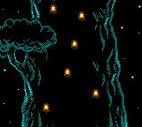
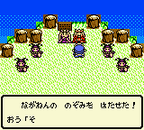
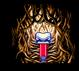
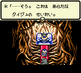
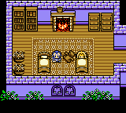

通关画面。
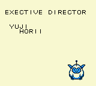
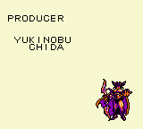
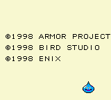

读档之后，大树再一次成长。多出9个BOSS要挑战。这些BOSS就是超强的问号系们，看看这一只只歪瓜劣枣的样子，跟PM怎么比嘛！
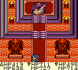
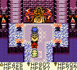
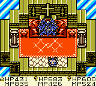
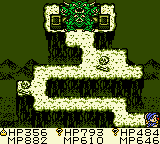
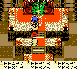
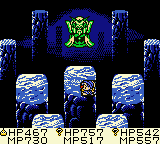
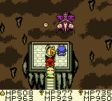
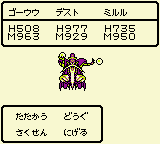

忙活将近3个月，最终的目的，就是合成这最后一只，把213变成215……
（其实就是常规赛BOSS改了个配色……）
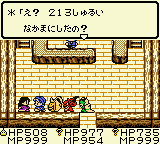
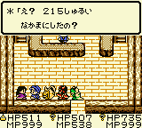
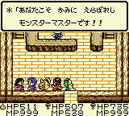
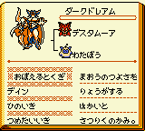