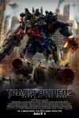

[变形金刚3](https://pewae.com/gaan/aHR0cHM6Ly9tb3ZpZS5kb3ViYW4uY29tL3N1YmplY3QvMzYxMDA0Ny8=)

原名：Transformers: Dark of the Moon导演：迈克尔·贝主演：乔什·杜哈明 / 凯文·杜恩 / 巴兹·奥德林 / 希亚·拉博夫 / 帕特里克·德姆西 / 弗兰西斯·麦克多蒙德 / 朱丽叶·怀特 / 格伦·莫肖尔 / 比尔·奥雷利 / 泰瑞斯·吉布森类型：动作 / 科幻地区：美国首映时间：2011

霸天虎的队伍，五年之前就已经数过了。第一部里挖地虎出来之前，有名有姓的骨干成员，算上那三盘磁带才只有12个。

反观汽车人的队伍。
老大擎天柱，除了会叫上一句：“汽车人，变形，出发。”以外，并没有体现出什么强大的战力。倒是倒下之后汽车人队伍一盘散沙，体现出了这个老大还是有点儿作用的。(1)
副队长铁皮，除了放狠话以外，战斗力并不如何强大。(2)
体育委员爵士。这个角色的作用就是数次出发之前，擎天柱都要求爵士整队。相当的莫名其妙。特技是扔小爪子。(3)
战斗人员开路先锋。算是战斗力比较强大的吧，有比较强的防护技能。（4）
侦查员探长。最早跟人类关系比较好的就是他了。特技是放全息图像。玩了一回反间计还被识破了。战斗力极其低下，差点儿被轰隆隆弄死在水里，还是人类给救回来的（5）
侦查员幻影。比较机灵的一个，拯救过一次地球。但没什么战斗力，被威震天直接一炮干倒过。(6)
侦查员大黄蜂。这个就更渣了，连机器狗都弄不过。(7)
鲁莽、大汉、充电器、飞过山、变速箱这些小个子，一个个叫得欢，没一个能打的(12)
红色警报、蓝霹雳、警车、飞毛腿、横炮这些战斗人员，往往是只会打落水狗，单挑的话，基本干不过闹翻天惊天雷兄弟。(17)
搞科研的千斤顶基本就是一枪撂倒的货。(18)
还有个护士救护车，战斗力比千斤顶稍强一点儿，但也不怎么能打。（19）
总之，汽车人冗员太多，职责不明，指挥不灵。要不是几个地球人保障有力加上敌人内讧，早就死得连渣都不剩了。不用说别的，偌大的一个基地，防卫近乎为零。声波机器狗激光鸟想来就来想走就走如入无人之境。

但人手不平衡终究不好。所以，稍后的时候，才会给霸天虎加上挖地虎和机器昆虫，凑够20人。

但是汽车人这边也出现了钢索淤泥铁渣大力神，
所以霸天虎那边又加了救火侯
所以汽车人这边又加了守护神……
所以，再往后就活脱脱的军备竞赛，开始没法儿看了。

这些，都是在看变3最后30分钟半睡半醒间想到的。