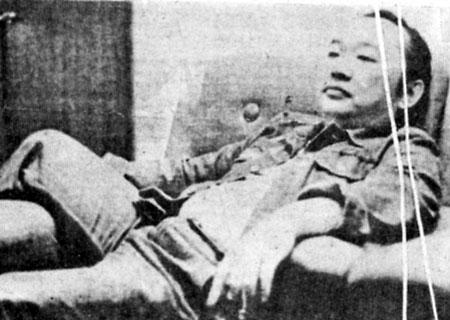

俺小时候相当爱看闲书.因此如果要说一个对俺影响最深的人,除了俺爹,就像~~和菜头(http://www.caobian.info/?p=2716)~~
说的,只剩下知名作家了.
如果写俺爹的话,俺是没有朱自清那样的本领,根本写不好,写好了也会跟这次什么鬼比赛一样,不会有人看,人家看了,也一定记不住,所以,无端暴露自己隐私,何苦来哉?

至于作家.
在小学五六年级到初中的阶段,读的最多的,便是古龙先生和北京大爷郑渊洁鸟.
之所以印象深刻,可能跟这两个人都喜欢在小说里夹杂些锦上添花或者说不合时宜的评论有关.但也有不同.老郑喜欢把自己写得臭脚不错的东西整理起来,夹杂在每期童话大王的最后N页上,显摆一番.好像叫什么郑渊洁精彩什么什么荟萃的,古龙就没这样的爱好,许是因为他死得早.
虽然有的时候很喜欢借用郑渊洁式的大灌口式的一气通贯一泻千里一骑当千一碧万顷一针见血一纸空文的修辞方式,但是这种读着累写着更累的模样,还真的是只能玩玩而已.


古龙的影响就大发了.
首先是友情.不同于金庸的虚情假意的结拜而骨子里的个人英雄主义,在少年们的眼中古龙笔下的人物都是重合同讲诚信的真汉子,最有代表性的就是欢乐英雄里的4个主人公.避世的王动为了朋友可以顽抗强仇;跳脱的郭大路和灵动的燕七可以”打死也不说”,壮哉!时至今日,每每重温,也是兽血沸腾不已.

其次是酒.是的,在古龙和家里的老爹这两个老酒鬼的熏陶下,本胖子一直没有喝酒会影响什么功能什么生理这般的觉悟.即便是年度体检的大夫说什么有脂肪肝的倾向,也自当是他们为了糊口骗钱.

再次是担当.古龙先生教会了俺,身为男人,总有一些东西是不能避免的,既然不能避免,迎头而上岂非便是那最好的解决方式?

最后是善恶.不同于主旋律电视剧里好人和坏人那种贴了纸条在脑门上的扑克脸,古龙的世界比金庸琼瑶和三毛都更接近于真实世界.善恶无绝对,利益有纷争才是王道.

古龙这个人,贪酒好色,从他拖稿这一点来说,如果他活在今天挖坑,一定会被海峡两岸的网友骂到仆街.但偏偏他的小说充满了人生的味道.
人生的味道就是,你觉得它是什么味道,那么它就是那个味道.

最后拿出古先生的一坨话,大家共勉一下:

> 我想的事很多，有时我想做皇帝，又怕寂寞，有时我想当宰相，又怕事多，有时我想发财，又怕人偷，有时我想要老婆，又怕罗嗦，有时我想烧肉吃，又怕洗锅，有时我甚至还想打你一巴掌，又怕惹祸。每个人活在世上，好像都是想得多，做得少。

```
比赛期间,请点这里投俺一票
```

```
3rd日链接：
http://www.feedsky.com/challenge/art/142294/feedsky/lifishake/~/rzsg/071113/06562/lnk.html
```

3rd日图片：

```

```