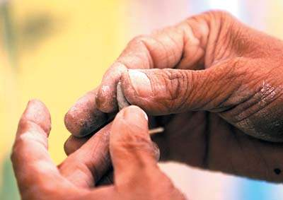

什么是俺年少时最钟爱的游戏?电视游戏和真人RPG.奈何最喜欢的电视游戏[一直在写](https://pewae.com/category/record-and-narrate/nightlygames).真人RPG的[变形金刚](https://pewae.com/2006/10/review-transformers-after-17-years.html)和[圣斗士](https://pewae.com/2006/01/memories-of-saint-seya.html)已经写过了,再写怎么也提不起精神.因此虽然猜到比赛会有这个题目,可真真是到了之前1分钟,才决定写这个风靡全球的游戏.

小时候在奶奶家长大的,院子里土不少.每当俺在院子里蠢蠢欲动的时候,远见卓识的奶奶总是不忘大声提醒俺:”不许尿尿和泥玩!”.打个巴掌当然就有甜枣吃,之后奶奶总是会舀来两舀子水,直接到在地上,然后俺就开始了向伟大的女娲sama致敬的过程.为什么没有水桶?废话!在上世纪80年代早期,粮票还是很金贵的东西,不是所有的家庭都舍得拿来换塑料桶的.至于铁皮桶,我一个4岁不到的小屁孩,拎得动嘛!!小屁孩见识少,捏的大多是…吃的…鱼啊,螃蟹啊,扇贝啊,萝卜啊,茄子啊…直到有一天俺照着看图识字上的图片捏了个菱角.俺姑父看到了,夸俺手巧:”这个小刀捏得真像!”俺立马从农业社会跨入工业时代,开始造房子,车床,火车,搅拌机(俺小时候很喜欢研究搅拌机)…后来,小俺三岁的妹妹逐渐长大了,俺终于不是一个人在战斗,但是少不了陪她捏个老和尚啊,花仙子啊,花栗鼠啊之类的东东.直到上小学之前,俺都一直留恋着奶奶家的院子.可能好玩但玩不投入的种子从那时遍种下了.
**俺一直骄傲的是/
最擅长捏的/
就是/
玉米面/
窝头.**

小学低年级其实也属于蒙昧时期,那个时候连大礼拜都没有,回奶奶家的时间就仅限于两个假期.在没跟3P混熟之前,常常都是一个人玩.沙堆和花园之类的好去处,自然有大孩子们霸占了,俺所能守着的,就剩下楼道边上那无尽的红土堆了.就在这种有米无水的尴尬境地下,俺滴灵感又一次爆发了.捧着土就冲向了路边那爆发的马葫芦.用石头和草棍先把水过滤一番,然后就开始用红土堆砌着”大坝”.”海狸先生”这个词当时还不存在,否则俺的外号一定不会是现在这个没什么特点的二胖子.几次之后,发现校服上总是臭哄哄的,便放弃了造福小区内蚊子的这项工程.但之后每逢雨季,总要寻一处坡道,垒个坝,过过瘾.

中年级之后,认识了3P等一帮损友,物质也逐渐丰富了起来,泥是不怎么玩了,但是手工课(要不就是美术课)的用品橡皮泥又成了新宠.结合当时最火爆的动画片变形金刚,捏出来的都是飞机坦克之类.从同学那里借回来的,也往往被俺跟橡皮泥机器人搅和在一起.往回还的时候难免连累老爹老妈去给人道歉.要不怎么说俺懂事早呢?早就看穿了同学父母一边说不要紧,一边用眼神给他的孩子们传达:”以后不能把东西借给二胖子了”的信息的嘴脸.

高年级和中学之后,电子游戏和武侠小说逐渐成为了娱乐的主流,手动的这些种种,都渐渐远离.直到某年某月的某一天,俺在沈阳,大学校园的边上发现了一种叫做陶吧的新鲜事务.花了30块钱,体会了一下当年的快感.仍旧是捏了个菱角.收银的那个校友故意过来恭维俺:”同学,你这把锁头做的可真像!”我#$%^%&!

上边描述的,这还仅仅是泥巴的分支的一部分,泥巴分支,还包括尿炕玩法,过家家玩法,戳刀玩法,糊墙玩法…而撒尿分支,包括射苍蝇玩法,射蛆玩法,淹蚂蚁玩法,斗远玩法…

祖国的花朵们啊,还真是离不开土壤和水分的说.

P.S:这篇命题的东东写得果然不好,强烈建议大家去看我写圣斗士的那段.

====Update 2017.5.4 删除失效链接====