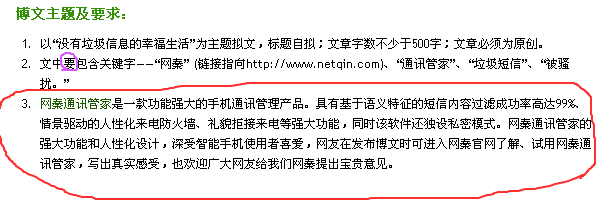
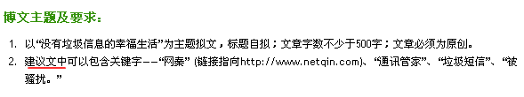

今天本来是打算交一张白卷.但是早上起来以后,通过对比,发现了feedsky的努力.
第一张是昨天下午快下班的时候,通过非法手段得到的题目要求:

再对比看看今天的要求:

出来混的,都不容易.只是越发的鄙视

```
网秦
```

.有钱就可以当大爷么?

同情归同情,理解归理解,鄙视归鄙视.要我给它写软文,我真的做不到.

我真的无法理解,这种所谓的”口碑”的软文,跟**垃圾短信**有什么区别?
甚至,我觉得所谓口碑,比垃圾短信更要害人.大家都是写blog的,大家也都是通过阅读器订阅blog的,通过订阅投票,本身无可厚非.换句话说,人家是给你面子才订你blog,你却时不时地来个这个营销那个口碑的,不仅败坏了别人的兴致更诋毁了自己的名声.为了几十块钱,值当吗?

而且从骨子里,我不信任所谓”**通讯管家**“这种带有噱头的产品.

首先是功效.
如果这种产品有效的话,还要警察干嘛?因为没有试用过,所以我不好说这个东东到底好使不好使.但是我一直坚信,在电子信息和通信工程领域,永远是道高一尺魔高一丈.罗胖子牛不牛?还不是照黑不误!腾讯人气旺不旺?还不是被盗得一塌糊涂!SONY狠不狠?PSP还不是刚升级就被破解!M记算是大大大大大佬了吧?宁丫们用的操作系统,有几张是正版的?!世上无难事,只怕鬼叫门;只要功夫深,巨炮磨成针.

其次是性能.
大家都知道,除了操作系统和少数3d的专业软件以外,就数杀毒软件最消耗资源.这个东东不号称自己手机杀毒也就罢了,偏偏说什么” 全面快速的文件扫描，及时准确的实时监控，安全彻底的病毒清除”.我靠!大多数手机在设计的时候都是精打细算的,在保证功能的前提下能省用CPU就省用CPU,为了降低成本嘛!你一家伙弄个系统监控的软件上来.就算把病毒防住了吧,我手机来电来短信来月经响应不过来,找谁哭去!?我一直坚信,能做成巨头的,都不是傻子.这东西如果这么容易,诺基亚三星摩托索爱早就开始搞了,怎么也轮不到这个名字听着像鸟类的公司来弄.

最后是安全.
最担心的就是这个.看看吧”软件自动上锁，彻底保护您的隐私！”**能保护隐私就能泄漏隐私**!!垃圾短信骗钱电话之所以满天飞,还不是因为移动联通之流把咱的隐私透露出去了的缘故?很遗憾,在他们的官方网站上,连一句关于安全和私隐的承诺都没有.承诺不可靠,没有承诺更不可靠.鬼才知道他们会不会收集用户信息再卖给垃圾短信制造商!

什么叫垃圾信息?没有用处的才是.但是对你没有用处不等于对别人也没有用处.
毛主席教导我们说马克思教导我们说:苍蝇不叮无缝的鸡蛋.**垃圾短信**满天飞,说明这种三级或暴力短信还是有市场的.大禹治水的都故事听说过吧?想一劳永逸的不**被骚扰**,靠这种防火墙防是防不住的.想根治,唯有靠zf出手.先解开GFW,让能上网的想上哪就上哪,想看哪国文字的A书就看哪国文字的A书,想看金毛黑毛红毛绿毛白毛无毛的一应俱全,谁还会搭理诱惑的文字?再开放文化领域,把本国的外国的文字的图像有码的无码的三级的X级的统统解禁,活色生香丰乳肥臀长枪短炮地一晃悠,谁还在乎手机那个小小屏幕?最后,还要努力把要什么有什么的共产主义搞出来.那时候要鸡蛋有鸡蛋,要猪肉有猪肉,要肾有肾,要房子有房子,要枪有枪,要钱有钱,要充气娃娃有充气娃娃.所谓无欲无求,啥都有了,谁还去看垃圾短信?那才是真正的**没有垃圾信息的幸福生活**.

现阶段想维持不被吓阳痿的性福生活,还是老老实实关机吧!

感谢禽类公司,这是俺开赛以来写得最过瘾的一天!

**比赛期间,请点**

```

```

这里投俺一票

7th日链接:

```
http://www.feedsky.com/challenge/art/142294/feedsky/lifishake/~/rzsg/071117/581a1/lnk.html
```

7th日图片:

```

```

==== Update 14.10.18 ====
失算了。网秦竟然还活着……