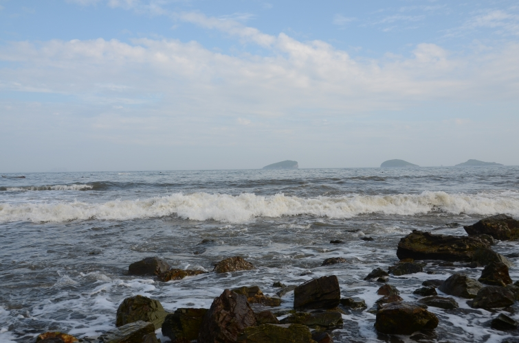

可能是”只缘身在此山中”的缘故,俺这个大连土著看到这种命题作文,竟然很难用5个方面来说出这个城市的好或者说特点.也许是因为这个移民城市没有更多的特点吧.但是题目要求了,咱就说说,反正别人认不认同就不是咱的事儿了.

**海南丢.山东.1899年以前的史**
在大连人嘴里和概念里,”东北人”跟”大连人”是两个概念.这可不是”白马非马”的问题,而是一个历史遗留问题.
大连的官方文章和资料里,大连的历史被说得无比的久远,都快跟大熊猫差不多了.但是,其实从它们的资料也可以看出,历代大连的治所或者说市中心,要么是在金洲,要么是在旅顺,并没有现在的大连市区什么事.所以,想在大连看什么太悠久的有数百年上千年历史的遗迹,是想都不要想了.

现在的大连”土著人”,其实90%以上都是”闯关东”移民,这当中,又有八成来自山东.如果你能隐身偷出现在60-100岁大连老人的户口本的话,”籍贯”一栏中的”山东”二字绝对会引起视觉疲劳的.

闯关东的山东人在东北别处是散居,在大连却是聚居.想必也是.分析一下那些亡命闯关东的移民们吧,摇着小破船过了海,可能已经筋疲力尽了,可能已经惴惴不安了,大连这地方气候挺好的,历史上跟山东也多有往来,可能偷渡的船老大跟码头的什么人还沾亲带故的,能照拂一下.算了,就在这定居吧!咱是为了逃荒,又不是非要跑到辽阳去灭了满族人或者被满族人灭—就这么留下了.所以,继续北上的人,应该是更有闯劲的人—我猜这就是在东北为什么越往北民风越彪悍的原因.但总归是越往北越少了.
那些闯到了满洲人腹地的山东人,分散到了东北大地,跟那边的满族高干或者平民,被流放的汉族人,朝鲜族人,蒙古族人…文化融合以后,形成了大连人眼里的”东北人”,而留下来的这许多山东人,就成了”大连人”.
所以,如果有远来的朋友到大连,说俺们是大连人当然最好,说山东人俺也会很高兴,说是”东北人”就差了那么一点—虽然俺们地理位置确实在东北,可俺们是地地道道的”海南丢”啊!

**殖民地.日本.1899年以后的史**
山东人到了大连以后,却不是像网游里或者yy小说那样说建城就建了个城,都是分散在现在的城区和郊区的各个村落里.靠海的就捕鱼,不靠海的就种地.这地方在当时也算是天高皇帝远了,过着平静的生活.直到1899年俄国人打了进来,才正式有了”达里尼”这个城市名,貌似还是音译.
被殖民的历史就不多说了,感兴趣的一google一大把.只要看看市政府前面广场名字的变化就一目了然了:长者广场—中正广场—斯大林广场—人民广场 😯
别的统治者可以不提,却不能不提日本人.可以说,他们是现代大连的缔造者.大连人对日本人的认识绝对是中国人里最复杂的.恨那是一定的了,就凭个旅顺大屠杀,就是不共戴天的仇.但另一方面,不管是民脂民膏也好,劳民伤财也罢,大连几乎所有的基础设施—铁路,公路主干道,火车站,海港,商场(大商),医院(一院),公园,中学(一中,现理工化院)…都是日本人留下的底子.要不是日本人跑的匆忙,留下了大量的工厂和设备,大连这么个市区面积小得可怜的城市还真不能成为重工业基地.感谢还是庆幸?更多的是作为殖民地的悲哀吧.
现在的大连人对日本人的心情更是矛盾—一方面有化解不开的仇恨,另一方面却还处处指着日本人的资本来经营这个城市.日资企业和合资企业充斥在这个城市的每个角落,当然,大多数是ZF招来的.因此,在这个城市里,樱花树,生鱼片,日语学校,日文招牌,日本人和讲日语的中国人(有些企业要求员工在公车上也必须讲日语)多如牛毛.
看看这些”贡献”吧!真要把日本人打跑了,大连经济立刻瘫痪,包括本人在内的无数大连人会因为失业而饿死.

所以,第一次来到这里的朋友们,冤有头,债有主,请不要因为我们被二次殖民的无奈而苛责我们了.

**海鲜.饮食**
因为跟山东素有渊源,所以本地的饮食其实是正宗的鲁菜嫡传,但却没有什么特色的.俗话说靠山吃山靠海吃海,大连能拿得出手的一点特色也就是本地的这点海鲜了.盛传的”咸鱼饼子”其实没有太多的技术含量,只是大连人爱吃这口罢了,外地人来了,未必会对难以下咽的玉米面饼子和打死卖盐的一般的咸鱼有什么兴趣.
但介绍一下本地的两道名菜:海杂拌和全家福
本人不是厨师,不敢说这两个菜是不是本地的原创,但这却绝对是只有用大连海鲜才能烹饪出来的美味.原材料都差不多:海参,乌鱼(本地特产的一种乌贼类,几乎吃光了,现在都用鱿鱼代替),干贝丁,虾仁,海螺.全家福多个鱼肉.做法也差不多.把原料切成合适的或丁或块,下锅炒就是了.全家福因为多了鱼肉这种不好直接炒的东西,所以要把所有原料在油里炸一下.
简单吧?所以味道如何完全取决于材料.
那么大连的海鲜究竟是不是就那么美味呢?来尝一下就知道了,反正不好吃也不怪我,因为市场上本地的海鲜已经越来越少了.

**大连话.问路**
大连话在骨子里透着那么种彪悍,好多朋友说最适合用来骂人,说是能发上力… 😐
其实根本就是胶东方言.这太好理解了,闯关东的山东人还能说什么话?离大连最近的山东人是哪的人??不就一目了然了么!所以,好多的词和词的用法都是跟人一样从海的那一边”丢”过来的,只不过稍微多了点殖民地色彩的词汇而已.
有人说大连话口音难听,却很少有谁说听不懂的.您就将就吧,咱这个地方口音确实比较重,人银肉右不分.连电视台的节目主持人都带着那么点余韵.好在咱在关键的时候平翘舌分的可还溜着呢,更是万万不会出分不开”失声”和”失身”的那种事故.
在大连问路,尤其问老地名的时候,可要挑有大连口音的人问,不然就大连这横不平竖不直的蜘蛛网地形,指不定给指了哪了呢;新地名就不必了,什么这个”花园”那个”山水”的,本地人也未必知道在哪.

**扑克.休闲**
大连人最适合的title是什么?
田径之乡?zf自封的
服装城?哪有没有一个全国叫得响的牌子都没有的服装城.
啤酒城?别扯了,那是青岛.办了几年所谓”全国啤酒节”就真把自己当回事了?
北方香港?那个市长早调走了,还提那干嘛!
足球城?也许,不过全民普及率还差点.
在俺看来,真正的称谓应该是”扑克城”.
全城男女老幼,不会打扑克的极少.而且最盛行的是当地特产”打滚子”.
一副扑克叫”掉主”,两副叫”打棒”,三副叫”打滚子”,四副叫”打耙子”,五副以上?爱叫啥叫啥,会玩得了呗!
大连的休闲场所也顺应了这个潮流,咖啡厅,酒吧,水吧,茶座…叫”冰激凌”不一定有,叫”三副扑克”包准立马上来.还免费送个垫子,俗称”打得容易”.
更多也更传统的是在路边路灯下,夏天甚至要赤膊上阵.打得固然津津有味,看得却也乐在其中.前年流行的段子是,全国评选文明城市的时候,上边来的人看到大连老爷们光个膀子在路灯底下打扑克,就上去问了几句.那爷们也比较冲,说了句:该你什么事!不知怎么这事情就被zf知道了,生怕这个没有的头衔加不到自己头上,就派人给这帮路边党发免费T恤.结果咱大连爷们说啥?
“俺家不缺抹布,谢谢!”

在大连,夏天标准的休闲活动就是:带上帐蓬,约上一打或半打好友,有条件的带个烧烤炉子,没条件的带钱.捧几个西瓜,拎一箱啤酒,有钱的打车没钱的坐公交,到海滨浴场支上帐蓬,什么都不说先打一锅扑克再说.然后赢的把输得扔下海,在一起纠缠着跳下去,畅游一番.上岸后烧烤吃西瓜喝啤酒,补充完体力在接着打扑克游泳.人多了还可以来场沙滩足球…

又一个夏天,就要到了.

——————————————————————————–
最后发句牢骚.博邻的这次征文,先是在外出差的时候就看到了.那个时候还有个副标题,叫”我喜欢的5个地方”.当时俺脑袋那个大啊,就开始自己google自己,想尽办法凑齐了5个地方.可在什么都酝酿好了的今天上去一瞅:副标题被不声不响的撤掉了,还撤得不那么彻底,在登录博客页面的右下角还留着.
当年还是穷学生的时候就喜欢钻老师出题的空子.这样的失误,是不是应该给所有参加的blogger们都发奖啊??

==== Update 14.10.12 ====
这次征文很是用了心,结果也不错,得了个二等奖.但是领奖过程太虐心.因为可以选择现金或者是flickr的VIP.我非死心眼跟人要VIP.等奖品到手后没多久,Flickr就被墙了.