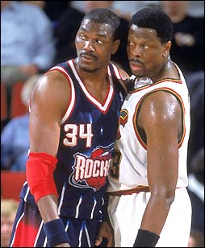
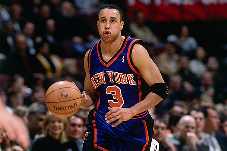

**中锋，又见中锋。**
1994年，央视第一次直播NBA总决赛，正好赶上初升高考试，刚上初一懵懂少年很幸运的目睹了可能是电视时代最伟大的一次中锋对决。
大我半岁的姚明那个时候可能舍不得逃课或者是逃训练来看比赛。我一直认为，看过那场系列赛的人，是不会把中锋当成……

很幸运，第一次看NBA比赛，眼前闪耀的就是索普、麦克斯维尔、奥克利、安东尼梅森、德里克哈珀这些响亮的名字，当然无法忘记后来修成老妖的霍利和卡塞尔，当然更无法忘记绝对传奇的奥拉朱旺和尤因。当然还有，那个人。

前两场的时候，还是在[玩游戏](https://pewae.com/2006/07/teenage-mutant-ninja-turtles.html)大脑缺氧的空档用来调节一下气氛。但是两场以后，就被那满场弥漫的硝烟和汗臭味吸引住了。说来也怪，只用不到一节的时间，我就知道了什么叫走步什么叫三秒什么叫三分什么叫盖帽什么叫造犯规什么叫罚球，甚至能看懂两个队的insie-out的战术。可能这简单的比赛对于想享受高比分的老骨灰们来说，是沉闷而乏味的。但是对于我这个刚出壳的菜鸟来说，却是无比的生动和真实。
场上（双方）的角色分工相当的明确或者说传统，无疑是初学者最好的教材：攻防围绕着大中锋进行；PF负责篮板和二次进攻，有的时候还要防守对方的中锋；后卫负责把球交给中锋，有的时候接中锋传出的球投三分，有的时候突破进去直攻篮下；小前锋位置最灵活和诡异（其实是看不明白），是最难防的冷枪……还有两个油头的教练在场边大喊大叫；当然还有吉祥物；当然还有啦啦队；还有万恶的无处不在的广告……（当时还以为伍兹是个种树的）

第一场，一个晃来晃去很会投篮的大个子（奥拉朱旺）和一个很能跳的骷髅（索普）混了个脸熟。
第二场，纽约的那个黑猩猩尤因开始发威，解说的孙老师不停的在给我这样的菜鸟解释什么是中锋标准动作，其实那个时候孙老师也是个菜鸟。纽约还有一只大黑熊（梅森）把火箭的那个大个子缠得一点办法也没有。
第三场，记住了火箭队里的火星人（卡塞尔）。
第四第五场开学了，没看成。但是已经学会了看体育新闻。据说第五场大猩猩大发神威，扇了对方5个帽，创造了什么什么记录。
第六场，最后一刻，那个神奇的大个子……会飞。已经把自己当成纽约人的我感觉仿佛那一巴掌扇的不是球，而是挂着总冠军奖杯的纽约队徽……

第七场，大个子在笑，伤心的猩猩哭了。

但是，整个系列赛最耀眼的，引领我走进篮球殿堂的那个，并不是奥拉朱旺和尤因这两个超级大佬，也不是妖人犊子霍利卡塞尔和成年妖人疯•马克思维尔。而是那个顽强灵动而且神经兮兮的小个子：约翰•斯塔克斯（John Starks）。

可怜的斯塔克斯，被当成了火箭队总冠军的垫脚石。永远的那种。提起94年总决赛，盖棺的定论总是：奥拉朱旺身边有一群帮手……尤因伟大而孤独，身边只有一个斯塔克斯……成也萧何败也萧何……最后一投被盖……三分球11投0中……

所谓一将功成万骨枯。
所谓成者为王败者贼。

这不公平。在我心中，那场总决赛，最佳男主角是尤因，最佳男配角是斯塔克斯。奥拉朱旺只不过是最佳大反派而已。
最刻骨铭心的剧本，往往都是悲剧。
所有人都在埋怨斯塔克斯，甚至尤因都一直在用怨妇的眼神表达着他的情绪。可是，他们也许忘记了，如果第二场不是这个身披3号的娃娃脸不断的攻击篮下，如果不是第五场这个家伙死死缠住了火箭队的疯子，他们根本就没有把自己的名字写进史上最伟大的七场胜负历史的机会。

其实，94年的纽约客输给了自己。他们所依靠的是强悍的防守，精准的外线和倔强的神经。防守可以被冲垮，外线也可能失灵，但是纽约人斗志之顽强却是一直存在他们骨子里。代表人物如在中国被千夫所指的范甘迪（现在又有人开始怀念他了），代表人物如最喜欢跟奥尼尔较劲的梅森和奥克利。而斯塔克斯无疑是他们当中最顽固的那个。总决赛，第七场，11次三分出手……换作现今某些球队的某些软蛋，恐怕早就两腿发软瘫倒在地上了。但是这个小个子楞是抗住了。如果说纽约是一把长剑，那么强壮的内线苦力就是敦实可靠的剑柄，黑猩猩就是攻防一体的剑身，哈珀史密斯之类的投手就是锋利的剑刃，斯塔克斯，无疑就是那见血封喉的剑尖。可惜这把剑钢口太硬，折了。剑尖断了，封了自己的喉。

也伤了我这个场外观众。
但从此迷上了刀刀见血拳拳到肉的比赛，从此落下了喜好强硬球队和强硬份子的毛病：纽约，热火，爵士，活塞……；米勒，梅森，AI，邮差，大本，天尊……
JS3就是那个引领我欣赏篮球的启蒙者。

敢于挑衅神的人，总是可敬的。

我一直都知道。