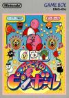

[卡比弹珠台](https://pewae.com/gaan/aHR0cHM6Ly93d3cuZG91YmFuLmNvbS9nYW1lLzI2OTM4Nzkz)

原名：カービィのピンボール机种：GB厂商：HAL / 任天堂类别：PUZ发行年月：1993-11耗时：3

本作是星之卡比的衍生作品，发售日很有意思，跟红白机的《[星之卡比](https://pewae.com/2006/07/hoshi-no-kirby.html)》是同一天！也就是说，任天堂早在第一款卡比作品发售之后就发现了粉红恶魔的卖萌潜质，从第二款开始就准备圈钱了。
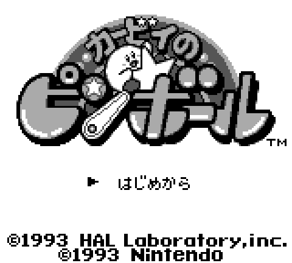

高中的时候我周围除了我以外就没别人有GB了，所以我玩找不到人[[1]](https://pewae.com/2024/03/kirbys-pinball-land.html#inner_anchor_1)换卡，所有的卡都是我自己去买的。
1998年的某天，我揣了100块钱去买心水已久的《口袋妖怪皮卡丘》。在电子市场转了一圈，还是一家女老板要价最低，只要60。我虽然不擅讲价，却也知道不要一开始就暴露目标的道理，就随手点了旁边的一张8合1卡。那张卡一看就不值钱，一个文字游戏都没有。而且大多数游戏我也都玩过了，新游戏只有《卡比弹珠台》和《鳄鱼弹珠台》。大概玩了7、8分钟《卡比弹珠台》，放下，换成口袋黄，又玩了接近10分钟。8合1老板要价也是60。
我问老板：“两盘90行不行？”
老板可能算是想榨干我这个穷学生身上的100块钱，咬死了，一盘50，两盘100，没有余地。
结果就是，我只买了一盘《口袋黄》——因为我刚在市场门口报刊亭买了新一期的《电软》，身上不足100了啊！
今天某管刚巧刷到了鳄鱼弹珠台的视频，便联想起了这款遗忘已久的作品。
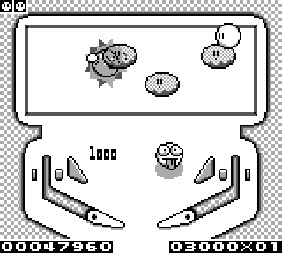

因为机能原因，GB上的游戏往往偏轻量级，即使是桌面类游戏也比较简明。而这恰恰是我喜欢的类型。
弹珠台嘛，左边一个板板，右边一个板板，然后摁就行了。单独一个面板上的内容，本作甚至不如1984年的马里奥客串的《弹珠台》丰富，每个面板上的得分要素绝不会超过5个。但老任在其它方面下了功夫：分成了3大关，每关3个面板；9个面板之外还有3个BOSS和一个总BOSS，多达13个场景玩久了也令人不会感到疲倦。
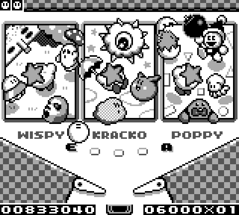

每关开始的时候，出现在中间一层的面板。玩家要争取把卡比弹到上一层，然后打出星星，继而跟BOSS战斗。一时失手掉到下一层也不要紧，本作打回上层比红白机PINBALL可是简单得多。面板上的敌人也不咋厉害，以卖萌为主，所有的敌人都可以被攻击，只不过各种敌人材质不同，反弹回来的速度有差异而已。而且本作还有一个很妙的设定，按B键是晃机台，眼看着卡比要从侧面飞出去的时候，这招特别好使。
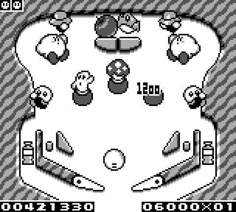

要说比较敷衍的地方，就是不仅所有的敌人是从卡比前作里扣出来的，连音乐也一首原创都没有。甚至奖命的音效都一毛一样。
作为奖分为主的游戏，每满50万分会出一个祝贺画面，挺没意思的就是了。
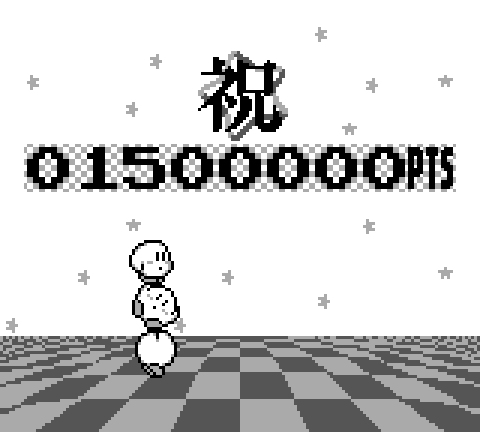

三个中BOSS是系列经典怪：风语大树、独眼云、波比兄弟。到了BOSS战难度曲线陡升，因为BOSS都有另你的小板板失效的技能，有时是眼瞅着卡比掉坑里，只能重来。
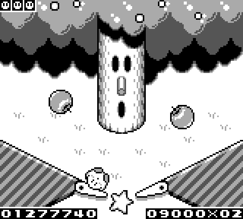
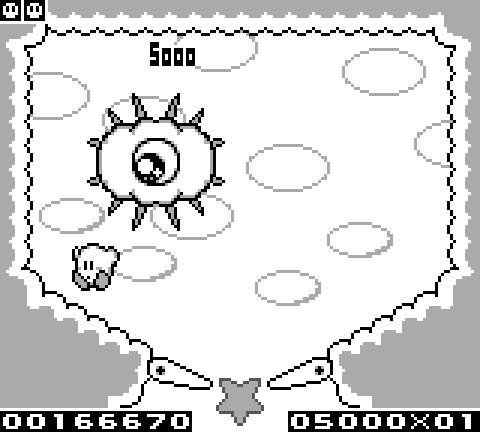
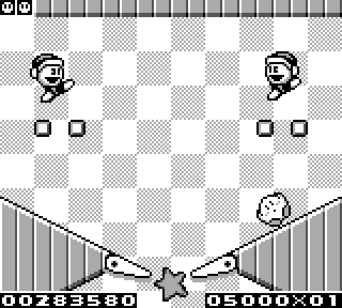

守关BOSS更是万年悲催的帝帝帝大王。帝帝帝大王的传统艺能是至少变一次身。
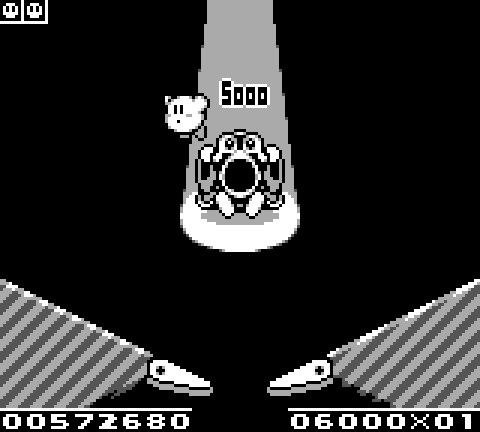
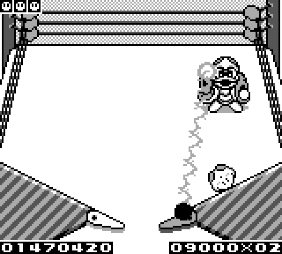

战胜帝帝帝后，他不讲武德，召唤小弟把卡比锤扁，直接开启二周目。
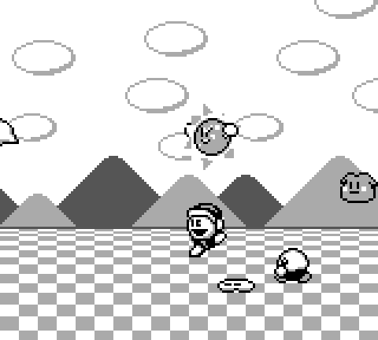
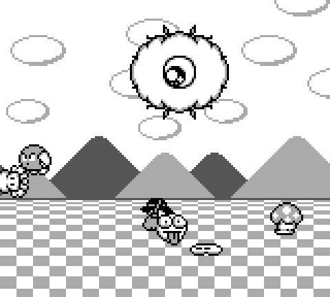

---

- [(1)](https://pewae.com/2024/03/kirbys-pinball-land.html#inner_ref_1)：本来还有个汤球球，但他把机器和卡一起卖给了我。