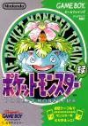

[口袋妖怪：绿](https://pewae.com/gaan/aHR0cHM6Ly93d3cuZG91YmFuLmNvbS9nYW1lLzI2Mzc1NTU2Lw==)

原名：ポケットモンスター 緑机种：GB厂商：任天堂类别：RPG发行年月：1996-02耗时：200

P。轮到GB上的第一名作了。
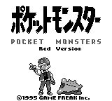

口袋妖怪初代在GB上一共有4个版本，第一时间发售的是红和绿。两个版本流程完全一样，只是某些怪物出现的频率不一样，以及少数几只在某版本独占，只有两个版互连才能集齐150种。这种类型的游戏对于我这个收集癖+怪物队友爱好者来说是无法抗拒的诱惑。
接着是蓝，据说是个什么纪念版，修复了一些bug，改了几处概率，重绘了所有妖怪和描述。后来的美版和欧版其实都是基于蓝而不是最初的红绿，所以美版叫红蓝而不是红绿，不过我并没玩过美版。
再后来因为动画版的皮卡丘大火，老任又趁热出了皮卡丘这个骗钱版。因为是第一次圈钱，所以还算良心，开头加了一段动画和语音，皮卡丘能在地图上跟着主人公跑，所有的怪物图像都重绘了，好多怪物的技能也做了改动。当年我还挺喜欢玩这个版本的，因为红绿里的前三种怪物（御三家）一次只能选一只，而在皮卡丘版里都能直接得到。其实我一点儿也不喜欢用电老鼠，因为其高攻低血低防，太容易被秒，而且红绿版本里的十万伏特实在是太晃眼了。

这也是20多年来这个系列四色骗钱模式的开端。
我只是对于初版情有独钟，到99年玩金/银的时候就不那么有兴致了，再往后只玩了一小会儿NDS上的火红/叶绿，再就差不多没碰过这个系列。
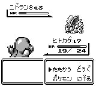

当年虽不是冲着口袋买的GB，但是冲着口袋买了第二部GB。
当时跟[汤球球](https://pewae.com/2014/10/older-tang.html)脚前脚后买了GB，他整天拖着我在学校里打三款热斗，我胆小怕不敢在学校玩，只是自己玩口袋，并且找借口怕掉记录，不跟他联。但是反过来等我需要红绿版本对接以及几个通信进化的怪物必须要联机的时候，就被汤球球拿住了，一系列丧权辱国。
加之宝宝总跟我借机器回家玩，我自己怪物抓到一半心里总是痒痒的，于是一狠心一咬牙，花100块把汤球球那部也给买了回来。也就是说，第二部GB的主要作用就是传妖怪。
砖头机上，四个版本加上盗版商汉化版，一共通关9次，累计游戏时间250个小时以上。
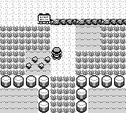

如果按照计划，这个十一我应该把GB上的进度推进到S结束。给口袋分配的时间是20个小时，10小时攻关，10小时凑齐150只，我觉得足够了。并且一上来就打算要四个版本一起开。
谁知出师不利，一直以来用的GBA兼容GB的模拟器能联机，但在传妖怪的时候乱码，再重新进什么都没了。不死心，几个版本试了一遍统统如此。差不多半天就这么过去了。上论坛问作者菌，作者菌表示他从来没遇到过这个问题，测试的时候GB元祖机的联机功能没怎么测过，反问：“你怎么不玩GBA上的火红/叶绿，那个是测试过的……”
赶紧换十几年前使用过的老版本模拟器，却又不兼容Win7，又一顿折腾。凑齐御三家准备出新手村的时候，已经是第一天晚上11点了。

二十年前滚瓜烂熟的四个版本之间的差异，几乎都忘光了。看到只烈雀都要想半天——这货是不是红版独有的？攻略的时候更是各种坑，连携带物品有上限这种事都不记得了。要知道当初四个版本加在一起，游戏时间绝对在250个小时以上啊！而且“每夜一游”开坑之前，我还在模拟器上重温过呢，感觉才没多久啊。那次重温正是刚得知BUG抓梦幻的办法，趁着热乎劲来了一发。
加上宝宝跟汤球球都已经失联多年，颇有些“昔时人已没，今日水犹寒”的感觉，越打越伤心。
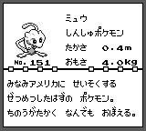

一直以来最喜欢的妖怪都是No.35/36的皮皮/皮克西，长相可爱，血长可以当超能系用，还没有超能系弱点那么明显。最重要的是带皮克西是有战略意义的——其自身有催眠的招式，催眠之后的“食梦”招狠属性强。而皮皮还可以装打不死人的干扰波和能冻住人的暴风雪，实在是抓怪的首选。可是看看随手改出来的99个大师球，就是一种“我空有屠龙之技，可这世界上却已没有龙”的古怪感觉。
之前最爱用的阵容是水箭龟+暴鲤龙+皮克西+火伊布+快龙+急冻鸟。
御三家里最爱用杰尼龟。水属性过一开始的山洞非常给力能节约大量的时间。而且选了杰尼龟，对手就肯定选妙娃种子，草系什么的最好打了。
然后是火伊布，对付草系用。反正用哪个御三家，就带个对应克制对手的伊布就是了。
暴鲤龙，不要太好抓。后期招式多到舍不得扔。
迷你龙，属性是极好的。
最后一块拼图是急冻鸟，冰系用起来实在太爽了。
这次为了重温第一次玩的感觉，跟当年第一次玩一样选了小火龙。其实小火龙的招式分布超级不给力的，属性在中后期也被克得厉害，待在队伍里不得冒头。为了配合小火龙，火伊布换成了雷伊布。以及因为会搞梦幻了，就忍痛放弃了迷你龙。我其实完全不会用梦幻，只是它能学所有招式，所以把1到4号秘传机器都给它背上算是非常能节约队伍空间的做法了。
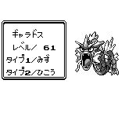
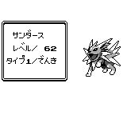
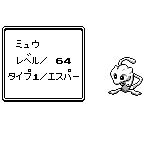
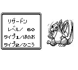
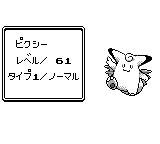
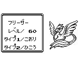

超梦出场实在太晚了，完全没有用武之地。
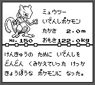

当年抓123/125/126/127/128这几个老大难是最讨厌的，充满了各种不确定性，眼瞅着浪费电池啊！不过最难搞的还不是它们，而是#137，完全是拿钱陪出来的。偏生这游戏搞钱的办法还不多，不利用bug的话只能反复虐最后的BOSS来打钱。别提猫老大，那速度还不够电池钱的呢！
下图是#125雷电兽。我最初玩的是绿，这只根本就不出现，所以也算是怨念颇深。
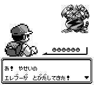

打到最后的冠军之路的时候，卡关了。卡得我叫一个热泪盈眶啊——因为跟我第一次攻关的时候卡住的原因是一样的——最后一个道馆没打。
最终之战从开始到结束都没什么好说的，就是跟几个馆长还有宿敌再打一场，跟博士唠两句就完事了。打倒最后哪种怪吃什么招早就了然于心，等级差个十多级也能轻松通关。
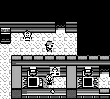
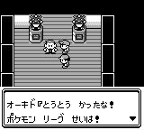
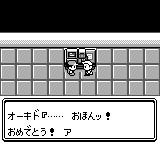
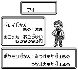

通关的时候差了一只，抓超梦把数字变成150才是这个游戏的真谛啊！

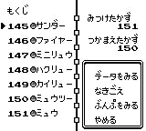