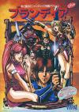

[古罗马对决](https://pewae.com/gaan/aHR0cHM6Ly93d3cuZG91YmFuLmNvbS9nYW1lLzI3MTg0MjYw)

原名：Blandia别名：快打布兰达机种：ARC厂商：ALLUMER类别：FTG发行年月：1992-01耗时：3

再来个街机游戏。这个游戏对我来说印象深刻。并不是说它有多好玩，而是又有故事了。
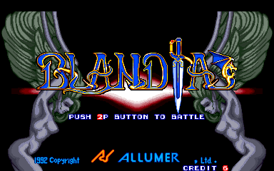

我转学后的学校位于沙区，沙区小学逢周六总喜欢找理由放半天假。话说1993年的某天赶上半天假，而我家所在的甘区要上课。我趁没人跑到家附近的一个街厅里，花差花差。然后就被一位社会大哥给堵了，抢了我两块钱。这位大哥是个讲究人，他说：“哥不是抢你钱，哥是卖你条消息。知道吗？”说着食指关节往旁边的机台面板上一敲：“就这个游戏，女的裙子能砍掉，光腚打。”
两块钱肯定是要不回来了，权当大哥说的对吧。我脑补出了泼妇打架，两具白花花的肉身晃来晃去的场景。
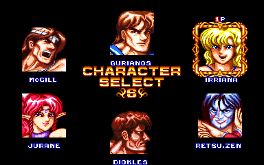

隔了大约一个礼拜，又赶上一次这样的半天假。趁人少跑那个厅里，我要亲自验证一下两块钱的价值。我对自己打格斗游戏有多么手残还是有自知之明的，便一狠心一咬牙，投了俩币，1P2P都选裙子MM，对着削，酱婶裙子总可以削掉了吧？
然而并没有。打了两局一无所获，却舍不得币钱，第三局就站在那儿等Time out。引得旁边游戏厅老板像看傻子一样看我。
什么社会人，说话果然还是不靠谱的。

这一晃就是20多年。上次找别的游戏攻略的时候，油管的侧边推荐栏出现了这个游戏。点开一看才弄清事情的原委：
大哥虽没说错，却不准——我选错人了。能被削光的不是我选的长裙魔法师，而是另一位刀盾女战士。
可是大哥啊，您能看清楚点儿嘛，那不能叫裙子，最多只能叫裙甲，裙甲懂吗？艹，吃了别人没文化的亏，价值两块五毛钱呢。
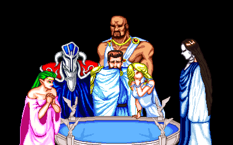

游戏的出品方叫ALLUMER，是法文“点燃”的意思。跟高大上的名字相反，这家公司名不见经传，资料少得可怜。90年代出过几个高达和奥特曼的作品，从这看来有可能是眼镜厂或者万代的第二方。作品以街机游戏为主，没什么太有名的，可能本作就算是他们流行度最高的游戏了。另外一部听说过的游戏是PS上的格斗游戏《西游记真人格斗版-孙悟空传说》。并且这家公司的寿命也很短，1999年就已破产。

那时候的街机游戏名字更多靠口耳相传，毕竟是连马克笔都是稀罕物的年代。家门口的游戏厅根本没写这个游戏的名字，我是后来在劳动公园的游戏厅里惊鸿一瞥，才记住了古罗马XX这个名的。家门口这家，自从我投两个币被老板鄙视之后，就再没去过了。
作为格斗游戏，这部作品最大的亮点就是“盔甲”系统了。有四位可选角色以及大部分不可选角色身上是穿了甲的，有甲的部位第一次被攻击时，不会掉血，而是会掉甲。有甲的四位角色中只有一位是女性，也就只有她是所谓的“裙子能被削掉”了。
小亮点是配乐，占了个气势恢宏。那家老板喜欢把这台机器的声音调到最大来招揽顾客。倒不是音乐有多好听，而是这个游戏使用率最高的长裙魔法师，挂掉时的那一声“啊——”实在是有够销魂。
亮点以外就尽是黑点。动作僵硬，缺少连技。最不能忍受的是必杀技威力极小破绽极大，几乎每个人物都有一招后攒力的必杀放出来之后是钻进对手怀里等着挨摔的。而反过来，只要防住对手的大招跟着一个大摔，就可以对付大部分电脑，连破甲的过程都省了。
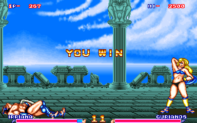

因为在1992年就舞刀弄剑的缘故，这游戏还占了个“最早的使用武器的格斗游戏”的名头。比侍魂早是一定的，但我记得南梦宫也出过一款街霸Like的格斗游戏，同样是抄家伙上场的。跟这部作品哪个更早些未必有定论。只是这部作品我还依稀记得名字里沾上了罗马二字，还投过两个币，而那部虽更普及却是一直旁观，从来未敢上手。

来看看我这次的爆衣之旅吧：
第一关打毫无特色的男角斗士。
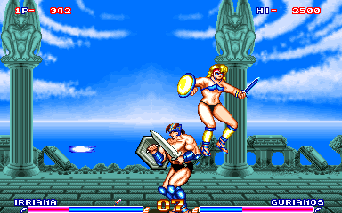
第二关是换了个颜色的男角斗士。
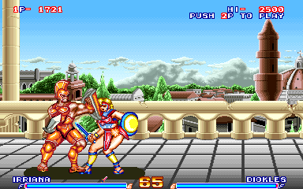
第三关有点儿难，是小日本做游戏最喜欢加塞乱入的日系格斗家。这部作品里是个二刀流，攻击速度很快，跳来跳去，有些逆向攻击的味道，难防。甲很快就被破了。
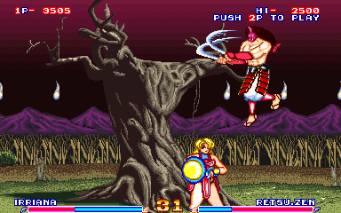
那年头直接“借鉴”野蛮人柯南的还真不少。这位老兄不带甲，但是攻击力极高，不小心很快就会挂掉。
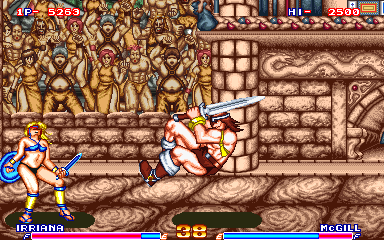
拿长矛的精灵MM。大哥看好了，人家这穿的这才叫裙子！可能就是因为这个跳斩的动作吧，这位MM才是使用率最高的。
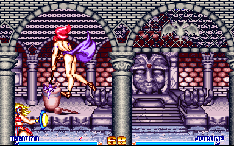
附加关第一关，一个平胸小怪物，不知男女。
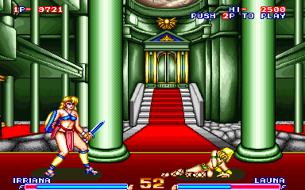
这位浑身盔甲的，是我选的角色的爹。只不过当爹的攻击力太高，上来两刀就把女儿衣服砍光了。
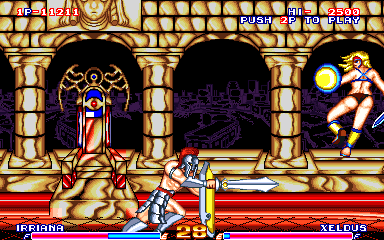
很菜的魔法师，比普通关都要好打一些。
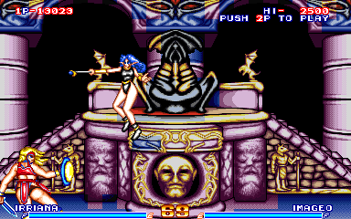
最后BOSS，背景有些像幽白的啥怪物肚子里。该BOSS攻防都极高，正常是不好打的。但电脑AI太低，喜欢放突进系的大招。只要防住就是一个大摔。感觉有点像拳皇97打大蛇，伺机而动即可。
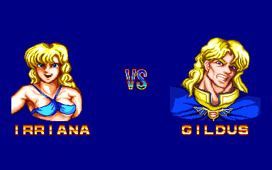
BOSS还会变一次身，变成主角的样子再打一次。泼妇打架终于梦想照进现实！！
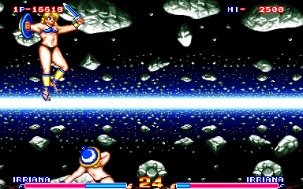
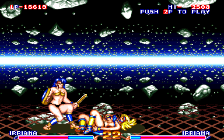
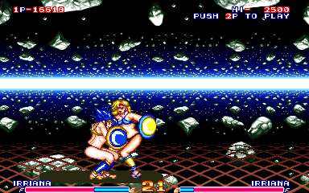

通关画面不是一般的简陋。因为制作公司能力低下，也不知是画面就这样还是模拟器没模拟好。
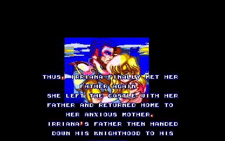
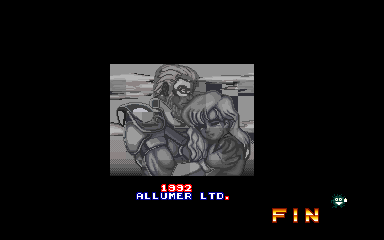