[史蒂皮的发明](https://pewae.com/gaan/aHR0cHM6Ly93d3cuZ2lhbnRib21iLmNvbS90aGUtcmVuLXN0aW1weS1zaG93LXN0aW1weXMtaW52ZW50aW9uLzMwMzAtMTk3Mjkv)

原名：The Ren & Stimpy Show: Stimpy's Invention别名：兔子和狗机种：MD厂商：世嘉类别：ACT发行年月：1993-01耗时：12

本作来源于米国一部卡通片：《莱恩和史蒂皮秀》。游戏版有好多个名字，台湾一般译作《兔兔历险记》，非常容易和另外一作宾尼兔搞混。当年我们玩的地板卡上叫啥名字早就想不起来，反正俺们哥俩把它叫做“兔子和狗”。刚才查资料才发现，Ren竟然是一只猫！
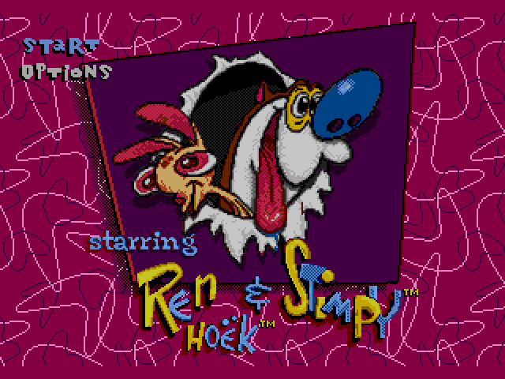
如果有条件，这款游戏一定一定一定要找一个志同道合的小伙伴一起来玩耍。本作单打的乐趣不及双打的十之一二。
初中的时候我每天中午戒饭，跑到宝宝家，有一阵就是攻关这个游戏。虽然打得不甚远，甚至连接关密码都打不到，但只要玩上就是笑声不断的。
笑声的来源就是各种整队友。
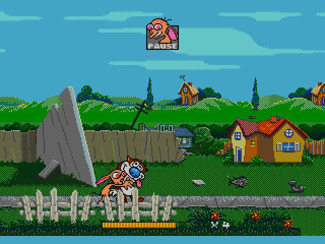
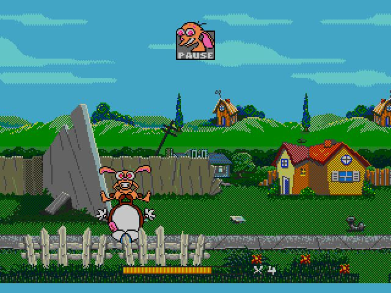
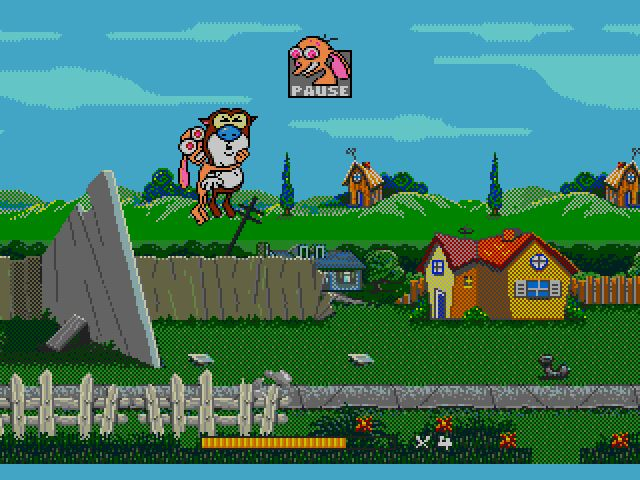
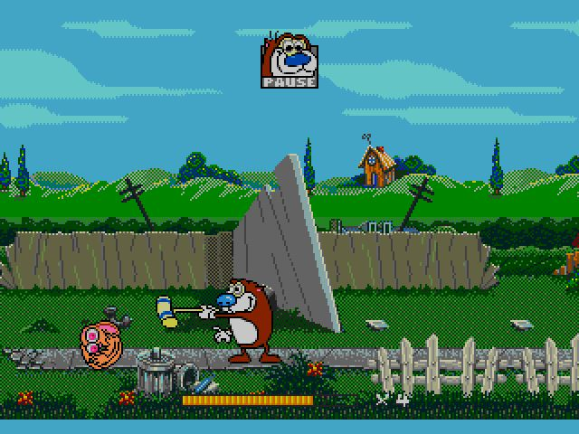
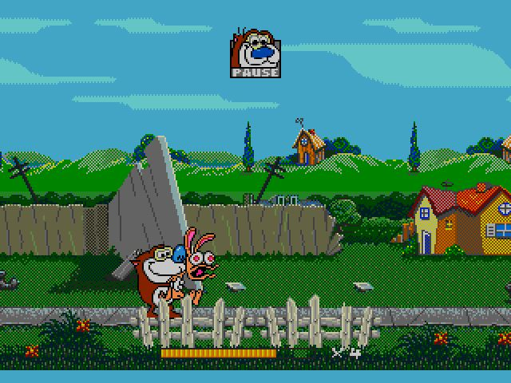
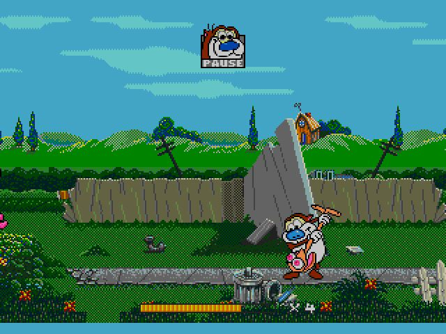
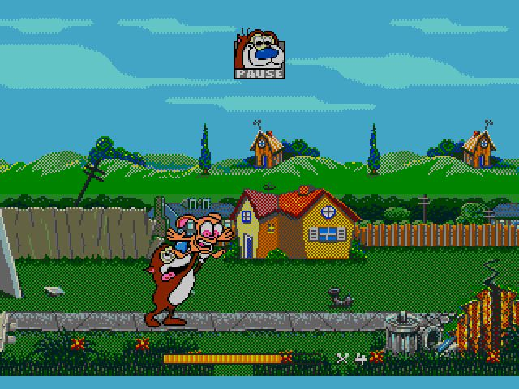
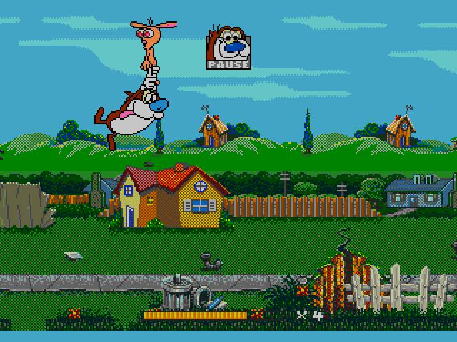
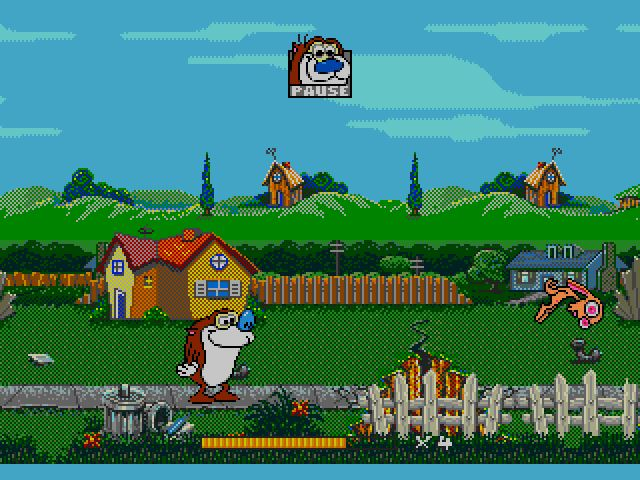
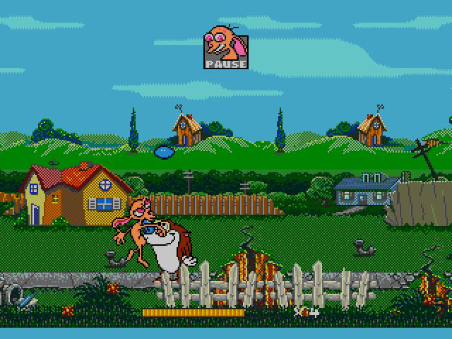

游戏里最著名的一个场景。只要玩过这个游戏的都会对呲着大牙的长颈鹿记忆深刻。
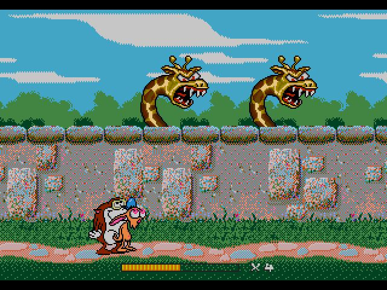
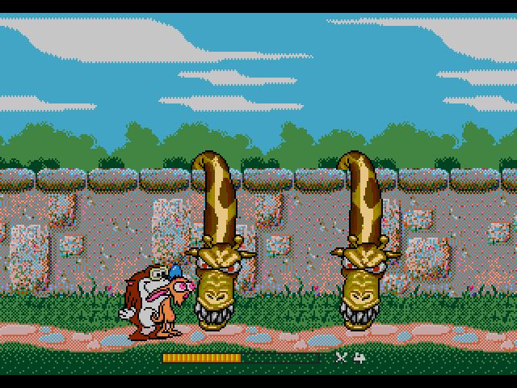

关卡设计得好，没隐藏要素也无所谓，就这么一路冲过去吧。
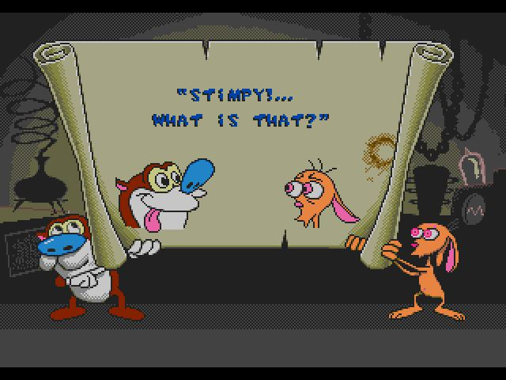
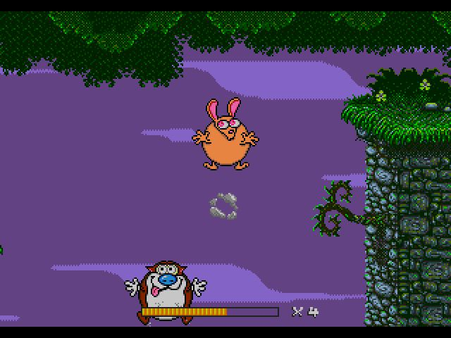
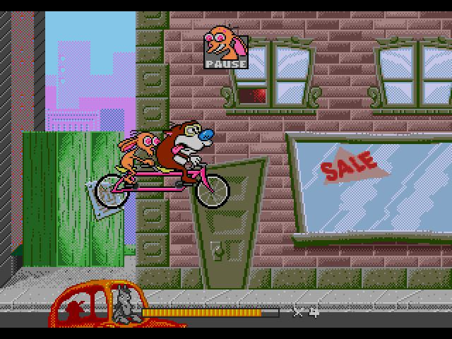
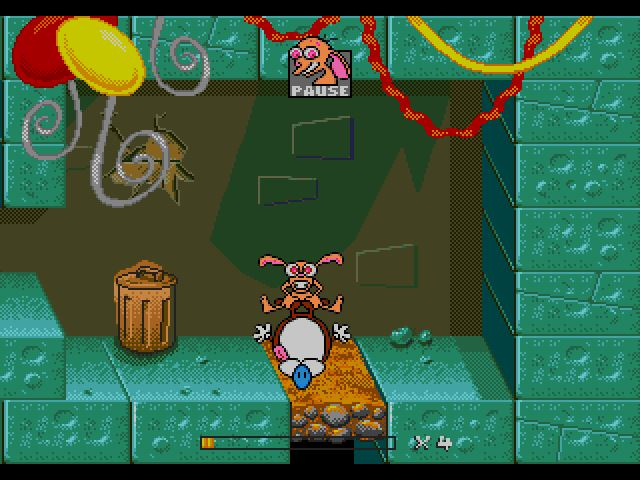
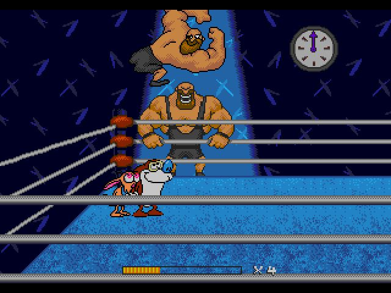
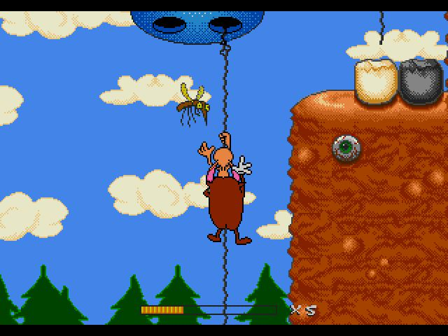
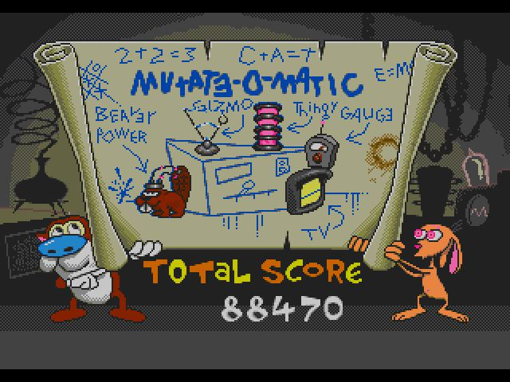

最后一关，一点儿气势也没有。只要把4个开关踩下去就行。
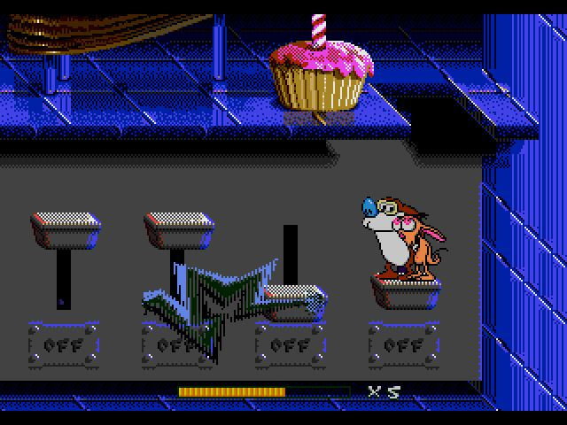

通关画面也不长。
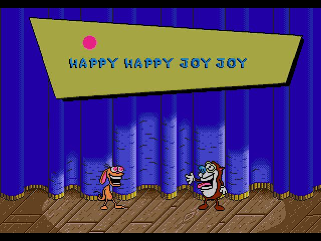
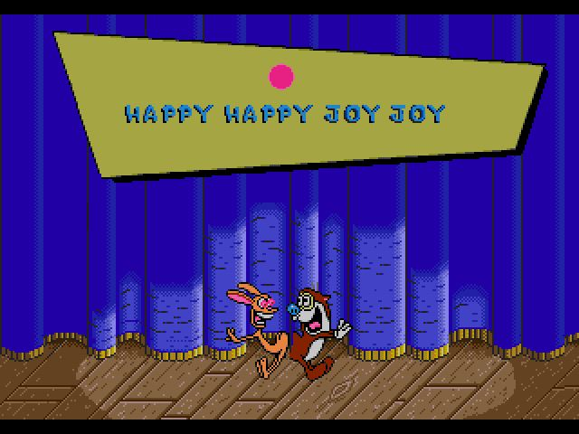