为题目里要不要加AV二字头疼了好久.因为其实不是由武林外传找AV女优,而是照着AV女优列表往回找.
盖因之前~~大猫（http://caitou.com/）~~说苍井空跟武林外传里的老板娘长得像,就想,应该不止这一对吧…于是展开了长达一个月之久的搜索工作.今天终于有了点成果.
就苍井空的问题来说,俺看来只不过是两张照片的发型比较类似而已.不过仔细看苍井空的笑好像真的跟老板娘稍微有那么点接近.
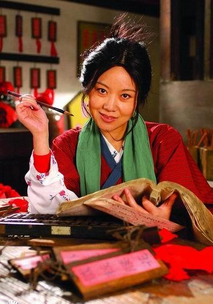
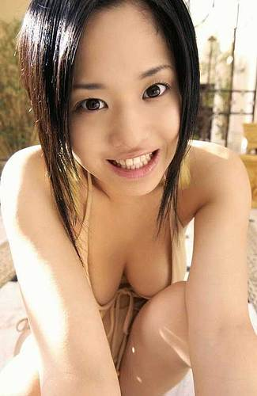
其实苍井空比闫妮年轻多了,单纯找女优图片的话,也少有妆整得像武林外传那么浓的,仔细观察一下,大猫说像的原因可能是因为两个人笑的时候,嘴和下巴那块比较像.参考一下苍井的这个表情.

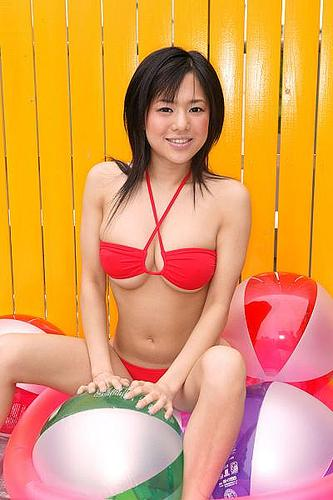
其实佟老板这双眼睛在AV女优里比较难找,因为少有那么重眼袋的.但是还是被俺发觉到了,看亜紗美的这张照片的上半边脸,似曾相识吧??
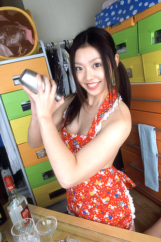

这样某张照片相近的例子还很多.来看一下

```
葵实野理
```

和莫小贝王莎莎.这组照片看简直是姐妹,但是你在搜索引擎上找到葵实野理不笑的照片,就会发现两个人除了脑形相似以外没有更多的共同点.
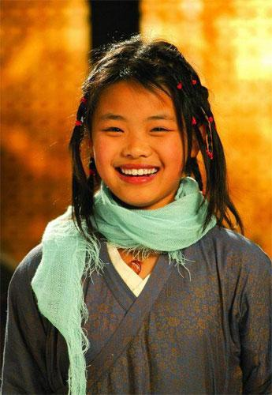
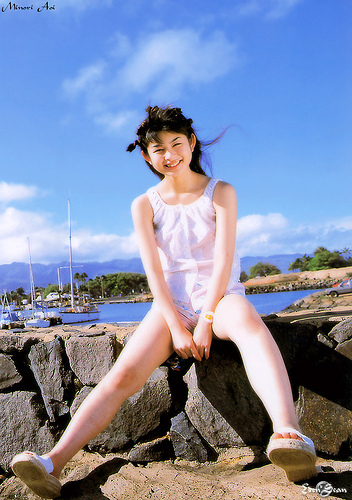
好吧,我承认,我真邪恶.但是这一次真的是就事论事,我决定不是萝莉控!

无双姑娘的长相其实最受A片厂商的欢迎,但是女优里还真少有她眼睛这么大却是鹅蛋脸型的的.只有某些女优从某个角度能弄出类似的效果.最接近的是神谷姬
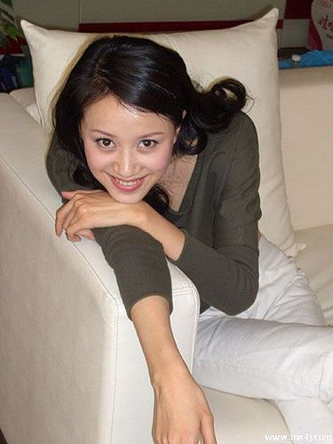
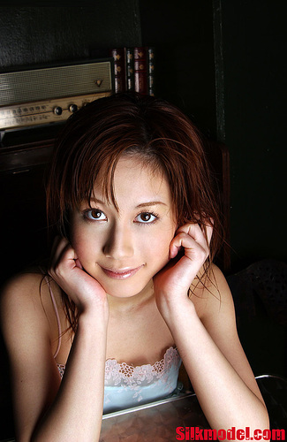
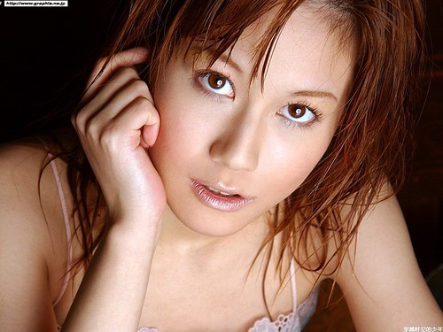
另外,还找到了一张封面,做的跟婷美的第一版广告极为神似.主演叫

```
蛯原朱里
```

.这个名字之前根本没听说过.
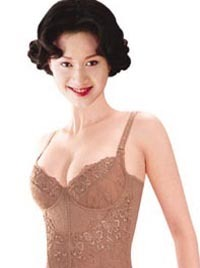
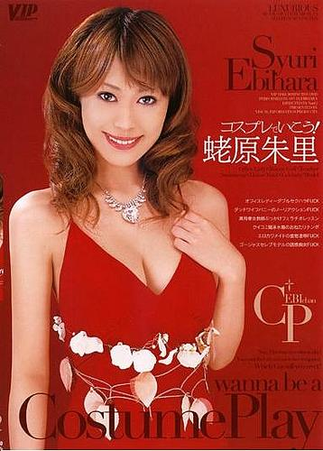

其实俺也蛮喜欢郭芙蓉姐姐姚晨的,但是不得不说,别人只是某个角度和某个神态像,但是她跟这个叫

```
鸠田琴美(京野琴美)
```

的女优可就真不仅仅是神似的问题了.
这个女优年纪已经很大了,而且相当的没有名气,甚至无法分辨是哪个类型的.也不知道她能不能凭借俺这句明星脸火起来.
还是直接看照片吧.
郭芙蓉姚晨:
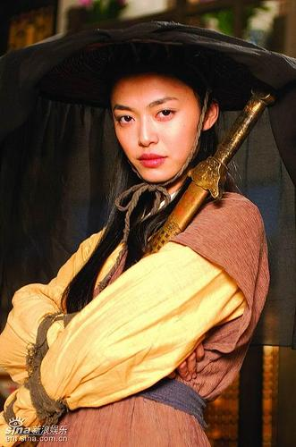
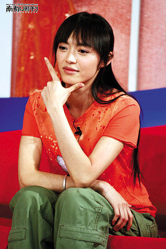
鸠田琴美:
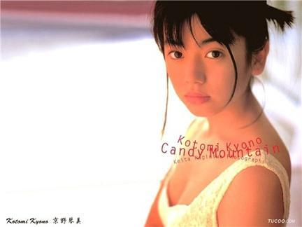
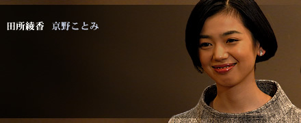

再次声明:**此次研究纯为了好玩!绝对没有任何攻击国产优秀电视连续剧剧组及个人的不良企图.**