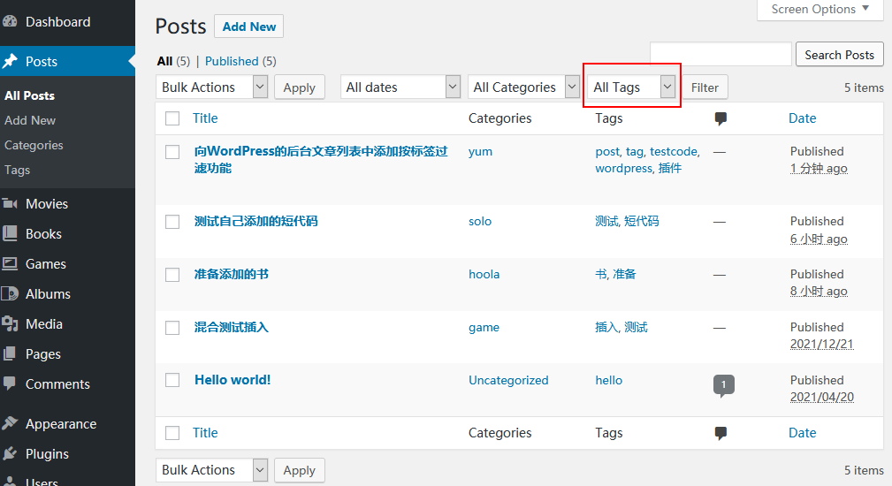
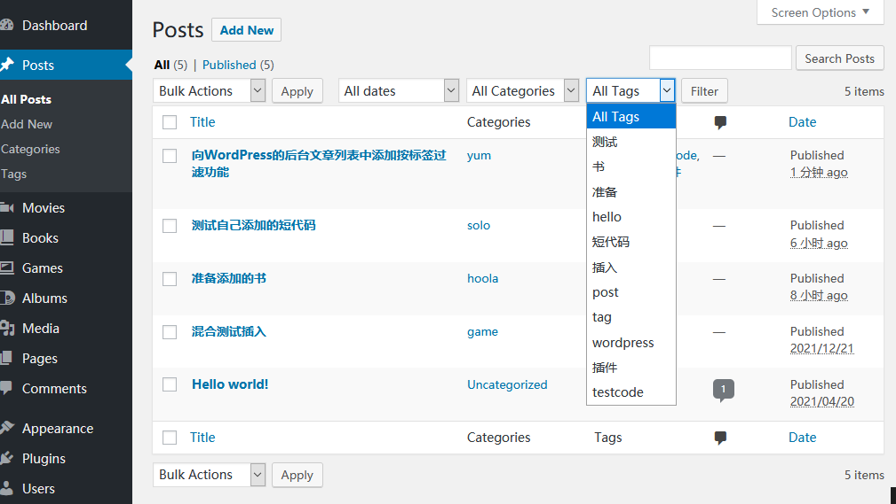
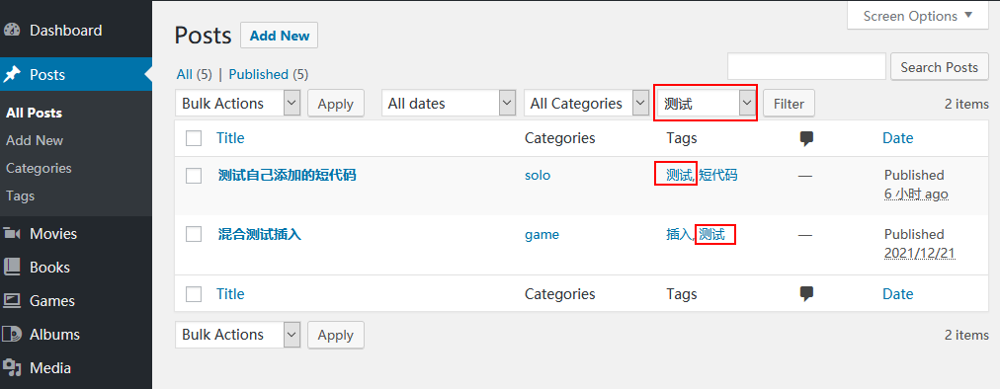

这个功能是最近开发插件的副产品。作用是在后台的文章列表里增加一个下拉列表，选中后再点击旁边的Filter按钮，可以通过标签对列出的文章进行过滤。效果见截图
实际意义并不太大。因为这个方案的缺点很明显：一次只能过滤一个标签；并且使用的标签比较多时，下拉列表并不是很容易找到过滤项。
我猜这也是WP没添加这个功能的原因。

阅读下文时请注意，我向来看不上WP的中文翻译，一直使用英文后台，所以并不确切地知道后面某些单词的具体翻译是什么，所以后面的名词都是直接使用英文。
大抵post=文章，page=页面，taxonomy=分类法，post_tag=tag=标签，category=categories=分类，media=媒体，filter、term_id 和slug 我不知道被翻译成啥。

## 截图

添加下拉列表后：

下拉：

过滤结果：


## 代码

```
add_action( 'restrict_manage_posts', 'rz190_add_dropdownlist_filter_for_post_tag');
function rz190_add_dropdownlist_filter_for_post_tag($post_type) {
if('post'!==$post_type) { //只在post列表显示。如果想在page列表里同样支持，可以更改判断条件。
return;
}
global $apip_tag;
$key='tag';//要针对post_tag进行过滤。
$selection = isset($_GET[$key])?$_GET[$key]:'';//特别重要，记录当前选中项，设错了没法过滤。
$dropdown_arg = array(
'show_option_none' => 'No Tag',
'option_none_value' => '',
'orderby' => 'count',
'order' => 'DESC',
'name' => $key,	//post_tag特殊，内部检索时一定要用“tag”而不是post_tag
'value_field' => 'slug',
'taxonomy' => 'post_tag',
'selected' => $selection,
);
wp_dropdown_categories($dropdown_arg);
}
```

## 说明

### 注册回调函数

为了实现这个功能，需要利用到restrict_manage_posts 这个钩子[[1]](https://pewae.com/2022/01/add-a-dropdown-list-control-of-post_tags-for-wordpress-posts-list.html#inner_anchor_1)。
这个钩子默认支持两个参数。
第一个参数是当前后台post/page页面所对应的post_type。在后台有编辑页面的只有“post”，“page”和“attachment”这三种。
第二个参数是要添加的位置。WP中默认这个钩子只被调用两次，在post/page 列表中，第二个参数是“top”；在media 列表中，这个参数固定是“bar‘。而且这个参数身上玩不出什么花样。因此在使用这个钩子的时候，我只使用第一个参数，这只是为了代码能短一点儿，并没有其它意义。

### 生成下拉列表

插入下拉列表。主要利用了wp_dropdown_categories 这个WP封装好的工具函数[[2]](https://pewae.com/2022/01/add-a-dropdown-list-control-of-post_tags-for-wordpress-posts-list.html#inner_anchor_2)。
这个函数虽然看起来是针对category 的，其实它对于所有的taxonomy 都是可以使用的。而post_tag 恰好是taxonomy 的一种。
该函数的参数有很多，捡几个重要的说明一下：

#### $show_option_all

所有可选项的标题，留空的时候不显示。如果选中这一项，意味着通过后面的$name=0进行过滤。然而，除了categories 以外的taxonomy 设成0的话都无法过滤。所以**这一项一定要留空**！

#### $show_option_none

选择空项目时的标题，留空时不显示。如果想清除过滤，必须加这一项，不加的话后面的$option_none_value 会不起作用。至于内容倒是随便写。

#### $option_none_value

选择空项目时传的值。这项最坑，文档里说默认值为空，但实际上默认值是0，不设的话filter 就永无清空之日了。所以这一项一定要设并且要设成”。

#### $orderby

taxonomy 的排序方法。默认的是term_id，用在post_tag 身上等同于tag 添加顺序，基本相当于是无序的。所以建议用count 或者name。这个参数有很多玩法，具体可以参照WP_Term_Query 的构造函数。

#### $order

大家都懂。默认“ASC”。

#### $echo

是否直接显示在屏幕上。如果设成0，下拉列表的html就会作为字符串返回给调用的函数。默认是1。

#### $name

选项的“name”属性。这个属性会被当成http 请求传给AJAX，再带回页面。所以**一定不能使用默认的“cat”**，那样就跟已经存在的分类选择框混淆了。这里**必须设成“tag”**，因为WP内部对post_tag 做了特殊处理。如果要添加其它自定义的taxonomy，应该设成taxonomy 的slug。

#### $selected

下拉列表的当前选中项。官网的例子是使用全局变量记住上一次的值，我使用的是REQUSET 里带的post_tag 的slug。

#### $value_field

传给AJAX的唯一标识参数，默认是term_id，这个跟rewrite的设置有关。使用term_id 不一定好用，但是设成slug 就一定好使。

#### $taxonomy

要进行操作的taxonomy。所以一定要设成“post_tag”。

#### $hide_if_empty

当一条内容都没有的时候，是否隐藏。默认是false，建议设成true，否则画面有点不太好看。

对于过滤起关键作用的是$name，$selected 和$value_field 这三个参，一个都不能错。

---

- [(1)](https://pewae.com/2022/01/add-a-dropdown-list-control-of-post_tags-for-wordpress-posts-list.html#inner_ref_1)：[restrict_manage_posts 的官网说明](https://developer.wordpress.org/reference/hooks/restrict_manage_posts/)
- [(2)](https://pewae.com/2022/01/add-a-dropdown-list-control-of-post_tags-for-wordpress-posts-list.html#inner_ref_2)：[wp_dropdown_categories 的官网说明](https://developer.wordpress.org/reference/functions/wp_dropdown_categories/)