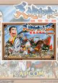

[吞食天地2：诸葛孔明传](https://pewae.com/gaan/aHR0cHM6Ly93d3cuZG91YmFuLmNvbS9nYW1lLzEwNzY0NDA4)

原名：天地を喰らうII 諸葛孔明伝机种：FC厂商：卡普空类别：RPG发行年月：1991-04耗时：8

这款作品可能是中国大陆红白机玩家心目中流行度最高的中文RPG游戏，甚至可以把“中文”二字去掉。哪怕是距离日文版发售超过30年的今天，这款游戏仍旧如雨后蘑菇一般不断冒出各种MOD。
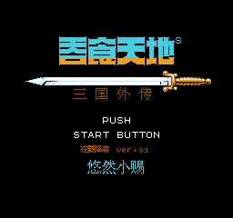

在这个游戏最流行的年代，我并没有玩过。因为它流行的太晚了。之前说过的，我对红白机的兴趣在买了MD和GB之后戛然而止。
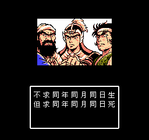
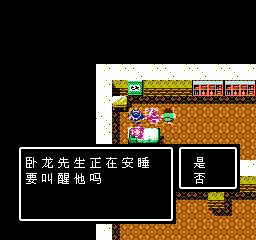

我的朋友3P哥特别推崇这个游戏，他曾经不止三五次跟我推荐过这个游戏，然后聊一些什么武器复制队伍阵型什么的。他就是那种热衷到把每个城每个关卡的每块砖都调查过的人。但某次在他家，看他玩了几分钟，我就对这个游戏失去了兴趣：走路太慢了。所以这次玩，不仅第一时间改出了赤兔马，还把模拟器的速度调成了200%。
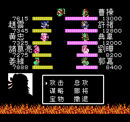

但是据说走得慢并不是原版的缺点，而是汉化版没搞好而产生的恶性BUG。这其实挺搞笑的——原版本身可能是著名游戏当中良性BUG最多的那个。甚至我都怀疑，道具复制法跟用信招吕布在游戏的流传中起到了重要的积极作用。
当然，因为我现在打RPG会在一开始就改出最终装备，无论是道具复制还是城里隐藏物品，对我都没什么吸引力，也没对那些秘技进行尝试。
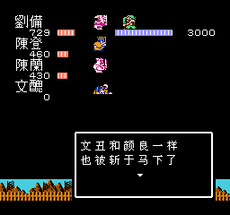

这次没有选日文原版或者先锋卡通的“豪华版”。
之所以在众多MOD中选择这个“降将版”，是因为我虽然没玩过本作的红白机版，却玩过简化的GB版，并且日文版和D商汉化版都通过关。在我看来，招降野外武将那是天经地义的事情。于是看了几个MOD的介绍之后，就敲定了这个终于原剧情，只优化作战方式的版本。没想到送给我一个巨大的惊喜——剧情招张辽！实在想不到MOD制作者已经把游戏吃透到这个程度了。
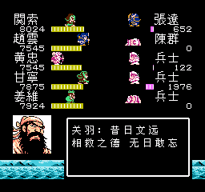
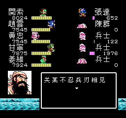
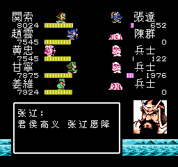

剧情方面，要表扬一下原来的先锋卡通汉化团队。他们是真正地研究过三国演义，很多对话是从原著里扒下来的半白话文，韵味十足。
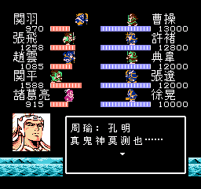
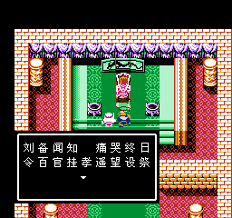
但可惜的是，有的地方张冠李戴得离谱，真当打游戏的人不读书么？比如这里，把太史慈的遗言安排到了庞统身上。
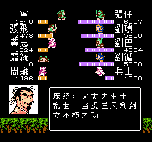
再比如这里，第六天魔王乱入。
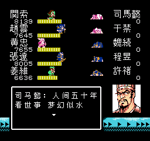

总的来说，这是一部中规中矩的RPG作品。
每到一城都要攻城略显单调，即使加了一些诸如叫门、诈败、内应、火攻之类的佐料。但能把从讨伐袁术到北伐中原的漫长故事线通过红白机简陋的机能表现出来，已经很了不起。
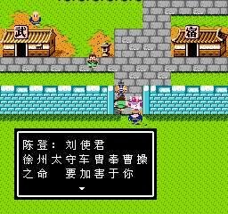

算得上创意的设定可能是把HP改成了兵力，兵力不足的时候虽然死不了，但打人也不疼。正因为这样，这部作品可能也是张鲁在所有三国游戏中最高光的时刻——用BUG招出来的张鲁，在关张赵只有1000出头兵力的时候，能带高达5800的兵，真正的一力降十会。
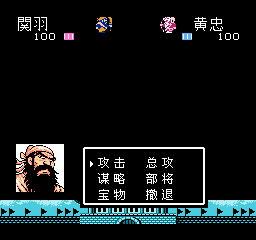

说到人物能力，本作因为不是SLG，要考虑各个阶段给主角团压力的因素，敌方角色的能力设置的极为不合理。后期的夏侯家、司马家各个文武双全，而前期为了给玩家埋雷，不惜给各种小人物赋予奇葩能力。
这也造成了降将版其实意义不是很大。除了张辽、周瑜和甘宁，能跻身最终挑战司马懿阵容的可招降武将并不多。甘宁没多高的攻，而是作为斧将，比魏延聪明不少。吕布猛则猛矣，50的智力打到后面，就是给对方军师送的。弓将更是可怜，就没一个比黄忠好使的。
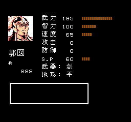
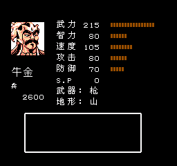

流程上基本就没遇到什么坎儿。卡关只有第一次打汉中之前冲得太猛，没跟王平对话，砍不动敌人而稍微顿了一下下。再就是景帝墓最下层的迷宫有些记不住路，出动了纸笔两样大杀器。
倒是岁数大了，不太能忍受老式RPG来回折腾人的任务方式。本作里给黄石公找茶叶的任务，一点儿也不难，但需要跑路三个来回，实在是让人火大啊！
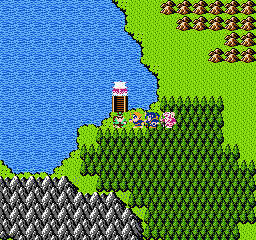

要说卡婊的“吞食天地”系列也挺神奇的，FC上是正宗RPG，街机上是正宗清版过关，到了SFC上又是正宗模拟历史SLG。人物的头像也挺……随意的。据说祸根在原作上，宫本广志的漫画连载没多久就画不下去自行腰斩了，以至于很多角色根本没出场。最明显是魏延，在我们所熟知的街机吞食天地二里是光头佬，在本作里却成了八字胡。据说最惊险的是云哥。原著漫画里出场了两页，刚好有头像有全身像，所以各个版本中赵云的形象才得以统一。
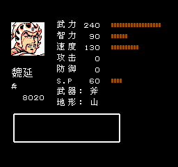

曹操是倒数第三的BOSS，倒不难打，因为身边有许褚和典韦两个傻子。
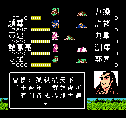
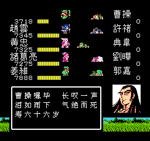

最终BOSS司马懿。原版司马懿兵力9999已经是最多的了，结果本MOD的另外4个，各个兵力在一万二到一万四之间，非常硬。感谢八卦阵这个不是BUG胜似BUG的存在。
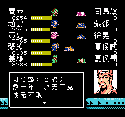
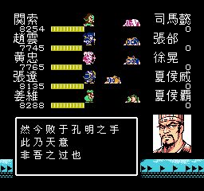

通关。据说通关的《临江仙》是最初的汉化组嫌翻译人名太麻烦而加的。
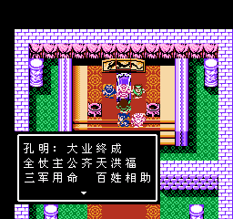
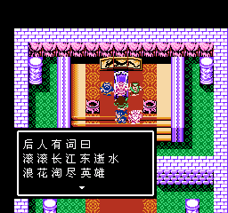

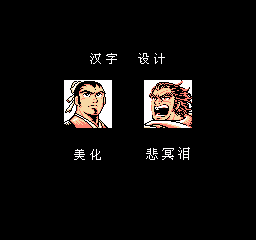
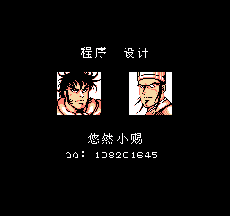
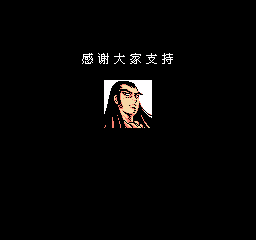
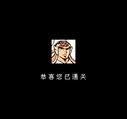
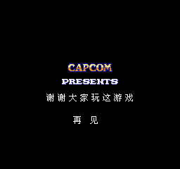