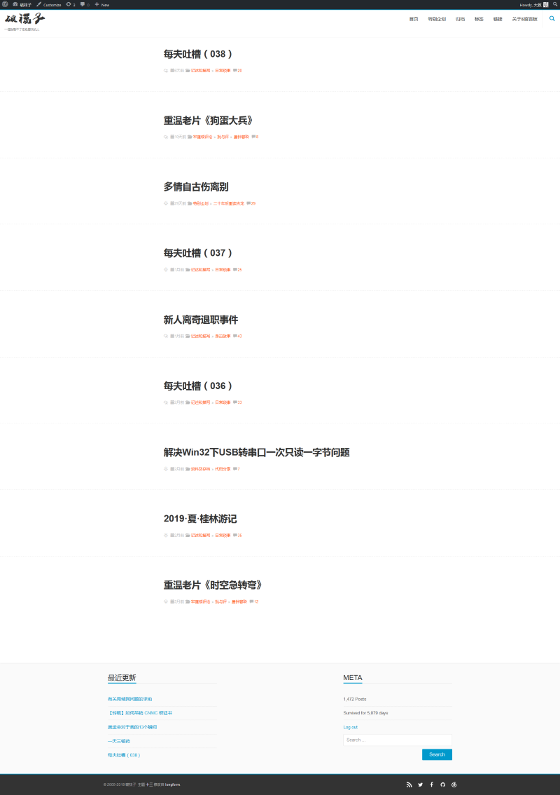

又到了10月底，换主题的时间。
本来上个主题没打算用那么久的，但一直心有旁骛，加之没什么灵感所以一直没动手。直到十一前想起自己说过，纪念版主题没打算用上一年，才匆匆开始动手。
因为再往前一个主题用得比较顺畅，就在它的基础上又换了一套配色。主要的功夫花在抠图上——我盗取了自己喜欢的13位漫画家的15部漫画的插图，作为可变色的背景图片。其余就只有细微调整。
对于改主题这事儿暂时没什么激情了，所以这款主题可能会用上很长时间。

其实这次的另一个重大变动是，我把WP降级了。出于安全考虑，就不公布具体版本号了，反正不是5.2.4。
前回尸体：
