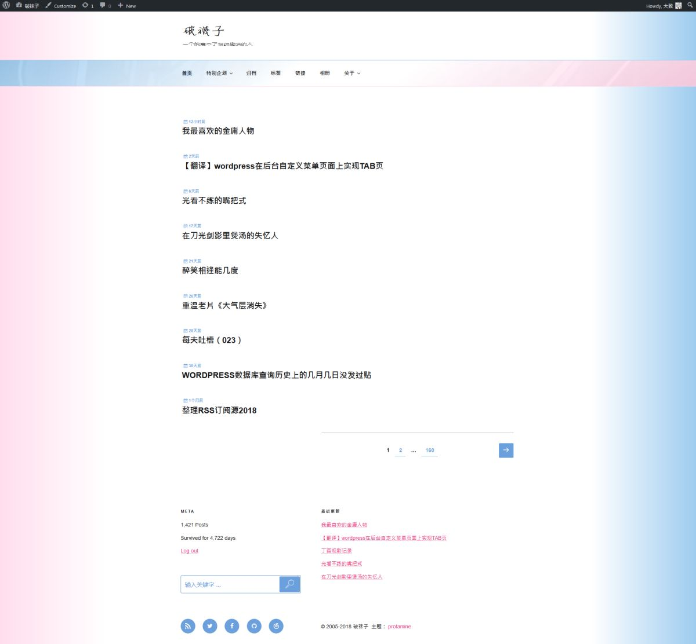

今年是十三周年大庆，一定要搞个新主题用以庆祝。
这次的想法是“回归”，配色采用的是当年我使用过第一个主题的配色。鉴于我在配色方面的黑历史，css里关于颜色的几乎一字没改。
当然技术上跟13年前是无法同日而语了，那时候别说是bootstrap，连css3都没有呢！

这还没等仔细用呢，已经发现好几处瑕疵了，求轻喷。

这个主题改自[longform](https://pewae.com/gaan/aHR0cHM6Ly9jb2hoZS5jb20vcHJvamVjdC12aWV3L2xvbmdmb3JtLw==)，也是过渡，最多用一年吧。
前回尸体：
