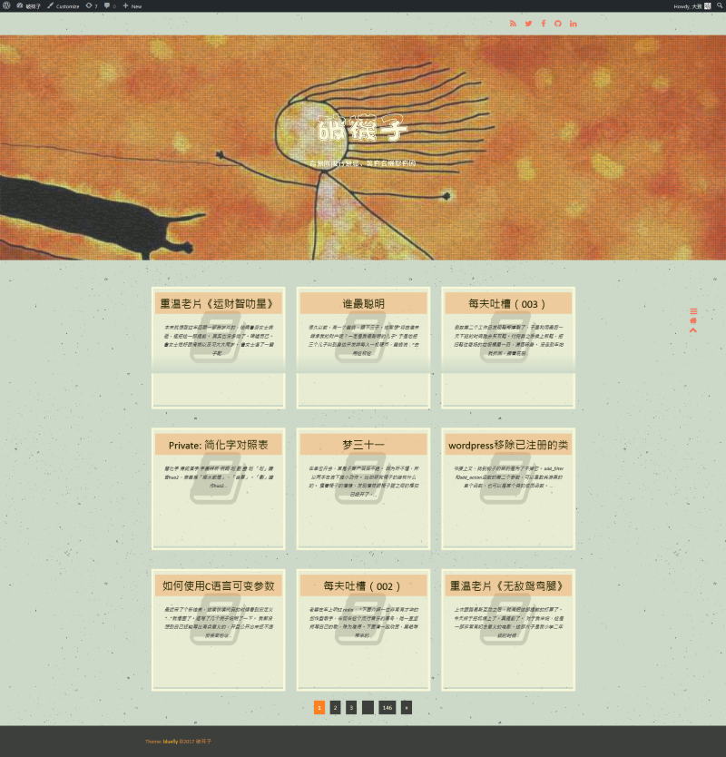
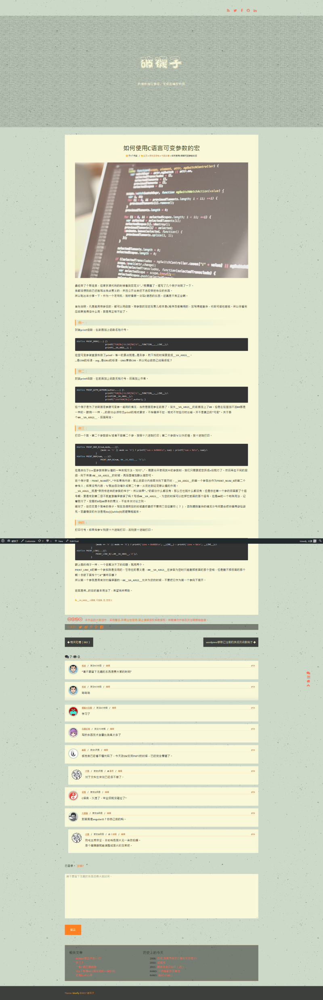

这个主题有些仓促。
但因为一些情况，不得不提前放出来了。好在剩余没做到的也只是些边边角角，在家里也能改。

改自2017。然而2017的大部分新功能都被我删了。

上一个主题以及上上个主题有个问题，就是再往前我都没用过特色图，所以这俩主题都可谓是被特色图亏着了，变着法儿加图片上去。
图片上去了，速度自然就下来了。尤其上个主题，本来的想法是瀑布流无限加载的。但打开实在太慢，所以没用多久就放弃首页图片了。可以算是彻头彻尾的失败。
而且很多时候，留言者光去看图片，而忽略了内容——虽然这种人很多时候是没话找话，但看了也烦。毕竟我对摄影一点兴趣都欠奉。
所以这次进行了一个大胆的尝试。尤其是特色图的第二种摆放位置，我还没见有别人用过。

这次的配色是我年少时的猛犸，我也知道黑底配紫色多么有挑战性。但凡有配色方面的意见的，就甭再提了。说了我也不会改。

老样子，开源，随便抄，但抄完记得自己也要开源。

最后照例是前一回的尸体。

