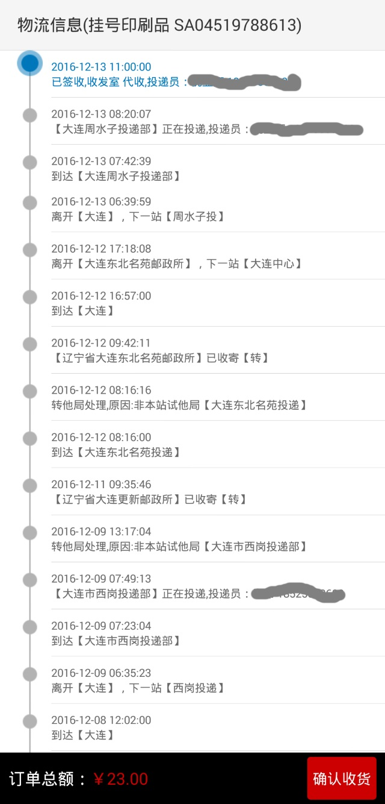

被中国邮政强迫跟双十二来了一次亲密接触。
话说4号在孔夫子上买了几本旧书，反正也不着急，当然选择最便宜的挂号印刷品方式进行邮寄。
一直没当回事儿。直到12号晚上收到卖家短信，问寄到没有。
赶紧刷了一下订单状态。
我了个去——原来8号就到了大连，然后就一直在市内转圈。具体形成见下图，玛德一屏都装不下了：

昨天晚上终于拿到了邮包。一看地址写得一点问题都没有。
就算我们家是新小区，可行政地址也下来两年了。难道管地名的政府跟管邮政的政府不是同一家？
分析一下我这枚可怜的包裹的行程：
*1.到大连。分拣中心的人眼瞎，把甘井子区的东西拣到了西岗区。
2.西岗区小，所以所有包裹都直接分发转送，于是包裹到了派送员手里。
3.派送员一看地址是甘井子区，心想我去你妈的，打回区里。
4.区里负责处理回笼邮包的人把地址错当成了西岗区的X进巷，于是转发。
5.更新街处理人员算有点脑子，明明是甘井子区促进路附近的包，赶紧转发给负责促进路的东方所。
6.东方所驾轻就熟，总接这样的活。转给周水子正主儿。
7.周水子开始干活。*

下次还得走邮政，行政地址不可靠就打个括号写上哪个邮局吧，谁叫便宜呢！